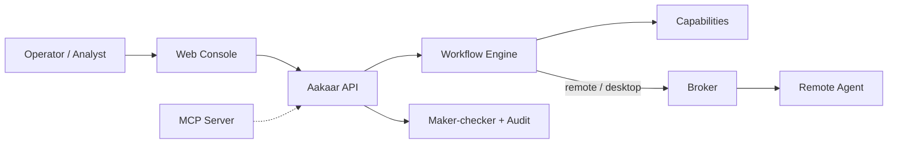

# Aakaar

**Aakaar is an agentic automation platform for regulated, on-premises environments.**
Operators describe a back-office process as a visual **workflow**; Aakaar runs it
deterministically — on the server or on a remote/desktop machine — with every
sensitive step approved, recorded, and auditable. It runs fully self-contained
(SQLite + Chroma, in-process engine), so data never has to leave your premises.



## 📚 Documentation

All documentation lives in **[`docs/`](docs/README.md)** as a suite of standalone
PDFs — one per component plus architecture, security, compliance, quickstarts, and
operations. Start here:

- **[Executive & Product Brief](docs/pdf/00-EXEC-executive-brief.pdf)** — what Aakaar is and why it matters (non-technical).
- **[Solution Architecture Overview](docs/pdf/01-ARCH-architecture-overview.pdf)** — how the system fits together.
- **[Quickstart: Server, Broker & Web](docs/pdf/20-QSCORE-quickstart-server-broker-web.pdf)** — get it running.
- **[Full documentation index →](docs/README.md)**

## Repository layout

| Path | What it is |
|------|------------|
| `aakaar/` | Backend & API service (FastAPI) — the orchestration core |
| `aakaar-web/` | Web console (React + TypeScript) |
| `aakaar-agent/` | Remote desktop/RPA agent |
| `aakaar-broker/` | Stateless rendezvous broker |
| `aakaar-capabilities/` | Shared capability SDK |
| `aakaar-mcp/` | MCP server (exposes capabilities to AI assistants) |
| `examples/` | Worked workflow templates (incl. banking use cases) |
| `loadtest/` | k6 load test + CI smoke scripts |
| `docs/` | Documentation suite (PDFs + Markdown sources) |

## Building the docs

```bash
cd docs/_build && npm install && node build.mjs
```

See **[docs/README.md](docs/README.md)** for details.
