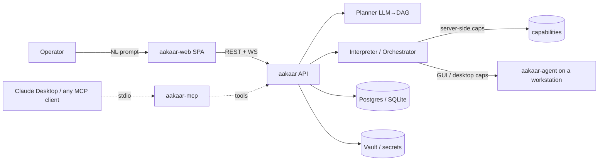
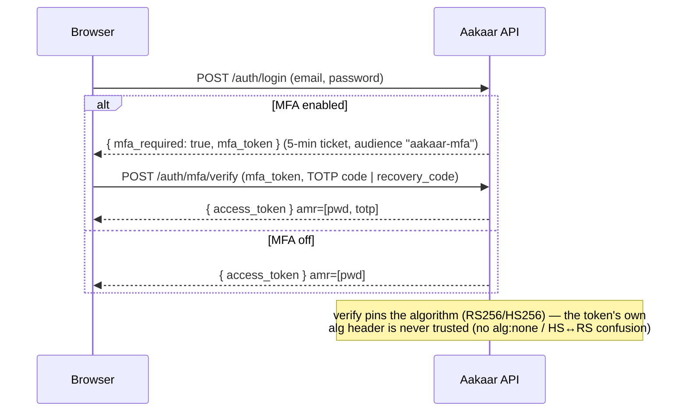
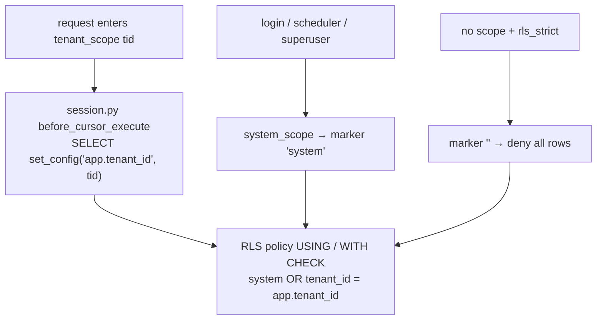

# Aakaar

Aakaar is a **multi-tenant, natural-language → DAG workflow platform**. An operator
describes a process in plain language; the planner turns it into a validated
**DAG** of *capabilities* (email, OCR, SQL, HTTP, browser automation, desktop
RPA, …); the interpreter executes it deterministically, on the server or on a
remote workstation, with per-tenant credentials, full audit, and a live run view.



---

## Repository layout

| Path | What it is | Language |
|------|------------|----------|
| [`aakaar/`](aakaar/) | **Backend** — FastAPI API, planner, interpreter/orchestrator, capability registry, scheduler, audit, remote-execution dispatcher, DB + migrations. | Python |
| [`aakaar-web/`](aakaar-web/) | **Frontend** — React + TypeScript SPA (the operator console). | TypeScript |
| [`aakaar-agent/`](aakaar-agent/) | **Remote agent** — runs capability nodes on a workstation (desktop/GUI RPA). Dials *out* to the API over a WebSocket. | Python |
| [`aakaar-capabilities/`](aakaar-capabilities/) | **Shared capability SDK** (`aakaar_caps`) — host-neutral capabilities that run identically on the server or the agent. | Python |
| [`aakaar-mcp/`](aakaar-mcp/) | **MCP server** — projects the capability registry as [Model Context Protocol](https://modelcontextprotocol.io) tools so any MCP client (e.g. Claude Desktop) can call Aakaar capabilities. | Python |
| `admin-app/`, `nbbl-app/` | **Example tenant web apps** only — sample sites a tenant might automate against. Not part of the platform runtime; ignore them for platform setup. | — |
| [`extras/`](extras/) | Ops assets — e.g. [`extras/rls/setup_app_role.sql`](extras/rls/setup_app_role.sql) (the Postgres role that makes RLS enforce). | — |
| [`.github/workflows/`](.github/workflows/) | CI — lint, type-check, tests, dependency + secret scans, SBOM. | — |

Per-service documentation: [backend](aakaar/README.md) · [web](aakaar-web/README.md) · [agent](aakaar-agent/README.md) · [MCP](aakaar-mcp/README.md).

---

## Quickstart (local dev)

**Prerequisites:** Python ≥ 3.11 (3.12 recommended), Node ≥ 20, and (optional) a
running Postgres. With nothing else configured it uses an embedded **SQLite**
DB, so you can start immediately.

```bash
# from the repo root — bootstraps the venv + node_modules + migrations,
# then opens the API and web UI each in a new terminal tab (macOS).
./dev.sh
```

That brings up:

- **API** → http://localhost:8000  (`AAKAAR_API_HOST=0.0.0.0` by default so LAN agents can reach it; set `127.0.0.1` to restrict to this machine)
- **Web UI** → http://localhost:5173

Stop with `Ctrl+C` in each tab, or `./dev-stop.sh`.

To create the first login, set a superuser before starting (or in `aakaar/.env`):

```bash
export AAKAAR_SUPERUSER_EMAIL="admin@example.com"
export AAKAAR_SUPERUSER_PASSWORD="change-me-please"
```

> **Not on macOS / prefer manual control?** See **“Starting each service separately”** below.

---

## Starting each service separately

Every service is independent. Dependencies and exact commands:

### 1. Backend API (`aakaar/`)

**Depends on:** Python ≥ 3.11; a DB (SQLite by default, or Postgres via `AAKAAR_DB_URL`); `AAKAAR_JWT_SECRET` (required).

```bash
cd aakaar
python -m venv .venv && . .venv/bin/activate
pip install -e . -e ../aakaar-capabilities          # server + shared caps SDK
python -m playwright install chromium                # only if you use browser caps
export AAKAAR_JWT_SECRET="$(python -c 'import secrets; print(secrets.token_urlsafe(48))')"
alembic upgrade head                                 # apply migrations
uvicorn aakaar.api.main:app --reload --host 0.0.0.0 --port 8000
```

### 2. Web UI (`aakaar-web/`)

**Depends on:** Node ≥ 20. Talks to the API at `VITE_API_BASE` (default `/api`; for split-origin dev set it to the API URL).

```bash
cd aakaar-web
npm ci
VITE_API_BASE="http://localhost:8000" npm run dev    # http://localhost:5173
# production build:
npm run build && npm run preview
```

### 3. Remote agent (`aakaar-agent/`) — on the workstation

**Depends on:** Python ≥ 3.11; reachability of the API’s `/ws/agents` endpoint; an
enrollment key issued by a tenant admin. **Full step-by-step (incl. Windows/macOS
service install): [`aakaar-agent/README.md`](aakaar-agent/README.md).** In short:

```bash
# 1) a tenant admin enrolls an agent in the web UI (Agents page) or via the API,
#    which returns a one-time key of the form "<agent_id>.<secret>".
# 2) on the workstation:
pip install -e aakaar-agent -e aakaar-capabilities    # + ".[gui]" for desktop caps
aakaar-agent --server wss://aakaar.example.com:8000 --key "<agent_id>.<secret>"
```

### 4. MCP server (`aakaar-mcp/`)

**Depends on:** the `aakaar` package importable. Runs over stdio for an MCP client.

```bash
AAKAAR_MCP_MODE=describe python aakaar-mcp/server.py   # safe, no side effects
# wire into Claude Desktop with aakaar-mcp/claude_desktop_config.snippet.json
```

---

## Authentication & security

Aakaar ships defense-in-depth auth. Defaults are backward-compatible (HS256,
app-layer tenancy); the hardened modes are opt-in via env.

### Token model — HS256 (default) or RS256 + JWKS



- **RS256/JWKS** (`AAKAAR_JWT_ALG=RS256`): RSA keys from `AAKAAR_JWT_KEY_DIR`, `kid`
  in the JWT header, public keys served at **`GET /auth/.well-known/jwks.json`**
  (every key is published so tokens survive a key rotation). The algorithm is
  **pinned at verification** — the single most important hardening.
- **MFA (TOTP)**: enroll → confirm → one-time **recovery codes**; anti-replay on
  the time-step; optional **encryption-at-rest** of the secret
  (`AAKAAR_MFA_ENCRYPTION_KEY`). A user with MFA on must present a token whose
  `amr` proves a second factor — MFA is *enforced*, not just minted.
- **OIDC/SSO** (`AAKAAR_OIDC_ENABLED=true`): authorization-code flow with **PKCE +
  nonce**, id_token verification (asymmetric-alg allowlist, `aud`/`iss`,
  `userinfo.sub == id_token.sub`), `email_verified` gating, and the minted token
  delivered to the SPA in the URL **fragment**.

### Row-Level Security (Postgres)

App-layer tenancy is the primary guard; **RLS** is DB-layer defense-in-depth.



The tenancy scope is mirrored into the transaction-local `app.tenant_id` GUC that
the policies read. RLS enforces whenever the app connects as a **non-superuser**
role that owns its tables (`FORCE ROW LEVEL SECURITY` binds the owner;
superusers always bypass). **docker-compose does this automatically** — the init
hook creates `aakaar_app` and the API connects as it. For a manual/existing DB,
run [`extras/rls/setup_app_role.sql`](extras/rls/setup_app_role.sql) once and
point `AAKAAR_DB_URL` at `aakaar_app`. SQLite (dev) is unaffected. Details in
[the backend README](aakaar/README.md#row-level-security-postgres).

### Key environment variables

| Variable | Default | Purpose |
|----------|---------|---------|
| `AAKAAR_JWT_SECRET` | — (**required**) | HS256 signing secret. |
| `AAKAAR_JWT_ALG` | `HS256` | `RS256` to enable asymmetric signing. |
| `AAKAAR_JWT_KEY_DIR` | — | RSA key directory (RS256). |
| `AAKAAR_JWT_BOOTSTRAP_KEYS` | `false` | Dev: generate a keypair if the dir is empty. |
| `AAKAAR_JWT_ISSUER` / `AAKAAR_JWT_AUDIENCE` | – / `aakaar-api` | `iss` / `aud` claims. |
| `AAKAAR_MFA_ENCRYPTION_KEY` | — | Fernet key to encrypt TOTP secrets at rest. |
| `AAKAAR_OIDC_ENABLED` | `false` | Turn on SSO. |
| `AAKAAR_OIDC_ISSUER` / `_CLIENT_ID` / `_CLIENT_SECRET` / `_REDIRECT_URI` | — | OIDC client config. |
| `AAKAAR_RLS_STRICT` | `false` | Fail-closed when no tenant/system scope is set. |
| `AAKAAR_DB_URL` | SQLite | e.g. `postgresql+psycopg://aakaar_app:…@host/aakaar`. |
| `AAKAAR_SUPERUSER_EMAIL` / `_PASSWORD` | — | Bootstrap the first superuser. |

(Full list in [`aakaar/aakaar/core/config.py`](aakaar/aakaar/core/config.py).)

---

## Capabilities as MCP tools

[`aakaar-mcp/`](aakaar-mcp/) exposes the **same registry** that drives human
workflows as MCP tools — one build, two channels. Default **describe** mode
returns an execution plan with no side effects; **live** mode dispatches through
the real `/workflows` + `/runs` API, so an agent’s call inherits the identical
grants check, audit trail, and deterministic executor. See
[`aakaar-mcp/README.md`](aakaar-mcp/README.md).

---

## Continuous integration

[`.github/workflows/ci.yml`](.github/workflows/ci.yml) runs on every PR/push:

- **backend** — `ruff check`, `mypy` (strict), `pytest` (Python 3.12).
- **frontend** — `npm run typecheck` + `npm run build`.
- **dep-scan** (Trivy → SARIF) and **secret-scan** (gitleaks).
- [`sbom.yml`](.github/workflows/sbom.yml) generates CycloneDX SBOMs on release tags.

---

## Testing

```bash
cd aakaar && .venv/bin/python -m pytest        # backend
cd aakaar-web && npm run typecheck             # frontend types
```

## License

See repository root for licensing.
