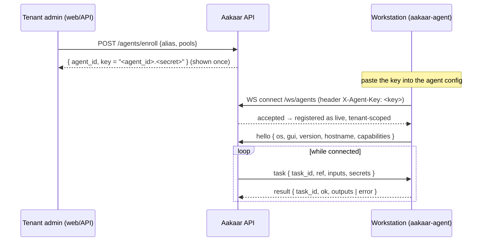

# Aakaar remote agent (`aakaar-agent`)

A small Python service that runs **capability nodes on a workstation** — desktop
/ GUI automation (clicks, typing, clipboard, window control) and headless host
caps (shell, system info) — on behalf of the Aakaar server.

The agent **dials out** to the server over an authenticated WebSocket, so the
workstation needs **no inbound ports and no public IP**. Once connected it
announces its OS, whether it has an interactive GUI session, and its
capabilities; the server’s dispatcher then targets it for DAG nodes whose
`target` selects this agent.



---

## What to do on the remote machine

### Prerequisites

- **Python ≥ 3.11** on the workstation.
- **Outbound network access** to the API host on its port (default `8000`) over
  `ws`/`wss`. No inbound firewall rules are required.
- For **desktop/GUI** capabilities (`desktop_click`, `desktop_type`,
  `clipboard_write`, `window_manage`): the agent must run **inside an interactive
  desktop session** (a logged-in user with a screen), not a headless service
  account. Install the `gui` extra (pulls `pyautogui`, `pyperclip`, `pygetwindow`).
- Headless caps (`shell_exec`, `system_info`, provided via the shared
  `aakaar_caps` SDK) work without a GUI.

### Step 1 — Enroll the agent (admin, once)

A **tenant admin** enrolls the agent and receives a **one-time key** of the form
`<agent_id>.<secret>`. The server stores only a hash of the secret, so copy it now.

- **Web UI:** *Agents* page → *Enroll agent* → choose an `alias` (and optional
  pools) → copy the key.
- **API:**
  ```bash
  curl -X POST https://aakaar.example.com:8000/agents/enroll \
    -H "Authorization: Bearer <tenant-admin-token>" \
    -H "Content-Type: application/json" \
    -d '{"alias": "branch-pc-01", "pools": ["mumbai"]}'
  # → 201 { "agent_id": "…", "key": "<agent_id>.<secret>", ... }
  ```

### Step 2 — Install the agent on the workstation

From a copy of the repo (or a built wheel/installer):

```bash
# editable from the monorepo (dev):
pip install -e aakaar-agent -e aakaar-capabilities      # headless only
pip install -e "aakaar-agent[gui]" -e aakaar-capabilities   # + desktop automation
```

> The agent depends on the shared `aakaar-capabilities` package (`aakaar_caps`),
> a monorepo sibling — install it alongside. A packaged installer bundles it
> automatically.

### Step 3 — Run it

Point it at the **base** server WS URL (the agent appends `/ws/agents`) and pass
the key. Flags or env:

```bash
aakaar-agent --server wss://aakaar.example.com:8000 --key "<agent_id>.<secret>"

# equivalently:
export AAKAAR_AGENT_SERVER="wss://aakaar.example.com:8000"
export AAKAAR_AGENT_KEY="<agent_id>.<secret>"
export AAKAAR_AGENT_LOG_LEVEL="INFO"      # optional
aakaar-agent
```

Use `ws://…` only on a trusted LAN; prefer `wss://` (TLS) anywhere else. On
success you’ll see `agent connected to wss://…/ws/agents`; the *Agents* page shows
it **online**. It reconnects automatically if the link drops.

### Step 4 — Run it unattended (service)

Run the agent as a supervised service so it survives logout/reboot. Examples:

<details>
<summary><b>Linux — systemd (user service, for GUI caps)</b></summary>

`~/.config/systemd/user/aakaar-agent.service`:

```ini
[Unit]
Description=Aakaar remote agent
After=graphical-session.target

[Service]
Environment=AAKAAR_AGENT_SERVER=wss://aakaar.example.com:8000
Environment=AAKAAR_AGENT_KEY=<agent_id>.<secret>
ExecStart=%h/.local/bin/aakaar-agent
Restart=always
RestartSec=5

[Install]
WantedBy=default.target
```
```bash
systemctl --user daemon-reload
systemctl --user enable --now aakaar-agent
loginctl enable-linger "$USER"     # keep it running across logout
```
</details>

<details>
<summary><b>macOS — launchd (LaunchAgent, for GUI caps)</b></summary>

`~/Library/LaunchAgents/com.aakaar.agent.plist`:

```xml
<?xml version="1.0" encoding="UTF-8"?>
<!DOCTYPE plist PUBLIC "-//Apple//DTD PLIST 1.0//EN" "http://www.apple.com/DTDs/PropertyList-1.0.dtd">
<plist version="1.0"><dict>
  <key>Label</key><string>com.aakaar.agent</string>
  <key>ProgramArguments</key>
  <array>
    <string>/usr/local/bin/aakaar-agent</string>
    <string>--server</string><string>wss://aakaar.example.com:8000</string>
    <string>--key</string><string>&lt;agent_id&gt;.&lt;secret&gt;</string>
  </array>
  <key>RunAtLoad</key><true/>
  <key>KeepAlive</key><true/>
</dict></plist>
```
```bash
launchctl load ~/Library/LaunchAgents/com.aakaar.agent.plist
```
Grant the agent **Accessibility** + **Screen Recording** permission
(System Settings → Privacy & Security) so it can drive the desktop.
</details>

<details>
<summary><b>Windows — service (NSSM)</b></summary>

```powershell
# install the agent into a venv, then register it as a service that logs in
# as the interactive user (required for desktop automation):
nssm install AakaarAgent "C:\aakaar\.venv\Scripts\aakaar-agent.exe" `
  --server wss://aakaar.example.com:8000 --key <agent_id>.<secret>
nssm set AakaarAgent AppEnvironmentExtra AAKAAR_AGENT_LOG_LEVEL=INFO
nssm start AakaarAgent
```
For desktop caps, the service must run in the interactive session (auto-logon
kiosk user, or run the agent from the user’s startup instead of a session-0 service).
</details>

---

## Capabilities the agent runs

| Capability ref | Needs GUI session | Notes |
|----------------|:-----------------:|-------|
| `cap.desktop_click` | ✅ | click at coordinates / on an element |
| `cap.desktop_type` | ✅ | type text |
| `cap.clipboard_write` | ✅ | set the clipboard |
| `cap.window_manage` | ✅ | focus / move / resize windows |
| `cap.shell_exec` | — | run an argv command (no shell string — injection-safe) |
| `cap.system_info` | — | host facts |

GUI caps are imported lazily, so a headless agent never needs the `gui` extra.
The server only ever dispatches **advertised capability refs** — never arbitrary
commands.

## Networking & security

- **Outbound only:** the agent connects out to `wss://<api>/<…>/ws/agents`; open
  no inbound ports on the workstation.
- **Auth:** the key is `<agent_id>.<secret>`; the server stores only a bcrypt hash
  and verifies it **before** accepting the socket. Identity is **tenant-scoped**
  (`(tenant_id, alias)`), so an agent can only ever run its own tenant’s nodes.
- **Secrets** for a task are sent just-in-time for that node and are never
  persisted on the agent.
- **Treat the key like a password.** Rotate by revoking the agent (*Agents* page /
  `DELETE /agents/{id}`) and enrolling a new one.

## Develop / test

```bash
cd aakaar-agent
pip install -e '.[gui,dev]' -e ../aakaar-capabilities
python -m pytest        # tests/
ruff check aakaar_agent
```

Config & flags live in [`aakaar_agent/main.py`](aakaar_agent/main.py); the
connection loop in [`aakaar_agent/client.py`](aakaar_agent/client.py). For the
server-side design see
[`../documentation/remote-execution-architecture.md`](../documentation/remote-execution-architecture.md).
