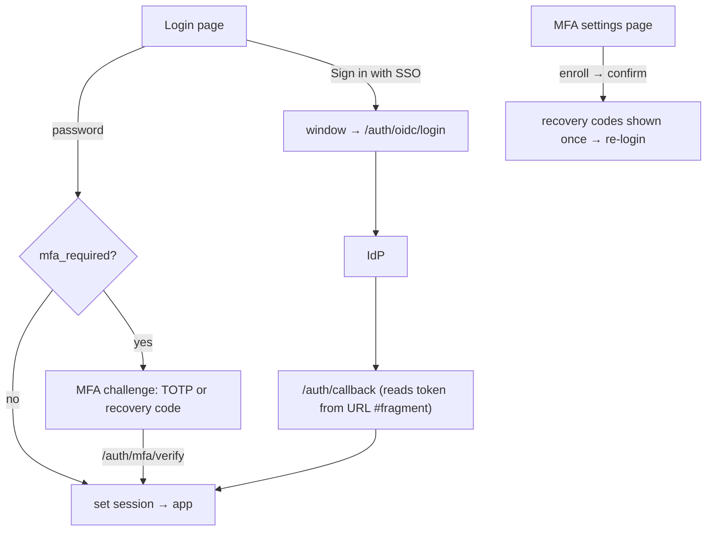

# Aakaar — web console (`aakaar-web`)

The operator-facing **React + TypeScript SPA**: chat → DAG planner, workflow
editor, live run timeline, capability grants, agents, audit log, and account
security (MFA / SSO).

> See the [repo root README](../README.md) for the full-stack picture. This is
> the frontend deep-dive.

## Stack

- **React 18** + **TypeScript 5**, built with **Vite 5**.
- **@tanstack/react-query** for server state, **react-router-dom 6** for routing.
- **@xyflow/react** + **dagre** for the DAG editor/viewer, **recharts** for charts.
- **Tailwind** for styling, **lucide-react** icons.
- **zod** validates auth/planner-critical API payloads; **dompurify** + Trusted
  Types (`src/security/trustedTypes.ts`) sanitize any HTML.

## Develop & build

**Depends on:** Node ≥ 20 and a reachable API.

```bash
npm ci
# split-origin dev (Vite :5173, API :8000):
VITE_API_BASE="http://localhost:8000" npm run dev
# checks / production build:
npm run typecheck      # tsc -b --noEmit
npm run build          # tsc -b && vite build  → dist/
npm run preview        # serve the build
```

`VITE_API_BASE` defaults to `/api` (same-origin deploy behind a reverse proxy).
The API client (`src/api/client.ts`) injects the `Authorization: Bearer` header
and routes a `401` to logout.

## Auth in the SPA

The token lives in `sessionStorage` (`aakaar.token` + decoded `aakaar.claims`),
one session per tab. `AuthContext` exposes `login(email, password)` and
`loginWithToken(resp)` (used by the MFA-verify result and the OIDC fragment),
which share one persist path.



- **`pages/Login.tsx`** — password login; branches into an in-page MFA challenge
  when `mfa_required`; the **Sign in with SSO** button full-page-redirects to
  `${VITE_API_BASE}/auth/oidc/login`.
- **`pages/MfaSettings.tsx`** — enroll (shows secret + `otpauth://` URI), confirm,
  display one-time recovery codes, and disable. Enabling MFA invalidates the
  current single-factor token, so the page prompts a re-login.
- **`pages/OidcCallback.tsx`** — chrome-less; reads `access_token` etc. from the
  URL **fragment**, establishes the session, and navigates to a sanitized `next`.

API helpers are grouped under `auth` in `src/api/index.ts`
(`login`, `mfaStatus`, `mfaEnroll`, `mfaConfirm`, `mfaDisable`, `mfaVerify`);
response types/zod in `src/api/types.ts`. Public routes (`/login`, `/auth/callback`)
and protected routes (everything in `Layout`, incl. `/mfa-settings`) are wired in
`src/App.tsx`.

## Project structure

```
src/
├── api/            # client.ts (fetch wrapper) + index.ts (endpoints) + types.ts (zod)
├── auth/           # AuthContext, ProtectedRoute
├── pages/          # Dashboard, Chat, Workflows, WorkflowDetail, Runs, RunDetail,
│                   # Capabilities, Agents, AuditLog, Login, MfaSettings, OidcCallback, admin/superuser…
├── components/     # DagEditor, DagViewer, Layout, PageHeader, ErrorBanner, …
├── hooks/          # useRunEvents (live WS run stream)
├── security/       # trustedTypes.ts (DOMPurify policy + sanitizeHtml)
├── i18n/ theme/ lib/ styles/
```

Design-system primitives to reuse on new pages: `PageHeader`, `ErrorBanner`,
`EmptyState`, and the CSS utilities `btn-primary` / `btn-ghost` / `input` / `card`
/ `panel-title` / `headline` (defined in `src/index.css`).
