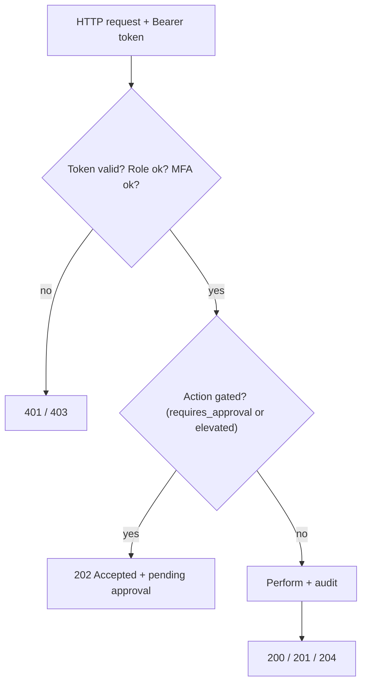
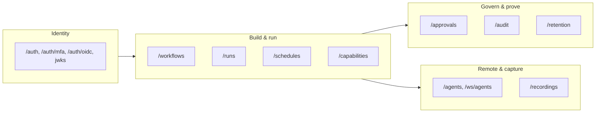
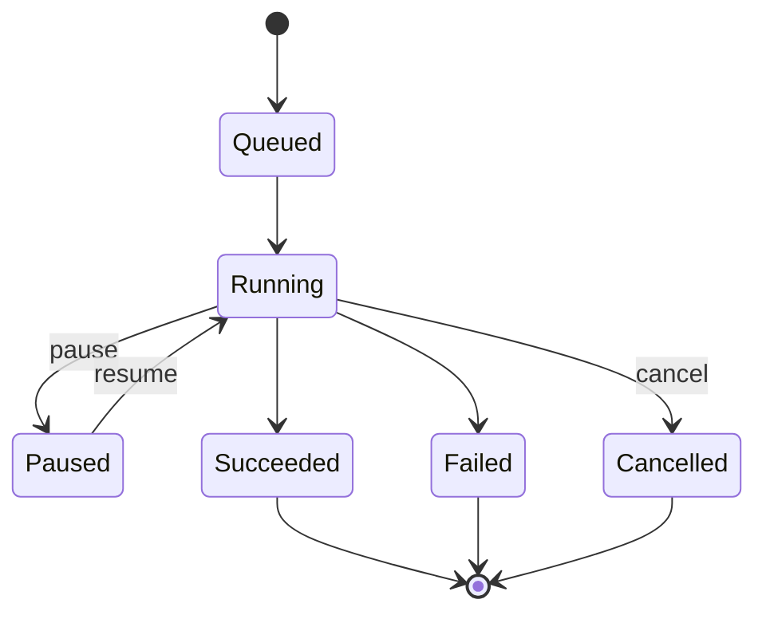

# API Reference

> **In plain terms:** This is the menu of everything the Aakaar backend can do over HTTP. Each entry tells you the web address to call, what it does, who is allowed to call it, and the important pieces of data that go in and come back. If the console can do it, it is here — the console itself just calls these same endpoints. Sensitive actions return a special "waiting for approval" response instead of acting immediately; those are flagged below.

All paths are relative to the API base URL. Authentication is a **Bearer token** in the `Authorization` header, obtained from `POST /auth/login` (and a second step at `/auth/mfa/verify` when MFA is enabled). Roles referenced below: **superuser** (cross-tenant), **tenant admin**, and **tenant user**.

How an endpoint decides what to return:



The endpoint groups and the layer each one serves:



---

## Authentication & identity

| Method | Path | Purpose | Auth |
|--------|------|---------|------|
| POST | `/auth/login` | Exchange email + password for an access token (or an MFA ticket) | public |
| GET | `/auth/mfa/status` | Whether TOTP is enabled for the caller | user |
| POST | `/auth/mfa/enroll` | Begin TOTP enrollment (returns secret + QR provisioning URI) | user |
| POST | `/auth/mfa/confirm` | Confirm enrollment with a TOTP code | user |
| POST | `/auth/mfa/disable` | Turn TOTP off | user |
| POST | `/auth/mfa/verify` | Complete a step-up login with a TOTP/recovery code; returns the access token | MFA ticket |
| GET | `/auth/oidc/login` | Start an OIDC/PKCE login | public |
| GET | `/auth/oidc/callback` | OIDC redirect target; completes login | public |
| GET | `/auth/.well-known/jwks.json` | Public RSA keys for verifying RS256 tokens | public |

**`POST /auth/login`** — request `{ email, password }`; response `LoginResponse`:

| Field | Meaning |
|-------|---------|
| `access_token` | Bearer token, or `null` when `mfa_required` |
| `token_type` | `"Bearer"` |
| `expires_at` | Token expiry |
| `tenant_slug` / `tenant_name` | The caller's tenant, for UI labels |
| `mfa_required` | `true` when password was correct but a second factor is needed |
| `mfa_token` | Short-lived step-up ticket (present only when `mfa_required`) |

---

## Capabilities

| Method | Path | Purpose | Auth |
|--------|------|---------|------|
| GET | `/capabilities` | Capabilities the caller's tenant may use | tenant user |
| GET | `/capabilities/all` | Every registered capability (administration) | superuser |

Each `CapabilityDefinitionResponse` carries `ref`, `kind`, `description`, `inputs`, `outputs`, `secret_names` (names of secrets a grant must supply), and `tags`.

---

## Workflows

| Method | Path | Purpose | Auth |
|--------|------|---------|------|
| POST | `/workflows` | Create a workflow (validates the DAG against granted capabilities) | tenant user |
| GET | `/workflows` | List the tenant's workflows | tenant user |
| GET | `/workflows/{workflow_id}` | Fetch one workflow | tenant user |
| GET | `/workflows/{workflow_id}/versions/latest` | Latest version's DAG | tenant user |
| GET | `/workflows/{workflow_id}/versions/{version}` | A specific version's DAG | tenant user |
| PATCH | `/workflows/{workflow_id}` | Publish a new version (**gated**: 202 when the workflow requires approval) | tenant user |
| DELETE | `/workflows/{workflow_id}` | Delete a workflow | tenant user |

**`POST /workflows`** — request `WorkflowCreateRequest`:

| Field | Meaning |
|-------|---------|
| `name` | 1–255 chars |
| `description` | Free text |
| `dag` | The node/edge graph the interpreter runs |
| `rationale` | Why this version exists |
| `requires_approval` | Opt into the maker-checker gate |
| `sensitivity` | `normal` or `elevated` (`elevated` also gates) |

Response `WorkflowResponse`: `id`, `tenant_id`, `created_by`, `name`, `description`, `latest_version`, `requires_approval`, `sensitivity`, timestamps.

> **Gating:** `PATCH /workflows/{id}` (publish) returns **202 Accepted** with an `ApprovalPendingResponse` when the workflow is gated, instead of saving the version. A checker decides it via the approvals endpoints.

---

## Runs

| Method | Path | Purpose | Auth |
|--------|------|---------|------|
| POST | `/workflows/{workflow_id}/runs` | Start a run (**gated**: 202 when the workflow requires approval) | tenant user |
| GET | `/runs` | List recent runs (`?active=true` for in-flight only) | tenant user |
| GET | `/runs/{run_id}` | Run detail: status, full event timeline, pending prompts | tenant user |
| POST | `/runs/{run_id}/pause` | Hold the run between DAG layers | starter or tenant admin |
| POST | `/runs/{run_id}/resume` | Release an operator pause | starter or tenant admin |
| POST | `/runs/{run_id}/cancel` | Cancel cooperatively | starter or tenant admin |
| POST | `/runs/{run_id}/rerun` | Start a fresh run pinned to the source run's version + inputs | tenant user |
| POST | `/runs/{run_id}/respond` | Answer a pending `human.prompt` | the run's starter only |

**`POST /workflows/{id}/runs`** — request `RunStartRequest` (extra fields forbidden):

| Field | Meaning |
|-------|---------|
| `version` | Workflow version to run (default: latest) |
| `inputs` | Run inputs |
| `target` | Placement: `null` (per-node), `server` (all local), or an agent alias/pool |
| `mode` | `live` (default) or `dry_run` (simulate side-effecting nodes) |

Response is a `RunResponse` (`id`, `status`, `mode`, `started_by`, `outputs`, `error`, timestamps) on **201**, or an `ApprovalPendingResponse` on **202** when gated.

Lifecycle states a run moves through:



---

## Approvals (maker-checker)

| Method | Path | Purpose | Auth |
|--------|------|---------|------|
| GET | `/approvals` | List approval requests (the queue) | tenant user |
| GET | `/approvals/{request_id}` | One approval request | tenant user |
| POST | `/approvals/{request_id}/approve` | Approve and **perform** the gated action | tenant admin |
| POST | `/approvals/{request_id}/reject` | Reject the request | tenant admin |

The approve/reject body is `ApprovalDecisionRequest`: `{ reason }`. A `ApprovalRequestResponse` carries `subject_type`, `subject_ref`, `status`, `requested_by`, `decided_by`, `reason`, and the snapshotted `context`.

> **Segregation of duties:** the checker must be a tenant admin who is **not** the maker. On approval the action runs attributed to the original `requested_by`, and the decision is committed before the action executes — so a failing action leaves an audited `approved` request and a 409, never a silently-lost approval.

---

## Audit

| Method | Path | Purpose | Auth |
|--------|------|---------|------|
| GET | `/audit` | List the tenant's audit entries (`entries`, `total`) | tenant admin |
| GET | `/audit/verify` | Recompute the tenant's hash chain | tenant admin |
| GET | `/audit/tenants/{tenant_id}/verify` | Verify any tenant's chain | superuser |
| GET | `/audit/export` | Export the tenant's ledger | tenant admin |
| GET | `/audit/tenants/{tenant_id}/export` | Export any tenant's ledger | superuser |

`AuditVerifyResponse`: `ok` (true iff every chained row recomputes cleanly), `entries_checked`, `first_seq`, `last_seq`, and on a break `first_broken_seq` + a human-readable `reason`.

---

## Retention & erasure

| Method | Path | Purpose | Auth |
|--------|------|---------|------|
| GET | `/retention/policies` | List retention policies | tenant admin |
| GET | `/retention/policies/{resource_type}` | One policy | tenant admin |
| PUT | `/retention/policies/{resource_type}` | Set `ttl_days` (`null` = keep forever, else ≥ 1) | tenant admin |
| POST | `/retention/legal-hold` | Set/clear a legal hold on a `run` or `stored_object` | tenant admin |
| POST | `/retention/erase` | Right-to-erasure for a `run` or `stored_object` | tenant admin |

`EraseRequest`: `{ resource_type, resource_id, reason }`; `EraseResponse`: `{ resource_type, resource_id, erased_at, already_erased }`.

> **The audit trail is never erased.** Erasure and retention apply to business data and artifacts; the hash-chained ledger is immutable on purpose.

---

## Recordings

| Method | Path | Purpose | Auth |
|--------|------|---------|------|
| POST | `/recordings` | Start capturing an agent's activity into a draft workflow | tenant admin |
| GET | `/recordings` | List active recordings | tenant admin |
| GET | `/recordings/{recording_id}` | Status (event count, truncation, duration) | tenant admin |
| POST | `/recordings/{recording_id}/stop` | Stop and compile into a draft DAG | tenant admin |
| DELETE | `/recordings/{recording_id}` | Discard a recording | tenant admin |

`RecordingStartRequest`: `{ name, agent_alias, max_events }` (1–5000). Stop returns the compiled `draft_dag`, `workflow_id`, `warnings`, and `rationale`.

---

## Schedules

| Method | Path | Purpose | Auth |
|--------|------|---------|------|
| POST | `/workflows/{workflow_id}/schedules` | Create a cron or one-shot schedule | tenant user |
| GET | `/workflows/{workflow_id}/schedules` | List a workflow's schedules | tenant user |
| PATCH | `/schedules/{schedule_id}` | Enable/disable or change cron / time / inputs | tenant user |
| DELETE | `/schedules/{schedule_id}` | Delete a schedule | tenant user |

`ScheduleCreateRequest`: exactly one of `cron` or `scheduled_at`, plus `inputs`, `executor_type` (`local`), and a placement `target`.

---

## Agents (remote workers)

| Method | Path | Purpose | Auth |
|--------|------|---------|------|
| POST | `/agents/enroll` | Enroll an agent; returns a one-time `enrollment_key` | tenant admin |
| GET | `/agents` | List enrolled agents (with `online` status) | tenant admin |
| DELETE | `/agents/{agent_id}` | Remove an agent | tenant admin |
| POST | `/placement/check` | Validate that a DAG's node targets can be satisfied | tenant user |
| WS | `/ws/agents` | Agent connection channel (key-verified, end-to-end) | agent key |

`AgentEnrollRequest`: `{ alias, pools }`. The returned `enrollment_key` is shown **once** and embeds the agent id as `"<agent_id>.<secret>"`; only the secret's hash is stored.

---

## Live run events

| Method | Path | Purpose | Auth |
|--------|------|---------|------|
| WS | `/ws/runs/{run_id}` | Subscribe to a run's live event stream | user |

The stream replays the durable timeline and pushes new events; clients dedupe on `(run_id, sequence)`.

---

## Worked curl examples

**1. Log in** (no MFA):

```bash
curl -s -X POST "$API/auth/login" \
  -H 'Content-Type: application/json' \
  -d '{"email":"payops.admin@bank.example","password":"••••••••"}'
# -> {"access_token":"eyJ...","token_type":"Bearer","expires_at":"...","tenant_slug":"payops"}
TOKEN="eyJ..."
```

**2. Create a reconciliation workflow** (marked sensitive so runs are gated):

```bash
curl -s -X POST "$API/workflows" \
  -H "Authorization: Bearer $TOKEN" -H 'Content-Type: application/json' \
  -d '{
        "name":"Daily switch reconciliation",
        "description":"Compare ledger export vs switch report",
        "dag":{"nodes":[{"id":"n1","kind":"capability","ref":"cap.db_query","inputs":{}}],"edges":[]},
        "sensitivity":"elevated"
      }'
# -> 201 {"id":"<workflow_id>","latest_version":1,"sensitivity":"elevated",...}
```

**3. Start a run** — because the workflow is `elevated`, this returns **202** with a pending approval:

```bash
curl -s -X POST "$API/workflows/<workflow_id>/runs" \
  -H "Authorization: Bearer $TOKEN" -H 'Content-Type: application/json' \
  -d '{"inputs":{"value_date":"2026-06-17"},"mode":"live"}'
# -> 202 {"status":"pending_approval","approval":{"id":"<approval_id>",...}}
```

**4. Approve the gate** (as a different tenant admin) — this performs the run:

```bash
curl -s -X POST "$API/approvals/<approval_id>/approve" \
  -H "Authorization: Bearer $CHECKER_TOKEN" -H 'Content-Type: application/json' \
  -d '{"reason":"verified value date and source files"}'
# -> 200 {"status":"approved","decided_by":"<checker_id>",...}
```

> **Tip:** add `"mode":"dry_run"` to a run start to walk the full DAG while simulating every side-effecting capability — ideal for validating a money-moving workflow before it ever touches a real account.
