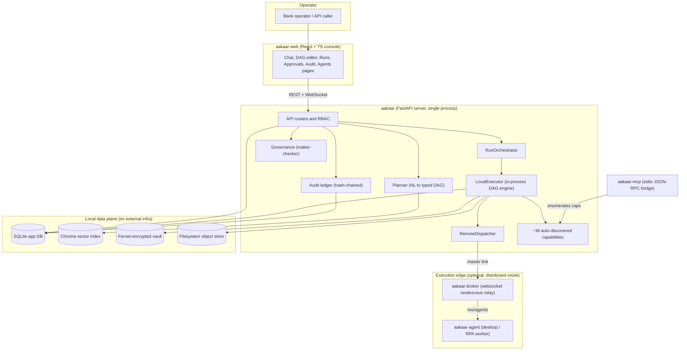
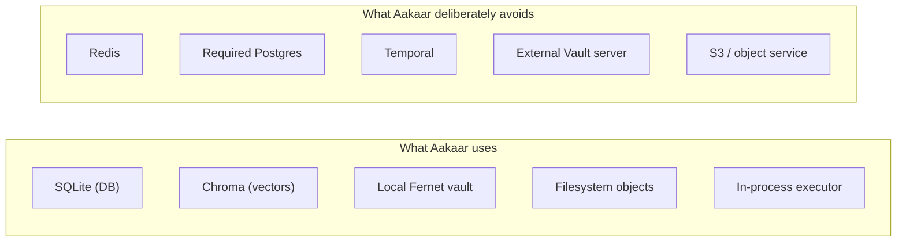
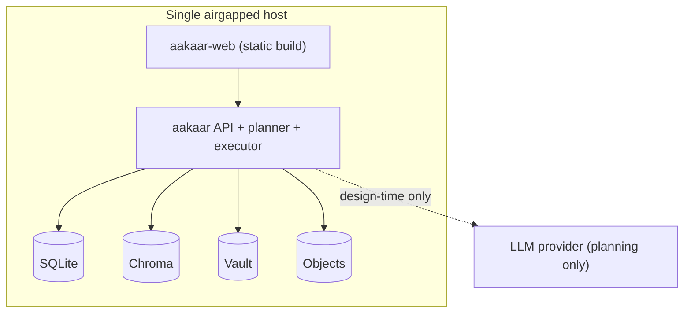
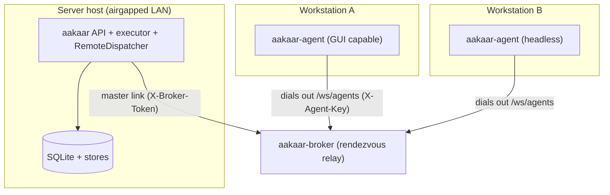

# Solution Architecture Overview

> **In plain terms:** Aakaar lets a bank operator type a request in plain language — "log into the disputes portal and download the open-disputes report" — and have the platform turn that into a repeatable, fully audited automation that a computer carries out. The whole system is built to run **inside the bank's own walls**: no cloud database, no message bus, no outside vault, nothing that phones home. Everything it needs to run lives in a handful of processes and a few local files. This page is the one-page map of those pieces and how they fit together.

This document is the **context map** for the entire platform. It names every component, says in one line what each does, shows how a request flows end to end, and describes the two ways the system can be deployed. Deeper subsystem detail lives in the High-Level Design; step-by-step interaction traces live in the Data Flow & Sequence Catalog.

---

## 1. The system on one map

The platform is a small set of cooperating components grouped into three planes: a **control plane** (the API server and its in-process engine), a **data plane** (the local stores), and an **execution edge** (the broker and remote agents that act on machines the server can't reach itself).

> The server is the brain; an agent is a pair of hands. Most work happens inside the server's own process; only nodes that *must* run elsewhere (a GUI app, a LAN-only system) are shipped to an agent.

---

## 2. What each component does (one line each)

| Component | One-line role |
| --- | --- |
| **aakaar-web** | React + TypeScript + Vite console: chat, DAG editor, run timelines, approvals queue, audit viewer, agent fleet. |
| **aakaar (API)** | FastAPI server exposing all REST + WebSocket endpoints, RBAC, and the planner/orchestrator wiring. Fully in-process. |
| **Planner** | Turns a natural-language message into a typed, validated DAG of *pre-approved* capability nodes — or asks to clarify / reports missing caps. |
| **RunOrchestrator** | Owns a run's lifecycle: schedules it, drives it to a terminal status, handles pause/resume/cancel and crash recovery. |
| **LocalExecutor** | The engine. Walks the DAG topological layer by layer, runs nodes concurrently within a layer, checkpoints after each layer. |
| **Governance** | Maker-checker gate: a sensitive publish or run-start opens an `ApprovalRequest` and waits for a *different* user to approve. |
| **Audit ledger** | Tamper-evident, hash-chained record of every consequential action; verifiable and exportable for regulators. |
| **RemoteDispatcher** | Ships a single DAG node to a remote agent when its placement target isn't the server, with a just-in-time credential envelope. |
| **Capabilities** | ~38 auto-discovered units of work (HTTP, browser, file, document, storage) with SSRF / zip-slip / zip-bomb guards and a `side_effecting` flag. |
| **aakaar-broker** | Stateless WebSocket rendezvous relay so server and agents can meet without either needing an inbound address. |
| **aakaar-agent** | Remote desktop / RPA worker that dials out, runs dispatched nodes, records activity, and reconnects with backoff. |
| **aakaar-mcp** | A stdio JSON-RPC server that exposes the same capabilities to MCP clients (e.g. an AI assistant), enumerated dynamically. |
| **SQLite** | The single primary database: tenants, users, workflows, runs, events, approvals, the audit chain, agent metadata. |
| **Chroma** | Local vector index backing semantic capability search during planning. |
| **Vault** | Fernet-encrypted local secret store behind a pluggable `KeyProvider` (a KMS seam for later). |
| **Object store** | Filesystem-backed artifact store (downloads, screenshots, exports), namespaced per tenant and run. |

---

## 3. The airgap / no-third-party-infra principle

This is the single most load-bearing decision in the platform and it shapes every component above.

> **Aakaar runs with no third-party infrastructure.** No Redis, no required Postgres, no Temporal, no external Vault server, no S3. The primary store is **SQLite**, the vector store is **Chroma**, secrets live in a **local Fernet vault**, artifacts live on the **local filesystem**, and the workflow engine runs **in-process**. The only outbound connection a deployment makes is to its LLM provider for planning — and even that is at *design* time (turning a prompt into a DAG), not during execution of an approved workflow.

Why this matters for a bank:

- **Deployable into an airgapped or tightly-segmented network** without provisioning a fleet of supporting services.
- **A smaller attack surface and a simpler audit story** — there are fewer moving parts to secure, patch, and certify.
- **Durability without a cluster.** Crash recovery, checkpoints, and the maker-checker queue are all backed by SQLite rows rather than a separate coordination service.

The cost is a deliberate one: the system is single-node and scales *within* a host rather than across a cluster. That trade is appropriate for the operator-driven, governed workloads it targets (reconciliation, dispute handling, KYC pulls, loan-document processing). The execution edge (broker + agents) is the one place where work *does* leave the host — and even there, agents dial **out** to the server, so workstations need no inbound ports.

> RS256 / JWKS identity, TOTP MFA, OIDC/PKCE login, RBAC, and an optional Postgres Row-Level-Security mode exist as *seams*: you can layer enterprise identity on top, but nothing in the base deployment requires an external service to function.

---

## 4. Deployment topologies

There are two supported shapes. They share the exact same server and stores; the only difference is whether the execution edge (broker + agents) is present.

### 4.1 All-in-one airgap

Everything in one process plus a few local files. The executor runs every node itself. There is no broker and there are no agents. This is the default, and it is sufficient for any workflow built from HTTP, browser, file, document, and storage capabilities.

### 4.2 Distributed with broker

The same server, plus a stateless broker and one or more agents on other machines — used when some nodes must run on a workstation (GUI/desktop automation, a LAN-only intranet app, or data that must not leave a specific machine). The server still orchestrates the whole run; only the targeted nodes execute on agents.

Key properties of the distributed mode:

- **Both sides dial out to the broker.** Neither the server nor an agent needs a stable inbound address. The broker is a pure relay: it allocates a session id per agent and forwards frames verbatim, never parsing them.
- **End-to-end agent authentication.** The agent's `X-Agent-Key` is forwarded opaquely through the broker; the **API** performs the authoritative database check and pins each session to the verified key's tenant. A fail-closed `X-Broker-Token` guards the master link.
- **Coordination stays in-process.** The live agent registry lives in the server's memory over the open socket; SQLite holds only durable agent metadata. There is still no external broker for *task queuing* — the rendezvous broker only relays the transport.

| Choose | When |
| --- | --- |
| All-in-one airgap | Every node can run server-side (HTTP/browser/file/document/storage). Simplest to operate and certify. |
| Distributed with broker | One or more nodes need a real desktop session, LAN-only locality, or strict data residency on a specific machine. |

---

## 5. Where to read next

- **High-Level Design** — subsystem responsibilities, the major end-to-end flows, non-functional posture, and the reasoning behind the in-process executor and SQLite choices.
- **Data Flow & Sequence Catalog** — swimlane traces for the run lifecycle, intent-to-workflow planning, remote-node execution, the maker-checker gate, durable resume after restart, and dry-run.
