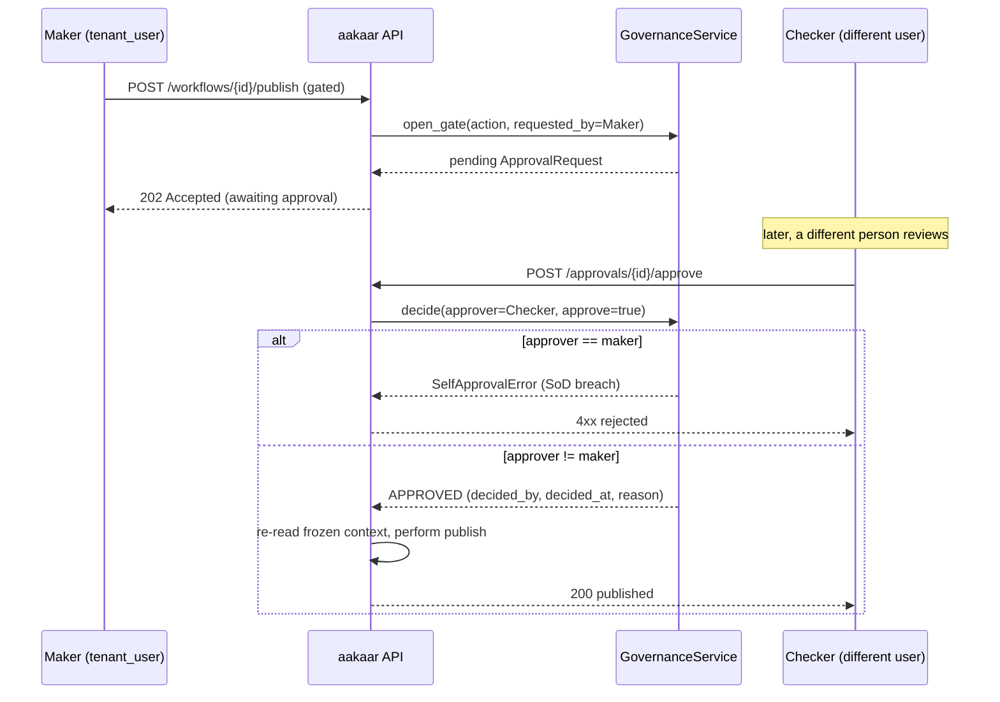
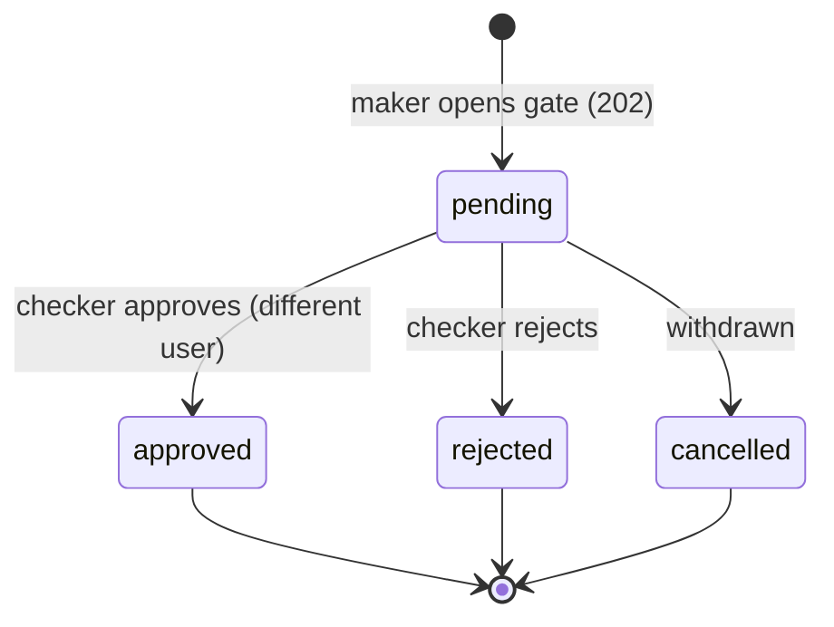
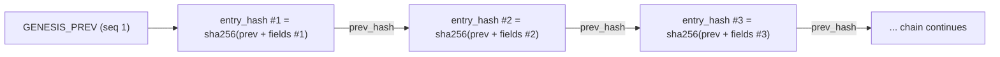
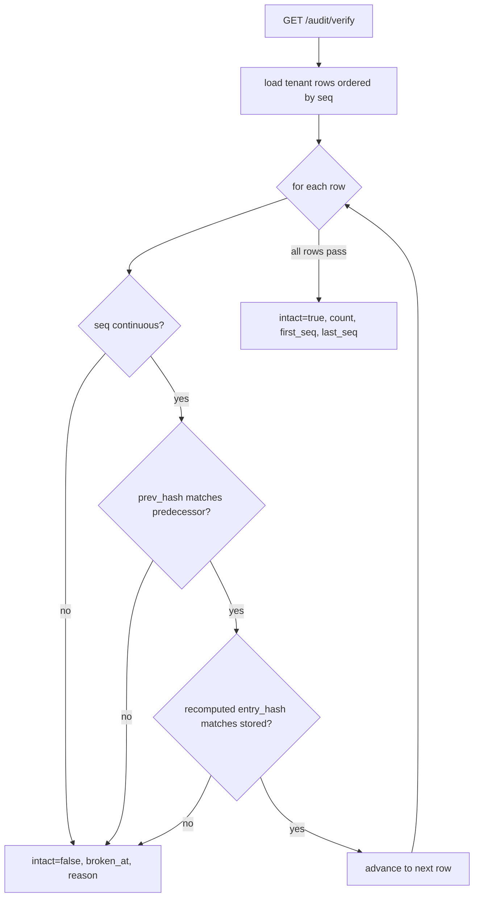
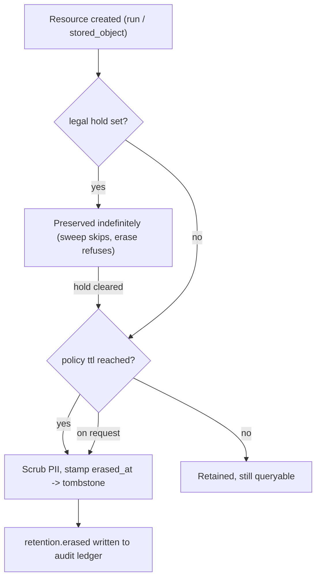

# Compliance & Governance Guide

> **In plain terms:** When software automates money-movement-adjacent work, regulators and internal auditors ask three questions: *Who approved this? Can the record be trusted? And can we get the evidence out?* Aakaar answers all three. Sensitive actions need two different people (a "maker" who requests and a "checker" who approves). Every action is written into a tamper-evident logbook where altering any past page is detectable. And data can be erased to satisfy privacy law — but the logbook of *what happened* is never erased, so the audit trail always outlives the data it describes.

This guide is written for risk and audit readers. It explains maker-checker segregation of duties, the tamper-evident hash-chained audit ledger and how to verify/export it for a regulator, and the retention / legal-hold / right-to-erasure controls. It closes with a control-to-evidence mapping table you can take into an audit.

---

## 1. Maker-checker and segregation of duties

Some actions are too sensitive to be performed by a single person — for example, **publishing a workflow** that will move payments, or **starting a run** of an elevated-sensitivity process. For these, Aakaar enforces **segregation of duties (SoD)**: the person who requests the action (the *maker*) cannot be the person who approves it (the *checker*).

### How a gate works

A workflow is *gated* when it opts in (`requires_approval=true`) or is marked `sensitivity='elevated'` (`workflow_is_gated`, `services/governance/service.py`). The default — `requires_approval=false`, `sensitivity='normal'` — is ungated, so existing low-risk flows are unaffected.

When a maker attempts a gated action, the API does **not** perform it. Instead it opens a pending `ApprovalRequest` and returns **HTTP 202 Accepted** — "received, awaiting a second person". A *different* user later approves or rejects it via `POST /approvals/{id}/approve` or `POST /approvals/{id}/reject`. The single rule the governance service exists to guarantee is `req.requested_by != approver_id` — a self-approval raises `SelfApprovalError`.

> **Why the action is performed by the API, not the governance service:** the `GovernanceService` only *records the decision*. On approval, the approvals router re-reads the frozen `context` snapshot and performs the original publish/run-start under the **checker's** authorization. This keeps SoD enforcement decoupled, testable, and impossible to bypass by calling the action directly — the gated endpoints themselves return 202 instead of executing.

The 202-gate, second approver, then action — a full maker-checker cycle:



### Decision states

An `ApprovalRequest` moves through a simple lifecycle. Decisions are terminal — an already-decided request cannot be re-decided (a second approve returns the audited `approved` request and a 409, never a silently-lost decision).



> **Auditor's note:** both the approval and the rejection are themselves recorded in the audit ledger (`approval.approve` / `approval.reject`) with the checker as the actor. So the evidence for an SoD control is two linked, immutable rows: the maker's request and a *different* user's decision.

---

## 2. Tamper-evident audit ledger

Every tenant-scoped action is written to the `audit_log` table as a row in a **per-tenant hash chain** (`services/audit/recorder.py`, `chain.py`). This is what makes the log *tamper-evident*: you cannot quietly edit, delete, or reorder history without breaking the chain, and the break is detectable.

### How the chain works

Each row carries a per-tenant monotonic sequence number `seq` and an `entry_hash`:

```
entry_hash = sha256( prev_hash + "\n" + canonical_payload(immutable fields) )
```

`prev_hash` is the *previous* row's `entry_hash` (or a genesis sentinel for `seq = 1`). The `canonical_payload` is a deterministic, sorted-key JSON serialization of exactly the **immutable** audit fields — `tenant_id`, `seq`, `actor_id`, `action`, `target_kind`, `target_id`, the timestamp, and the (redacted) `payload`. Because each entry's hash folds in its predecessor's hash, the rows form a chain: altering any historical field changes that row's `entry_hash`, which no longer matches the `prev_hash` stored in the *next* row — and every hash downstream breaks too.

How each entry is bound to the one before it:



A few properties a reviewer should know:

- **The writer and verifier share one function.** Both call `compute_entry_hash`, so they can never disagree about what a row's hash "should" be. The timestamp is normalized to fixed-precision UTC so the database's timezone round-trip cannot change the hashed bytes.
- **Concurrency is serialized.** A per-tenant in-process lock guards the read-tail-then-insert step, and a `uq_audit_tenant_seq` unique index is the durable backstop — a torn-chain collision is retried with a freshly read sequence.
- **Sensitive fields are redacted before persistence.** Keys like `password`, `token`, `secret`, `client_secret`, and `private_key` are replaced with `<redacted>` so the ledger never becomes a secret store.
- **System rows are a separate side log.** Superuser/bootstrap actions (`tenant_id is None`) get a NULL `seq` and are *not* chained — they are an append-only, unverifiable side log by design. The verifiable chain is strictly per-tenant.

### Verifying the chain (for a regulator)

A tenant admin calls `GET /audit/verify` (a superuser can verify any tenant via `GET /audit/tenants/{tenant_id}/verify`). The verifier recomputes the whole chain and reports the **first broken link**:

| Tampering attempted | How verify detects it |
|---|---|
| A historical field was edited | recomputed `entry_hash` differs from stored — `entry_hash mismatch` |
| A row was deleted or reordered | `seq` gap or non-monotonic — `sequence gap or reorder` |
| A link was severed | stored `prev_hash` does not match the predecessor's `entry_hash` |
| A sequenced row lost its hash | `row is sequenced but has no entry_hash` |

The response carries `intact` (true/false), `count`, `first_seq`/`last_seq`, and — when broken — `broken_at` (the offending `seq`) and a human `reason`. The verifier **only reports; it never repairs** — history is never rewritten.

How verification confirms (or pinpoints a break in) the chain:



### Exporting for external attestation

`GET /audit/export` streams the calling tenant's chain as JSONL (a superuser can export any tenant via `GET /audit/tenants/{tenant_id}/export`). Because the canonical serialization is documented and deterministic, **a regulator can recompute every `entry_hash` independently from the exported JSON** — without trusting Aakaar's own verifier. The export is paged/resumable so even a large ledger streams without loading it all into memory.

---

## 3. Retention, legal hold, and right-to-erasure

Privacy regimes require that personal data not be kept forever and can be erased on request; litigation and investigations require that *specific* data be preserved. Aakaar reconciles these with three tenant-scoped operations (`services/retention/service.py`), exposed under `/retention`.

Two resource types are erasable today:

- **`run`** — scrubs the PII-bearing `inputs` / `outputs` / `error` / `checkpoint` JSON (and the mirrored `run_events` payloads), leaving a tiny `{"_erased": true}` marker, and stamps `erased_at`. The row remains as a **tombstone** — status, timeline, and workflow reference are kept for audit.
- **`stored_object`** — deletes the underlying bytes via the object store, flips `status` to `erased`, stamps `erased_at`; the metadata row remains.

### The three operations

| Operation | Endpoint | Behaviour |
|---|---|---|
| Set retention TTL | `PUT /retention/policies/{resource_type}` | `ttl_days = null` retains forever; a positive int ages data out. A non-positive ttl is rejected. |
| Periodic sweep | (lifespan task; `sweep`/`sweep_all_tenants`) | erases resources older than `now - ttl_days` that are **not** under legal hold and not already erased. |
| Right-to-erasure | `POST /retention/erase` | erases one resource on demand; **refused** while a legal hold is in force. Idempotent. |
| Legal hold | `POST /retention/legal-hold` | sets/clears the hold flag on a run or stored object. |

How a resource flows through retention:



> **Legal hold outranks erasure.** A held resource is skipped by the sweep and an explicit erase raises `LegalHoldError`. The hold is re-checked *inside* the write transaction, so a hold set in the gap between listing and erasing still wins (no race). Clearing the hold re-exposes the resource to retention.

### The erasure guarantee

> **Erasure never touches the audit trail.** The `RetentionService` can only target `run` and `stored_object` resources (`ERASABLE_RESOURCE_TYPES`). The `audit_log` is intentionally **not** an erasable type — "the audit log must outlive what it describes." Erasing a run removes the personal data inside it but leaves the immutable ledger entry recording *that it ran and that it was erased* (a `retention.erased` row, with the reason). So you can satisfy a right-to-be-forgotten request **and** still prove to an auditor what happened and when. The two requirements do not conflict.

---

## 4. Control-to-evidence mapping

This table is the one to take into an audit: each control, the mechanism, and the concrete evidence you can produce.

| Control objective | Mechanism in Aakaar | Evidence an auditor can pull |
|---|---|---|
| Segregation of duties on sensitive actions | Maker-checker gate; `requested_by != approver_id` enforced | The `ApprovalRequest` (maker, checker, `decided_at`, `reason`) plus `approval.approve`/`reject` ledger rows with distinct actors |
| Authorization of privileged actions | Gated endpoints return 202; action performed under checker's authority | 202 response + the approved request's frozen `context` snapshot |
| Tamper-evident activity log | Per-tenant SHA-256 hash chain over immutable fields | `GET /audit/verify` returning `intact=true` (or `broken_at` if tampered) |
| Independent verifiability | Documented canonical serialization; JSONL export | `GET /audit/export` — recompute every `entry_hash` outside Aakaar |
| No secrets leak into logs | Redaction set applied before any audit write | Inspect ledger rows — `password`/`token`/`secret` etc. show `<redacted>` |
| Data minimization / retention | `RetentionPolicy.ttl_days`; periodic sweep | `GET /retention/policies` + `retention.erased` ledger rows (`reason=retention_sweep`) |
| Right-to-erasure (e.g. data-subject request) | `POST /retention/erase` scrubs PII to a tombstone | `erased_at` on the row + `retention.erased` ledger row (`reason=right_to_erasure`) |
| Preservation for litigation/investigation | Legal hold outranks both sweep and erase | `retention.legal_hold_set` ledger row; erase attempt returns `LegalHoldError` |
| Audit trail survives erasure | `audit_log` excluded from erasable types | The `retention.erased` row still exists after the data it describes is gone |
| Tenant data separation | App-level `tenant_scope` + optional fail-closed RLS | Audit chains are per-tenant; verify is scoped to one tenant |

> **Bottom line for risk and audit:** every sensitive action is two-person-authorized, every action is written to a chain that fails verification if altered, and personal data can be erased without ever erasing the proof of what occurred. The whole evidence set is reproducible from documented endpoints — `/approvals`, `/audit/verify`, `/audit/export`, and `/retention` — with no proprietary tooling required.

For the underlying identity, encryption, and isolation controls these governance mechanisms rest on, see the **Security Overview**.
