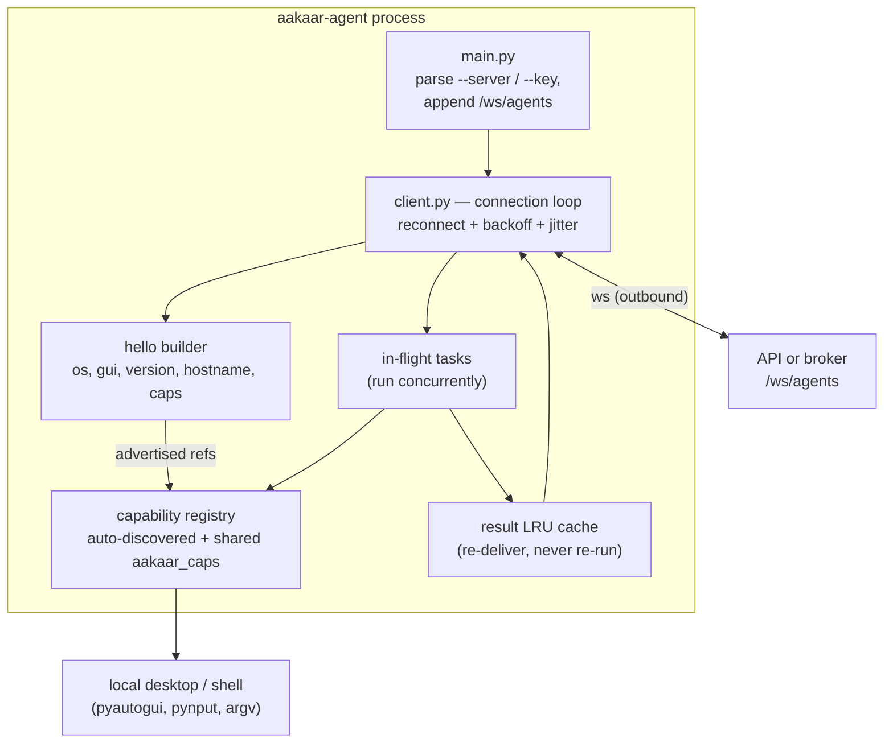
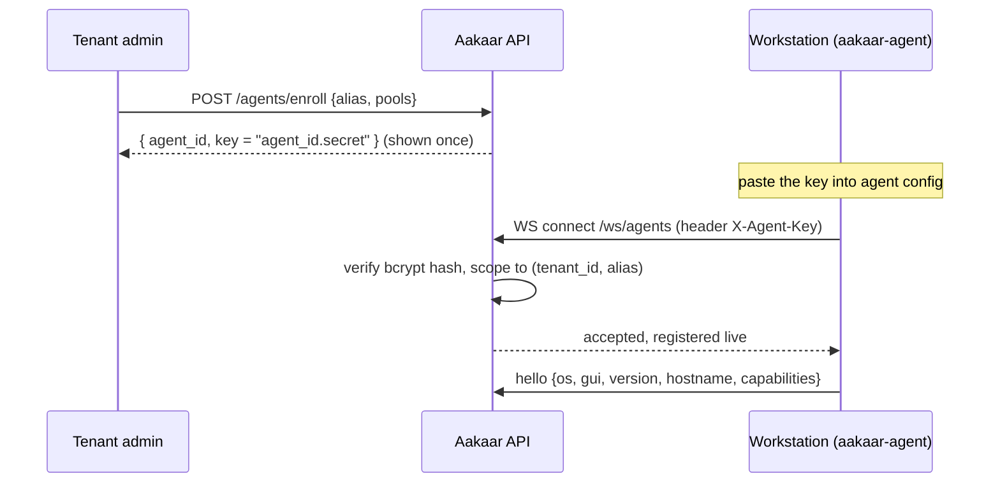
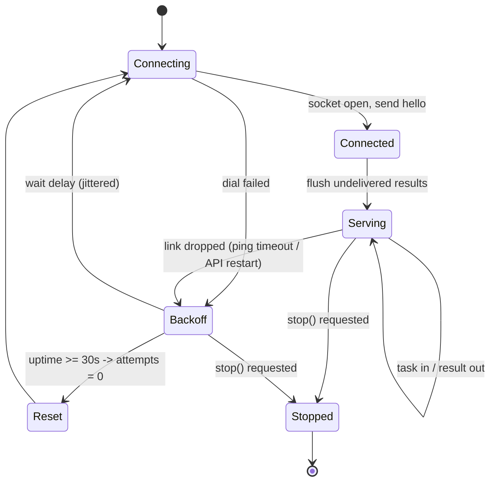
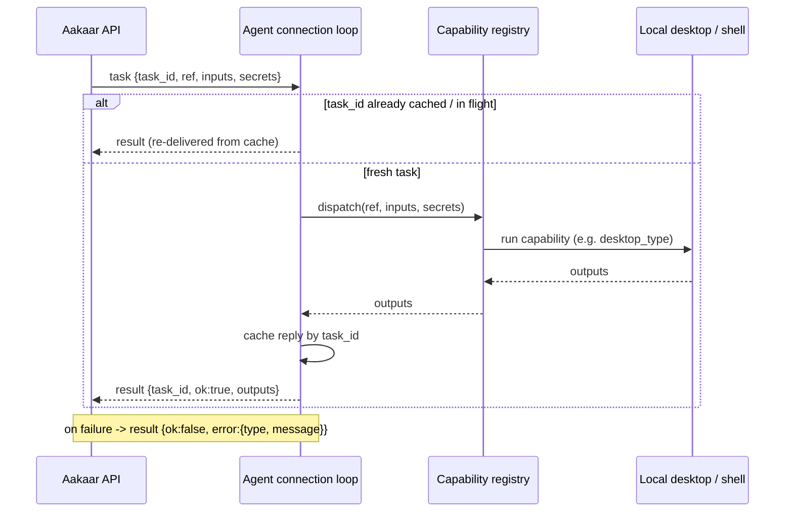
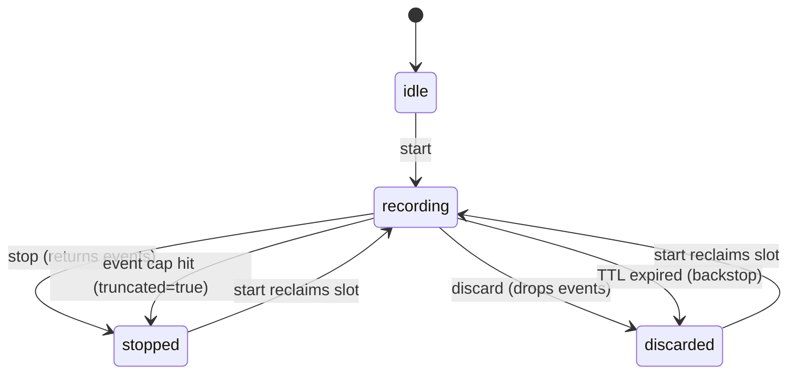
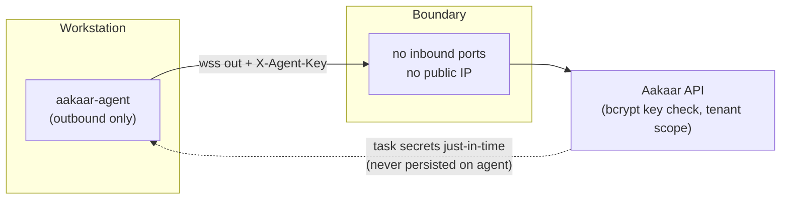

# Remote Agent

**In plain terms:** the remote agent is a small, trusted worker program you install on an ordinary computer — a branch teller's PC, a back-office workstation, a kiosk. It lets Aakaar reach out and *do things on that machine*: click buttons, type into a legacy banking application, read a window title, run a command. Think of it as a careful robot hand that Aakaar can borrow on a specific machine, but only for work that machine's owner (its tenant) has explicitly authorised. The computer never opens a door for the outside world — the agent always calls *out* to Aakaar, never the other way round.

This is how Aakaar automates the last mile of banking work that lives in desktop software with no API: a green-screen core-banking terminal, a vendor reconciliation tool, a Windows-only KYC scanner. The agent runs the steps a human would, on the machine where those applications actually run.

> The agent is **RPA (robotic process automation)** done safely: outbound-only networking, per-agent identity, just-in-time secrets, and a privacy-preserving activity recorder. It runs the *same* capability code the server runs, so a capability is "write once, run server-or-agent."

---

## What it is

The agent is a Python service (`aakaar-agent`) installed on a remote/desktop machine. On startup it dials out over an authenticated WebSocket to the API's `/ws/agents` endpoint, announces what it is, and then waits for the API to dispatch tasks. Each task names a **capability ref** (e.g. `cap.desktop_click`); the agent runs that capability locally and sends the result back.

It loads two kinds of capabilities:

| Capability ref | Needs a GUI session | What it does |
|---|:---:|---|
| `cap.desktop_click` | yes | click at coordinates / on an element |
| `cap.desktop_type` | yes | type text |
| `cap.key_send` | yes | send keys / hotkeys |
| `cap.desktop_scroll` | yes | scroll |
| `cap.clipboard_write` | yes | set the clipboard |
| `cap.window_manage` | yes | focus / move / resize windows |
| `cap.activity_recording` | yes | record desktop activity as a redacted trace |
| `cap.shell_exec` | no | run an **argv** command (no shell string — injection-safe) |
| `cap.system_info` | no | report host facts |

GUI capabilities are imported **lazily** — a headless agent (a server with no logged-in desktop) loads fine and simply never advertises GUI caps. The shared headless caps (`shell_exec`, `system_info`) come from the `aakaar_caps` SDK, the very same library the server uses.

> Banking example: a reconciliation workflow places a `cap.desktop_type` node and a `cap.key_send` node on the branch PC that hosts the legacy ledger app. The agent drives the app exactly as the clerk would — opens the day's batch, types the control total, presses Enter — and reports back success or the on-screen error.

---

## Agent internals

The pieces:

- **`main.py`** reads `--server`/`AAKAAR_AGENT_SERVER` (a base URL like `wss://aakaar.lan:8000`) and `--key`/`AAKAAR_AGENT_KEY`, appends `/ws/agents`, and starts the client loop.
- **Capability registry** auto-discovers every handler module at startup and merges in the shared `aakaar_caps` library, then advertises only the refs it actually loaded.
- **Connection loop** (`client.py`) owns reconnection, the heartbeat, concurrent task execution, and the result cache.

---

## Enrollment and per-agent key authentication

An agent has an identity before it ever connects. A **tenant admin** enrolls it once and receives a **one-time key** of the form `<agent_id>.<secret>`. The server stores only a **bcrypt hash** of the secret, so the plaintext key is shown exactly once — copy it then.

Key facts about agent identity:

- **Enroll** via the *Agents* page or `POST /agents/enroll` (tenant-admin only). Optional `pools` group agents for targeting.
- **Identity is tenant-scoped** `(tenant_id, alias)` — an agent can only ever run *its own tenant's* nodes; it can never reach another tenant's work.
- The API verifies the key **before** accepting the socket. A missing/malformed/wrong/revoked key closes the socket with code **4401**.
- **Targeting:** DAG nodes select an agent by `target` — an alias, `pool:<name>`, or `os:<name>`. The API only dispatches to a live agent that matches; `POST /placement/check` is a pre-flight that reports `online_agents` and placement issues.
- **Revocation = rotation.** `DELETE /agents/{id}` deletes the row *and* drops the live connection immediately; re-enroll for a fresh key. Both `agent.enroll` and `agent.revoke` are audited.

> Treat the key like a password. A stolen key lets someone connect *as that agent* and receive any task placed on it — including grant-resolved secrets in task frames. After a suspected compromise, revoke, re-enroll, and rotate any secrets dispatched to that agent.

---

## The connection loop — reconnect, backoff, heartbeat

The agent is built to survive flaky networks, sleeping laptops, and API restarts without losing or duplicating work.

Robustness semantics, exactly as implemented:

- **Exponential backoff with jitter.** Base delay 1s, doubling per failed attempt, capped at 60s, multiplied by a random 0.5–1.0 factor. The jitter de-synchronises a herd of agents so a mass reconnect (after an API restart) does not hammer the API in lockstep.
- **Backoff reset.** A connection that stays up for 30s is "healthy again" and resets the attempt counter.
- **Heartbeat.** WebSocket pings every 20s with a 10s timeout. A peer that stops answering (laptop slept, NAT entry expired) gets the link torn down, which re-enters the reconnect loop.
- **In-flight tasks survive a disconnect.** Tasks keep running across a drop. Results are **re-delivered, never re-executed**: every completed reply is kept in a bounded LRU cache (128 entries); a reply that couldn't be sent is flushed right after the next successful `hello`; and a server *redispatch* of a known `task_id` (in flight or cached) is answered from the cache instead of running the capability again. This is what makes a side-effecting RPA step safe across network blips.
- **Concurrent tasks.** Tasks run concurrently so one slow task never blocks the channel; each reply is correlated by `task_id`.
- **Graceful stop.** `stop()` is thread-safe (callable from a signal handler or service manager) — it hops onto the event loop, sets the stop event, and closes the live socket so the loop doesn't stay parked in the read.

---

## Capability execution

When a `task` frame arrives, the agent dispatches by ref through its registry. Secrets ride in the task frame **just-in-time** for that node and are never persisted on the agent.

- The agent only ever runs **advertised capability refs** — never an arbitrary command. An unknown ref fails cleanly.
- `cap.shell_exec` takes an **argv list, not a shell string**, so there is no shell-injection surface.
- Failures are caught and reported as a structured `error` (type + truncated message), not as a dropped task.

---

## Activity recording — and its privacy guarantees

`cap.activity_recording` lets a workflow capture what happens on the desktop as a **redacted event trace** — used to teach or verify an automation (e.g. "show me how the clerk closes the batch") without ever capturing the actual content typed.

What it records, and what it deliberately does **not**:

| Event kind | Captured | Never captured |
|---|---|---|
| `click` | x, y, button | — |
| `scroll` | dx, dy (coalesced within 250ms) | — |
| `key` | only allowlisted nav/hotkey combos (enter, tab, esc, ctrl+c, ctrl+v, alt+tab, ...) | — |
| `text` | a **count** of redacted keystrokes | the actual characters typed |
| `window` | window title and app name (length-capped) | — |

> **Privacy hard rule (enforced in code):** raw keystrokes never leave the agent process. Only allowlisted navigation/hotkey combos become `key` events; every other key press — printable characters, passwords, account numbers, anything — is aggregated into a `text` event carrying *only a count*. On macOS the `cmd` modifier is normalised to `ctrl`, so `cmd+c` records as the cross-platform `ctrl+c`.

Operational safety nets:

- **One recording per agent process**, with a bounded event buffer (default 2000, hard cap 5000). Hitting the cap auto-stops and sets `truncated`.
- **Never permanently wedged.** A session self-expires after a TTL (3 hours) and a new `start` reclaims a slot left behind by a server that crashed or forgot the recording — but an *actively recording*, un-expired session is never clobbered; the caller must `stop` or `discard` it first.

---

## Security posture

| Property | How it is enforced |
|---|---|
| **Outbound only** | the agent dials out to `/ws/agents`; the workstation opens no inbound ports and needs no public IP |
| **Authenticated identity** | key `<agent_id>.<secret>`; server stores only a bcrypt hash, verified before the socket is accepted |
| **Tenant isolation** | identity is `(tenant_id, alias)`; an agent can only run its own tenant's nodes |
| **Just-in-time secrets** | task secrets arrive per-node in the task frame and are never persisted on the agent |
| **No arbitrary execution** | only advertised refs run; `shell_exec` is argv-only (no shell string) |
| **Transport security** | use `wss://` (TLS) anywhere outside a trusted LAN; `ws://` only on a trusted LAN |
| **Keystroke privacy** | activity recording redacts all non-allowlisted keys to a count |

For the optional path where the agent can't reach the API directly, see the Rendezvous Broker component doc — the agent's protocol is unchanged; only its server URL points at the broker. For operating an offline fleet, see the agent-fleet-degradation runbook.
