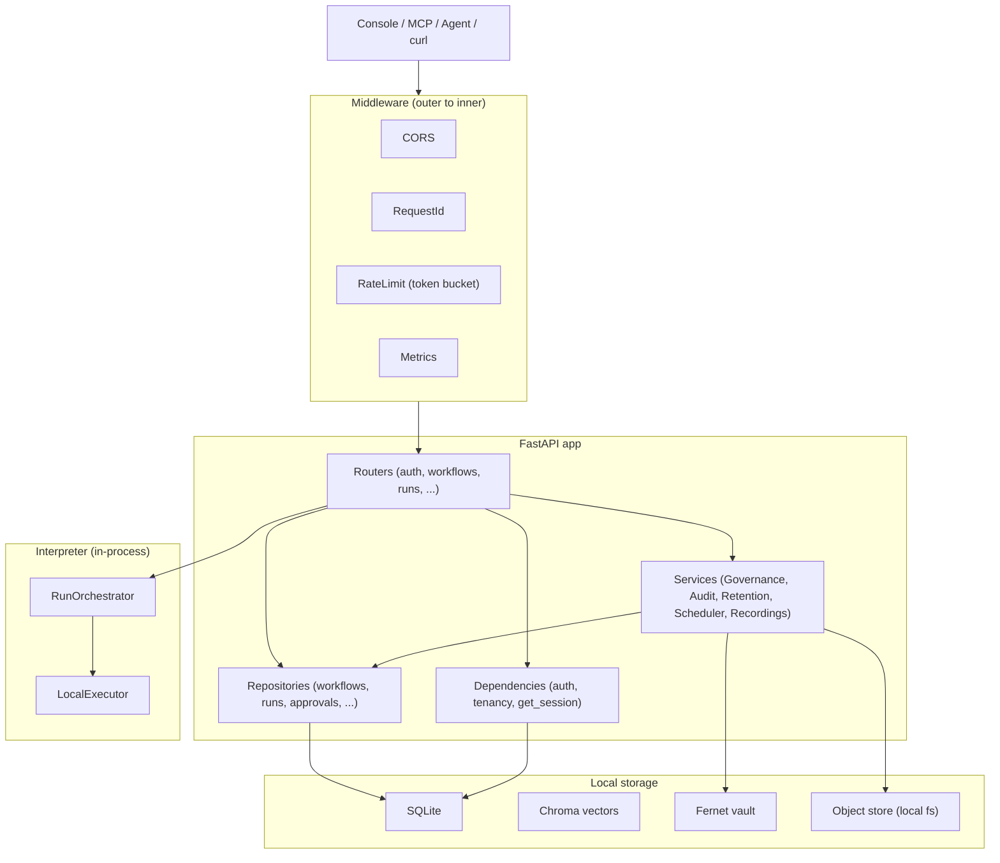
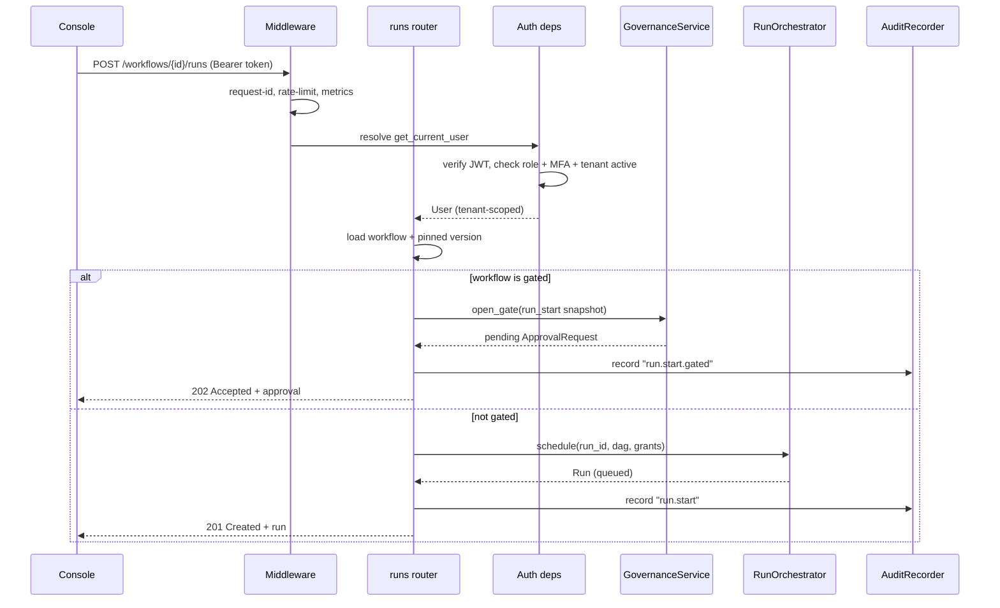
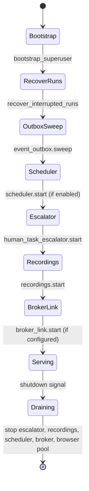

# Backend & API Service

> **In plain terms:** This is the brain and front door of Aakaar. Every screen in the console, every AI assistant, and every remote worker talks to this one service. It checks who you are, decides whether you are allowed to do what you asked, runs the actual automations, and writes an unforgeable record of everything that happened. It is a single program that runs entirely on one machine — no cloud database, no external queue, nothing that needs to phone home. That is deliberate: a bank can run the whole thing inside an airgapped network.

The Backend & API service is a **FastAPI** application backed by **SQLite** (records) and **Chroma** (vector search for capability matching). It is fully in-process: the workflow engine, the audit ledger, the encrypted secrets vault, the scheduler, and the event fan-out all live inside the same Python process. There is no Redis, no Postgres requirement, no Temporal server, no Vault server, and no S3 — airgap by design.

This document explains what the service is responsible for, how a request flows through it, and what happens when it starts up.

---

## Responsibilities

| Area | What the backend owns |
|------|----------------------|
| **Identity & access** | Login, JWT verification (HS256 default, RS256/JWKS optional), TOTP MFA, OIDC/PKCE, role checks (superuser / tenant admin / tenant user) |
| **Tenancy** | Every business row is scoped to a tenant; a tenant-bound user can never read another tenant's data |
| **Workflows** | Create, version, publish, and delete automations expressed as a DAG (directed graph of nodes) |
| **Runs** | Launch, pause, resume, cancel, rerun automations; drive them to completion via the interpreter |
| **Governance** | Maker-checker approval gates for sensitive workflows and runs |
| **Audit** | Tamper-evident, hash-chained ledger of every consequential action, with verify + export |
| **Retention** | Per-resource retention policies, legal hold, and right-to-erasure (never touches the audit trail) |
| **Capabilities & grants** | Expose the ~38 auto-discovered capabilities and the tenant credential grants that unlock them |
| **Remote work** | Enroll and dispatch to remote desktop/RPA agents; record agent activity into draft workflows |
| **Scheduling** | Cron and one-shot scheduled runs |

---

## Internal structure

The service is layered. Requests come in at the top (routers), flow down through services and repositories, and only the bottom layer touches the database. The **interpreter** is a sibling subsystem that the run path hands work to.

Layered view of the backend, top (HTTP) to bottom (storage):

> **Why the layers?** Routers handle HTTP shape and authorization only. Repositories hold the SQL. Services hold cross-cutting rules (e.g. "publishing a sensitive workflow opens an approval gate instead of publishing"). The interpreter is kept free of any `aakaar.api` imports so the engine could one day run behind a different front end without dragging the web layer along.

### Routers — the public surface

Every router is mounted in `aakaar/aakaar/api/app.py`. Here is what each one does and the role it generally requires.

| Router | Prefix | Purpose | Typical role |
|--------|--------|---------|--------------|
| `auth` | `/auth` | Password login; returns a bearer token or an MFA step-up ticket | public |
| `mfa` | `/auth/mfa` | TOTP enroll / confirm / disable / verify | authenticated user |
| `oidc` | `/auth/oidc` | OIDC/PKCE login + callback | public |
| `jwks` | `/auth/.well-known/jwks.json` | Publish RSA public keys for RS256 token verification | public |
| `superuser` | `/superuser` | Cross-tenant administration (create/suspend tenants, global views) | superuser |
| `admin` | `/admin` | Per-tenant user management and capability grants | tenant admin |
| `capabilities` | `/capabilities` | List the capabilities the caller may use | tenant user |
| `workflows` | `/workflows` | Create, list, version, publish, delete workflows | tenant user |
| `runs` | (root) | Start/list/inspect runs; pause/resume/cancel/rerun; respond to prompts | tenant user |
| `chat` / `chat_sessions` | `/chat` | Natural-language workflow planning sessions | tenant user |
| `objects` | `/objects` | Fetch run-produced artifacts | tenant user |
| `stats` | `/stats` | Dashboard counters for the caller's tenant | tenant user |
| `audit` | `/audit` | List entries, verify the hash chain, export | tenant admin / superuser |
| `approvals` | `/approvals` | The maker-checker queue: list, approve, reject | tenant user / admin |
| `retention` | `/retention` | Retention policies, legal hold, erasure | tenant admin |
| `schedules` | (root) | Cron and one-shot schedules for a workflow | tenant user |
| `agents` | (root) | Enroll, list, delete remote agents; placement check; `/ws/agents` | tenant admin / user |
| `recordings` | `/recordings` | Capture agent activity into a draft workflow | tenant admin |
| `ws` | `/ws/runs/{run_id}` | Live run-event stream over WebSocket | authenticated user |

### Repositories and services

`api/repositories/` (e.g. `workflows.py`, `runs.py`, `approvals.py`, `audit.py`, `grants.py`) are thin data-access modules — they build and run SQL with the tenant scope already applied. `services/` holds the durable subsystems: `audit/` (hash-chained ledger + file sink), `governance/` (maker-checker), `retention/`, `scheduler/`, `recordings/`, and `events/` (the at-least-once outbox + broker).

### The interpreter

The interpreter (`aakaar/aakaar/interpreter/`) is the execution engine. The `RunOrchestrator` owns "execute this DAG and persist the final status"; the `LocalExecutor` walks the DAG **layer by layer** in topological order, running each layer's nodes concurrently. It supports durable checkpoint/resume, a **dry-run mode** (side-effecting capabilities are simulated, never performed), operator pause/cancel between layers, and governed human-in-the-loop prompts. A node either runs as a registered activity locally or — when it targets an agent — is dispatched to a remote worker.

---

## Request lifecycle

A request passes through middleware (added in `app.py` so CORS is outermost), then FastAPI resolves dependencies that establish *who* you are and *which tenant* you are in, then the router does its work, and finally an audit row is written for any consequential action.

End-to-end flow of "start a run on a sensitive workflow":

> **The 202 pattern.** When a workflow is marked `requires_approval` or `sensitivity: elevated`, the gated endpoints (`POST /workflows/{id}/runs` and the workflow-publish `PATCH`) do not act. They snapshot the request, open an `ApprovalRequest`, and return **HTTP 202 Accepted** with the pending approval. A different tenant admin (never the maker) must approve before the action executes, attributed back to the original requester.

### How auth, tenancy, rate-limiting, and middleware fit

- **Auth** is resolved by FastAPI dependencies in `api/deps.py`. `get_current_claims` verifies the JWT (against the symmetric secret or the RSA `KeyStore`); `get_current_user` loads the user, rejects role drift, enforces MFA when enabled, and blocks suspended tenants. `require_superuser` / `require_tenant_admin` / `require_tenant_user` are role guards; `require_mfa_satisfied` is a step-up guard for especially sensitive routes.
- **Tenancy** is enforced via `tenant_scope` — repositories run inside the caller's tenant scope so a query can only see that tenant's rows. Superusers (no tenant) are the only cross-tenant identity.
- **Rate limiting** is a token-bucket middleware with a separate, tighter budget for `/auth` routes (to slow credential stuffing). It is wrapped by CORS so even a `429` carries CORS headers and the SPA can read the body.
- **Request ID** middleware stamps a correlation id so every log line in a request is tied together; **Metrics** middleware (optional) exposes `/metrics`.

---

## Lifespan startup tasks

When the process boots, the FastAPI `lifespan` hook in `app.py` runs a sequence of recovery and background tasks. These exist so that a crash or restart never leaves the system in a confusing or unsafe state.

Startup and shutdown sequence:

| Startup task | Why it exists |
|--------------|---------------|
| **bootstrap_superuser** | Ensures a superuser account exists on first boot so the platform is operable |
| **recover_interrupted_runs** | Reconciles runs left mid-flight by a crashed/restarted process so the UI never shows perpetually-RUNNING zombies |
| **event_outbox.sweep** | Replays run events that a previous process persisted but never fanned out (at-least-once delivery; the UI dedupes on `(run_id, sequence)`) |
| **scheduler.start** | Begins the cron/one-shot tick loop (only when `scheduler_enabled`) |
| **human_task_escalator.start** | Escalates human approval tasks whose SLA deadline has passed, even when no run activity would otherwise trigger a sweep |
| **recordings.start** | Expires abandoned recording sessions and tells their agents to stop capturing |
| **broker_link.start** | Optional outbound dial to a rendezvous broker; relayed agents register through the same key-verification path as direct connections |

On shutdown the same components are stopped in reverse, including tearing down the Playwright browser pool if one was wired.

---

## Banking example: a reconciliation run

A PayOps user starts a daily reconciliation workflow that compares the core-banking ledger export against the payment switch report.

1. `POST /workflows/{id}/runs` with `{ "inputs": { "value_date": "2026-06-17" } }`.
2. Because the workflow is `sensitivity: elevated`, the backend returns **202** with a pending approval. The maker cannot self-approve.
3. A second PayOps admin calls `POST /approvals/{id}/approve`. The orchestrator now schedules the run.
4. The `LocalExecutor` walks the DAG: pull both files, normalize, diff, raise a `human.prompt` if breaks exceed a threshold.
5. Every step lands in the hash-chained audit ledger; `GET /audit/verify` will later prove the record was not altered.

> **Key takeaway:** the backend is one process that combines a web API, a durable workflow engine, governance, and an audit ledger — with every sensitive action gated and recorded, and every startup designed to heal a previous crash.
