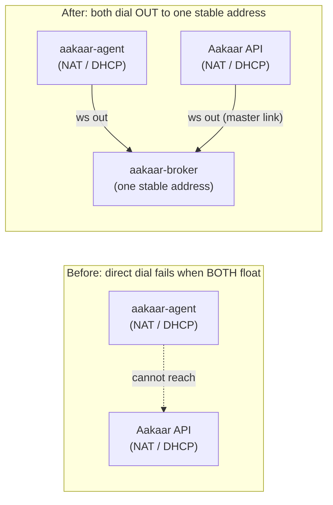
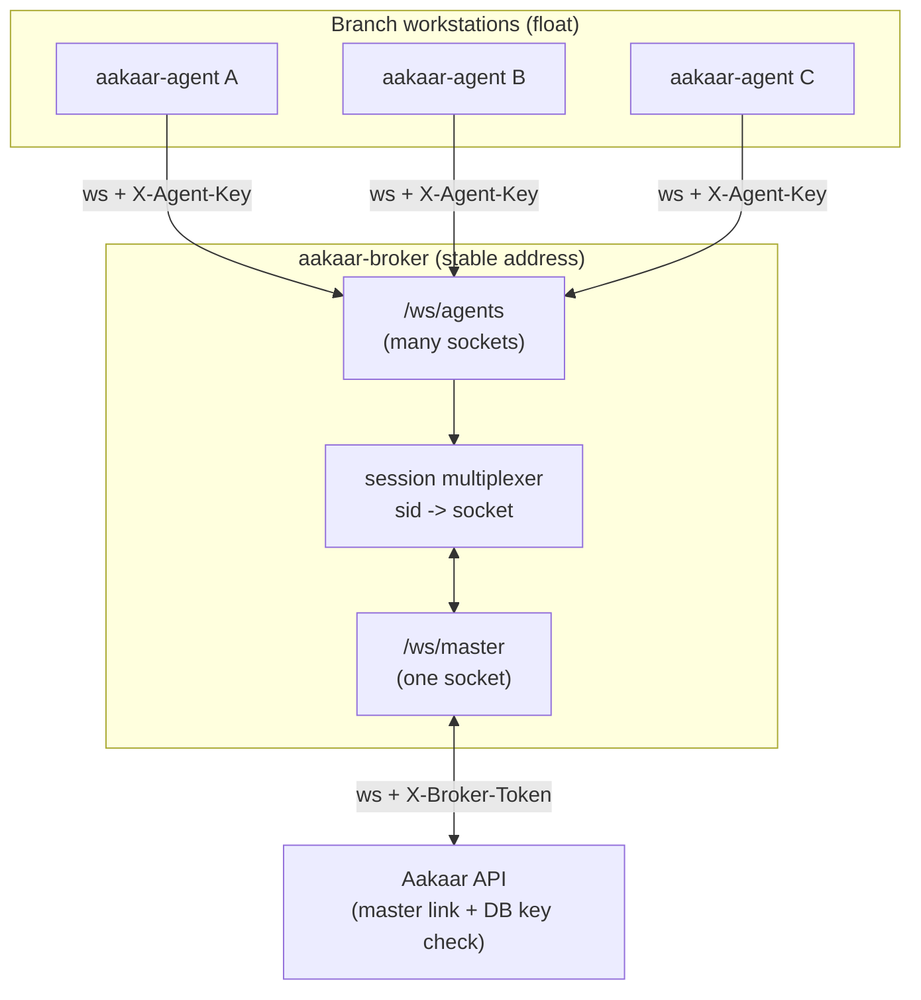
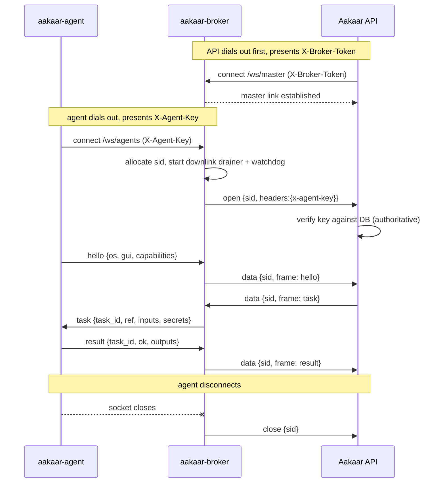
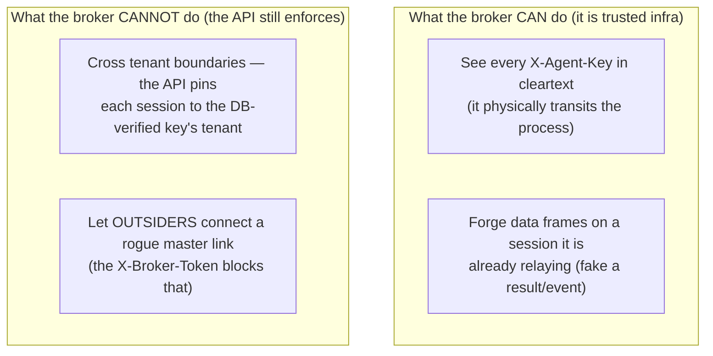
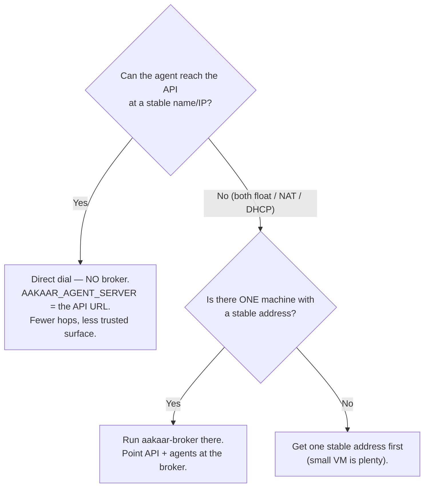

# Rendezvous Broker

**In plain terms:** imagine two people who both want to talk on the phone, but neither has a phone number you can dial — both are behind a switchboard that only lets them call *out*. The rendezvous broker is a meeting point with one fixed, dialable address that both sides call into. Once they have both called in, the broker simply patches their calls together and passes messages back and forth. It never reads the conversation, never decides who is allowed in (that is the API's job), and keeps no record once everyone hangs up.

In Aakaar, the two parties are a **remote agent** (running on a branch workstation) and the **Aakaar API** (running in your data centre). When neither has a network address the other can reach — both on DHCP, behind NAT, or on entirely separate networks — the broker is the one machine with a stable address that lets them find each other **by identity instead of by IP**.

> The broker is **optional and purely additive**. If your API already has an address the workstations can reach, you do not need a broker at all — agents dial the API directly. Direct connections keep working even when a broker is running.

---

## The problem it solves

A remote agent never accepts inbound connections — it only dials *out* (so the workstation needs no open ports, no public IP). That is great for security, but it creates a chicken-and-egg problem: if the **API box** is *also* on a floating address (DHCP, NAT, a different network), then neither side has an address the other can dial. Direct connection is impossible.

The fix is a third party with one stable address that both sides dial out to.

Before vs after — where the dialable address lives:



> Banking example: the API runs in a head-office VM that DHCP renumbers on every reboot, and twelve branch reconciliation workstations sit behind branch-office NAT. No branch can dial the head office and the head office cannot dial any branch. A single small broker VM with a stable hostname (`broker.bank.internal`) lets all twelve agents and the API find each other.

---

## Topology — one master link, many multiplexed agents

The broker exposes exactly two WebSocket paths:

| Path | Who dials it | Auth checked at the broker |
|---|---|---|
| `/ws/master` | the **API** (one connection) | `X-Broker-Token` header must equal `AAKAAR_BROKER_TOKEN` |
| `/ws/agents` | each **agent** (many connections) | none — the `X-Agent-Key` header is forwarded opaquely to the API |

Every agent socket gets its own **session id (`sid`)**. The broker announces each new session up the single master link and then relays text frames verbatim in both directions, multiplexed by `sid`. The API sees each relayed agent exactly as if it had connected directly — same `hello`/registration path, same end-to-end key check.

Topology of a broker-mediated fleet:



The master-link wire protocol is one JSON object per text frame, keyed by `sid`:

| Direction | Frame | Meaning |
|---|---|---|
| broker to master | `{"t":"open","sid":...,"headers":{"x-agent-key":...}}` | a new agent appeared; here is its (opaque) key |
| broker to master | `{"t":"data","sid":...,"frame":...}` | an agent frame, relayed up to the API |
| master to broker | `{"t":"data","sid":...,"frame":...}` | an API frame, relayed down to that agent |
| broker to master | `{"t":"close","sid":...}` | that agent went away |
| master to broker | `{"t":"close","sid":...}` | the API is dropping that agent |

---

## How pairing works

Both sides dial out; the broker stitches them together. The agent does **not** know it is talking to a broker — it speaks its normal `/ws/agents` protocol and simply has `AAKAAR_AGENT_SERVER` pointed at the broker's address instead of the API's. All the cleverness is in the broker patching the right sockets together.

Pairing and relay of one task, end to end:



A few guarantees baked into pairing:

- **Watchdog / handshake timeout.** A freshly opened agent session that the API never answers (no frame routed down within `AAKAAR_BROKER_HANDSHAKE_TIMEOUT`, default 10s) is dropped with close code **4408**. This stops half-open sessions from piling up if the API is unwell.
- **Bounded sessions.** Beyond `AAKAAR_BROKER_MAX_SESSIONS` (default 200) new agents are refused with close code **1013** ("try again later"); they keep retrying with backoff.
- **No master online.** If no API master link is connected, agents are refused with **1013** rather than buffered.
- **Single master, newest wins.** A second valid-token master connection *replaces* the old one (logged as a warning) and live agent sessions are closed with **1012** so they re-pair through the new link. This is how the API cleanly resumes after a restart while its old half-open TCP connection lingers.

---

## The trust model — the broker host is trusted infrastructure

This is the most important section to internalise before deploying a broker. "The API verifies the key, not the broker" is true, but it does **not** mean a malicious broker is harmless.



What the broker **enforces**:

- **Fail-closed token.** `AAKAAR_BROKER_TOKEN` is required with **no default** — the process refuses to start without it. A guessable token would let anyone connect a rogue master link and harvest agent sessions (and their keys), so this is deliberately a hard stop. The token is compared with a constant-time comparison (`hmac.compare_digest`).
- **Opaque key forwarding.** The broker copies the `X-Agent-Key` header into the `open` envelope without parsing it, and is instructed never to log it. The **API** performs the authoritative check against its database, exactly as for a direct connection.
- **Head-of-line isolation.** Each agent session has its *own* bounded downlink queue drained by its own task. A single agent that stops reading (a stalled or hostile socket) is dropped — it can never stall the shared master read loop and so can never block dispatch to the rest of the fleet. The cap is 1024 queued frames; overflow drops just that one agent.

What the broker **cannot** prevent (so treat the host accordingly):

- A hostile broker operator can **read every agent key** (it transits the process in cleartext) and replay it against the API to impersonate that agent.
- A hostile operator can **forge frames on sessions it is already relaying** — e.g. inject a fake `result` resolving a dispatched task with attacker-chosen output. It **cannot** cross tenants: the API pins every session, including recorded events, to the `tenant_id` of the DB-verified key.

> **Operational rule:** run the broker only on hardware you control, on the same trust boundary as the API, and always behind TLS outside a trusted LAN (the key header transits this link). The broker speaks plain `ws://`; terminate TLS in a reverse proxy in front of it and forward the `X-Agent-Key` header.

---

## When you need it (and when you don't)



| Scenario | Use a broker? |
|---|---|
| API has a stable LAN/VPN name agents can reach | No — direct dial |
| Both API and workstations are on DHCP / behind NAT / on different networks | Yes |
| Some agents can reach the API directly, others can't | Mixed — direct + broker simultaneously (broker is additive) |

---

## Configuration keys

All config is environment-only. On the **broker host**:

| Env var | Default | Meaning |
|---|---|---|
| `AAKAAR_BROKER_TOKEN` | **required — no default; refuses to start** | shared secret the API presents on `/ws/master` |
| `AAKAAR_BROKER_HOST` | `127.0.0.1` | bind address; set `0.0.0.0` only behind a TLS proxy / firewall |
| `AAKAAR_BROKER_PORT` | `9300` | bind port |
| `AAKAAR_BROKER_MAX_SESSIONS` | `200` | concurrent agent sessions; extras refused with close code 1013 |
| `AAKAAR_BROKER_HANDSHAKE_TIMEOUT` | `10` (seconds) | unanswered new sessions dropped with close code 4408 |
| `AAKAAR_BROKER_LOG_LEVEL` | `INFO` | log verbosity |

On the **API** (both vars or the API refuses to start — a fail-closed check):

```bash
AAKAAR_BROKER_URL=wss://broker.example.com \
AAKAAR_BROKER_TOKEN=<same shared secret> \
  uvicorn aakaar.api.main:app ...
```

On each **agent** — no code or flag change, just the server URL:

```bash
AAKAAR_AGENT_SERVER=wss://broker.example.com aakaar-agent --key "<agent_id>.<secret>"
```

### Close codes you will see in logs

| Code | Sent to | Meaning |
|---|---|---|
| 4401 | master | bad `X-Broker-Token` |
| 4408 | agent | handshake timeout (API never answered the session) |
| 1013 | agent | no master online, or session limit reached |
| 1012 | agent | master link lost or replaced (re-pair through the new one) |
| 1003 | agent | sent a binary frame (protocol is text-only) |
| 1009 | agent | frame too large after envelope escaping |

---

## Behaviour notes

- **Stateless:** no disk, no DB, no queue. If the broker restarts, agents and the API simply reconnect (both already retry with jittered backoff) and re-pair — nothing to replay, nothing to resume. This is why recovery is "just restart it with the same token."
- **Keepalive:** WebSocket pings every 20s on every connection; half-dead links are torn down by the protocol layer and trigger a redial.
- **Supervise it:** run under systemd with `Restart=always`. It is a single small process with no state to protect.

For operating a broker through an outage, see the broker-outage runbook; for diagnosing offline fleets, see the agent-fleet-degradation runbook. The agent side of this relationship is documented in the Remote Agent component doc.
