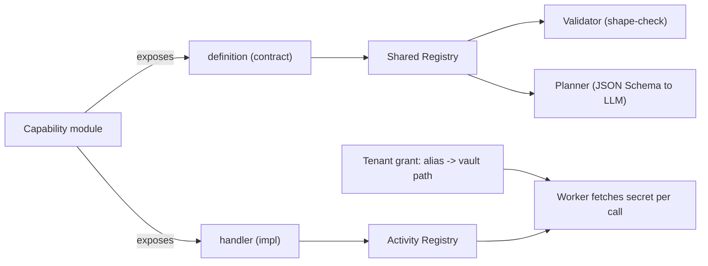
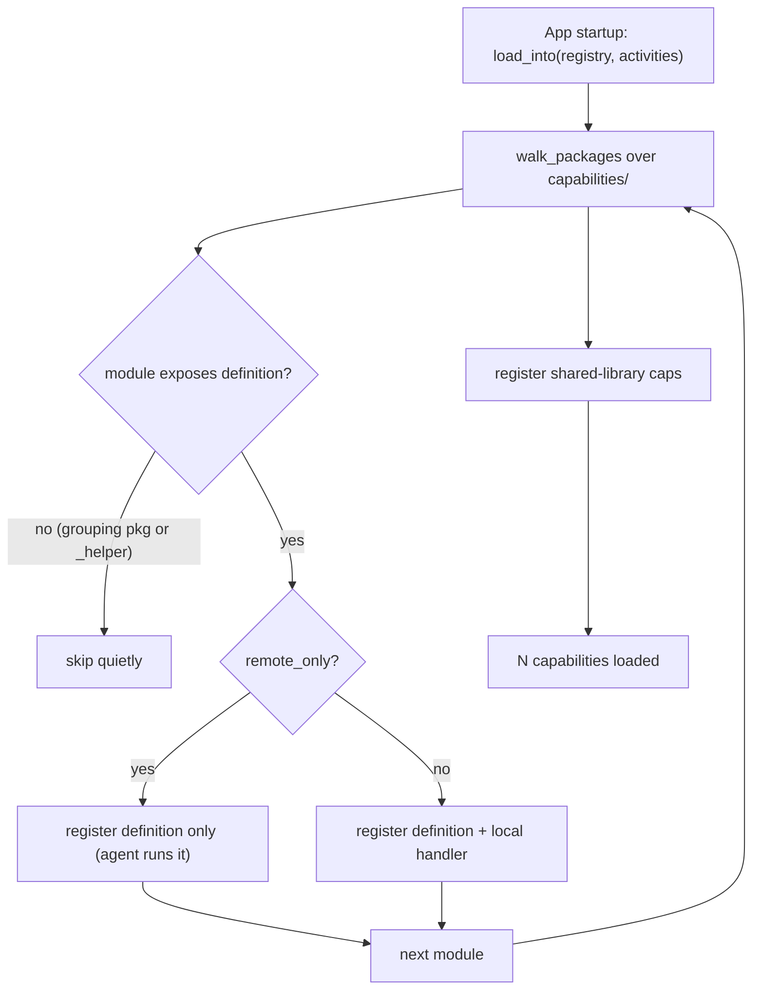

# Capabilities & Catalog

In plain terms: a capability is a pre-built, safety-checked Lego brick that the platform can snap into an automation. "Log into a portal," "read a PDF," "send an email," "list a folder over SFTP" — each is one capability. Staff author them once, the platform discovers them automatically, and a tenant only ever sees the ones it has been granted. Because every brick is vetted up front, the people composing automations never have to think about the dangerous edges (a malicious zip file, a request that secretly hits an internal server, a credential leaking into a log) — the brick already handles that.

This document explains what a capability is, how the platform finds them, the safety bar every capability clears, and a full catalog of the bricks that ship today, grouped by domain.

## What a capability is

A capability is a Python module that exposes exactly two things: a `definition` (a `CapabilityDefinition` registered in the shared registry) and a `handler` (the async function the engine invokes). The definition is the contract the rest of the system reasons about; the handler is the implementation nobody else needs to see.

The definition declares, for every capability:

| Field | Purpose |
| --- | --- |
| `ref` | Stable identifier, always `cap.*` (e.g. `cap.web_login`). What a DAG node references. |
| `description` | Human/LLM-readable summary used in planning and the catalog. |
| `input_schema` / `output_schema` | Pydantic models — the validator shape-checks inputs and the planner serialises them as JSON Schema for the LLM. |
| `secrets` | **Names only** of credentials the worker will fetch from the vault by alias at run time. Never values. |
| `tags` | Soft labels for search and filtering. |
| `side_effecting` | Tri-state flag (True / False / None) driving dry-run simulation — see below. |

> The cardinal rule: **the DAG carries references, never secrets or live data.** A capability declares which credential *names* it needs (`username`, `password`, `api_token`); the tenant's grant binds those names to a vault path; the worker fetches the real values fresh per call and they never flow back into the run environment.

Capabilities sit above generic **actions** (platform primitives like `browser.navigate`) and **control** nodes (`control.branch`, `control.for_each`, `control.wait`, `human.prompt`). The difference that matters: capabilities are *tenant-grantable* and *own credentials*; actions are tenant-agnostic and carry none. If an action would need authentication, that is the signal it should be wrapped as a capability instead.

## How capabilities are auto-discovered

There is no central list of capabilities to maintain. At process startup the loader walks the `aakaar.capabilities` package, and any module that exposes a `definition` (and a `handler`, unless it is remote-only) is registered. Drop a folder, restart, the capability is live tenant-side once granted.

Flowchart of the startup discovery walk.

Two rules fall out of how the walk works:

- Modules whose name starts with `_` (helpers like `_shared`, `web_login.discovery`) are skipped — they are infrastructure, not capabilities.
- A capability can be **remote-only**: its definition (schema, tags, placement) is registered for planning and validation, but it has no local handler because the implementation runs on a remote desktop agent. The six `cap.desktop_*` / `cap.window_manage` / `cap.key_send` / `cap.clipboard_write` capabilities work this way.

## The safety bar

Every capability that touches the outside world clears the same set of guards. This is the whole point of the capability abstraction: the danger is handled once, in the brick, so it can never be forgotten by whoever composes the workflow.

| Guard | What it stops | Where it lives |
| --- | --- | --- |
| **SSRF guard** | Outbound HTTP being tricked into hitting internal services or cloud metadata (`169.254.169.254`). Resolves every request's host and refuses private / loopback / link-local / reserved / multicast addresses. A grant may pass an `allow_hosts` allowlist for legitimate LAN calls. | `core/net/ssrf.py`, used by `api_call`, `webhook_send`, extended HTTP |
| **Zip-slip guard** | Archive members escaping the extraction root via `../`, absolute paths, or symlinks (path traversal). | `archive_manage` |
| **Zip-bomb / decompression-bomb guard** | A small archive inflating into a memory bomb. Caps members (`_MAX_MEMBERS = 1000`) and total uncompressed bytes (`_MAX_TOTAL_UNCOMPRESSED = 256 MiB`) on list/extract. | `archive_manage` |
| **Image-bomb guard** | A tiny image file decoding into gigapixels. Source pixel count checked before any decode, output geometry checked before allocation, capped at `_MAX_PIXELS = 64M`, below Pillow's own bomb threshold. | `image_convert` (and `ocr_extract`) |
| **Argv-only shell** | Shell injection. External tools are invoked with an argument vector, never a string passed to a shell; no `shell=True`. | shell-invoking capabilities |
| **Credential envelope** | Secrets leaking into the DAG, logs, or run env. Capabilities declare credential *names*; values are fetched fresh from the vault per call against the tenant grant and never returned to the DAG. | `interpreter/credentials.py` + `_base.py` |
| **`side_effecting` flag** | A simulation accidentally moving money. Drives the dry-run path. | every capability definition |

### The `side_effecting` flag and dry-run

The flag is deliberately tri-state, and the default is the *safe* one:

| Value | Meaning | Dry-run behaviour |
| --- | --- | --- |
| `True` | Performs an external, irreversible effect (send / write / upload / transfer). | **Always simulated** to a fake success. |
| `False` | Read-only (scrape, read, validate, GET-style). | **Runs for real**, even in a dry-run. |
| `None` | Undeclared. | Treated **conservatively as side-effecting** — simulated — so a new capability that forgot to declare can never move money during a rehearsal. |

> `None` is the safe fallback, not a recommendation. Authors should declare the flag explicitly. The point is that forgetting fails *closed*: an undeclared capability is simulated, never executed, in a dry-run.

## The catalog

The following capabilities ship today, grouped by domain. Refs and tags are taken directly from the registered definitions. The "Side effect" column reflects the `side_effecting` declaration; capabilities reaching arbitrary URLs go through the SSRF guard.

### Web & browser

Drive a real browser session: log in, navigate, scrape, fill forms, screenshot.

| Ref | What it does | Side effect |
| --- | --- | --- |
| `cap.open_url` | Open a fresh browser session and navigate to a URL. | No |
| `cap.web_login` | Log into an arbitrary web application (owns credentials). | No (auth) |
| `cap.web_navigate` | Drive a browser session through a sequence of steps. | Varies |
| `cap.web_scrape` | Read a web page and return its content, optionally LLM-structured. | No |
| `cap.web_form_fill` | Fill (and optionally submit) a web form. | Yes (on submit) |
| `cap.screenshot` | Capture a screenshot of the current page or a single element. | No |
| `cap.file_download` | Download a file through an authenticated browser session. | No |
| `cap.file_upload` | Attach a managed-storage file to a file input. | Yes |

### Files & SFTP

Object-store file operations and remote file movement over SFTP-over-SSH.

| Ref | What it does | Side effect |
| --- | --- | --- |
| `cap.file_manage` | Object-store file operations (copy / move / delete in managed storage). | Yes |
| `cap.file_watch` | Bounded poll of object storage for create / modify / delete. | No |
| `cap.archive_manage` | Create / extract / list zip and tar archives (zip-slip + bomb guarded). | Yes (extract/create) |
| `cap.sftp_login` | Establish an authenticated SFTP-over-SSH session (owns credentials). | No (auth) |
| `cap.sftp_list` | List a remote directory over an SFTP session. | No |
| `cap.sftp_read` | Pull a file off an SFTP server into managed storage. | No |
| `cap.sftp_write` | Push a file from managed storage onto an SFTP server. | Yes |
| `cap.sftp_transfer` | Move / copy a file between two paths on SFTP. | Yes |

### Data & documents

Tabular data, spreadsheets, SQL, PDFs, images and OCR.

| Ref | What it does | Side effect |
| --- | --- | --- |
| `cap.data_transform` | Apply a pipeline of tabular transforms with pandas. | No |
| `cap.data_validate` | Validate tabular records against a simple field schema (recon checks). | No |
| `cap.db_query` | Run a **parameterized** SQL query against a relational database. | Varies |
| `cap.spreadsheet_read` | Read an xlsx / csv spreadsheet into structured rows. | No |
| `cap.doc_extract` | Read a stored document and return its structured content. | No |
| `cap.pdf_extract` | Pull text out of a stored PDF, whole or per-page. | No |
| `cap.pdf_tools` | Page-level PDF operations with pypdf (split / merge / select). | Yes |
| `cap.image_convert` | Image transforms over a stored object via Pillow (bomb-guarded). | Yes |
| `cap.ocr_extract` | OCR an image stored in object storage into text. | No |

### Comms (email)

IMAP fetch, SMTP send, and structured parsing of messages.

| Ref | What it does | Side effect |
| --- | --- | --- |
| `cap.email_fetch` | Fetch recent messages from an IMAP mailbox (owns credentials). | No |
| `cap.email_send` | Send an email over SMTP (stdlib smtplib). | Yes |
| `cap.email_parse` | Turn an email/text body into structured data via the runtime LLM. | No |
| `cap.eml_parse` | Structural parse of a raw RFC822/EML message, including attachments. | No |

### Integration (HTTP)

Outbound API calls and webhooks, both behind the SSRF guard.

| Ref | What it does | Side effect |
| --- | --- | --- |
| `cap.api_call` | Authenticated outbound HTTP request (SSRF-guarded). | Varies |
| `cap.webhook_send` | POST a JSON payload to an outbound webhook URL (SSRF-guarded). | Yes |

### Remote / desktop (agent-only)

These are **remote-only** contracts: the definition is registered for planning, but the implementation runs on an enrolled remote desktop agent. They drive RPA on legacy or thick-client apps that have no API.

| Ref | What it does | Side effect |
| --- | --- | --- |
| `cap.desktop_click` | Click on the remote desktop by coordinates or matched image. | Yes |
| `cap.desktop_type` | Type text into the focused window on the remote desktop. | Yes |
| `cap.desktop_scroll` | Scroll the focused window on the remote desktop. | Yes |
| `cap.key_send` | Press a validated key combo on the remote desktop. | Yes |
| `cap.clipboard_write` | Write text to the remote machine clipboard. | Yes |
| `cap.window_manage` | List or manipulate windows on the remote desktop. | Yes |

## A banking example

Consider a **reconciliation** workflow pulling a settlement file from a counterparty and checking it. It might compose: `cap.sftp_login` → `cap.sftp_read` (fetch the file into managed storage) → `cap.spreadsheet_read` (parse it) → `cap.data_validate` (assert the schema and totals) → `cap.email_send` (notify ops of breaks). In a dry-run, the login, read, parse and validate steps run for real (they are read-only) while `cap.email_send` is simulated — so an operator can rehearse the entire recon, see the real validation result, and send nothing.

> Reading the catalog this way is the fastest route to authoring: pick the read-only bricks for the "look at the data" half, pick the side-effecting bricks for the "act on it" half, and remember that the second half is exactly what a dry-run will hold back.

## Where this fits

Capabilities are the vocabulary the Workflow Authoring Guide composes into a DAG; the credentials they reference live in the vault described in the Security doc; the engine that invokes their handlers layer-by-layer is covered in the Backend & API component. To see which capabilities a tenant actually has, an operator opens the **Capabilities** page in the Web Console.
