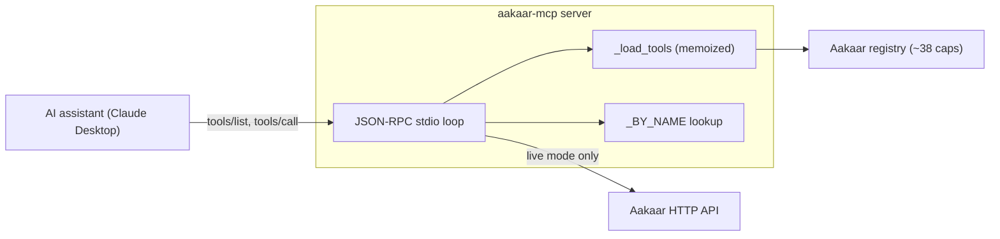
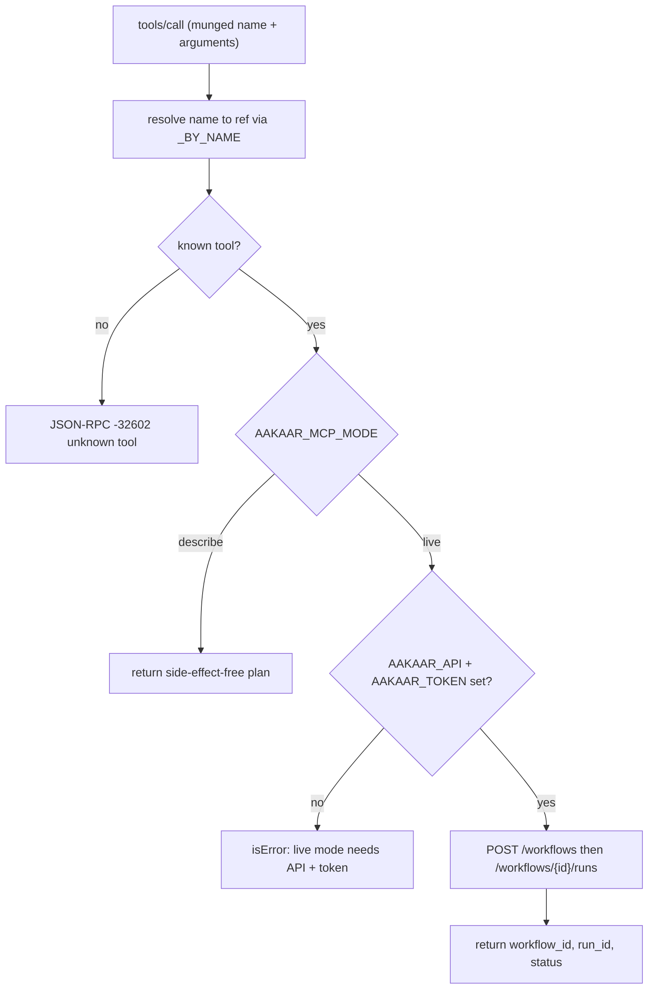
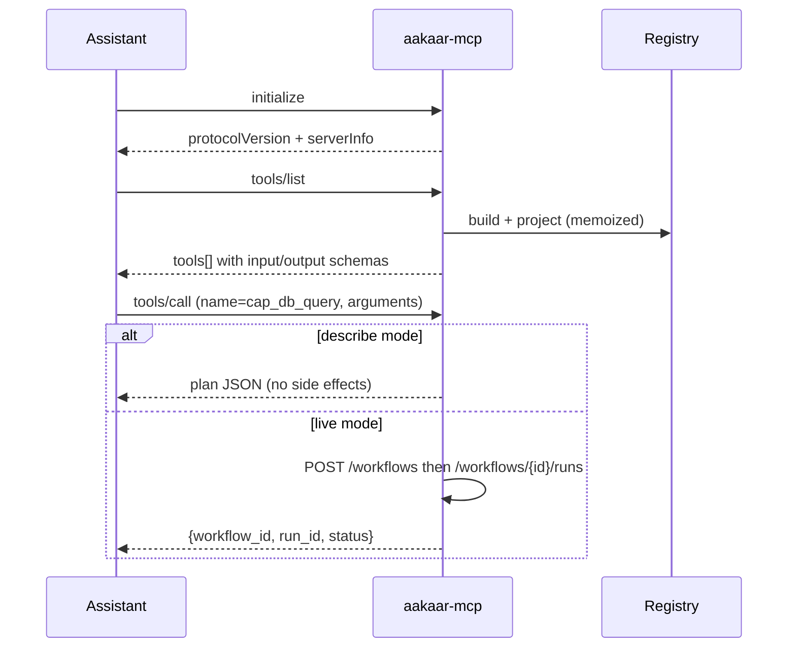

# MCP Server

> **In plain terms:** This is the adapter that lets an AI assistant — like Claude Desktop — *see and use* Aakaar's automation building blocks. Instead of a human clicking through the console, the assistant asks "what can Aakaar do?", gets back a clean list of every capability (query a database, move a file, call an API), and can either describe exactly what an automation *would* do, or actually run it. It speaks the open **Model Context Protocol (MCP)**, so it works with any MCP-aware assistant without custom integration code.

The MCP server lives in `aakaar-mcp/server.py`. It is a small, dependency-light program: **JSON-RPC 2.0 over stdio** (one JSON object per line), no third-party MCP SDK, only the Python standard library plus the Aakaar registry it reflects.

---

## What MCP is, and why it exists here

**Model Context Protocol** is a standard way for an AI assistant to discover and call "tools" exposed by an external system. The assistant launches the MCP server as a subprocess, talks to it over standard input/output, and the server replies with a list of tools and their input/output schemas. The assistant can then call a tool with arguments and read the result.

Aakaar already has a **registry** of ~38 capabilities (auto-discovered from the `aakaar.capabilities` package). Rather than maintain a separate, hand-written tool list for AI assistants, the MCP server **projects that exact same registry** into MCP tools. The source of truth is the live registry, built the same way the backend builds it:

```python
reg = build_default_registry()
load_into(reg, ActivityRegistry())
```

> **Why this matters:** add a new capability to the platform and it appears to every connected AI assistant automatically — no second list to update, no drift between what the engine can do and what the assistant believes it can do.

---

## How it exposes capabilities

Each registry `Definition` becomes one MCP tool. Because MCP tool names cannot contain dots and registry refs are dotted (e.g. `cap.db_query`), the server munges `.` to `_` (so `cap.db_query` becomes `cap_db_query`) and keeps a reverse lookup table (`_BY_NAME`) to recover the real ref on a call.

Each tool descriptor carries:

| Field | Source |
|-------|--------|
| `name` | The munged ref, e.g. `cap_db_query` |
| `description` | `[cap.db_query] <human description>`, plus a note naming any **secrets** a tenant grant must supply (names only — never values) |
| `inputSchema` | The capability's pydantic input model as JSON Schema |
| `outputSchema` | The capability's pydantic output model as JSON Schema (so assistants that support it can shape-check the result) |

**Dynamic enumeration** is controlled by `AAKAAR_MCP_INCLUDE`:

- `capabilities` (default) — only `kind == "capability"`, keeping the surface tight.
- `all` — also exposes raw `action` and `control` nodes.

A name-collision guard disambiguates with a numeric suffix if two refs ever munge to the same name, and a malformed definition is logged and skipped rather than crashing the whole server.

Assistant talks to the MCP server, which reflects the live registry:



---

## The two execution modes

The mode is chosen with `AAKAAR_MCP_MODE`. This is the central safety design: by default the server **cannot** cause a side effect.

| Mode | What `tools/call` does |
|------|------------------------|
| `describe` (default) | Returns a side-effect-free JSON **plan** describing what a live call *would* do — the capability ref, the inferred node kind, and the two HTTP calls it would make. Nothing touches the backend. |
| `live` | Reaches the real Aakaar HTTP API: creates a one-node workflow and starts a run, returning `{workflow_id, run_id, status}`. Requires `AAKAAR_API` (base URL) and `AAKAAR_TOKEN` (bearer). |

> **Why a describe default?** An AI assistant should be able to explore and reason about what Aakaar can do without any risk of moving money or mutating data. Turning on side effects is an explicit operator decision (set `live` and provide a scoped token), and even then the action lands in the same governed, audited run pipeline as any console-launched run.

The `describe`/`live` split is also why the live path matters: it does not bypass the platform. A live call goes through `POST /workflows` then `POST /workflows/{id}/runs` — the **same** governance gates, grant checks, and audit ledger that protect every other run.

How a single `tools/call` branches on mode:



---

## Security: the stdout quarantine

Because the transport is stdio, **stdout is sacred** — it carries JSON-RPC frames and nothing else. A single stray `print()` from any transitively-imported dependency (and the Aakaar import graph is large) would corrupt the framing and break the client.

The server defends this in three ways:

1. All diagnostics go to **stderr** via `_log()` — never stdout.
2. During the import-heavy registry build, stdout is temporarily redirected to stderr (`sys.stdout = sys.stderr`) and restored in a `finally`.
3. A single `_write_frame` / `_reply` choke point emits every response, so framing is consistent and always flushed.

Failures are handled per MCP semantics: an unknown tool yields a JSON-RPC `-32602`; a tool-execution failure (including any live HTTP error) is returned as an `isError` **result**, not a protocol error, so one bad call never kills the loop. Live-mode network and HTTP errors are caught and surfaced as readable `isError` text.

---

## Protocol flow: discover then call

The assistant initializes, lists tools, then calls one. Notifications (no `id`) are ignored.



---

## Example tool call

A banking analyst asks the assistant to check yesterday's failed disbursements. The assistant resolves this to the `cap.db_query` capability and calls it.

Request (sent by the assistant over stdio):

```json
{
  "jsonrpc": "2.0",
  "id": 7,
  "method": "tools/call",
  "params": {
    "name": "cap_db_query",
    "arguments": {
      "query": "SELECT id, amount FROM disbursements WHERE status = 'FAILED' AND value_date = :d",
      "params": { "d": "2026-06-16" }
    }
  }
}
```

Response in **describe** mode (default — no side effects):

```json
{
  "jsonrpc": "2.0",
  "id": 7,
  "result": {
    "content": [{ "type": "text", "text": "{\n  \"channel\": \"aakaar-mcp\",\n  \"capability_ref\": \"cap.db_query\",\n  \"execution\": { \"mode\": \"describe\", \"node_kind\": \"capability\",\n    \"would_post\": [\"POST {AAKAAR_API}/workflows\", \"POST {AAKAAR_API}/workflows/{id}/runs\"] } }" }],
    "isError": false
  }
}
```

In **live** mode the same call instead creates the workflow and run and returns the ids and status, ready for the analyst to track in the console.

> **Key takeaway:** the MCP server is a thin, safe mirror of Aakaar's capability registry. It enumerates dynamically, protects its stdio framing rigorously, and defaults to a no-side-effect "describe" mode — so an AI assistant can explore the platform freely and only act through the same governed, audited pipeline as a human operator.
