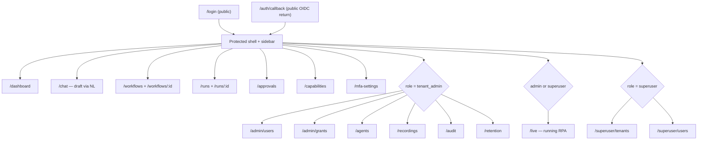
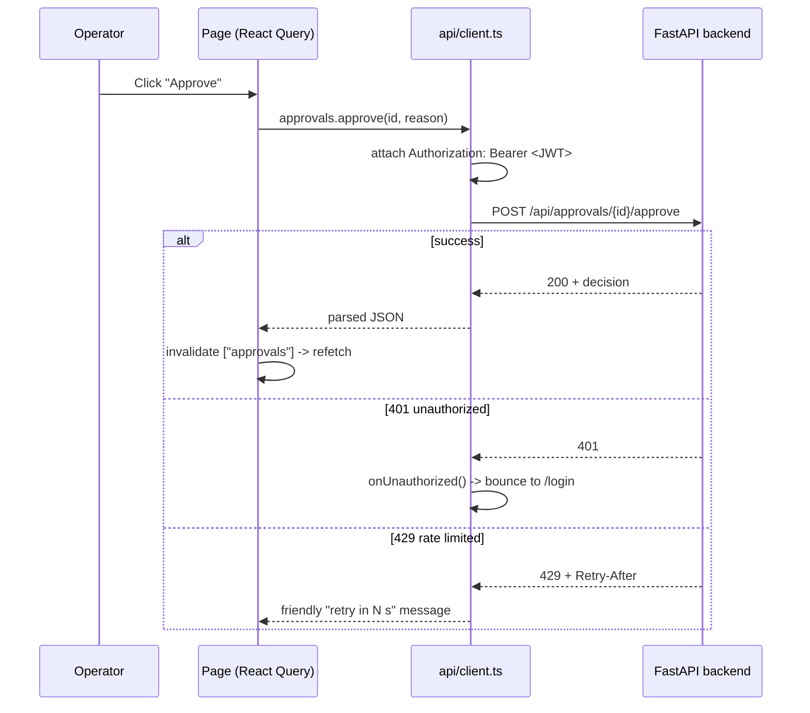
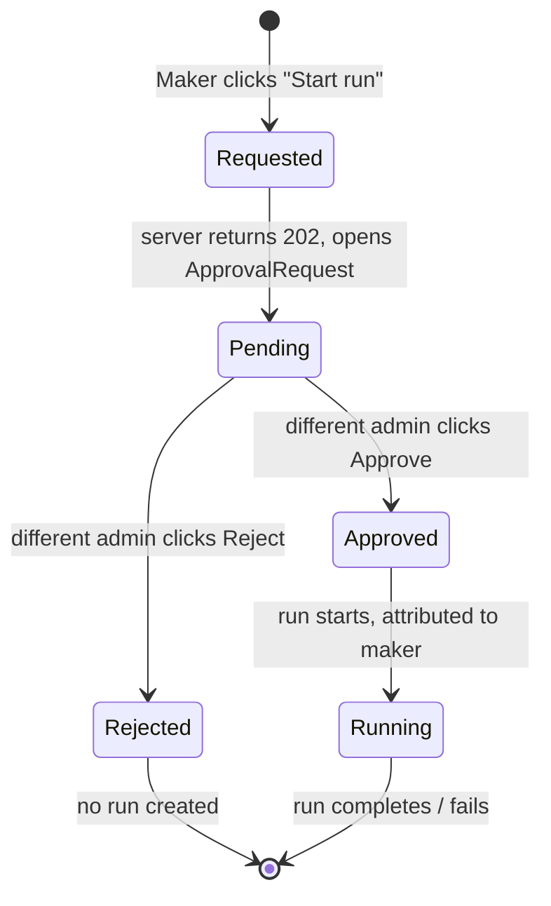
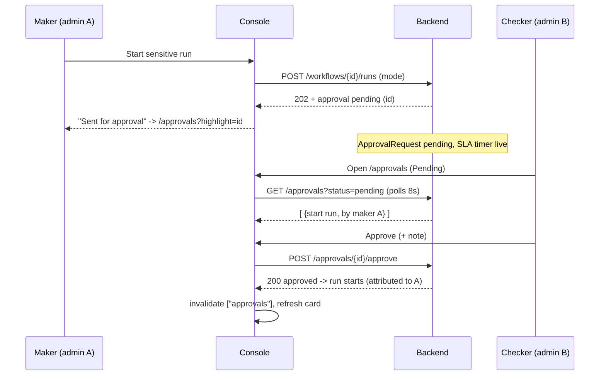

# Web Console

In plain terms: the Web Console is the control room operators sit in front of. It is where a bank's staff describe the work they want automated, watch it run step by step, sign off on anything sensitive before money or data moves, and pull the evidence trail an auditor will ask for. Nothing about the automation engine is hidden behind a command line — every action a person needs to take has a button, and every button is gated by the person's role.

This document describes the console as a software component: what operators do in it, the page map, the technology underneath, how it talks to the backend API, and how role-gating shapes what each person sees. It closes with a click-by-click walkthrough of the single most important operator task — approving a gated run.

> The console is a static single-page application. It holds no business logic of its own and stores no secrets. Every decision (can this user publish? is this run gated? did the approval succeed?) is made by the backend; the console only renders state and forwards the operator's intent.

## What operators do here

The console is organized around the lifecycle of a piece of automation. A typical day touches most of these:

| Job to be done | Where | Who |
| --- | --- | --- |
| Describe intent in natural language, get a draft workflow | Chat | Tenant user, admin |
| Review / version / publish a workflow (its DAG) | Workflows | Tenant user, admin |
| Launch a run, live or dry-run; pin a version | Workflows / Runs | Tenant user, admin |
| Watch a run execute layer-by-layer; answer human prompts | Runs | Tenant user, admin |
| Approve or reject a gated publish or run | Approvals | Admin (a *different* admin than the maker) |
| Browse the catalog of available capabilities | Capabilities | All roles |
| Grant a capability + credentials to the tenant | Admin → Grants | Admin |
| Enrol and manage remote desktop agents | Agents | Admin |
| Review tamper-evident audit ledger; verify the chain | Audit log | Admin |
| Set retention policies, legal holds, right-to-erasure | Retention | Admin |
| Watch live remote-desktop processes; review recordings | Live / Recordings | Admin |
| Manage tenants and cross-tenant users | Superuser pages | Superuser |

The unifying idea: **operators express intent, the backend enforces governance, the console makes both visible.** An operator never edits raw credentials, never bypasses an approval, and never sees another tenant's data — those are server-side guarantees the UI simply reflects.

## Page map

The console is one protected shell with a role-aware sidebar. The diagram below is the live route table (from `App.tsx`), grouped by the minimum role each route requires.

Flowchart of the console's route tree and the role gate on each branch.

The sidebar (from `Layout.tsx`) renders only the items a role is allowed to reach. A tenant user sees Dashboard, Chat, Workflows, Runs, Approvals, Capabilities and Two-factor; a tenant admin additionally sees Live, Users, Grants, Agents, Recordings, Audit log and Retention; a superuser sees the tenant/user administration pages. The same gate is enforced twice — once by hiding the nav item, and again by `ProtectedRoute` wrapping the route — so deep-linking to a forbidden path bounces the user, it does not leak.

## Roles and what they unlock

Three roles drive every gate in the UI:

| Role | Sidebar label | Can do |
| --- | --- | --- |
| `tenant_user` | member | Chat, author/run workflows, view capabilities & approvals |
| `tenant_admin` | admin | All of the above **plus** grants, users, agents, recordings, audit, retention, **and deciding approvals** |
| `superuser` | platform | Cross-tenant tenant/user management, platform dashboard |

> Maker-checker is a role gate *with a twist*: a `tenant_admin` can approve gated work, but never their **own** request. The Approvals page detects "you are the maker" and replaces the Approve/Reject buttons with a "waiting for a different admin" note, because the server would reject a self-approval with a `409` anyway.

## Technology

The console is a conventional, dependency-light React app chosen to build to a static bundle that ships inside the airgapped appliance — no Node runtime in production, just files served behind the API.

| Concern | Choice |
| --- | --- |
| Framework | React + TypeScript |
| Build / dev server | Vite |
| Routing | react-router-dom (route table in `App.tsx`) |
| Server state | TanStack React Query (`@tanstack/react-query`) |
| Auth state | a small `AuthContext` holding JWT claims |
| Styling | Tailwind utility classes + CSS themes |
| Icons | lucide-react |
| Hardening | Trusted Types policy (`security/trustedTypes.ts`) |

React Query is the backbone of every page: each list/detail view is a `useQuery` keyed by resource, and every action (approve, publish, start run) is a `useMutation` that invalidates the relevant query on success so the screen refreshes itself. Time-sensitive views poll — for example the Approvals queue refetches every 8 seconds (`refetchInterval: 8_000`) so a freshly-opened gate appears without a manual reload.

## How the console talks to the API

All traffic flows through one thin fetch wrapper, `api/client.ts`. There is no second path to the backend.

Sequence diagram: how a console action reaches the API and comes back, including the auth and error paths.

Key behaviours of the client, all centralised so no page reinvents them:

- **Base path** is `VITE_API_BASE` or `/api`. The SPA and API are served same-origin in the appliance.
- **Bearer auth**: the JWT is pulled from `AuthContext` via a registered getter and attached to every request. The console never persists secrets beyond the token.
- **`401` → logout**: any unauthorized response calls `onUnauthorized()`, which clears auth and routes to `/login`.
- **`429` → friendly retry**: a rate-limited response is turned into a human phrase ("please retry in about 2 min") honouring `Retry-After`, instead of a raw HTTP error.
- **`202` is success, not failure**: a gated publish or run-start returns `202 Accepted` with an *approval pending* payload. The console narrows this (`isApprovalPending`) and shows "sent for approval" rather than treating it as the run having started.

The endpoint groups the console calls map one-to-one to backend routers — for example `workflows` (`/workflows`), `runs` (`/workflows/{id}/runs`, `/runs/{id}/pause|resume|cancel|rerun|respond`), `approvals` (`/approvals`, `/approvals/{id}/approve|reject`), `audit` (`/audit/verify`, `/audit/export`), `retention` (`/retention/policies`, `/retention/legal-hold`, `/retention/erase`), and `capabilities` (`/capabilities`, `/capabilities/all`).

## Dry-run from the console

Every run launch carries a `mode`: `live` (default) or `dry_run`. A dry-run executes the workflow's full topology but the engine **simulates side-effecting capabilities** (sends, writes, uploads, money movement) instead of performing them, while read-only steps (scrapes, reads, validations) run for real. The console exposes this as a mode choice when starting a run and badges dry-run approvals distinctly (a "dry run" pill on the Approvals card), so a reviewer can tell a rehearsal apart from the real thing at a glance.

> Use dry-run as the safe rehearsal before publishing a sensitive workflow: you get a real run record, real read-side outputs, and a full audit entry — with zero irreversible effects.

## Worked walkthrough: approving a gated run

This is the canonical operator task. A maker tries to start a sensitive (ELEVATED, `requires_approval`) workflow; a second admin must approve it. No screenshots — just the exact path and what each side sees.

State diagram: the lifecycle of a gated run-start from the operator's point of view.

**1. The maker starts the run.** On the Workflows page the maker opens a sensitive workflow and clicks Start (optionally choosing dry-run mode). Because the workflow is gated, the API answers `202 Accepted` with an approval-pending body rather than `201`. The console does not show a running run; it shows that the request was sent for approval and links into the Approvals queue (often with `?highlight=<id>` so the new gate is easy to spot).

**2. The request lands in Approvals.** Any admin opening `/approvals` (default filter: Pending) sees a card titled **"Start run"** with the workflow name and version, the maker's id, the request time, a link to view the workflow, and — if it was a rehearsal — a cyan **dry run** badge. The queue self-refreshes every 8 seconds.

**3. The console decides who may act.** The card computes `canDecide = isAdmin && pending && !isMaker`.
- The **maker** sees a muted note: *"Waiting for a different admin to decide — you can't approve your own request."* No buttons.
- A **non-admin** sees the card read-only.
- A **different admin** sees an optional decision-note field plus **Approve** and **Reject** buttons.

**4. The second admin approves.** The admin optionally types a decision note (capped at 2000 chars) and clicks **Approve**. The console fires `approvals.approve(id, reason)` → `POST /approvals/{id}/approve`. The card itself spells out the consequence: *"Approving runs the action under your authorization, attributed to the maker."*

**5. The result settles.** On success the mutation invalidates the `["approvals"]` query; the card flips to **approved**, showing who decided, when, and the note. The gated run now actually starts. A `409` (e.g. the maker tried to self-approve, or someone already decided) surfaces inline via the error banner — the console never silently swallows a governance refusal.

Sequence diagram: the two-person maker-checker handshake across the console and backend.

## Where this fits

The Web Console is the human surface of the platform; the governance, audit, vault and execution guarantees it relies on all live in the backend. For the engine that runs the DAG, see the Backend & API component doc; for the rules a workflow must satisfy before it can be published or run, see the Workflow Authoring Guide; for the building blocks an operator can compose, see the Capabilities & Catalog doc.
