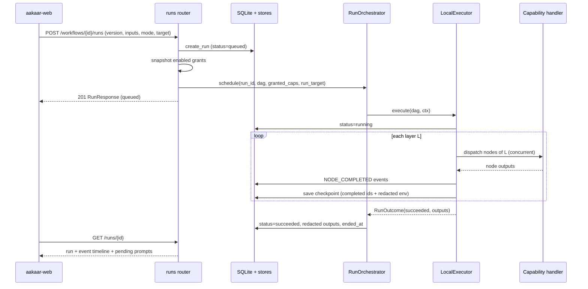
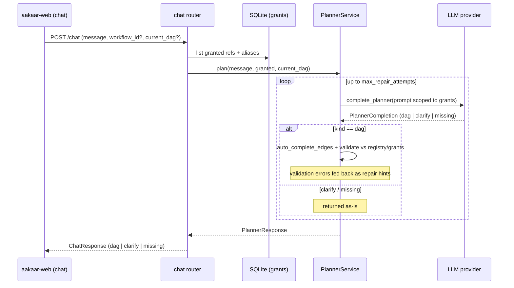
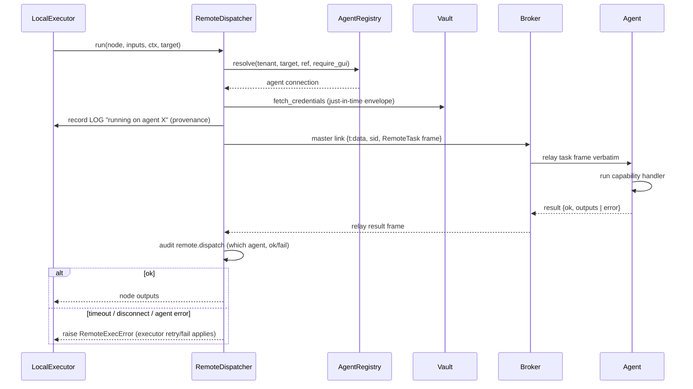
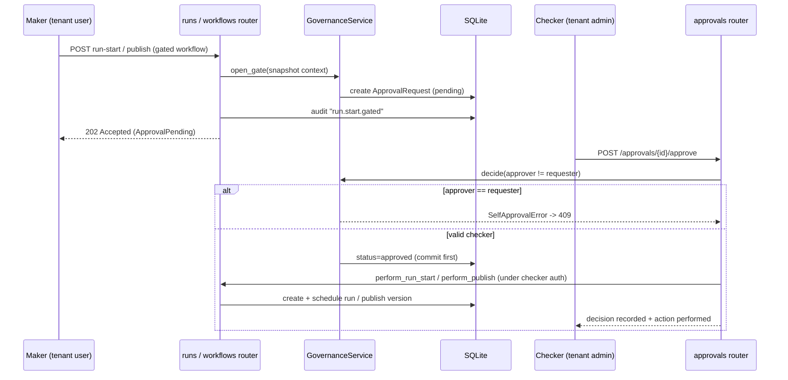
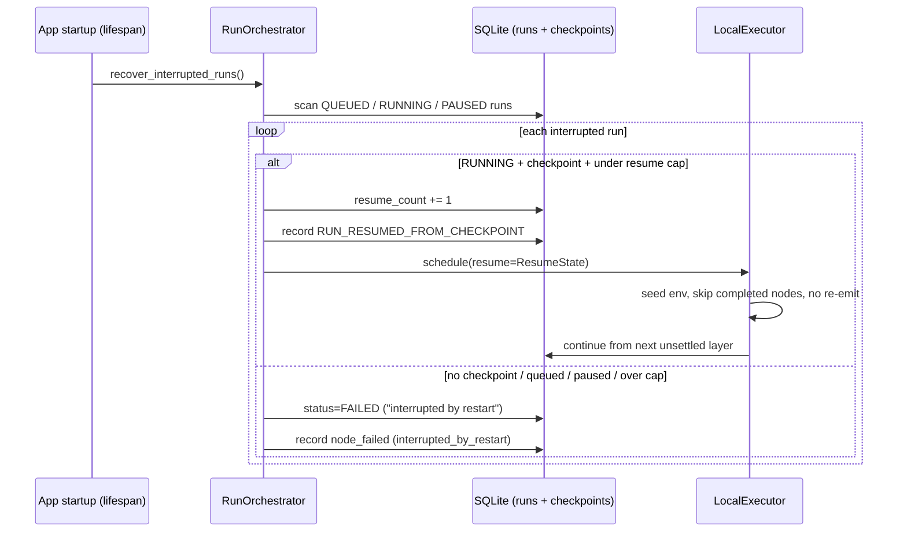
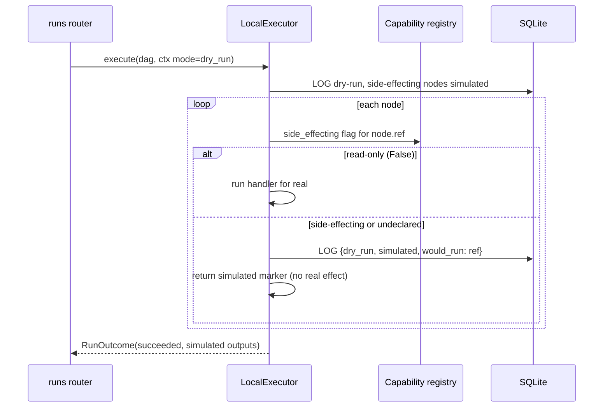

# Data Flow & Sequence Catalog

> **In plain terms:** The other architecture documents describe *what* the pieces are. This one shows them *in motion* — a set of step-by-step "who-talks-to-whom" diagrams for the journeys that matter most: turning a request into a plan, running that plan, getting a sensible human to approve a sensitive one, sending a step to a remote machine, picking up exactly where it left off after a crash, and practising a run safely without moving any money. Each diagram is a swimlane: every vertical line is a participant, and time flows downward.

This is a reference catalog. Each entry has a short narrative and a sequence diagram. The flows are grounded in the actual API routers, the orchestrator/executor, the planner, the governance service, and the remote-execution stack.

---

## 1. Run lifecycle — submit to complete

**Narrative.** An operator (or an API caller) starts a run from a workflow version. The runs router persists a `queued` run row stamped with its mode, snapshots the tenant's enabled capability grants, and hands the DAG to the `RunOrchestrator`, which returns `201` immediately and drives the run in the background. The executor marks it `running`, walks the DAG **one topological layer at a time** (nodes inside a layer run concurrently), records an event per node, and checkpoints after each layer. On the terminal layer it returns a `RunOutcome`; the orchestrator persists the final status and **redacted** outputs. The UI follows the timeline by polling `GET /runs/{id}` (and the live event WebSocket).

> Banking example: *"download the open-disputes report for cycle C02"* compiles to a 3-layer DAG — log in, fetch the report, write it to the object store. Each step is a node; each becomes a timeline event the operator can inspect.

---

## 2. Intent to workflow — natural language to DAG

**Narrative.** `POST /chat` is one stateless turn of planning. The chat router loads the tenant's granted capability refs and aliases (and the current DAG, if editing a saved workflow), then asks the `PlannerService`. The planner builds a prompt scoped to those grants, calls the LLM, and converts the completion into exactly one of three outcomes: **dag**, **clarify**, or **missing**. For a DAG it auto-completes data-flow edges and validates against the registry and grants; on validation failure it feeds the errors back to the model for a bounded number of repair attempts before raising `PlannerError`.

> The planner never sees capabilities the tenant wasn't granted, and can only assemble ones that exist — so it cannot invent an action against a bank system. A request that needs something the tenant lacks comes back as **missing**, not faked.

---

## 3. Remote-node execution — API to dispatcher to broker to agent

**Narrative.** Most nodes run server-side, but a node whose effective placement `target` is an agent or pool is handled by the `RemoteDispatcher`. It resolves a suitable **online, same-tenant** agent that supports the capability (and is GUI-capable if the capability is GUI-tagged), builds a `RemoteTask` with the resolved inputs plus a **just-in-time credential envelope** fetched from the vault, records run-timeline provenance (`running on agent X`), and dispatches under a deadline. In distributed mode the frame travels over the **master link** to the stateless broker, which relays it verbatim to the agent's dialed-out `/ws/agents` session. The agent runs the capability and returns a result, which the dispatcher audits and maps back into the node's outputs (or raises, so the executor's normal retry/failure path applies).

> The server is the brain; the agent is a pair of hands. Control flow, retries, and events all stay on the server — only the node's *execution* is remote.

---

## 4. Maker-checker approval gate

**Narrative.** When a gated workflow (one that `requires_approval` or is `sensitivity = "elevated"`) is published or run, the API does **not** act. It snapshots everything a checker needs into an `ApprovalRequest`, writes an audit event, and returns **`202 Accepted`**. A *different* tenant admin then approves or rejects via `POST /approvals/{id}/approve|reject`. The `GovernanceService` enforces the one inviolable rule — the approver must not be the requester (`SelfApprovalError` → `409`). On approval the decision is committed **first**, then the API performs the originally-gated action (publishing the version, or starting the run) under the checker's authorization, attributed to the original maker. If performing fails afterwards (e.g. the pinned version was deleted), it surfaces as a `409` with the decision already recorded — an audited decision is never silently rolled back.

> Banking example: a workflow that *moves money or files a regulatory submission* is marked elevated. The maker requests the run; a separate authorizer approves it. Neither can do both — segregation of duties, enforced in code.

---

## 5. Durable resume after restart

**Narrative.** The in-process executor holds run state in memory, so a server restart loses the live state of any in-flight run. On startup, `recover_interrupted_runs()` scans every non-terminal run. A `RUNNING` run that has a persisted checkpoint and resume headroom is **re-driven** from the next unsettled layer: its env is seeded from the checkpoint, every already-completed node is skipped, and **their events are not re-emitted** — re-running a done node could double an irreversible side effect. Everything else (queued before any layer settled, paused whose in-process gate is gone, or a run past `max_resumes`) is marked `FAILED` with a clear reason, so the UI shows a definitive terminal status instead of a perpetual zombie.

> This is durability without a cluster: a SQLite checkpoint row, plus a startup reconciliation pass, replaces a distributed workflow engine.

---

## 6. Dry-run

**Narrative.** A run can be launched with `mode = dry_run`. The executor walks the **full DAG topology** exactly as a live run would, so the operator sees the real shape and ordering — but for any node whose capability is **side-effecting**, it short-circuits to a simulated marker (`{"simulated": true, "would_run": ref}`) and emits a `LOG` event instead of performing the real effect (no SMTP/SFTP, no HTTP POST, no file write, no desktop action). Read-only capabilities (`side_effecting is False`) still execute for real so the rehearsal is realistic. Anything **undeclared** is treated as side-effecting and simulated — a capability that forgot to declare can never move money in a dry-run. The run's mode is immutable, and a *rerun of a dry-run is also a dry-run*, so a rehearsal can never silently become a live action.

> Banking example: rehearse a payment-file upload workflow end to end — see every step, confirm the DAG is right — while the actual SFTP upload is simulated. Approve and run it for real only once the dry-run looks correct.

---

## 7. Flow index

| Flow | Trigger | Key guarantee |
| --- | --- | --- |
| Run lifecycle | `POST /workflows/{id}/runs` | Layer-by-layer execution, per-layer checkpoint, redacted outputs. |
| Intent to workflow | `POST /chat` | Only registered + granted capabilities; missing, not invented. |
| Remote execution | node `target` selects an agent | JIT credential envelope, server keeps control/retries, audited provenance. |
| Maker-checker | gated publish / run-start | Approver must differ from requester; decision committed before action. |
| Durable resume | server restart | Resume from checkpoint without re-running completed nodes; else fail cleanly. |
| Dry-run | `mode = dry_run` | Real topology, side-effecting nodes simulated; undeclared treated as side-effecting. |
