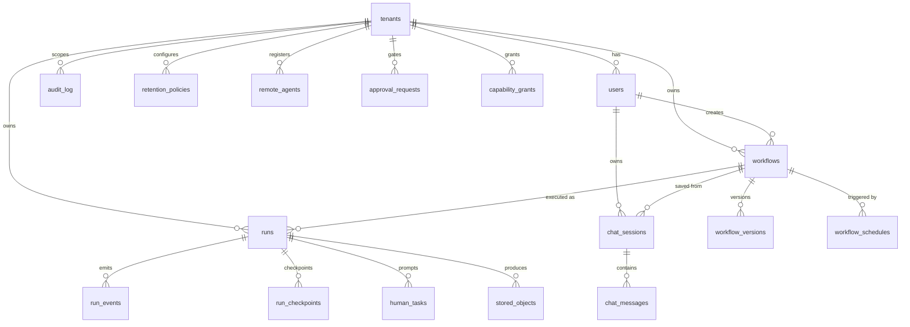
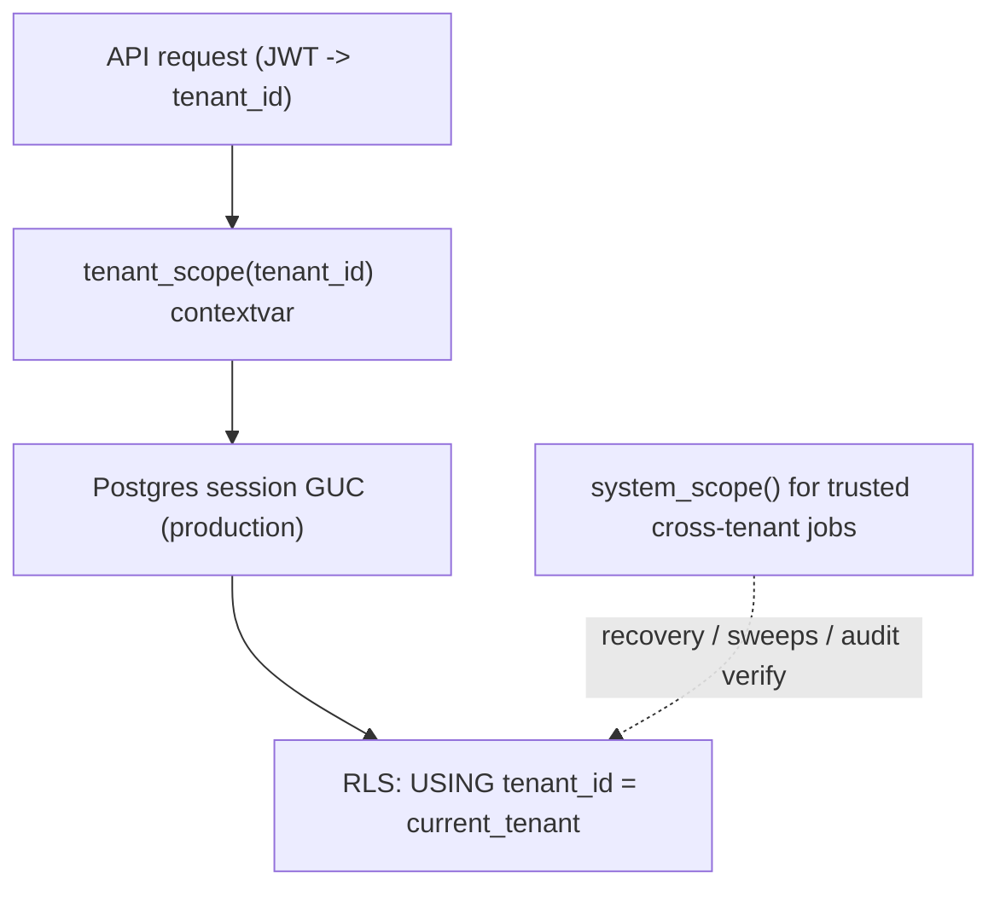
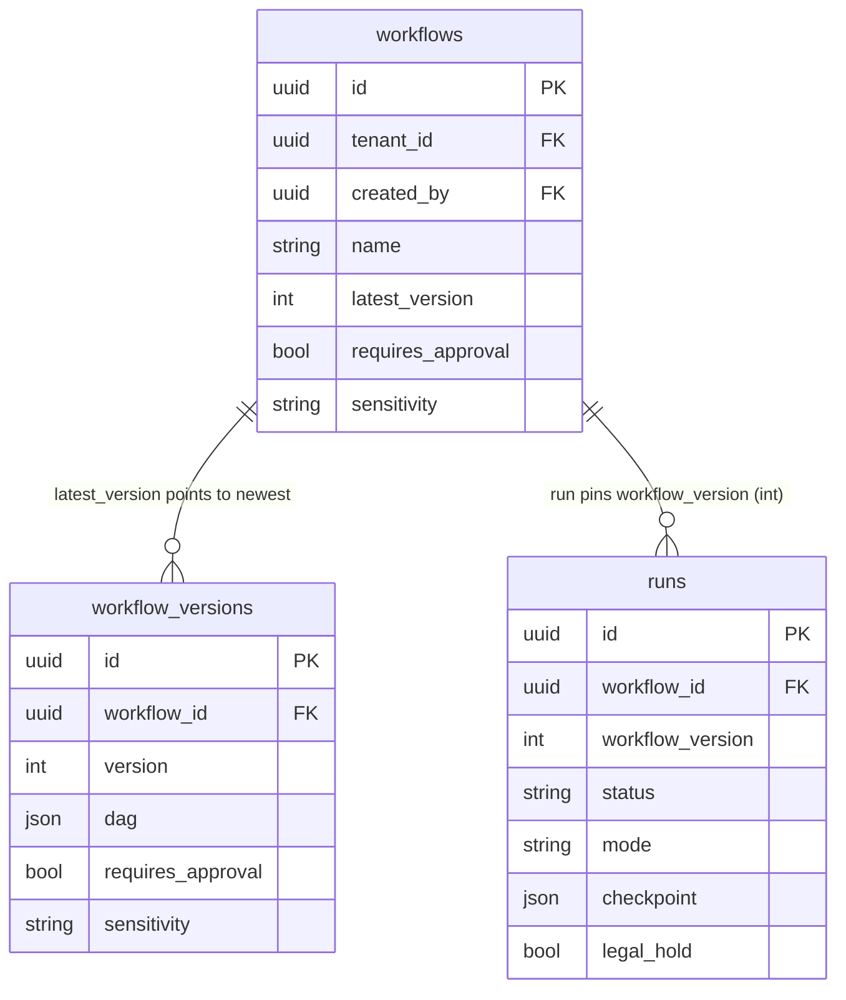
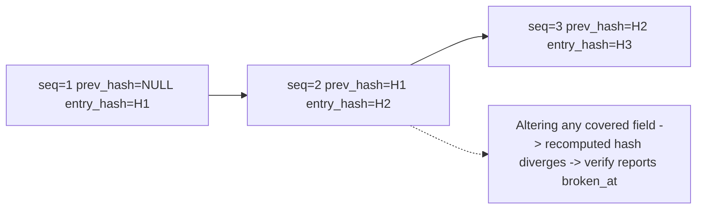
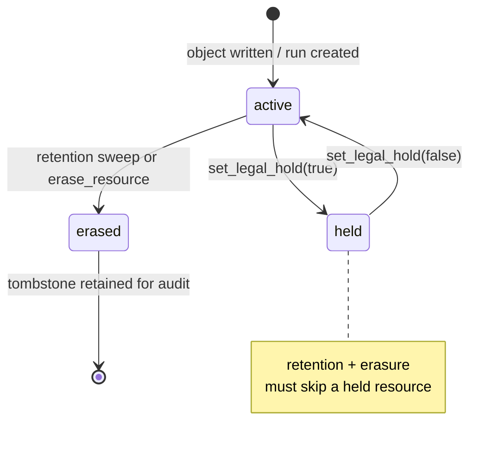

# Database Design: The Aakaar Data Model

> **In plain terms.** This document describes how Aakaar stores its data — the "filing cabinet" behind the platform. Every customer (a bank, called a *tenant*) gets their own clearly-labelled section of every drawer, so one bank can never see another's files. Some drawers are ordinary working files (who designed which workflow, which runs are in progress); others are special compliance drawers built to satisfy auditors and regulators — a logbook that can't be quietly edited, deletion schedules, and litigation freezes. This is for engineers, DBAs, and reviewers who need to understand exactly what is stored and why.

Aakaar runs entirely on **SQLite** in development and is **portable to PostgreSQL / YugabyteDB** in production — by design, the schema uses *no* dialect-only types (UUIDs use SQLAlchemy's portable `Uuid`, enums are stored as plain strings, DAGs and other structured data are stored as `JSON`). The whole platform is in-process and air-gapped: there is no separate database server *required*, no Redis, no S3. The schema's two organizing principles are:

1. **Tenancy first.** Every domain table carries `tenant_id` as its first non-id column, enforced by the API layer today and reinforced by Postgres Row-Level Security (RLS) in production.
2. **The validated DAG is the unit of work.** Workflow graphs are stored as JSON, not normalized into node/edge tables — the validated DAG is what you save, version, and run, atomically.

---

## 1. The core entity-relationship model

> This diagram is the map of the whole filing cabinet. A `tenant` owns everything; `users` design `workflows`; each save produces an immutable `workflow_version`; running a version creates a `run`; a run produces `run_events`, `run_checkpoints`, `human_tasks`, and `stored_objects`. Around the edge sit the cross-cutting compliance and operations tables.

### Entity overview

| Table | Purpose | Owns / belongs to |
|---|---|---|
| `tenants` | A customer organization (a bank). Root of all scoping. | — |
| `users` | A person (or superuser). Carries auth: password, MFA/TOTP, OIDC. | tenant (NULL for superusers) |
| `capability_grants` | Binds a capability + account alias to a vault credential path. | tenant |
| `workflows` | A named automation; holds the governance flags. | tenant, creator |
| `workflow_versions` | An immutable saved DAG snapshot. | workflow |
| `runs` | One execution of a workflow version. | tenant, workflow |
| `run_events` | The redacted run timeline (outbox-driven). | run |
| `run_checkpoints` | Per-layer durable resume state. | run |
| `human_tasks` | Durable, SLA-bounded human-in-the-loop prompts. | run |
| `approval_requests` | Maker-checker gates. | tenant |
| `audit_log` | Tamper-evident hash-chained ledger. | tenant (NULL = system) |
| `retention_policies` | Per-resource deletion rules. | tenant |
| `stored_objects` | Metadata for object-store bytes (artifacts, screenshots). | tenant, run |
| `remote_agents` | Registered RPA/desktop workers. | tenant |
| `workflow_schedules` | Cron / one-off triggers. | tenant, workflow |
| `chat_sessions` / `chat_messages` | Conversational workflow-planning sessions. | tenant, user |

---

## 2. The tenancy model

> Multi-tenancy is the single most important security property of the schema. Two banks share one database file but must never see each other's data. Aakaar enforces this in two layers.

**Layer 1 — application scoping.** Every domain table carries `tenant_id` (a FK to `tenants.id` with `ON DELETE CASCADE`), and every request handler must enter a `tenant_scope(tenant_id)` block before any query. Each tenant-scoped table also carries an `ix_<table>_tenant_id` index so the per-tenant filter is cheap.

**Layer 2 — Row-Level Security (Postgres/Yugabyte).** In production the `tenant_scope` contextvar is bound to a Postgres session GUC, and RLS policies restrict every query to the current tenant (`USING tenant_id = current_tenant`). Table owners and superusers bypass RLS, so trusted cross-tenant work — the startup recovery scan, retention sweeps, audit verification — runs under an *explicit* `system_scope()` that sets the marker for the system role. SQLite has no RLS, so there the contextvar is the only line of defense — acceptable because SQLite is the single-process dev/air-gap target.

Two tables intentionally allow a **NULL `tenant_id`**: `users` (a superuser is Aakaar staff with no tenant) and `audit_log` (system/bootstrap rows are an unverifiable side log). Everywhere else `tenant_id` is `NOT NULL`.

---

## 3. Identity and access tables

### `users`

The identity record, carrying everything needed for the platform's auth stack (RS256/JWKS tokens, TOTP MFA, OIDC/PKCE federation).

| Column | Purpose |
|---|---|
| `tenant_id` | Owning tenant; **NULL for superusers** (`role = superuser`). |
| `email`, `password_hash`, `role`, `status` | Core identity. Roles: `superuser`, `tenant_admin`, `tenant_user`. |
| `mfa_enabled`, `totp_secret`, `totp_pending_secret`, `totp_last_step`, `mfa_recovery_codes` | TOTP MFA. A *pending* secret during enrollment can never lock a user out; `totp_last_step` rejects replay within a code's window; `totp_secret` is Fernet-encryptable and redacted from audit. |
| `oidc_subject` | Federated identity key `"{issuer}::{sub}"`, **unique when set** (`uq_users_oidc_subject`) so two concurrent first-time OIDC logins can't provision duplicate users. |
| `last_login_at` | Last successful login. |

Constraints: `uq_users_tenant_email` (one email per tenant), plus the partial-unique OIDC subject index (multiple NULLs allowed — local/password users have no subject).

### `capability_grants`

> A capability's *definition* lives in code (staff-authored, ~38 auto-discovered capabilities). A *grant* is the tenant's permission to use it under a named account, and the bridge to the actual credentials.

The grant binds `(capability_ref, account_alias)` to a `vault_ref` (the encrypted-vault path holding the real credentials) plus `input_defaults` (per-tenant config like `login_url` the planner can't know). The DAG references only the `account_alias` — never a raw URL or secret. Unique on `uq_grants_alias = (tenant_id, capability_ref, account_alias)`.

---

## 4. Workflows, versions, and runs

> A workflow is a named automation; saving it produces an **immutable version**; running a version produces a **run**. Versions are immutable so that an approved-and-audited graph can never be retroactively changed — a later edit becomes a *new* version.

### `workflows`

Holds the governance flags that drive maker-checker. `requires_approval` (explicit opt-in) and `sensitivity` (`normal` | `elevated`, where `elevated` marks money-moving workflows) together decide whether publish/run must clear an approval. `latest_version` is the pointer to the newest saved version.

### `workflow_versions`

The unit of save/version/run. `dag` is the full validated graph as JSON (nodes/edges are *not* normalized into separate tables). Critically, `requires_approval` and `sensitivity` are **frozen per version at save time** — a later change to the parent workflow's flags cannot retroactively un-gate an already-approved version. Unique on `uq_workflow_version = (workflow_id, version)`.

### `runs`

One execution. Key columns:

| Column | Purpose |
|---|---|
| `workflow_version` | The pinned integer version this run executes (immutable). |
| `status` | `queued` → `running` → `paused` → `succeeded`/`failed`/`cancelled`. |
| `mode` | `live` | `dry_run`. In `dry_run` the DAG topology runs but side-effecting nodes are simulated. Set at creation, never changes. |
| `checkpoint` | JSON mirror of the newest `run_checkpoints` row for single-read crash recovery: `{layer_index, completed_node_ids, env}`. NULL until the first layer settles. |
| `resume_count` | How many times this run was resumed after a restart; bounds infinite resume loops on a poison run. |
| `inputs` / `outputs` / `error` | Run I/O (redacted of credential-shaped keys before persisting). |
| `legal_hold` | When true, retention/erasure must skip this run. |
| `erased_at` | Set when a retention/erasure sweep scrubbed this run's PII payloads. The row remains as an audit tombstone. |
| `temporal_run_id` | Reserved seam for a future Temporal-backed executor. |

### `run_events` — the timeline + outbox

A redacted, UI-friendly mirror of what happened during a run, written by the interpreter at every transition (`node_started`, `node_completed`, `node_failed`, `node_retrying`, `run_paused`, `run_resumed`, `run_cancelled`, `signal_received`, `live_screen`, `log`). It doubles as the **event outbox**:

| Column | Purpose |
|---|---|
| `sequence` | Per-run monotonic order; unique on `uq_run_event_seq = (run_id, sequence)`. The UI dedupes on this. |
| `published` / `published_at` | Outbox flags for at-least-once WS fan-out. A row is written `published=False`; the publisher flips it true after dispatch; a restart sweep replays anything still false. |

The `ix_run_events_outbox = (published, run_id, sequence)` index drives that sweep — find unpublished events fast, in run+sequence order, after a restart.

### `run_checkpoints` — durable resume

After the executor settles each topological DAG layer, it writes one row capturing the completed node ids and the **redacted** output-env snapshot up to that boundary. On restart, recovery loads the highest `layer_index` for a non-terminal run and resumes from the *next* layer instead of failing. Unique on `uq_run_checkpoint_layer = (run_id, layer_index)` so a re-driven layer overwrites rather than duplicates. `runs.checkpoint` mirrors the newest row; this table keeps the per-layer history.

| Column | Purpose |
|---|---|
| `layer_index` | 0-based topological layer this checkpoint completes; resume starts at `layer_index + 1`. |
| `completed_node_ids` | Nodes whose outputs are in `env` — lets resume skip already-done nodes (the financial-integrity rule). |
| `env` | Output snapshot `{node_id: {output_key: value}}`, secret-redacted by the writer. |

### `human_tasks` — durable human-in-the-loop

The in-memory `SignalHub` holds a pending `human.prompt` only in RAM; this table is its durable shadow so a deadline/escalation timer survives a restart and an operator can list outstanding tasks. Unique on `uq_human_task_run_node = (run_id, node_id)` (at most one live prompt per node). Status lifecycle: `pending` → `responded` / `escalated` / `expired` / `cancelled`.

| Column | Purpose |
|---|---|
| `prompt`, `expects` | The message and the input shape (`text` | `otp` | `confirm`). |
| `deadline_at`, `escalation_at`, `escalation` | SLA timers and escalation metadata; swept periodically. |
| `responded_by`, `responded_at`, `response` | The answer — **OTP values are redacted** to a length marker, never stored in plaintext. |

The `ix_human_tasks_deadline = (status, deadline_at)` index powers the SLA sweep.

---

## 5. The compliance tables

> These four tables are what make Aakaar deployable in a regulated bank. They implement the four regulator-facing controls: an unalterable audit trail, segregation of duties, scheduled deletion, and litigation holds.

### `audit_log` — the tamper-evident hash chain

Every meaningful action writes a row. Tenant-scoped rows form a **per-tenant hash chain**: editing, deleting, or reordering any historical row breaks the recomputed chain, which `GET /audit/verify` surfaces.

| Column | Purpose |
|---|---|
| `tenant_id` | Owning tenant; **NULL = system/bootstrap row** (unchained side log). |
| `actor_id`, `action`, `target_kind`, `target_id`, `payload` | The immutable event description (covered by the hash). |
| `seq` | Per-tenant monotonic position (1, 2, 3, …), assigned under a per-tenant lock so the chain is gap-free. NULL on pre-chain/system rows. |
| `prev_hash` | Hex sha256 of the previous entry's `entry_hash`. NULL at genesis (`seq=1`). |
| `entry_hash` | Hex sha256 over `prev_hash + canonical immutable fields`. The tamper anchor; an exporter recomputes and compares. |

The `uq_audit_tenant_seq = (tenant_id, seq)` **unique index** enforces the gap-free per-tenant ledger position (and is the durable backstop against a torn-chain race). The chain is verified per tenant by ordering on `seq`.

### `approval_requests` — maker-checker

A gate in front of three subject types: `workflow_publish`, `workflow_edit`, `run_start`. A *maker* raises a request; a *different* user (the *checker*) decides it — self-approval is forbidden by the governance service.

| Column | Purpose |
|---|---|
| `subject_type` | `workflow_publish` | `workflow_edit` | `run_start`. |
| `subject_ref` | The gated resource id (workflow id, version id, or pending-run correlation id), as a string so any subject fits one column. |
| `status` | `pending` → `approved` / `rejected` / `cancelled`. |
| `requested_by` / `requested_at` | The maker and when. |
| `decided_by` / `decided_at` / `reason` | The checker, when, and the decision note. |
| `context` | Snapshot the checker needs to decide without chasing other tables (workflow name, version, sensitivity, inputs summary, a diff). |

Indexed for the reviewer queues: `(tenant_id, status)` and `(tenant_id, subject_type, subject_ref)`.

### `retention_policies` — scheduled deletion

One policy per `(tenant_id, resource_type)` (unique `uq_retention_tenant_resource`). `resource_type` is a logical kind (`run`, `stored_object`, `run_event`, `audit_log`, `chat_session`); `ttl_days` is the retention window, where **`NULL` means retain indefinitely**. The retention sweep only acts on the *erasable* types (`run`, `stored_object`); a policy on `audit_log` is documentation-only — the audit trail is never an erasure target.

### Legal hold & right-to-erasure (columns on `runs` and `stored_objects`)

> Deletion is not a hard delete — it's a *tombstone*: the personal data is scrubbed but the record's existence is preserved for audit. And during litigation, a *legal hold* freezes a resource so no retention sweep can touch it.

Both `runs` and `stored_objects` carry the same pattern:

| Column | Meaning |
|---|---|
| `legal_hold` (bool) | When true, retention sweeps and right-to-erasure **must skip** this resource. |
| `erased_at` (datetime) | When the bytes/PII were scrubbed; NULL while intact. |
| `status` (`stored_objects` only) | `active` → `erased` (tombstone: bytes gone, metadata row kept). |

On erasure a run's `inputs`/`outputs`/`error` and mirrored event payloads become `{"_erased": true}`; a stored object's bytes are deleted from the object store and `status` flips to `erased`. The legal-hold flag is re-checked *inside* the write transaction so a hold set between listing and erase still wins.

---

## 6. Operations and supporting tables

### `stored_objects`

The DB-side index for bytes the object store writes under `aakaar://t/{tenant}/{key}` (the store itself has no index). One row per managed write so retention, legal hold, and erasure have something queryable to act on. Carries `uri`, `key`, `kind` (`download`/`screenshot`/`report`), `size`, `sha256`, plus the legal-hold/erasure columns above. Unique on `(tenant_id, uri)`; linked to its producing `run_id` (`ON DELETE SET NULL` — artifacts outlive a deleted run).

### `remote_agents`

A registered RPA/desktop worker that connects outbound over an authenticated WebSocket and executes capability nodes whose DAG `target` selects it. Agents are **tenant-scoped** — a run only dispatches to agents in its own tenant (unique `uq_remote_agent_tenant_alias = (tenant_id, alias)`). `api_key_hash` authenticates the agent; `status` (`enrolled` → `online` → `offline`) plus `last_seen` track liveness (the live state is held in-memory by the registry; this row is the durable record and last-known metadata: `os`, `hostname`, `gui_capable`, `pools`, `capabilities`, `agent_version`).

### `workflow_schedules`

A cron (recurring) or one-off (`scheduled_at`) trigger — exactly one is set, enforced in the API layer. A background scheduler polls this table, creates a `Run` for each due schedule, and stamps `last_triggered_at`. `executor_type` / `target` carry placement (local vs. a remote agent/pool).

### `chat_sessions` / `chat_messages`

A conversational workflow-planning session. `chat_sessions` owns an ordered message list and a `draft_dag` the planner produced; `workflow_id` + `saved_version` bind it to a saved workflow and enable drift detection (`draft_dag` is dirty iff it differs from the saved version). `chat_messages` is one turn each (`role` = `user` | `planner`); the planner row's `payload` holds the full structured `PlannerCompletion`. Unique on `(session_id, sequence)` for ordered, gap-free history.

---

## 7. Cross-cutting conventions

| Convention | Rationale |
|---|---|
| UUID primary keys (`Uuid` type) | Portable across SQLite and Postgres/Yugabyte; no sequence contention; safe to expose. |
| `tenant_id` first non-id column + `ix_*_tenant_id` | Cheap per-tenant filtering; the anchor for RLS. |
| String-valued status enums | Migration-simple across dialects; constants live beside the models. |
| JSON columns for DAGs, payloads, env, context | The validated graph / snapshot is the unit; avoids brittle node/edge normalization. |
| Tombstone-not-delete (`erased_at`, `status='erased'`) | Right-to-erasure removes the *data* but preserves the *record* for audit. |
| `ON DELETE CASCADE` on tenant FKs; `RESTRICT`/`SET NULL` on creator FKs | Deleting a tenant removes its data; a creator/decider reference is preserved or nulled, never silently orphaned. |

> **Key takeaway.** The schema is deliberately boring where it can be (portable types, JSON DAGs, string enums) and deliberately rigorous where it must be: `tenant_id` everywhere for isolation, a gap-free hash-chained `audit_log` for tamper evidence, frozen-per-version governance flags for segregation of duties, and a tombstone model for retention that deletes personal data without ever erasing the trail that proves what happened. That is what lets the same SQLite file power a developer laptop and an air-gapped bank deployment.
