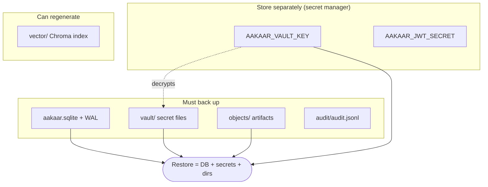
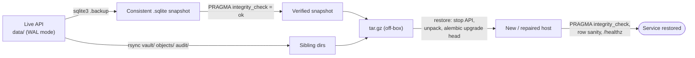

# Disaster Recovery & Business Continuity

In plain terms: this is the plan for the worst day — a disk dies, a server is destroyed, a building loses power, a ransomware event hits. It answers two questions a regulator or a board will ask: "how much data could we lose?" and "how long until we are back?" Because Aakaar is deliberately a single-node, airgap-friendly system with **no external database, queue, or cloud dependency**, recovery is unusually simple: it comes down to good backups and a clean restart, not a complex multi-region failover. The catch is that "simple" only works if you have actually rehearsed it — so this doc ends with a numbered restore drill you should run quarterly.

> The single most important sentence in this document: **a backup that has never been restored is a hope, not a backup.** Run the drill in the last section.

---

## RTO and RPO — the two numbers that drive everything

| Term | Plain meaning | What sets it for Aakaar |
|------|---------------|-------------------------|
| **RPO** (Recovery Point Objective) | How much recent work you are willing to lose | Your **backup cadence** — you can only recover to your last good snapshot |
| **RTO** (Recovery Time Objective) | How long you can be down before it hurts | How fast you can provision a host, unpack a backup, run migrations, and restart |

Because the whole platform restores from one tarball onto one process, a realistic single-node target is:

| Tier | RPO | RTO | How you achieve it |
|------|-----|-----|--------------------|
| Standard | ≤ 24h | ≤ 1h | nightly backup off-box; documented restore on a warm spare |
| Enhanced | ≤ 1h | ≤ 30m | hourly `sqlite3 .backup` snapshots; pre-provisioned standby host; image pre-loaded |
| Best-effort airgap | ≤ 24h | hours | offline media rotation; manual host rebuild |

> These are achievable targets for this architecture, not contractual guarantees — set the actual numbers with your risk owners and validate them in the drill. The runbook backup procedure (keep ≥ 7 dailies off-box) maps to the Standard tier out of the box.

---

## What to back up (and what you can rebuild)

All durable state lives under one data directory (`aakaar/data/`, or `$AAKAAR_DATA_DIR`; in Docker, the `aakaar-data` volume at `/data`). There is no second store to coordinate.

| Path | Contents | Back up? | If lost |
|------|----------|:--------:|---------|
| `data/aakaar.sqlite` (+ `-wal`, `-shm`) | tenants, users, workflows, runs, grants, audit_log | **yes — critical** | everything |
| `data/vault/` | per-tenant secret files, Fernet-encrypted if keyed | **yes — critical** | every credentialed capability fails |
| `data/objects/` | object store: run artifacts, attachments | **yes** | artifact downloads 404 |
| `data/audit/audit.jsonl` | append-only mirror of `audit_log` | **yes** (forensics) | DB copy of the trail remains |
| `data/vector/` | Chroma index for planner capability search | optional | rebuildable; planner quality degrades until reindexed |
| `AAKAAR_VAULT_KEY` (the Fernet key list) | the key that decrypts the vault | **yes — store SEPARATELY** | vault ciphertext is unrecoverable |
| `AAKAAR_JWT_SECRET`, OIDC/MFA keys | auth signing material | **yes — secret store** | all sessions invalidated; SSO/MFA break |

> Two non-obvious but critical points. First, **the vault key is not in the data directory** — it is an environment secret. A backup tarball without its vault key is just encrypted noise; store the key in your secret manager, not next to the backup. Second, the **Chroma vector index is the only fully rebuildable asset** — everything else is authoritative and must be captured.

Critical-versus-rebuildable, at a glance:



---

## Backup cadence

The mechanics (WAL-aware `sqlite3 .backup`, `rsync` of the sibling dirs, tarball) are in **Operations & Runbooks, Runbook 01** — do not `cp` a live SQLite file. The DR-level policy on top of that:

- **Frequency:** nightly for the Standard tier; hourly `sqlite3 .backup` snapshots for the Enhanced tier (the online snapshot is consistent and safe while the API runs).
- **Off-box:** every backup leaves the host immediately. A backup on the same disk that died protects nothing.
- **Retention:** keep ≥ 7 dailies, plus weekly/monthly per your retention policy. Align with the platform's own retention rules (`GET /retention/policies`) and any **legal holds** — a legal hold means the relevant data must survive even routine deletion, so verify holds are reflected in what you retain.
- **Encryption at rest:** run with `AAKAAR_VAULT_KEY` set and `AAKAAR_VAULT_REQUIRE_ENCRYPTION=1` so the vault files **inside** the backup are ciphertext. The tarball still contains secret material — guard it like the vault itself.
- **Key custody:** retain every retired vault key for as long as any backup encrypted with it exists. Restoring an old backup needs the key that was active when it was taken (append it: `AAKAAR_VAULT_KEY=K_current,K_old`).
- **Integrity:** the snapshot is verified with `PRAGMA integrity_check` at capture time — never trust a backup you have not integrity-checked.



---

## Failover thinking within the airgap constraint

Aakaar is intentionally single-process: the executor, agent registry, scheduler, and event outbox all live **in the API process**, and the store is a local SQLite file. That rules out classic active-active clustering (two API processes on one SQLite file over a network mount **will corrupt it** — never do this). Continuity is therefore **fast rebuild and restart**, not live redundancy. Design around that:

| Failure | Continuity move | Notes |
|---------|-----------------|-------|
| API host lost | restore the latest tarball onto a **warm standby** host, run migrations, start | This is the primary DR path; rehearse it (drill below) |
| Disk/DB corruption, host intact | repair or restore in place | Runbook 02 (corruption) → Runbook 01 (restore) |
| Vault key lost | unrecoverable for that ciphertext | tenants re-enter secrets via grant updates; design prevents partial recovery |
| Broker host lost | **no DR needed** — broker is stateless | repoint agents direct to the API, or restart the broker (Runbook 05); nothing to restore |
| Remote workstation lost | re-enroll an agent on a replacement machine | runs that targeted it fail placement and `/rerun` after re-enrollment |
| In-flight runs at the moment of failure | accepted loss | startup recovery marks them FAILED; `/rerun` to relaunch — covered by RPO, not avoidable in a single-process design |

Standby host preparation that shrinks RTO: keep the OS, the Python venv (or the built Docker images via `docker save`/`docker load` for the airgap case), and the application code already in place, so recovery is reduced to *unpack data → migrate → start*. For the airgapped target, pre-stage the BGE embedding model under `/data/hf_cache` so planning works offline without reaching any hub.

> The agent fleet and the broker need no DR planning of their own. Agents dial out and reconnect with backoff; the broker is stateless. Once the API is back, the fleet converges within about a minute on its own.

---

## Tested restore drill (run quarterly)

This proves the backup is real **without touching production**: it boots a throwaway API on a different port against a copy of the latest backup. Disabling the scheduler and remote exec keeps the drill from firing real schedules or touching live agents.

1. **Unpack the latest tarball into a scratch dir.**

   ```bash
   mkdir -p /tmp/aakaar-drill && tar xzf backups/aakaar-<STAMP>.tar.gz -C /tmp/aakaar-drill
   ```

2. **Boot a throwaway API against it** (different port, schedules and remote exec off):

   ```bash
   cd ~/Codes/Aakaar/aakaar
   AAKAAR_DATA_DIR=/tmp/aakaar-drill/<STAMP> \
     AAKAAR_DB_URL="sqlite:////tmp/aakaar-drill/<STAMP>/aakaar.sqlite" \
     AAKAAR_JWT_SECRET=drill-only \
     AAKAAR_VAULT_KEY="<the key that was active for this backup>" \
     AAKAAR_SCHEDULER_ENABLED=false \
     AAKAAR_REMOTE_EXEC_ENABLED=false \
     AAKAAR_BROWSER_POOL=none \
     .venv/bin/uvicorn aakaar.api.main:app --port 8999
   ```

3. **Verify liveness and data integrity.**

   ```bash
   curl -s http://localhost:8999/healthz                              # {"status":"ok"}
   sqlite3 /tmp/aakaar-drill/<STAMP>/aakaar.sqlite "PRAGMA integrity_check;"   # ok
   sqlite3 /tmp/aakaar-drill/<STAMP>/aakaar.sqlite "SELECT count(*) FROM tenants;"   # plausible
   ```

4. **Verify a real workflow loads and an artifact is readable.** Log in as a known tenant user against `:8999`, open a workflow, and fetch one artifact via `GET /objects?uri=...`. A 200 with content proves the DB *and* the object store restored together.

5. **Verify the vault decrypts.** Run a workflow that uses a vault-backed grant, or confirm there are no vault errors at startup. A vault error here means the wrong key — fix key custody **before** you need it for real.

6. **Verify the audit trail is intact.** `GET /audit/verify` on the drill instance should report the hash-chained ledger valid — proof the tamper-evident trail survived the round trip.

7. **Record the result and tear down.** Log the drill date and the measured **time-to-restore** in your ops log (that measured number *is* your real RTO), then `rm -rf /tmp/aakaar-drill`.

> Expect the drill instance to log `recovered N interrupted run(s) -> FAILED on startup` — runs that were in-flight at backup time are deliberately marked FAILED on any restart. That is correct behaviour, not a restore failure.

---

## DR readiness checklist

Use this as a standing audit. Every line should be a confident "yes."

- [ ] Nightly (or hourly) WAL-aware `sqlite3 .backup` runs and is verified with `PRAGMA integrity_check`.
- [ ] Backups leave the host (off-box / offline media) and ≥ 7 dailies are retained.
- [ ] The backup captures `vault/`, `objects/`, and `audit/` — not just the `.sqlite` file.
- [ ] `AAKAAR_VAULT_KEY` is stored **separately** in a secret manager, and every retired key is retained while backups using it exist.
- [ ] `AAKAAR_JWT_SECRET` and any OIDC/MFA keys are backed up in the secret store.
- [ ] `AAKAAR_VAULT_REQUIRE_ENCRYPTION=1` so backups contain ciphertext, never plaintext secrets.
- [ ] A warm standby host (or pre-loaded Docker images for airgap) can take a restore quickly.
- [ ] The restore drill has been run in the **last quarter**, with the measured time-to-restore logged.
- [ ] RTO/RPO targets are agreed with risk owners and validated against the last drill.
- [ ] Retention policies and legal holds are reflected in what backups keep.
- [ ] The runbooks (Operations & Runbooks) are current and the on-call team knows where they are.

---

## Related

- **Operations & Runbooks** — Runbook 01 (backup/restore mechanics), Runbook 02 (corruption), Runbook 03 (vault key rotation), Runbook 05 (broker, stateless — no DR needed).
- **Quickstart: Server, Broker & Web** — how a restored stack is brought back up.
