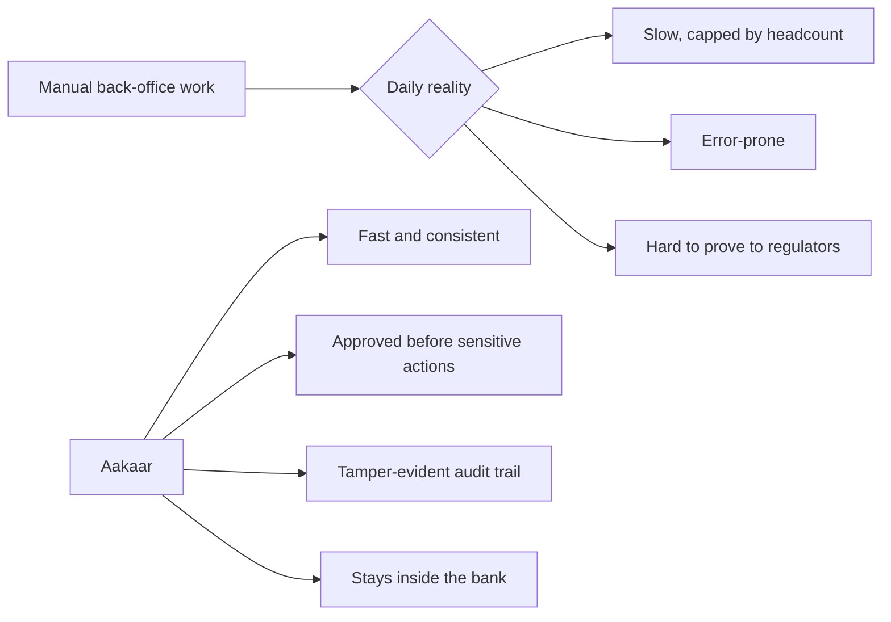
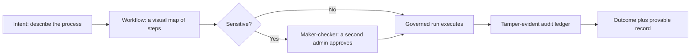
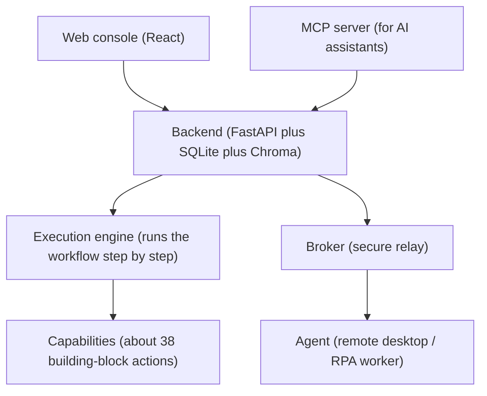
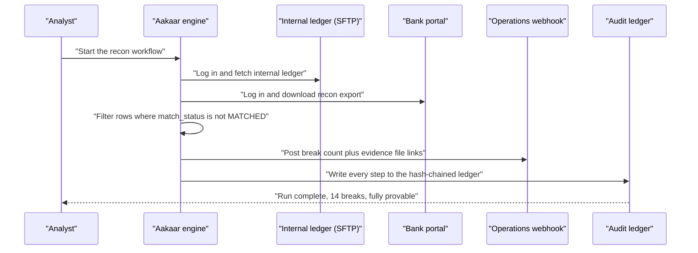

# Aakaar — Executive & Product Brief

## In plain terms

Aakaar is software that lets a bank automate slow, repetitive back-office work — reconciliation, disputes, KYC checks, loan processing — by *describing* the work once as a visual flow, instead of paying for custom code every time. Think of it as a tireless, rule-following clerk who never skips a step, never forgets to write things down, and always asks a supervisor before doing anything sensitive. Crucially, it runs entirely **inside the bank's own walls** — no customer data is shipped to an outside cloud — and it keeps a tamper-proof record of everything it did, which is exactly what auditors and regulators want to see.

> In one line: **describe the process once, and Aakaar runs it reliably — with every step approved, recorded, and provable.**

---

## The problem in the back office

Most of a bank's operational cost is not in the branch or the app — it is in the back office, where teams perform the same rule-based tasks thousands of times a day. Matching the internal ledger against the bank statement. Confirming a card dispute before issuing a provisional credit. Reading a loan PDF and copying fields into the origination system. Screening a new customer against a sanctions list.

These tasks share four painful traits.

| Trait | Why it hurts |
|-------|--------------|
| **High volume, low variation** | People burn out doing the same thing repeatedly; throughput is capped by headcount. |
| **Error-prone** | A missed break or a mistyped PAN becomes a financial loss or a compliance finding. |
| **Hard to audit** | When the regulator asks "prove this ran correctly six months ago," the answer is often a scramble through emails and spreadsheets. |
| **Risky to automate naively** | Off-the-shelf RPA scripts make sensitive moves with no approval and no trustworthy record — trading one risk for another. |

Aakaar exists to remove the drudgery **without** introducing those last two risks.

The shift, at a glance — from manual effort to governed automation:

---

## How it works, at a glance

You never start by writing code. You start by describing the *intent* — "fetch both statements, find the breaks, notify operations." Aakaar turns that into a **workflow** (a visual map of steps), runs it as a governed **run**, and writes every step to an **audit** trail you can later prove was never altered.

The journey from idea to provable outcome:

Three ideas make this safe enough for a bank:

- **Maker-checker.** Sensitive workflows do not just run when someone clicks start. The request goes to a *second* administrator, who must approve it. The person who asked cannot approve their own request — that is segregation of duties, enforced by the system.
- **Dry-run.** Before pointing automation at the real bank portal or core system, you can rehearse the whole flow. Side-effecting steps are *simulated* — the topology is walked end to end, but nothing is actually fetched, posted, or written. It is a flight simulator for back-office processes.
- **Tamper-evident audit.** Every step is written into a hash-chained ledger — each entry mathematically sealed to the one before it. A single command (`GET /audit/verify`) recomputes the chain and proves nothing was changed after the fact.

---

## Where the value comes from

| Capability | What it is | Business outcome |
|------------|-----------|------------------|
| **Visual workflows** | Processes drawn as a map, not written as code | Operations teams automate without a software project for each change |
| **Maker-checker governance** | A second approver on sensitive runs and on publishing | Segregation of duties is enforced, not just documented |
| **Tamper-evident audit** | A hash-chained ledger of every step | "Prove it ran correctly" becomes a one-line answer, not a fire drill |
| **Dry-run rehearsal** | Simulated execution with no side effects | Validate wiring safely before touching production systems |
| **On-premise / airgap** | Runs fully in-process; no external cloud dependency | Customer data never leaves the bank's perimeter |
| **RPA reach** | A remote worker drives real desktop and web apps | Automate legacy systems that have no API |
| **Retention and legal hold** | Policies, right-to-erasure, and investigation freezes | Honour privacy rules *without* ever erasing the audit trail |

> The combination is the point. Plenty of tools automate. Far fewer automate **and** prove what they did **and** keep the data inside the bank. Aakaar is built for the third category.

---

## What it is built on (one slide for the technically curious)

Aakaar is deliberately **self-contained**: a FastAPI backend with a local SQLite database and a local Chroma vector store, with no required Redis, Postgres, Temporal, external Vault server, or S3. That is what makes airgapped, on-premise deployment realistic. Secrets are encrypted locally with a pluggable key provider (so a hardware KMS can be slotted in later). Identity supports modern standards — RS256 token signing, TOTP multi-factor, OIDC login, role-based access, and optional database row-level security for hard tenant isolation.

The platform is a small family of components, each with one job:

- **Backend** — the brain: stores workflows, runs the engine, enforces governance, writes the audit ledger.
- **Capabilities** — roughly 38 auto-discovered building blocks (fetch a file over SFTP, call an API, transform data, extract a PDF, send a webhook). Each is sandboxed with guards against common attacks, and side-effecting ones are flagged so dry-run knows to simulate them.
- **Broker** — a stateless, secure relay so the backend can reach a worker sitting on a desk somewhere, without either opening a hole in the firewall.
- **Agent** — the remote worker that drives a real desktop or browser for systems with no API, recording its activity as it goes.
- **MCP server** — lets an AI assistant discover and use the same capabilities through a standard protocol.
- **Web console** — where humans design workflows, approve requests, and watch runs.

---

## Who uses Aakaar

| Role | What they do with it |
|------|----------------------|
| **Operations analyst (maker)** | Designs and starts workflows; answers in-flight prompts (e.g. "confirm this provisional credit"). |
| **Operations lead / admin (checker)** | Approves or rejects sensitive runs and publishes; cannot approve their own requests. |
| **Compliance / audit** | Exports and verifies the audit chain; sets retention policies and legal holds. |
| **Tenant admin** | Grants credentials to capabilities once (kept in the encrypted vault), manages users and roles. |
| **Engineering / platform** | Deploys the self-contained stack on-prem; configures identity (MFA, OIDC, RLS) and the key provider. |

---

## A day in the life — a reconciliation run

It is 7 a.m. The overnight ledger and the bank's reconciliation export both need to be matched, and any breaks escalated to operations before the desk opens. Here is what Aakaar does, with no analyst staring at two spreadsheets.

What happened, in plain language:

1. The engine opened an SFTP session and streamed in the **internal ledger**, retrying automatically through a transient drop.
2. It logged into the **bank portal** and downloaded the reconciliation export by its visible name — no brittle hard-coded selectors.
3. It ran a deterministic transform to keep only the **break rows** (`match_status` not `MATCHED`), sorted by amount. No AI guesswork in the matching — it is reproducible.
4. It posted the **break count plus links to both source files** to the operations webhook as evidence, through a guard that blocks calls to internal addresses.
5. Every one of those steps was written to the **tamper-evident audit ledger**. Three months later, when an examiner asks "did this run untampered?", the answer is a single `GET /audit/verify`.

Had the analyst wanted to test the wiring against a new bank portal first, they would have started the same run in **dry-run** mode: the engine walks the entire flow but *simulates* the login, download, and webhook — a safe rehearsal that never touches the real bank.

> The headline: the same run that saved hours of manual matching also produced its own court-admissible record of having done so. That is the difference between automation and *governed* automation — and it is why Aakaar fits a bank.

For the four shipped, ready-to-run examples — reconciliation, dispute intake, loan document extraction, and KYC screening — see the **Banking Solution Playbooks**. For any unfamiliar term above, see the **Glossary & Concepts**.
