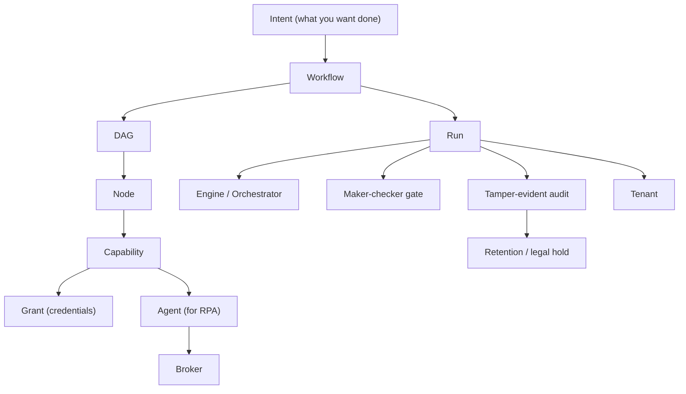

# Glossary & Concepts

## In plain terms

This is the shared dictionary for everyone working with Aakaar — leaders, analysts, compliance, and engineers. Every term used across the documentation is defined here in one or two plain sentences, grouped by theme so you can find related ideas together. If a doc uses a word you do not recognise, this is the place to look it up. Skim the concept map first to see how the core pieces fit together.

The core terms and how they relate — read it as "an intent becomes a workflow, which runs, governed and recorded":

---

## Core workflow concepts

| Term | Plain-language definition |
|------|---------------------------|
| **Intent** | What you want done, described in business terms ("fetch both statements and flag the breaks") before it becomes a concrete workflow. |
| **Workflow** | A reusable, visual map of a process — the recipe. It is versioned and can be marked sensitive so that publishing and running it require approval. |
| **DAG** | "Directed acyclic graph" — the technical shape of a workflow: steps connected by dependencies, with no loops, so the engine always knows a valid order to run them in. |
| **Node** | A single step in a workflow — one action (fetch a file, call an API) or one control (pause for a human). |
| **Capability** | A reusable building block a node performs, such as `cap.sftp_read`, `cap.api_call`, `cap.data_transform`, `cap.doc_extract`, or `cap.webhook_send`. Aakaar ships roughly 38, auto-discovered. |
| **Side-effecting** | A flag on a capability that changes the outside world (posts data, moves a file). It tells dry-run to *simulate* rather than actually perform the step. |
| **Reference (`${...}`)** | How one node passes its output to another (e.g. `${stamp.ist_date}`). A reference must be the *whole* value for a field — it cannot be embedded inside a longer string. |
| **Control node** | A built-in primitive that is not an external action — e.g. `human.prompt` (pause for a person) or `time.now` (stamp the run date). These need no credentials. |

---

## Running and execution

| Term | Plain-language definition |
|------|---------------------------|
| **Run** | One execution of a workflow — the recipe actually being cooked, with its own status and results. |
| **Engine / Orchestrator** | The `LocalExecutor` that walks the DAG layer by layer (via the `RunOrchestrator`), running independent steps and respecting dependencies. |
| **Run status** | Where a run is in its life: `pending`, `running`, `paused`, `succeeded`, `failed`, or `cancelled` — plus waiting when a human prompt is open. |
| **Dry-run** | A rehearsal mode (`"mode": "dry_run"`) that walks the entire workflow but *simulates* side-effecting steps — nothing is fetched, posted, or written. A flight simulator for processes. |
| **Checkpoint / resume** | The engine durably records progress so a run can be paused and resumed (or recovered) without re-doing completed steps. |
| **Human-in-the-loop (HITL)** | A point where the run pauses for a person to answer or confirm (via `human.prompt`), then continues with their response. |
| **Retry** | Automatic re-attempts of a step (e.g. 3 attempts) to absorb transient failures like a dropped SFTP connection. |

---

## Governance, approval, and audit

| Term | Plain-language definition |
|------|---------------------------|
| **Maker-checker** | A two-person control: the *maker* requests an action and a different *checker* must approve it. Enforced for sensitive workflows on both run-start and publish. |
| **Approval request** | The record opened when a gated workflow is started or published. Until a checker approves it (`POST /approvals/{id}/approve`), nothing runs. Returned as `202 Accepted`. |
| **Segregation of duties** | The principle that the person who requests an action cannot also approve it. Aakaar enforces this — a maker approving their own request is rejected (`409`). |
| **`requires_approval` / `sensitivity`** | The two workflow fields that turn on the maker-checker gate. Setting `requires_approval: true` and `sensitivity: "elevated"` gates both running and publishing. |
| **Governance service** | The backend component that creates approval requests, records decisions, and starts the approved run attributed to the original requester. |
| **Tamper-evident audit** | A hash-chained ledger where each entry is mathematically sealed to the previous one, so any later change is detectable. The platform writes every node to it automatically. |
| **Hash chain** | The technique behind tamper-evidence: each audit entry includes a fingerprint of the one before it, so altering any entry breaks the chain. |
| **Audit verify / export** | `GET /audit/verify` recomputes the chain to prove it was not altered; `GET /audit/export` streams it in order for an examiner or SIEM. |

---

## Data, retention, and privacy

| Term | Plain-language definition |
|------|---------------------------|
| **Retention policy** | A rule (`PUT /retention/policies/{resource_type}`) setting how long a resource type — a `run` or a `stored_object` — is kept before it can be erased. |
| **Right-to-erasure** | Honouring a deletion request (`POST /retention/erase`) for erasable resources. Crucially, erasure never touches the audit trail — proof of *what happened* survives. |
| **Legal hold** | A freeze (`POST /retention/legal-hold`) that protects a resource under investigation from erasure, overriding the retention policy. |
| **Stored object** | A governed file in the managed object store (e.g. an archived loan PDF) — an erasable, retainable resource, not an orphaned blob. |
| **Grant** | The one-time setup where a tenant admin gives a capability its credentials and defaults (host, username, key), kept in the encrypted vault. Workflows reference a grant by `account_alias`, never by holding secrets themselves. |
| **Vault** | The local, Fernet-encrypted store for secrets, sitting behind a pluggable **key provider** so a hardware KMS can be slotted in later. |

---

## Identity, tenancy, and security guards

| Term | Plain-language definition |
|------|---------------------------|
| **Tenant** | An isolated customer/organisation within one Aakaar deployment; data, grants, and runs belong to a tenant and do not leak across them. |
| **RBAC** | Role-based access control — what a user can do depends on their role (analyst, admin, compliance). |
| **MFA / TOTP** | Multi-factor authentication using a time-based one-time code, on top of the password. |
| **OIDC / PKCE** | Standard single-sign-on login (OpenID Connect) with the PKCE security extension, so Aakaar can plug into the bank's identity provider. |
| **RS256 / JWKS** | The asymmetric signing scheme for access tokens and the public-key endpoint used to verify them. |
| **RLS** | Row-level security — optional database-enforced isolation so even a query cannot see another tenant's rows. |
| **SSRF guard** | A protection on outbound calls that blocks targets resolving to private / loopback / link-local addresses, unless the exact host is named in `allow_hosts`. Stops automation being tricked into reaching internal services. |
| **Sandbox guards** | Protections built into capabilities — argv-only shell (no shell injection), and defences against zip-slip and zip-bomb attacks. |

---

## Components and integration

| Term | Plain-language definition |
|------|---------------------------|
| **Backend (aakaar)** | The brain: a FastAPI app with local SQLite and Chroma, fully in-process — no required external Redis, Postgres, Temporal, Vault server, or S3. Airgap by design. |
| **Capabilities (aakaar-capabilities)** | The library of ~38 auto-discovered building blocks, each with security guards and a side-effecting flag. |
| **Broker (aakaar-broker)** | A stateless WebSocket relay that lets the backend reach a remote agent without opening firewall holes; each agent's key is verified end-to-end, with a fail-closed token. |
| **Agent (aakaar-agent)** | A remote desktop / RPA worker that drives real applications and browsers (for systems with no API), records its activity, and reconnects with backoff. |
| **MCP (aakaar-mcp)** | A Model Context Protocol server (stdio JSON-RPC) that lets an AI assistant discover and call the same capabilities dynamically. |
| **MCP (the protocol)** | "Model Context Protocol" — an open standard for exposing tools and data to AI assistants in a uniform way. |
| **Web console (aakaar-web)** | The React + TypeScript + Vite interface where humans design workflows, approve requests, and watch runs. |
| **Chroma** | The local vector store used in-process for similarity search — part of what keeps the stack self-contained. |
| **Airgap** | A deployment with no connection to outside networks. Aakaar's in-process design makes airgapped, on-premise operation realistic — customer data never leaves the bank. |

---

## RPA-specific terms

| Term | Plain-language definition |
|------|---------------------------|
| **RPA** | Robotic process automation — driving real desktop and web applications the way a person would, used for legacy systems with no API. |
| **Rendezvous relay** | The broker's role: a meeting point that connects the backend and a remote agent without either exposing itself directly. |
| **Activity recording** | The agent's capture of what it did on the remote machine, for review and evidence. |
| **Reconnect / backoff** | The agent's resilience behaviour — if the connection drops, it retries with progressively longer waits instead of hammering the broker. |

> Cross-references: see the **Executive & Product Brief** for the big picture and a day-in-the-life example, and the **Banking Solution Playbooks** for how these terms come together in four shipped, ready-to-run banking workflows.
