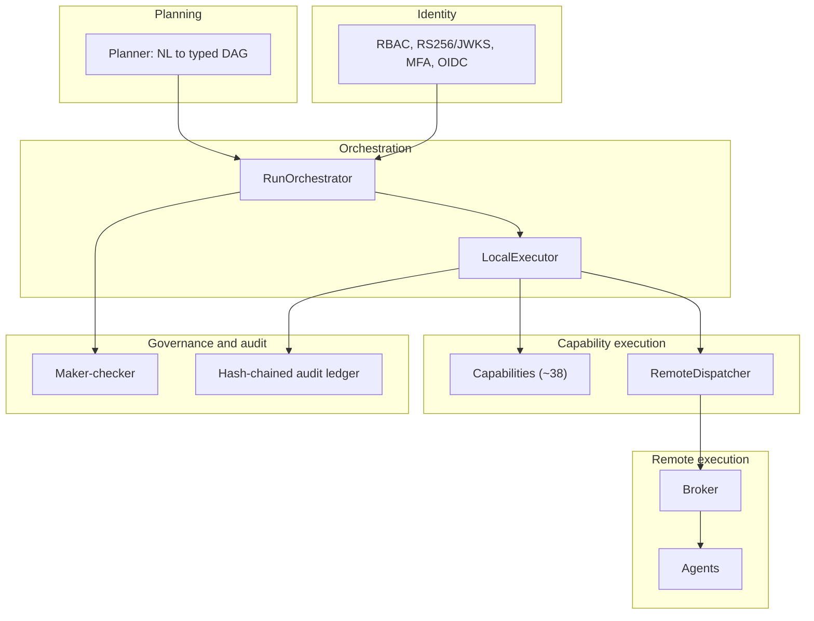
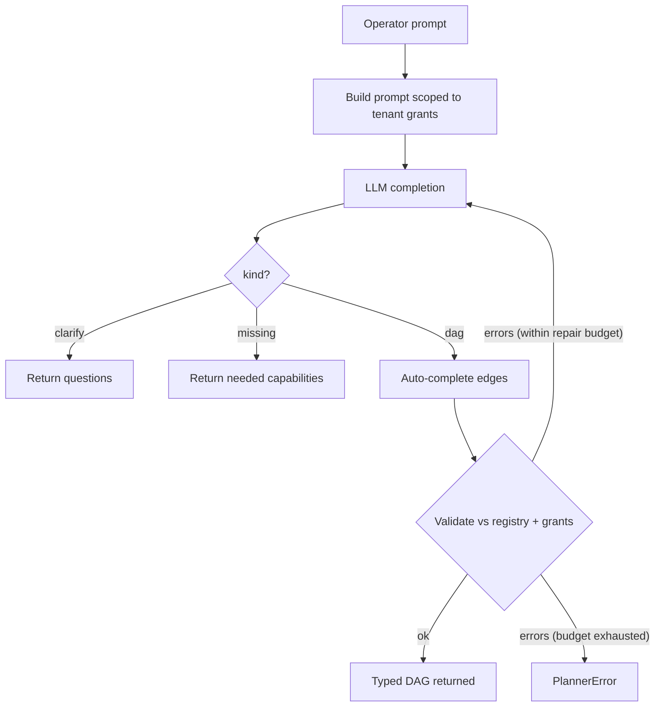
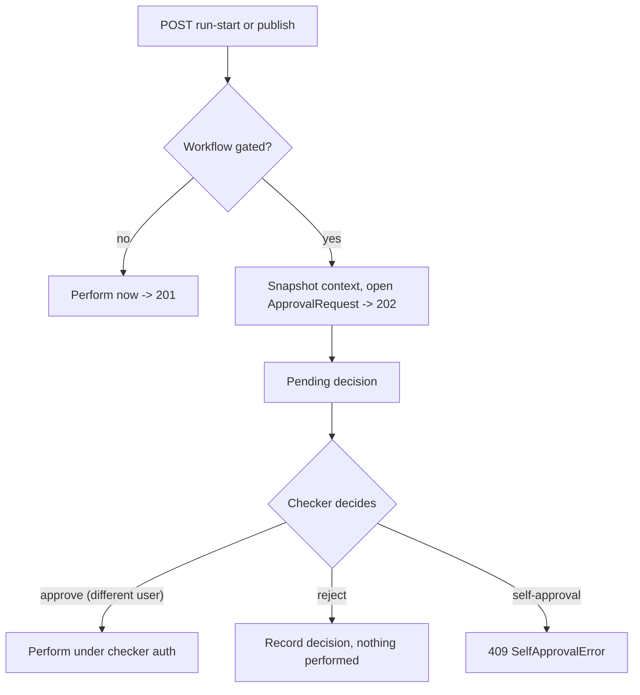
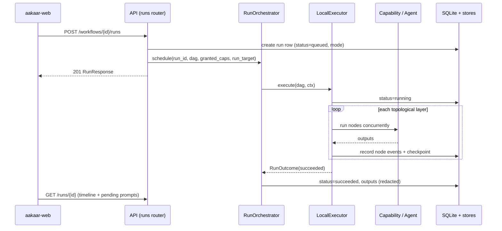
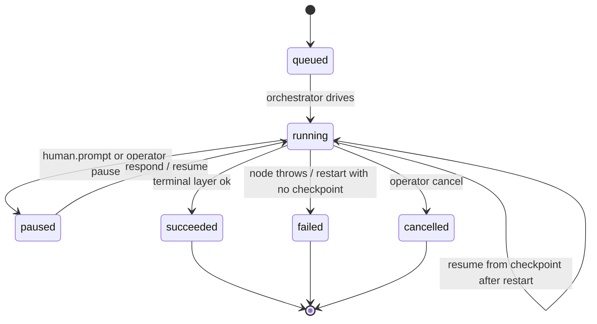

# High-Level Design

> **In plain terms:** This document explains *how the platform is built and why it's built that way*. Aakaar takes a plain-language request, turns it into a fixed, reviewable plan, and then runs that plan step by step — pausing for a human when a decision is needed, recording everything it does, and surviving a server restart without losing its place. Below we walk through the subsystems that make this happen, the journeys a request takes through them, and the deliberate engineering trade-offs (an in-process engine, a single SQLite database) that keep the whole thing simple enough to deploy inside a bank.

The companion Solution Architecture Overview gives the one-page map. This document goes one level deeper: it describes each subsystem's responsibility, the end-to-end flows that cross subsystem boundaries, the non-functional posture, and the key decisions that define the system.

---

## 1. Subsystems and responsibilities

The platform decomposes into six subsystems. Each owns a clear slice of the problem and talks to the others through narrow, testable seams.

### 1.1 Orchestration — `RunOrchestrator` + `LocalExecutor`

The orchestration subsystem is the spine of the platform.

- **`RunOrchestrator`** owns the *lifecycle* of a run: it schedules an `asyncio` task, marks the run RUNNING, drives it to a terminal status (SUCCEEDED / FAILED / CANCELLED), persists outputs, and implements the operator controls (pause, resume, cancel) and crash recovery. It deliberately stays free of any `aakaar.api` imports so the engine can be tested in isolation.
- **`LocalExecutor`** is the *engine*: it computes the DAG's topological layers and runs them one at a time. Within a layer, nodes run **concurrently** as explicit tasks; the executor waits for *all* siblings to settle before surfacing any failure, so a peer holding a live browser session is never torn down mid-flight. After each layer settles it writes a checkpoint.

The executor is defined behind a `Protocol`, so a future `TemporalExecutor` could satisfy the same interface without touching the orchestrator, planner, or API. The base deployment ships only `LocalExecutor`.

### 1.2 Capability execution — capabilities + `RemoteDispatcher`

A **capability** is a named, typed, human-reviewed unit of work (e.g. an HTTP request, a browser login, a file download, a document parse). There are roughly 38, auto-discovered at startup. Each declares its input/output schema and a `side_effecting` flag, and runs behind SSRF, zip-slip, and zip-bomb guards; shell-style capabilities take an `argv` list, never a shell string. Most nodes run via a local handler in the executor's process. When a node's placement `target` selects an agent, the **`RemoteDispatcher`** ships just that node to a remote worker instead, fetching a just-in-time credential envelope from the vault for it.

### 1.3 Governance — maker-checker

Sensitive actions don't execute on request; they open an `ApprovalRequest` and wait. A workflow is *gated* when it opts in (`requires_approval`) or is marked `sensitivity = "elevated"`. The `GovernanceService` enforces exactly one rule — **segregation of duties: the approver must not be the requester** (`SelfApprovalError`). Performing the approved action is the API's job, not the service's, which keeps the decision core free of router/orchestrator imports.

### 1.4 Audit — hash-chained ledger

Every consequential action (run start, publish, approval decision, remote dispatch, retention change) is written to a tamper-evident ledger. Each tenant-scoped row carries a monotonic `seq` and an `entry_hash = sha256(prev_hash || canonical_payload)`. Editing, deleting, or reordering any historical row breaks the recomputed chain — which `GET /audit/verify` surfaces to an auditor. `GET /audit/export` emits the chain for an external regulator to recompute independently.

### 1.5 Identity — RBAC and pluggable auth

Three roles — `superuser`, `tenant_admin`, `tenant_user` — gate every endpoint. Tokens are RS256-signed with a published JWKS; TOTP MFA and OIDC/PKCE login are available, and an optional Postgres Row-Level-Security mode enforces tenant isolation at the database row. The base deployment carries identity entirely in-process; the enterprise pieces are seams you can enable without adding required external infrastructure.

### 1.6 Remote execution — broker + agents

When work must run off the server (a real desktop session, a LAN-only system, data that can't leave a machine), an **agent** dials *out* to a stateless **broker**, the server's `RemoteDispatcher` places a node on it, and results flow back through the same event pipeline so remote steps light up the UI identically to local ones. See the Solution Architecture Overview for the topology and the Data Flow Catalog for the full trace.

---

## 2. Major end-to-end flows

### 2.1 Intent to workflow (planning)

A `tenant_user` types a request. `POST /chat` builds a system prompt scoped to the tenant's *granted* capabilities, asks the LLM for a `PlannerCompletion`, and converts it to one of three outcomes: a **DAG**, a **clarify** (questions back to the operator), or **missing** (capabilities the request needs but the tenant doesn't have). A DAG is auto-completed (mirroring `${A.x}` data-flow references into the edge list) and then validated against the registry and grants; validation errors are fed back to the model for up to a bounded number of repair attempts.

> The planner can only emit nodes from the registered capability catalog. Anything outside the catalog is reported as *missing*, never invented — the guardrail that keeps an LLM from improvising an action against a bank's systems.

### 2.2 Publish and run-start (with the governance gate)

A validated DAG is saved as a workflow version. Publishing it, or starting a run from it, checks the gate. If the workflow is *not* gated, the action proceeds immediately. If it *is* gated, the API snapshots what the action needs into an `ApprovalRequest` and returns **`202 Accepted`** instead of acting; a different admin later approves, and only then does the API perform the originally-gated publish or run-start under the checker's authorization, attributed to the original maker.

### 2.3 Run execution

`RunOrchestrator.schedule(...)` creates an `asyncio` task and hands the DAG plus a snapshot of enabled capability grants to the `LocalExecutor`. The executor walks layers; for each node it resolves inputs (including per-tenant grant defaults like a login URL the planner can't know), dispatches it locally or remotely, records events through the `EventRecorder`, and — after each layer — writes a checkpoint. Side-effecting capabilities, human prompts, and operator controls all flow through this loop.

### 2.4 Human-in-the-loop

When a node is a `human.prompt` control (a captcha, an OTP, an ambiguous selector, a confirmation), the executor pauses *that node*, records `RUN_PAUSED`, and waits on the `SignalHub` (mirrored by a durable, SLA-bounded `HumanTask` row). The run's starter answers via `POST /runs/{id}/respond` and the node resumes. An **operator pause** is different: it holds the run *between layers*; resume releases only that. The answer's value is never written to the event timeline — only its length — so OTPs and captcha answers don't leak into the audit trail.

---

## 3. Non-functional posture

### 3.1 Durability

Durability is achieved with SQLite rows, not a coordination cluster.

- **Per-layer checkpoints.** After each DAG layer settles, the executor persists the completed node ids and a redacted env snapshot. Checkpoint writes are best-effort: a failed checkpoint logs and continues rather than failing a healthy run.
- **Crash recovery on startup.** `recover_interrupted_runs()` scans non-terminal runs. A RUNNING run that has a checkpoint (and resume headroom) is **resumed** from the next unsettled layer — already-completed nodes are *not* re-run and their events are *not* re-emitted (the financial-integrity rule: never double an irreversible side effect). Everything else (queued-before-any-layer, paused-whose-gate-is-gone, or a run past its resume cap) is marked FAILED with a clear reason rather than left a zombie.
- **Bounded resumes.** A poison run that always crashes the same layer eventually fails instead of resuming forever (`max_resumes`).

### 3.2 Security

- **Tenant isolation** at the row level, optionally hardened by Postgres RLS; the orchestrator pins every write to the run's tenant via context vars.
- **Secrets** stay in a Fernet-encrypted vault behind a pluggable `KeyProvider`; for remote nodes they travel only as a just-in-time envelope and are never persisted by the agent or written into DAG/run JSON.
- **Capability guards** — SSRF, zip-slip, and zip-bomb protections; `argv`-only shell; a `side_effecting` flag that the dry-run path keys off.
- **Output redaction** — secret-shaped fields and human-prompt responses are scrubbed before persistence.
- **Tamper-evident audit** as described above.

### 3.3 Scale within constraints

The system is single-node by design and scales *within* a host: runs execute concurrently as `asyncio` tasks, and within each run a DAG layer's nodes run concurrently. Throughput is bounded by the host, not a cluster — an appropriate trade for governed, operator-driven banking workloads. The remote-execution edge spreads *desktop/locality-bound* work across agents without introducing a distributed task queue: coordination is the in-memory registry over a live socket, with SQLite holding only durable metadata.

---

## 4. Key design decisions

| Decision | Why | Trade-off |
| --- | --- | --- |
| **In-process `LocalExecutor`** (no Temporal) | Removes an external dependency; durability via SQLite checkpoints is enough for governed workloads. The executor sits behind a `Protocol` so a Temporal backend can slot in later. | Single-node; resilience is restart-recovery, not live failover. |
| **SQLite as the only primary DB** | Airgap-friendly, zero-ops, trivially backed up as a file; carries runs, events, approvals, the audit chain, and agent metadata. | Vertical scaling only; an optional Postgres-RLS path exists for tenants that need it. |
| **Chroma for vectors** (no separate vector service) | Local semantic capability search during planning without standing up an external store. | In-process index sized to a single host. |
| **DAG-only planner** | The LLM can only assemble *registered, granted* capabilities — never free-form code or invented actions. | Capabilities must be authored up front; new behavior = a new capability, not a prompt trick. |
| **Layer-by-layer, settle-before-fail execution** | Concurrency within a layer; no peer is torn down mid-flight while it holds external state (a browser session). | A failing layer waits for slow siblings to finish before unwinding. |
| **Maker-checker decoupled from action** | The governance core enforces only segregation of duties; the API performs the action. Keeps the rule testable and the layering clean. | The approved action can fail *after* the decision is recorded; that surfaces as a 409 with the request already approved. |
| **Agents dial out through a stateless broker** | Workstations need no inbound ports; the broker holds no trust state and pins nothing — the API verifies each agent key end to end. | The broker host handles keys in cleartext, so it is trusted infrastructure; production terminates the relay as `wss://`. |

---

## 5. Reading order

1. **Solution Architecture Overview** — the one-page map and deployment topologies.
2. **High-Level Design (this document)** — subsystems, flows, non-functional posture, decisions.
3. **Data Flow & Sequence Catalog** — the detailed swimlane traces for each flow named above.
