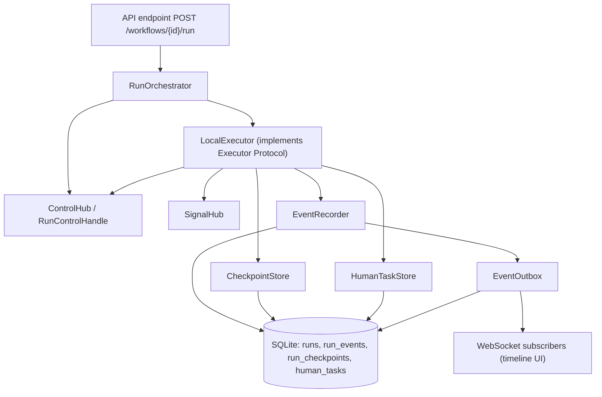
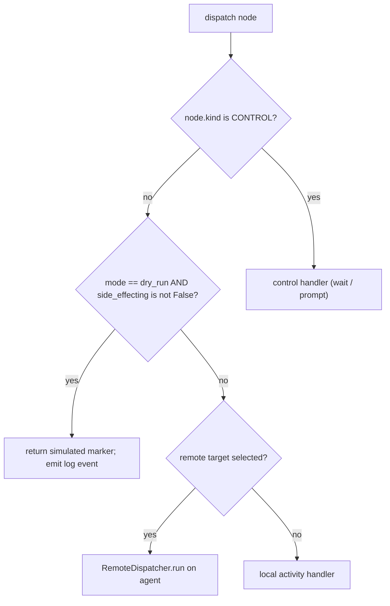
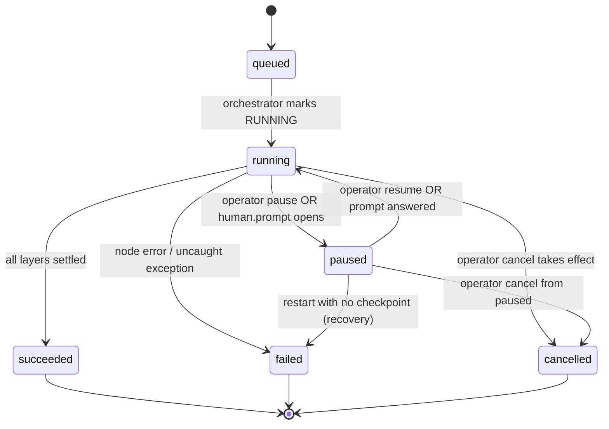
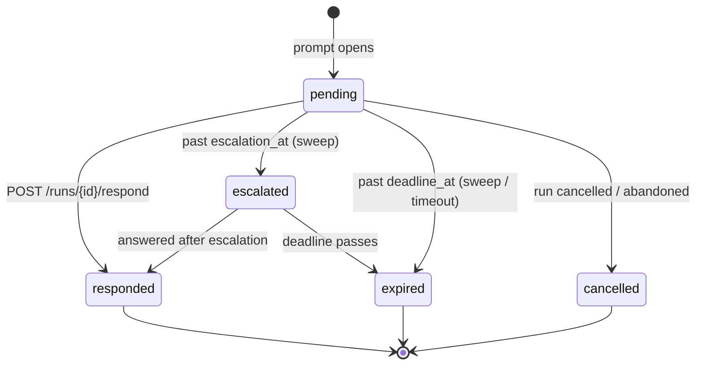
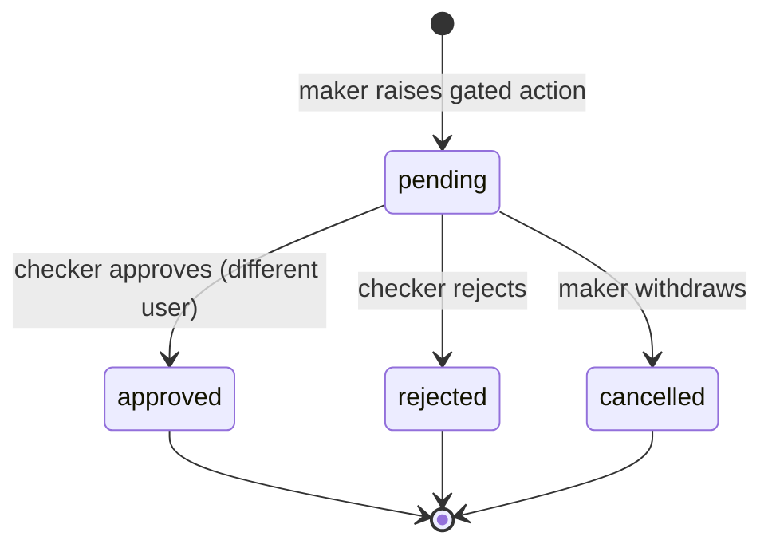
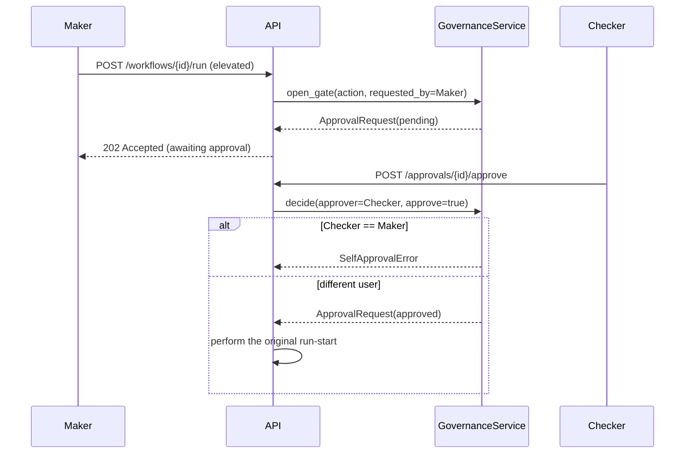
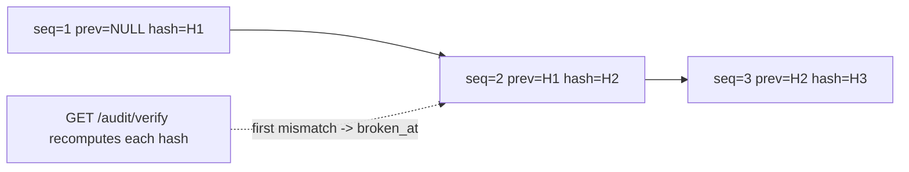
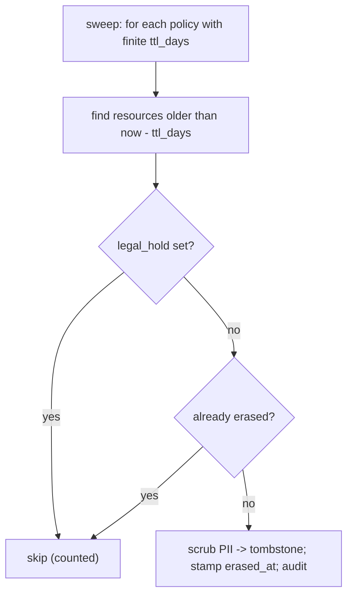
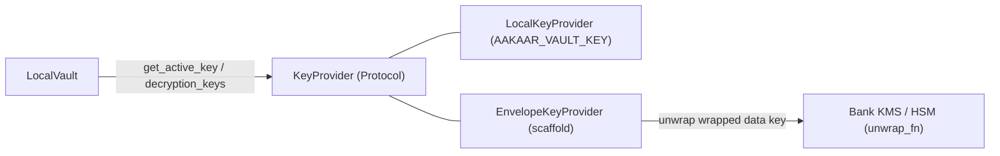
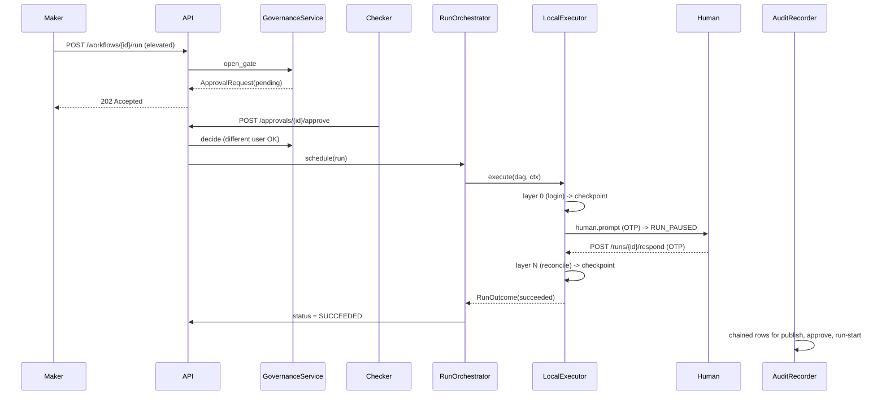

# Low-Level Design: The Aakaar Engine

> **In plain terms.** This document explains, module by module, how Aakaar actually *runs the work* a user designs. Picture an automated assistant that follows a flowchart: it does one step, waits if a person needs to approve something, writes down everything it did in a tamper-proof logbook, and — crucially — can pick up exactly where it left off if the power goes out mid-task. This document is for engineers and architects who need to know *why* each part is built the way it is, not just *what* it does. It is deliberately technical, but every design choice is explained in business terms first.

Aakaar is an air-gapped automation platform for banks: a workflow is a DAG (directed acyclic graph) of capability nodes — "log into the bank portal", "download the statement", "reconcile the ledger", "ask a human for an OTP". The engine's job is to take a validated DAG and drive it to a terminal status while satisfying four hard banking requirements: **durability** (survive a crash), **governance** (maker-checker on money-moving actions), **auditability** (a tamper-evident trail), and **reversibility-awareness** (never double an irreversible side effect, and be able to *simulate* before doing it for real).

Everything runs in one Python process on top of FastAPI + SQLite (Chroma for vectors). There is no Redis, no Postgres requirement, no Temporal server, no Vault server, no S3 — that is a design constraint, not an accident. The cleverness of the engine is delivering Temporal-grade behaviour (checkpoint/resume, at-least-once event fan-out, human-in-the-loop) entirely in-process.

---

## 1. The architecture spine

> The engine is split into a *Protocol* (`Executor`) and an implementation (`LocalExecutor`). Everything above the executor — the orchestrator, repositories, the API — talks to the Protocol, never the concrete class. That single seam is what lets a bank swap in a Temporal-backed executor later without touching a single caller.

This flowchart shows how a run flows from the API down through the engine and back out to the timeline UI.



### Class / responsibility map — engine core

| Class | Module | Responsibility | Why it exists |
|---|---|---|---|
| `Executor` (Protocol) | `interpreter/executor.py` | `async execute(dag, ctx) -> RunOutcome` | The swap seam: production can replace `LocalExecutor` with a Temporal executor with zero caller changes. |
| `LocalExecutor` | `interpreter/executor.py` | Walks the DAG layer-by-layer; dispatches nodes; enforces the dry-run gate; persists checkpoints. | The in-process answer to "run a DAG durably without a workflow engine server". |
| `RunContext` | `interpreter/executor.py` | Carries per-run state: `run_id`, `tenant_id`, `mode`, `run_target`, `controls`, `resume`. | One immutable bag so a node handler never reaches back into the orchestrator. |
| `RunOutcome` | `interpreter/executor.py` | Terminal result: `status` (`succeeded`/`failed`/`cancelled`), `outputs`, `error`. | The single value the orchestrator persists. |
| `RunOrchestrator` | `interpreter/orchestrator.py` | Schedules the drive task, persists status, owns pause/resume/cancel/respond, recovers interrupted runs on startup. | Keeps the interpreter free of API imports and owns the run lifecycle. |
| `ControlHub` / `RunControlHandle` | `interpreter/controls.py` | Operator pause/cancel state checked at every layer boundary. | Cooperative, conflict-detecting lifecycle control. |
| `SignalHub` / `PendingPrompt` | `interpreter/signals.py` | Maps `(run_id, node_id)` to a future the executor awaits for `human.prompt`. | In-process human-in-the-loop coordination. |
| `HumanTaskStore` | `interpreter/human_tasks.py` | Durable, SLA-bounded shadow of each live prompt. | Makes the prompt survive a restart and enforces a deadline/escalation. |
| `CheckpointStore` / `ResumeState` | `interpreter/durability.py` | Per-layer checkpoint persistence + resume seed. | Crash-safe resume mid-DAG. |
| `EventOutbox` | `interpreter/durability.py` | At-least-once, restart-safe fan-out of run events. | No lost timeline events across a restart, no broker. |
| `EventRecorder` / `DbEventRecorder` | `interpreter/events.py` | Writes `run_events` rows; redacts payloads. | The UI-facing, redacted run timeline. |

---

## 2. LocalExecutor — the layer loop

> A workflow is a DAG. The executor sorts it into **topological layers** — groups of nodes with no dependency on each other — and runs one layer at a time, with all nodes *within* a layer running concurrently. Think of an assembly line where several independent stations work in parallel, but the line only advances to the next stage once every station in the current stage has settled.

The loop (`LocalExecutor.execute`) does five things per layer:

1. **Layer-boundary control point.** Before starting a layer, it calls `ctx.controls.checkpoint()` — this *blocks* while an operator has paused the run and *raises* `RunCancelled` once a cancel is requested. Pause/cancel can therefore only ever take effect between layers, never mid-node.
2. **Skip already-done work on resume.** Nodes whose ids are in `resume.completed_ids` are dropped from the layer — their outputs are already seeded into `env`. This is the financial-integrity rule: re-running a done node could double an irreversible side effect (a second wire transfer).
3. **Run the pending nodes concurrently** via `_run_layer`, which drives each node as an explicit `asyncio` task and `asyncio.wait`s for *all* of them — even after the first failure.
4. **Checkpoint the boundary** via `_save_checkpoint` (best-effort; a checkpoint failure is logged and swallowed so durability never turns a healthy run into a failed one).
5. **Loop** to the next layer.

### Why settle the whole layer before surfacing an error

`_run_layer` does *not* cancel in-flight peers when one node fails. A node may hold external state — an open browser session, a half-finished SFTP transfer — that needs a graceful close. If the orchestrator stamped the run terminal and tore down shared `session_state` while a sibling coroutine was still touching it, late events would land *after* `run_cancelled` and sessions would leak. So every task is allowed to finish; only then is an error re-raised, **preferring `RunCancelled` (operator intent) over an incidental node failure**.

This sequence shows a two-node layer where one node fails:

```mermaid
sequenceDiagram
    participant E as LocalExecutor
    participant N1 as Node A (download)
    participant N2 as Node B (reconcile)
    E->>N1: dispatch (task)
    E->>N2: dispatch (task)
    N2-->>E: raises (validation error)
    Note over E: does NOT cancel Node A
    N1-->>E: finishes (closes browser session)
    Note over E: all tasks settled; now re-raise
    E->>E: prefer RunCancelled, else first failure
```

### Per-node execution and retries

`_run_node` wraps each dispatch in a `node_span` context manager that emits `node_started` / `node_completed` / `node_failed` events. `_dispatch_with_retry` honours the node's optional retry policy (`max_attempts`, `backoff_ms`), emitting a `node_retrying` event per attempt — but **control nodes are never retried** (a human-prompt timeout or a `control.wait` is not a transient fault). A best-effort `live_screen` screenshot of the active browser session is captured after every node, success or failure, so the operator can see what the automation was looking at.

### The dry-run gate

> Before a bank lets a money-moving workflow run for real, it wants to *rehearse* it. A dry-run walks the entire DAG topology but short-circuits every side-effecting capability to a simulated marker — no SMTP send, no SFTP upload, no HTTP POST, no file write, no desktop action.

The gate lives in `_dispatch`: when `ctx.mode == RunMode.DRY_RUN` and `_is_side_effecting(node)` is true, the node returns `{"simulated": True, "would_run": <ref>}` and emits a `log` event instead of executing. The side-effecting decision is **tri-state → conservative**: a capability's `side_effecting` flag is `True`, `False`, or `None` (undeclared). Both `True` and `None` count as side-effecting, so a capability that *forgot* to declare can never move money in a dry-run; only an explicit `False` (read-only) runs for real even in simulation.



---

## 3. Run status lifecycle

> Every run moves through a small, well-defined set of states. The UI shows one of these at all times; there is never a "zombie" run with no definitive status — even a server crash resolves to a terminal state on the next startup.

The string constants live in `db/models.py::RunStatus`: `queued`, `running`, `paused`, `succeeded`, `failed`, `cancelled`.



Two *independent* mechanisms can hold a run in `paused`, and the precedence rule between them is a deliberate invariant from `controls.py`:

| Cause | Held by | Released by |
|---|---|---|
| Operator pause | `RunControlHandle.gate` (cleared) | `resume_run` (reopens the layer gate only) |
| `human.prompt` wait | `SignalHub` future inside a layer | `POST /runs/{id}/respond` |

**The two causes never release each other.** Resuming an operator pause does not answer a pending prompt; answering a prompt does not reopen an operator-paused gate. Cancellation overrides both: `request_cancel` sets the cancel event *and* opens the gate, and the orchestrator cancels pending prompt futures so the run can unwind to `cancelled`.

---

## 4. Durability — surviving a restart mid-DAG

> This is the heart of "Temporal-grade behaviour without Temporal". Two persisted artifacts make a run crash-safe: a **per-layer checkpoint** (so we know where we were) and an **event outbox** (so no timeline event is ever lost).

### CheckpointStore

After each DAG layer settles, `CheckpointStore.save_layer` writes one `run_checkpoints` row — the completed node ids plus a **redacted** snapshot of the output environment (`{node_id: {output_key: value}}`) up to that boundary — and mirrors the newest onto `runs.checkpoint` for a single-read fast path. The `(run_id, layer_index)` unique constraint makes it idempotent: a re-driven layer overwrites rather than duplicates. Credential-shaped keys (`password`, `token`, `api_key`, `secret`, `authorization`) are scrubbed by `redact_env` *before* the snapshot lands — a secret never reaches the checkpoint table.

### ResumeState and the recovery path

On startup, `RunOrchestrator.recover_interrupted_runs` scans every `queued`/`running`/`paused` run across all tenants (under `system_scope`). For each:

- A **`running` run with a checkpoint** (and resume headroom under `max_resumes`, default 5, tracked by `runs.resume_count`) is **resumed**: `CheckpointStore.load_resume_state` builds a `ResumeState` (`next_layer_index`, seeded `env`, `completed_ids`) and the run is re-scheduled from the next un-settled layer. Already-completed nodes are *not* re-dispatched and their events are *not* re-emitted.
- Everything else — no checkpoint, a `queued` run that never settled a layer, a `paused` run (its in-process gate is gone), or a run that has exhausted the resume cap — is marked `failed` with a clear reason, so a "poison run" that crashes the same layer forever eventually fails instead of resuming endlessly.

```mermaid
sequenceDiagram
    participant Boot as App startup
    participant Orch as RunOrchestrator
    participant CK as CheckpointStore
    participant DB as runs / run_checkpoints
    Boot->>Orch: recover_interrupted_runs()
    Orch->>DB: select runs in (queued, running, paused)
    loop each interrupted run
        Orch->>Orch: _can_resume(run)?
        alt running + checkpoint + headroom
            Orch->>CK: load_resume_state(run_id)
            CK-->>Orch: ResumeState(next_layer, env, completed_ids)
            Orch->>Orch: resume_count += 1; schedule(resume=...)
        else otherwise
            Orch->>DB: status = FAILED ("interrupted_by_restart")
        end
    end
```

### EventOutbox — at-least-once timeline fan-out

The recorder persists each `run_events` row with `published=False`. `EventOutbox.dispatch` fans the event out to live WebSocket subscribers and only *then* flips `published=True`. A crash between persist and dispatch leaves the row unpublished, and a startup `sweep()` replays every still-unpublished row in `(run_id, sequence)` order (driven by the `ix_run_events_outbox` index). Delivery is therefore at-least-once: a reconnecting subscriber may see an event twice, which the UI dedupes on `(run_id, sequence)`. No broker is involved — this is the same single-process pub/sub made restart-safe.

---

## 5. Human-in-the-loop — SignalHub + HumanTask

> Some banking steps need a person: type an OTP, confirm a large transfer, key in a captcha. The engine pauses the run, surfaces a prompt, and waits — but it does so in a way that survives both an operator cancel and a server restart.

When a `human.prompt` control node fires, `_run_control`:

1. Emits a `run_paused` event with `reason: "human_prompt"`.
2. Opens an in-memory `PendingPrompt` future via `SignalHub.open`.
3. Mirrors it into a durable `human_tasks` row via `HumanTaskStore.open` (SLA `deadline_at` / `escalation_at` timers, clamped to the prompt's own `timeout_seconds`).
4. Awaits the response with `_await_prompt`, which **races** the response future against the operator cancel event *and* the per-node timeout.

The race in `_await_prompt` is subtle and load-bearing: a cancel that lands in the window between the layer checkpoint and the `await` (so `cancel_all_for` popped nothing) would otherwise leave the run sitting out the full timeout and finishing `failed` instead of `cancelled`. Watching `cancel_event` directly closes that window — a cancel at *any* point wins.

`HumanTaskStore.sweep_escalations` (run periodically by `HumanTaskEscalator`) flips a still-pending task to `escalated` past its `escalation_at` (recording a `run_paused` event with `reason: "human_prompt_escalated"`) and to `expired` past its `deadline_at`. OTP responses are never persisted as plaintext — only their length is recorded.



---

## 6. RunOrchestrator — driving and persisting

> The orchestrator is the conductor. The API endpoint creates the run row and gathers grants; the orchestrator owns "execute and persist the final status". This split keeps the interpreter package free of any `aakaar.api` import.

`schedule(...)` registers a `RunControlHandle` and spawns an `asyncio` task that runs `_drive`. `_drive` wraps everything in `tenant_scope(tenant_id)` so every app-DB write the run performs is pinned to its tenant — under Postgres RLS this keeps a run from ever touching another tenant's rows; the contextvar propagates into the executor's awaited work and any sub-tasks it spawns.

`_drive_impl` builds the `ActivityContext` (vault, object store, granted capabilities, browser pool), constructs the `RunContext`, calls `executor.execute`, then:

- closes any live `session_state` handles (browser sessions) best-effort;
- maps `RunOutcome.status` to the terminal `RunStatus`;
- persists `outputs` through a second redaction pass (`_redact_outputs`) — belt-and-suspenders so a secret never reaches the DB even if a handler leaked one.

Operator controls (`pause_run`, `resume_run`, `cancel_run`) flip the `RunControlHandle` and raise `RunControlConflict` on invalid transitions (already paused, not paused, waiting on a prompt). These map to the API endpoints `POST /workflows/runs/{run_id}/pause|resume|cancel|respond`.

---

## 7. Governance — maker-checker (segregation of duties)

> A bank's core control: the person who *asks* to do something money-moving must not be the person who *approves* it. Aakaar enforces this as a gate that sits in front of three actions: publishing a workflow, editing a sensitive workflow, and starting a run.

`GovernanceService` (`services/governance/service.py`) is deliberately the *decision core only* — it never performs the gated action. When a gated action is attempted, the API opens a pending `ApprovalRequest` instead of executing (the gated workflow-publish and run-start endpoints return **HTTP 202 Accepted**, not 200). A *different* user later decides it via `POST /approvals/{request_id}/approve` or `/reject`; on approval the *API*, not this service, reads the approved request and performs the original action under the checker's authorization. That keeps the service free of router/orchestrator imports and trivially testable.

`workflow_is_gated(requires_approval, sensitivity)` returns true when the workflow opts in *or* is `elevated` (money-moving). The one rule the service guarantees is **segregation of duties**: `decide` raises `SelfApprovalError` if `req.requested_by == approver_id`.





---

## 8. Audit — the tamper-evident ledger

> Every meaningful action writes a row to a logbook that *cannot be quietly edited*. Each row is cryptographically linked to the one before it, so altering, deleting, or reordering any historical entry breaks the chain at that point — and an auditor can prove it with one endpoint call.

The write side (`services/audit/recorder.py`) assigns each tenant-scoped row a per-tenant monotonic `seq` and an `entry_hash` = `sha256(prev_hash + canonical_payload(row))`. The canonicalization (`services/audit/chain.py::canonical_payload`) is sorted-key JSON over exactly the immutable fields — the writer and verifier both call it, so they can never disagree about what a hash "should" be. The read side (`services/audit/ledger.py::verify_chain`) recomputes the chain and reports the first broken `seq`.

| Column | Role |
|---|---|
| `seq` | Per-tenant monotonic position (1, 2, 3, …); the chain order. NULL on system rows. |
| `prev_hash` | The predecessor's `entry_hash`. NULL at genesis (`seq=1`). |
| `entry_hash` | `sha256(prev_hash + canonical immutable fields)`. The tamper anchor. |

Three integrity properties `verify_chain` detects: a tampered field (recomputed `entry_hash` differs), a severed link (`prev_hash` mismatch), and a deleted/reordered row (a `seq` gap). The critical section (read-max-seq + insert) is serialized by a per-tenant in-process lock, with the `uq_audit_tenant_seq` unique index as the durable backstop (retry on collision). System rows (`tenant_id is None`) are an unverifiable side log with NULL `seq`. Exposed via `GET /audit/verify` and `GET /audit/export`.



---

## 9. Retention, legal hold, and right-to-erasure

> Banks must delete personal data on a schedule (retention) and on request (right-to-erasure) — but they must also *freeze* data during litigation (legal hold), and they must **never** erase the audit trail itself, because the trail has to outlive what it describes.

`RetentionService` (`services/retention/service.py`) is tenant-scoped and acts on two erasable resource types — `run` and `stored_object` — driven by `RetentionPolicy` rows (one per `(tenant, resource_type)`; `ttl_days = NULL` means keep forever). Three operations:

| Operation | Endpoint | Behaviour |
|---|---|---|
| `sweep` | (periodic lifespan task) | Erases resources older than `now - ttl_days`, skipping any with `legal_hold` set or already erased. |
| `erase_resource` | `POST /retention/erase` | On-demand right-to-erasure; **refuses with `LegalHoldError`** while a hold is in force. |
| `set_legal_hold` | `POST /retention/legal-hold` | Sets/clears the hold flag on a run or object. |

Erasure is a **tombstone**, not a delete: a run's `inputs`/`outputs`/`error` and its mirrored `run_event` payloads are scrubbed to `{"_erased": true}`, `erased_at` is stamped, and the row stays for audit; a stored object's bytes are deleted from the object store, `status` flips to `erased`, and the metadata row remains. The legal-hold check is re-evaluated *inside* the write transaction (TOCTOU-safe). Every erasure is itself recorded via the audit recorder — and the audit log is never a retention target.



---

## 10. Vault — the KeyProvider seam

> Secrets (portal passwords, API keys) are encrypted at rest in a local file vault. The clever part is *where the encryption key comes from*: a bank can plug in **their own** key manager (an HSM or cloud KMS) without Aakaar shipping any of that infrastructure — preserving the "plain-PyPI, no third-party infra" constraint while still allowing an external root of trust.

`LocalVault` does not read Fernet keys directly; it asks a `KeyProvider` (`vault/key_provider.py`). The Protocol has two methods: `get_active_key()` (encrypts new writes) and `decryption_keys()` (every key still accepted for decryption, active first — `MultiFernet` order, which is what makes key rotation a non-event). Two providers ship:

| Provider | Purpose | Key source |
|---|---|---|
| `LocalKeyProvider` | Default | Comma-separated Fernet keys from `AAKAAR_VAULT_KEY` settings; first is active, the rest are retired keys kept decryptable during rotation. Byte-for-byte the pre-refactor behaviour. |
| `EnvelopeKeyProvider` | Scaffold (not wired by default) | **Envelope encryption**: a local data key stored *wrapped* by a master key the KMS holds and never releases. The unwrap is an injected `unwrap_fn(wrapped_bytes) -> data_key` — zero cloud-SDK imports, unit-testable with a fake. |

`EnvelopeKeyProvider` unwraps once at construction and caches (the vault is long-lived; we must not phone the KMS on every read). Failing to unwrap the *active* key is fatal — booting with an unusable write key would silently degrade to a fail-closed or plaintext path. Failing to unwrap a *previous* key is logged and skipped (a since-revoked old key legitimately stops unwrapping). Returning no key means the vault stores plaintext (with a warning) or, under `AAKAAR_VAULT_REQUIRE_ENCRYPTION`, **fails closed**.



---

## 11. End-to-end: a reconciliation run

This swimlane ties the modules together for a realistic gated, money-moving reconciliation that needs an OTP partway through.



> **Key takeaway.** Every hard banking requirement maps to one focused module behind a clean seam: durability to `CheckpointStore`/`EventOutbox`, governance to `GovernanceService`, auditability to the hash-chained ledger, reversibility-awareness to the dry-run gate and the resume `completed_ids` rule, and an external root of trust to the `KeyProvider`. All of it runs in one process, on SQLite, with no external infrastructure — which is exactly what an air-gapped bank deployment requires.
