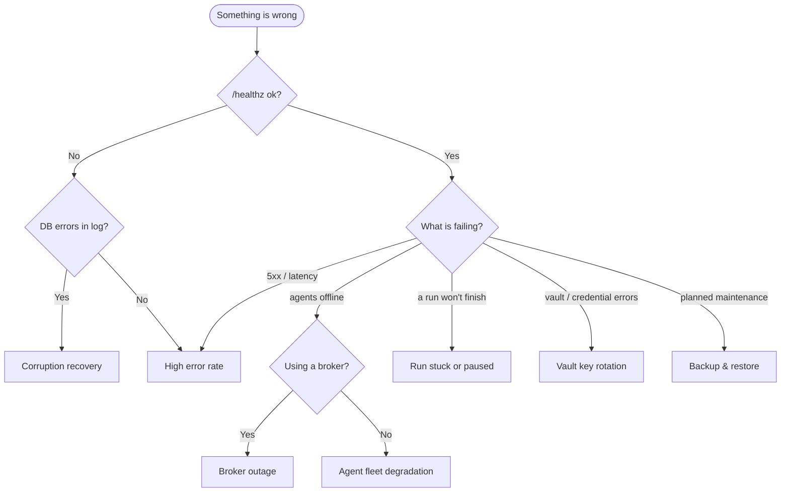
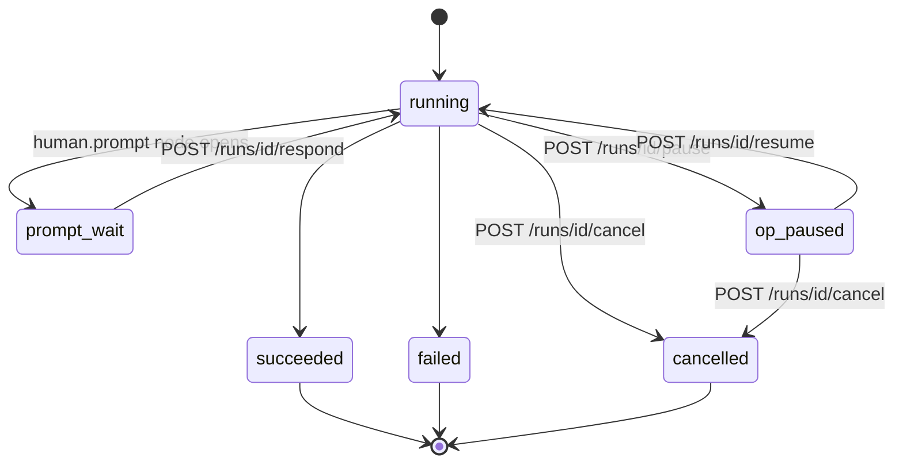

# Operations & Runbooks

In plain terms: this is the on-call handbook for a running Aakaar instance — what to do when something breaks at 2am. Each runbook follows the same shape: **symptoms** (how you know you have this problem), **steps** (the exact commands to run), and **verification** (how you know it is fixed). The commands assume the standard layout: repo at `~/Codes/Aakaar`, backend virtualenv at `aakaar/.venv`, and data under `aakaar/data/` (or `$AAKAAR_DATA_DIR`). For Docker deployments, the same paths live in the `aakaar-data` volume at `/data`.

> Because Aakaar is a single in-process design — SQLite, an in-process executor, a filesystem vault, an in-process agent registry — most incidents trace back to one of a small set of causes, and most fixes are local. There is no cluster to fail over to; reliability comes from good backups and clean restarts, not redundancy.

---

## Orientation — first 60 seconds of any incident

```bash
curl -s http://localhost:8000/healthz                    # liveness: {"status":"ok"}
curl -s http://localhost:8000/metrics | grep aakaar_     # request/run counters (no auth)
ls -lh aakaar/data/                                      # aakaar.sqlite, objects/, vault/, vector/, audit/
tail -50 aakaar/data/audit/audit.jsonl                   # file mirror of the audit_log table
```

The API logs to stdout. Set `AAKAAR_LOG_FORMAT=json` for one-line JSON records (`ts`, `level`, `logger`, `msg`, plus `request_id`/`run_id`/`tenant_id` in context). Every HTTP response carries an `X-Request-ID` header matching the `request_id` field in the logs — this is how you tie a failing request to its log lines.

How to pick a runbook:



---

## Built-in background work (lifespan tasks)

Several housekeeping jobs run **inside the API process** — there is no separate worker. Knowing they exist explains log lines you will see and behaviour after a restart. They are wired in the FastAPI lifespan hook (`aakaar/aakaar/api/app.py`):

| On startup | What it does | Log line |
|------------|--------------|----------|
| `bootstrap_superuser` | creates the configured superuser if absent | — |
| `recover_interrupted_runs` | marks any QUEUED/RUNNING/PAUSED run FAILED (the in-process executor cannot re-attach) | `recovered N interrupted run(s) -> FAILED on startup` |
| `event_outbox.sweep` | replays run events persisted but never fanned out (at-least-once) | — |
| scheduler start | fires due schedules (skip with `AAKAAR_SCHEDULER_ENABLED=false`) | — |
| human-task escalator | escalates human tasks past their SLA deadline even with no run activity | — |
| recordings sweeper | expires abandoned recording entries and tells agents to stop capturing | — |
| broker link | dials OUT to the rendezvous broker, if `AAKAAR_BROKER_URL` is set | `broker master link ...` |

> Key consequence: **an API restart marks all in-flight runs FAILED.** That is deliberate — the engine refuses to show perpetually-RUNNING zombies. Re-launch them with `POST /runs/{run_id}/rerun`.

---

## Monitoring via `/metrics`

The API exposes Prometheus metrics at `GET /metrics` (no auth, local scrape; disable with `AAKAAR_METRICS_ENABLED=false`). Names come from `aakaar/aakaar/core/middleware/metrics.py`:

| Metric | Labels | Meaning |
|--------|--------|---------|
| `aakaar_http_requests_total` | `method`, `path`, `status` | request counter; `path` is the route template, e.g. `/runs/{run_id}` |
| `aakaar_http_request_duration_seconds` | `method`, `path` | latency histogram (`_bucket`/`_sum`/`_count`) |
| `aakaar_runs_total` | `status` | declared but **currently never incremented** — track run outcomes via the runs API below until it is wired |

> Counters are process-local and reset on API restart. A sudden drop to zero usually means a restart, not a recovery — correlate with the `lifespan: startup` log line.

---

## Runbook 01 — SQLite backup & restore (WAL-aware)

**Why this matters:** the primary store is a single SQLite file opened in **WAL mode** with a 5s busy timeout. Live state spans **three files** — `aakaar.sqlite`, `aakaar.sqlite-wal`, `aakaar.sqlite-shm`. **Never `cp` a live database**; copying only the `.sqlite` loses everything still in the WAL. Use `sqlite3 .backup`, which takes a consistent snapshot through the SQLite API even while the server writes.

A complete backup also needs the sibling data dirs:

| Path | Contents | Loss impact |
|------|----------|-------------|
| `data/aakaar.sqlite` | tenants, users, workflows, runs, grants, audit_log | everything |
| `data/objects/` | object store (run artifacts, attachments) | artifact downloads 404 |
| `data/vault/` | per-tenant secret files (Fernet-encrypted if keyed) | every credentialed capability fails |
| `data/vector/` | Chroma index for planner capability search | rebuildable; planner quality degrades until reindexed |
| `data/audit/audit.jsonl` | append-only mirror of `audit_log` | forensics only; DB copy remains |

### Take a backup (online, safe)

```bash
cd ~/Codes/Aakaar/aakaar
STAMP=$(date +%Y%m%d-%H%M%S)
mkdir -p backups/$STAMP

# 1. Consistent DB snapshot (works while the API runs, thanks to WAL).
sqlite3 data/aakaar.sqlite ".backup 'backups/$STAMP/aakaar.sqlite'"

# 2. Verify the snapshot BEFORE trusting it.
sqlite3 "backups/$STAMP/aakaar.sqlite" "PRAGMA integrity_check;"   # must print: ok

# 3. Sibling dirs. rsync is restartable and preserves modes (vault files are 0600).
rsync -a data/objects/ "backups/$STAMP/objects/"
rsync -a data/vault/   "backups/$STAMP/vault/"
rsync -a data/audit/   "backups/$STAMP/audit/"
rsync -a data/vector/  "backups/$STAMP/vector/"   # optional; avoids a reindex

tar czf "backups/aakaar-$STAMP.tar.gz" -C backups "$STAMP" && rm -rf "backups/$STAMP"
```

Schedule with cron; keep at least 7 dailies off-box. The tarball contains **secret material** (the vault dir) — store it with the same care as the vault, and run with `AAKAAR_VAULT_KEY` set so vault files inside the backup are ciphertext (Runbook 03).

> Docker: run the same commands inside the container, e.g. `docker compose exec aakaar-api sqlite3 /data/aakaar.sqlite ".backup ..."`.

### Restore

```bash
cd ~/Codes/Aakaar/aakaar

# 1. STOP the API first — restoring under a live process corrupts the WAL.
../dev-stop.sh                       # docker: docker compose stop aakaar-api

# 2. Move the damaged state aside (never delete until the restore is verified).
mv data data.broken.$(date +%s) && mkdir data

# 3. Unpack the chosen backup.
tar xzf backups/aakaar-<STAMP>.tar.gz
mv <STAMP>/aakaar.sqlite data/
mv <STAMP>/objects data/ ; mv <STAMP>/vault data/ ; mv <STAMP>/audit data/
[ -d <STAMP>/vector ] && mv <STAMP>/vector data/

# 4. Sanity-check before boot.
sqlite3 data/aakaar.sqlite "PRAGMA integrity_check;"            # ok
sqlite3 data/aakaar.sqlite "SELECT count(*) FROM tenants;"      # plausible number

# 5. Apply any migrations newer than the backup, then start.
.venv/bin/alembic upgrade head
../dev.sh                            # docker: docker compose start aakaar-api
```

**Verification:** `/healthz` returns ok; expect `recovered N interrupted run(s) -> FAILED on startup` (runs that were in-flight at backup time). Re-launch them with `POST /runs/{run_id}/rerun`.

---

## Runbook 02 — SQLite corruption recovery

**Symptoms:** API logs `database disk image is malformed` or `file is not a database`; `PRAGMA integrity_check` prints anything other than `ok`; the process crash-loops at `alembic upgrade head`.

Corruption is rare in this shape (single process, WAL, busy_timeout) and almost always traces to: out-of-space during a write, a live file copy, two API processes on the same file over a network filesystem (**never put `data/` on NFS/SMB** — file locking does not work), or failing storage.

### Step 0 — stop the bleeding

```bash
../dev-stop.sh                       # docker: docker compose stop aakaar-api
df -h .                              # rule out a FULL DISK first
cd ~/Codes/Aakaar/aakaar
cp -p data/aakaar.sqlite      /tmp/corrupt-$(date +%s).sqlite   # work on copies
cp -p data/aakaar.sqlite-wal  /tmp/ 2>/dev/null || true
cp -p data/aakaar.sqlite-shm  /tmp/ 2>/dev/null || true
```

Do not run any write against the original until you have copied it.

### Step 1 — restore or repair?

If you have a recent verified backup, **restore it** (Runbook 01) — deterministic, minutes. Repair is for when the backup is too old or absent. Check what a restore would lose:

```bash
sqlite3 backups/<latest>/aakaar.sqlite "SELECT max(started_at) FROM runs; SELECT max(at) FROM audit_log;"
```

The object store and vault are plain directories and are usually intact even when the DB is not — a DB-only restore plus the live `objects/` and `vault/` is often the best combination.

### Step 2 — repair attempt (on a copy)

```bash
cd /tmp
# 2a. Replay/checkpoint the WAL into the main file.
sqlite3 corrupt-*.sqlite "PRAGMA wal_checkpoint(TRUNCATE);" || true
sqlite3 corrupt-*.sqlite "PRAGMA integrity_check;"

# 2b. Still broken: export everything readable and rebuild.
sqlite3 corrupt-*.sqlite ".recover" > recovered.sql      # sqlite3 >= 3.29
sqlite3 recovered.sqlite < recovered.sql
sqlite3 recovered.sqlite "PRAGMA integrity_check;"       # must be: ok

# Compare row counts against expectations before adopting:
for t in tenants users workflows workflow_versions runs capability_grants audit_log; do
  printf '%-20s' "$t"; sqlite3 recovered.sqlite "SELECT count(*) FROM $t;"
done
```

### Step 3 — put the repaired DB into service

```bash
cd ~/Codes/Aakaar/aakaar
mv data/aakaar.sqlite     data/aakaar.sqlite.corrupt
rm -f data/aakaar.sqlite-wal data/aakaar.sqlite-shm     # stale WAL must not replay onto the new file
cp /tmp/recovered.sqlite  data/aakaar.sqlite
.venv/bin/alembic upgrade head
../dev.sh
```

**Verification:** `/healthz` ok; log in, list workflows, start a trivial run, fetch one artifact. Spot-check grants still resolve (a recovered `capability_grants` row must still point at an existing `data/vault/<tenant>/grants/...` file; a missing one surfaces as `VaultNotFound` on first use). Find the root cause before closing — disk health (`smartctl`), free space, exactly one API process per DB file, no network filesystems. Reconcile lost rows from `data/audit/audit.jsonl` where possible.

---

## Runbook 03 — Vault key rotation

**Context:** tenant credentials live as JSON files under `data/vault/<tenant_id>/...` (one file per grant, mode 0600). With `AAKAAR_VAULT_KEY` set they are Fernet-encrypted envelopes (`{"$aakaar_vault": "fernet.v1", ...}`); without it they are plaintext and the API warns at startup.

`AAKAAR_VAULT_KEY` is a **comma-separated list** (parsed in `aakaar/aakaar/core/config.py`):

- the **first** key encrypts every new write;
- the **remaining** keys are still accepted for decryption (MultiFernet) — this is what makes zero-downtime rotation possible;
- plaintext entries stay readable under a keyed vault and are re-encrypted on next write.

Set `AAKAAR_VAULT_REQUIRE_ENCRYPTION=1` in every non-dev environment so a missing key is a startup failure, not a silent fall-back to plaintext.

### Rotation procedure

Assume the current value is `AAKAAR_VAULT_KEY=K_old`.

1. **Backup first** (Runbook 01). A rotation that loses both keys loses every tenant credential — there is no recovery but re-entry.

2. **Add the new key at the front, keep the old one behind it**, then restart the API:

   ```bash
   # aakaar/.env (or your process manager's environment)
   AAKAAR_VAULT_KEY=K_new,K_old
   ```

   Every write now encrypts with `K_new`; everything under `K_old` still decrypts.

3. **Re-encrypt existing entries** (they only pick up `K_new` when rewritten). One-off sweep (API stopped or during a quiet period — `put()` is atomic per file):

   ```bash
   cd ~/Codes/Aakaar/aakaar
   AAKAAR_VAULT_KEY=K_new,K_old .venv/bin/python - <<'EOF'
   import os
   from pathlib import Path
   from aakaar.vault.local import LocalVault
   keys = tuple(k.strip() for k in os.environ["AAKAAR_VAULT_KEY"].split(",") if k.strip())
   vault = LocalVault(Path("data"), keys=keys)
   root = Path("data/vault")
   count = 0
   for f in sorted(root.rglob("*.json")):
       tenant_id = f.relative_to(root).parts[0]
       ref = str(f.relative_to(root / tenant_id))[: -len(".json")]
       vault.put(tenant_id, ref, vault.fetch(tenant_id, ref))  # decrypt-with-any, encrypt-with-first
       count += 1
   print(f"re-encrypted {count} entries")
   EOF
   ```

4. **Verify nothing still needs `K_old`** — restart with only the new key in a scratch shell and fetch each entry (the verification snippet in `runbooks/03` lists any that fail).

5. **Retire the old key:** set `AAKAAR_VAULT_KEY=K_new`, restart, and keep `K_old` offline for as long as backups encrypted with it are retained — restoring an old backup needs the key active when it was taken (append temporarily: `K_new,K_old`).

**If decryption errors appear after rotation:** the running process is probably missing a key (confirm the live env lists both during the window), or an entry restored from an old backup needs that era's key appended. Worst case (key truly lost): delete and re-create the affected grants — `PATCH /admin/grants/{id}` requires the complete secret set, so partial recovery is impossible by design.

---

## Runbook 04 — Agent fleet degradation

**Symptoms:** runs fail with `no online agent matches target '...' for this tenant`; the Agents page shows agents offline (`GET /agents` → `"online": false`, stale `last_seen`); `POST /placement/check` reports `online_agents: 0`; or a churn of agent online/disconnect log lines (a reconnect storm).

### Is it one agent or the fleet?

```bash
TOKEN=...   # tenant-admin bearer token
curl -s -H "Authorization: Bearer $TOKEN" http://localhost:8000/agents | \
  python3 -c 'import json,sys; [print(a["alias"], a["online"], a["last_seen"]) for a in json.load(sys.stdin)]'
```

- **Whole fleet offline** → server side: API down/restarted, listener disabled, or a broken network path.
- **One agent offline** → workstation side: machine asleep/rebooted, process dead, or key revoked.

### Server-side checks

- `AAKAAR_REMOTE_EXEC_ENABLED` must not be `false` — when disabled the API closes every agent socket immediately with close code **4403**.
- The API must be reachable from workstations. `dev.sh` binds `0.0.0.0:8000`, but `AAKAAR_API_HOST=127.0.0.1` or a host firewall silently strands LAN agents.
- **An API restart drops every live agent socket** (the registry is in-process). Agents reconnect on their own with jittered exponential backoff (base 1s → 60s cap, counter reset after 30s stable), so the fleet reappears within ~a minute. No action beyond waiting.

### Workstation-side checks

```bash
pgrep -fl aakaar-agent
AAKAAR_AGENT_LOG_LEVEL=DEBUG aakaar-agent \
  --server wss://aakaar.example.com:8000 --key "<agent_id>.<secret>"   # see failure directly
```

The WebSocket close code tells you exactly why:

| Close code | Meaning | Fix |
|------------|---------|-----|
| 4401 | key wrong/malformed, or the agent was **revoked** | re-enroll: `POST /agents/enroll` |
| 4403 | `AAKAAR_REMOTE_EXEC_ENABLED=false` | re-enable, restart API |
| 4400 | malformed `hello` | version skew — update the agent |
| 1013 | broker at capacity | see Runbook 05 |

Half-dead TCP (sleep, expired NAT) is detected by the keepalive (ping every 20s, 10s timeout) and the agent redials. In-flight tasks keep running; completed results are **re-delivered** after reconnect, never re-executed.

### Key revocation (suspected compromise)

```bash
# Revoke — deletes the row AND drops the live connection immediately:
curl -s -X DELETE -H "Authorization: Bearer $TOKEN" http://localhost:8000/agents/<agent_id>   # 204
# Re-enroll the legitimate workstation; key shown exactly once:
curl -s -X POST -H "Authorization: Bearer $TOKEN" -H 'Content-Type: application/json' \
  -d '{"alias": "branch-pc-01", "pools": ["mumbai"]}' http://localhost:8000/agents/enroll
```

Both actions are audited (`agent.revoke`, `agent.enroll`). After a compromise, also rotate any tenant secrets dispatched to that agent.

**Verification:** `GET /agents` shows `"online": true` with a fresh `last_seen`; `POST /placement/check` returns `"issues": []`; re-run failed work with `POST /runs/{run_id}/rerun`.

---

## Runbook 05 — Broker outage

Applies **only** to deployments running the optional rendezvous broker. If `AAKAAR_BROKER_URL` is unset on the API, you do not run a broker and this does not apply.

**Topology:** agents dial the broker's `/ws/agents`; the API dials the broker's `/ws/master` (authenticated by the shared `AAKAAR_BROKER_TOKEN`); the broker pairs each agent socket onto the master link and relays frames blindly. It is **stateless** — verifies no agent credentials, holds no queue. Direct connections keep working alongside a broker at all times.

**Symptoms:** all *broker-routed* agents offline at once while the API is healthy; API log `broker master link reconnecting in Ns` repeating; agents log connection-refused/DNS errors, close **1013** (capacity) or **4408** (master link never answered within `AAKAAR_BROKER_HANDSHAKE_TIMEOUT`, default 10s).

### Diagnose which leg is down

```bash
# 1. Broker process — on the broker host:
pgrep -fl aakaar-broker
python3 -c "import socket; socket.create_connection(('broker.example.com', 9300), 5); print('tcp ok')"
```

2. **API→broker leg:** API log. A healthy link logs no reconnect lines. If the API *refused to start* with `AAKAAR_BROKER_URL is set but AAKAAR_BROKER_TOKEN is not`, the token is missing (fail-closed check). A token **mismatch** shows as the broker rejecting the master link and the API retrying — verify both carry the same `AAKAAR_BROKER_TOKEN`.
3. **Agent→broker leg:** agent logs (close codes as in Runbook 04). 1013 = capacity, not an outage.

### Restore the broker

Stateless, so recovery is just restarting it with the same token and address:

```bash
# on the broker host
export AAKAAR_BROKER_TOKEN='<same value the API holds>'
export AAKAAR_BROKER_HOST=0.0.0.0     # only behind TLS proxy / firewall
export AAKAAR_BROKER_PORT=9300
aakaar-broker
```

It refuses to start without `AAKAAR_BROKER_TOKEN` (no default). Agents and the API re-dial with backoff; the fleet converges within ~a minute. Nothing to replay.

### Fallback: direct dial (bypass the broker)

If the broker host is gone for a while and the API has an address the workstations can reach, repoint agents directly — same key, different server URL:

```bash
aakaar-agent --server wss://aakaar.example.com:8000 --key "<agent_id>.<secret>"
```

No server change needed: direct `/ws/agents` connections are always accepted. Leave `AAKAAR_BROKER_URL` set — the master link keeps retrying quietly and relayed agents return when the broker does. If the broker is *permanently* retired, unset `AAKAAR_BROKER_URL` (and `AAKAAR_BROKER_TOKEN`) and restart the API to stop the retry loop.

**During the outage:** runs targeting broker-routed agents fail placement fast (`no online agent matches target`); re-run after recovery. Schedules keep firing and fail the same way — disable a noisy one with `PATCH /schedules/{id} {"enabled": false}`.

---

## Runbook 06 — High error rate

**First five minutes** off `/metrics`:

```bash
M=http://localhost:8000/metrics
# Where are the errors? 5xx by route:
curl -s $M | grep '^aakaar_http_requests_total' | grep 'status="5'
# Are runs failing too, or only HTTP? (runs API, not metrics)
curl -s -H "Authorization: Bearer $TOKEN" http://localhost:8000/runs | \
  python3 -c 'import json,sys,collections; print(collections.Counter(r["status"] for r in json.load(sys.stdin)))'
# Slow rather than broken? eyeball the latency histogram:
curl -s $M | grep '^aakaar_http_request_duration_seconds_bucket' | grep -v 'le="0.0'
```

**Correlate a failing route with logs** via the request id (with `AAKAAR_LOG_FORMAT=json`):

```bash
RID=$(curl -sD- -o /dev/null http://localhost:8000/runs | awk 'tolower($1)=="x-request-id:" {print $2}' | tr -d '\r')
grep "$RID" api.log
```

**Common signatures:**

| Signature | Likely cause | Action |
|-----------|--------------|--------|
| 5xx on one route after a deploy | regression in that router | roll back; the `path` label names the file in `aakaar/aakaar/api/routers/` |
| failed-run share climbing, HTTP healthy | capability-level failure (credentials, target site, SSRF guard, missing extra) | open the failed run (`GET /runs/{id}`), read `error` + `node_failed`; vault → RB03; placement → RB04 |
| 429s (`Too many requests. Retry in Ns.`) | rate limiter (default 240/min per client, 20/min on `/auth`) | confirm a real flood before raising `AAKAAR_RATE_LIMIT_PER_MIN` / `_AUTH_PER_MIN`; 429 storms on `/auth` smell like credential stuffing — check `GET /audit` + source IPs |
| latency up across all routes, no errors | SQLite write contention or disk | sustained waits past `busy_timeout=5000` mean a long writer; check disk/IO; an unboundedly growing WAL means checkpointing is starved |
| every request 500 with DB errors | DB file problem | Runbook 02 |
| 503 on `/recordings` | `AAKAAR_REMOTE_EXEC_ENABLED=false` | expected when remote exec is off |
| LLM errors, planning broken but runs fine | upstream LLM endpoint | runs do not need the LLM; check `OPENAI_API_KEY` / `AAKAAR_OPENAI_BASE_URL`; never disable TLS verify against a public endpoint |

**Load-related?** The platform is single-process: the sustainable run-start rate is bounded by node work, not HTTP. Reproduce in non-prod with the k6 scenario in `loadtest/` before tuning limits, and scale by giving the process more CPU/IO first.

---

## Runbook 07 — Run stuck or paused

A run that will not reach a terminal status (`succeeded`/`failed`/`cancelled`) is in one of four distinguishable states. **Identify which before acting** — one fix (resume) is deliberately refused in the most common case.

```bash
curl -s -H "Authorization: Bearer $TOKEN" http://localhost:8000/runs/<run_id> | python3 -m json.tool
```

Read `run.status`, `pending_prompts`, and the tail of `events[]`.



| Observation | It is | Do |
|-------------|-------|----|
| `pending_prompts` non-empty | human-in-the-loop wait (OTP/captcha/confirm) | `POST /runs/{id}/respond` with `{node_id, response}` — **do not** resume; resume on a prompt-blocked run is a deliberate `409` |
| `paused`, last `run_paused.reason = "operator"` | operator pause (audited `run.pause`) | `POST /runs/{id}/resume` (starter or tenant admin only, else 403) |
| `running`, no prompts, a node clearly hung | stuck external wait (slow site, offline agent, long `control.wait`) | wait for the node/remote timeout (`AAKAAR_REMOTE_TASK_TIMEOUT_SECONDS`, default 300s), or `POST /runs/{id}/cancel` then `/rerun` |
| lifecycle calls give `409 "run is not active on this server"` | pre-restart zombie | startup recovery marks it FAILED; then `/rerun` |
| `queued` and never starts | restart between create and schedule | same as zombie — recovery on next boot, then `/rerun` |

> Cancel is cooperative and safe: it interrupts `control.wait` sleeps and pending prompts immediately; other in-flight nodes finish first, then the run lands on `cancelled`. Poll `GET /runs/{id}` until `status: "cancelled"`. Then relaunch with the same pinned version via `POST /runs/{run_id}/rerun` (a NEW run id).

---

## Escalation

When handing an incident off, fill in the template in `runbooks/escalation.md`. Rules of thumb:

- **Never paste secret values, vault contents, enrollment keys, or JWT secrets** into an incident thread — names and timestamps only. Security-relevant incidents follow `SECURITY.md` as well (email, do not file publicly).
- **Mitigate before root-causing for SEV1:** restoring from backup (Runbook 01) beats live-debugging a corrupted DB.
- **One owner at a time;** hand-off is explicit ("taking it").
- File the post-mortem within 3 business days, and fix the missing/wrong runbook in the same PR.

The audit trail is your evidence of record: `GET /audit/verify` proves the hash-chained ledger is intact, and `GET /audit/export` gives you a slice for the incident write-up.
