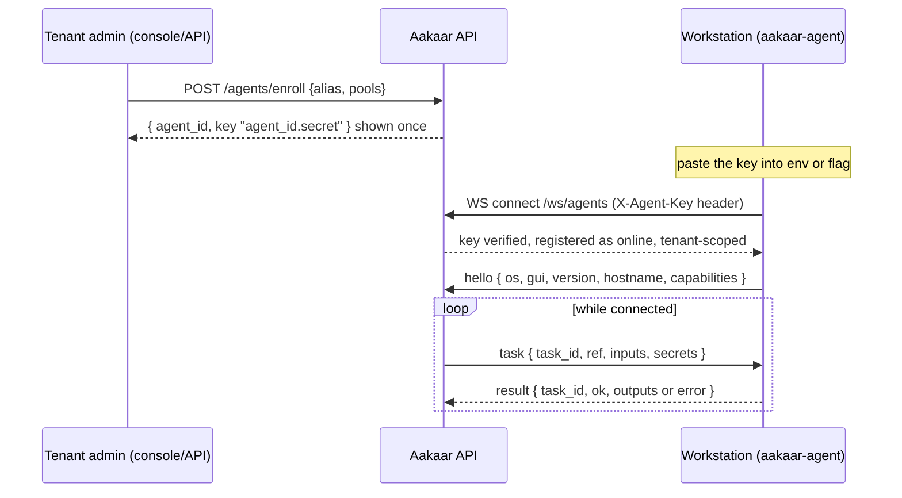
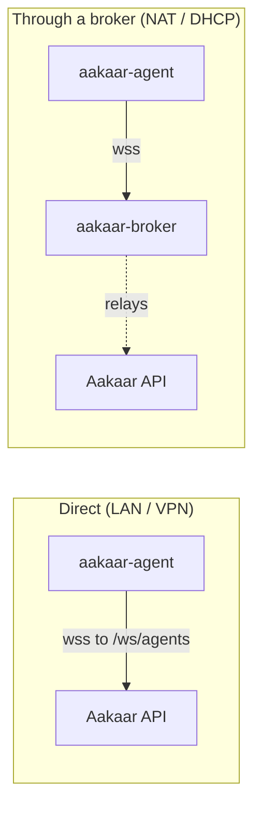
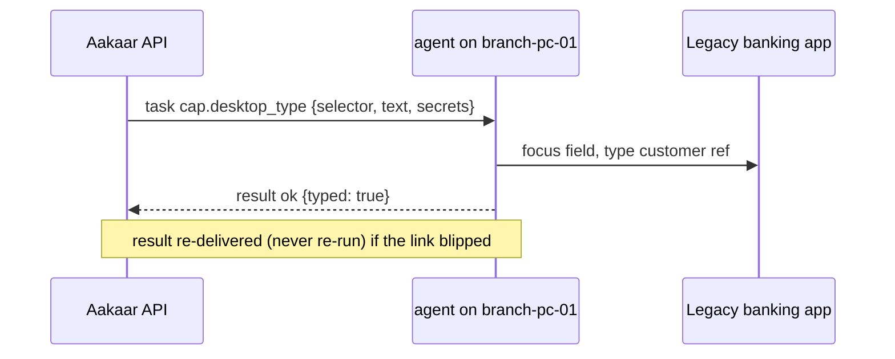

# Quickstart: Remote Agent

In plain terms: an Aakaar **agent** is a small program you install on a real desktop computer — a branch PC, a kiosk, a back-office workstation — so the platform can drive that machine: click buttons, type into a legacy banking application, read the clipboard, run a command. The agent **dials out** to the central server, so the workstation needs no open inbound ports and no public IP. This guide takes you from "nothing installed" to "the server is clicking on this desktop."

By the end you will have:

- Enrolled an agent and captured its one-time key
- Installed and started `aakaar-agent` on the workstation
- Confirmed it shows **online** in the console
- Run a desktop capability against it

---

## How an agent connects

The agent connects out over an authenticated WebSocket. The key is `<agent_id>.<secret>`; the server stores only a bcrypt hash of the secret and verifies it **before** accepting the socket. Identity is tenant-scoped, so an agent can only ever run its own tenant's nodes.

End-to-end connection and task flow:



Two ways to reach the server:



Either way the agent speaks the same protocol and the API performs the same key check. The broker only relays frames blindly.

---

## Prerequisites

- **Python ≥ 3.11** on the workstation.
- **Outbound** network access to the API host on its port (default `8000`) over `ws`/`wss`. No inbound firewall rules required.
- For **desktop/GUI** capabilities (`cap.desktop_click`, `cap.desktop_type`, `cap.clipboard_write`, `cap.window_manage`): the agent must run **inside an interactive desktop session** (a logged-in user with a screen), not a headless service account. Install the `gui` extra.
- Headless capabilities (`cap.shell_exec`, `cap.system_info`) work without a GUI and without the extra.

| Capability ref | Needs GUI session | What it does |
|----------------|:-----------------:|--------------|
| `cap.desktop_click` | yes | click at coordinates / on an element |
| `cap.desktop_type` | yes | type text |
| `cap.clipboard_write` | yes | set the clipboard |
| `cap.window_manage` | yes | focus / move / resize windows |
| `cap.shell_exec` | no | run an argv command (no shell string — injection-safe) |
| `cap.system_info` | no | host facts |

---

## Step 1 — enroll the agent (admin, once)

A **tenant admin** enrolls the agent and receives a **one-time key**. The server only keeps a hash, so copy the key immediately — it is shown exactly once.

**In the console:** *Agents* page → *Enroll agent* → choose an `alias` (and optional pools, e.g. `mumbai`, `kiosk`) → copy the key.

**Or via the API:**

```bash
curl -s -X POST https://aakaar.example.com:8000/agents/enroll \
  -H "Authorization: Bearer <tenant-admin-token>" \
  -H "Content-Type: application/json" \
  -d '{"alias": "branch-pc-01", "pools": ["mumbai"]}'
```

**You should see** a `201` response containing `"enrollment_key": "<agent_id>.<secret>"`. The enrollment is audited as `agent.enroll`.

> Pools are how DAG nodes target a machine. A node with `target: "pool:mumbai"` runs on any online agent in that pool; `target: "branch-pc-01"` (the alias) pins it to this exact machine; `target: "os:windows"` selects by operating system.

---

## Step 2 — install the agent on the workstation

From a copy of the repo (or a packaged installer/wheel):

```bash
# headless host capabilities only:
pip install -e aakaar-agent -e aakaar-capabilities

# + desktop automation (pulls pyautogui, pyperclip, pygetwindow):
pip install -e "aakaar-agent[gui]" -e aakaar-capabilities
```

> The agent depends on the shared `aakaar-capabilities` package (`aakaar_caps`), a monorepo sibling — install it alongside. A packaged installer bundles it automatically.

---

## Step 3 — configure and start it

The agent reads its configuration from **two flags or two environment variables**. The `--server` value is the **base** WS URL — the agent appends `/ws/agents` itself.

```bash
aakaar-agent --server wss://aakaar.example.com:8000 --key "<agent_id>.<secret>"

# equivalently, via environment (handy for service supervisors):
export AAKAAR_AGENT_SERVER="wss://aakaar.example.com:8000"
export AAKAAR_AGENT_KEY="<agent_id>.<secret>"
export AAKAAR_AGENT_LOG_LEVEL="INFO"      # optional; DEBUG to diagnose
aakaar-agent
```

Use `ws://` only on a trusted LAN; prefer `wss://` (TLS) anywhere else.

**You should see** a log line like `agent connected to wss://aakaar.example.com:8000/ws/agents`. The agent reconnects automatically if the link drops, with jittered exponential backoff (base 1s, doubling to a 60s cap), so you do not need to babysit it.

### Connecting through a broker instead

If the workstation cannot reach the API directly, point `--server` (or `AAKAAR_AGENT_SERVER`) at the **broker's** address instead of the API — no other change. The API must have been started with `AAKAAR_BROKER_URL` + `AAKAAR_BROKER_TOKEN`.

```bash
export AAKAAR_AGENT_SERVER="wss://broker.example.com"   # was: the API URL
aakaar-agent
```

### Running it unattended

For production, run the agent under a service supervisor so it survives logout/reboot — `systemd --user` on Linux, a `launchd` LaunchAgent on macOS (grant **Accessibility** + **Screen Recording**), or NSSM on Windows (run in the interactive session for desktop caps). Full per-OS service snippets live in `aakaar-agent/README.md`.

---

## Step 4 — confirm it is online

**In the console:** open the *Agents* page; the agent shows **online** with a fresh `last_seen`.

**Or via the API (tenant admin):**

```bash
TOKEN=...   # tenant-admin bearer token
curl -s -H "Authorization: Bearer $TOKEN" http://localhost:8000/agents \
  | python3 -c 'import json,sys; [print(a["alias"], a["online"], a["last_seen"]) for a in json.load(sys.stdin)]'
```

**You should see** your alias with `online` = `True`. If it is `False`, jump to the troubleshooting table.

You can also check whether a specific workflow can be placed on your fleet:

```bash
curl -s -X POST -H "Authorization: Bearer $TOKEN" -H 'Content-Type: application/json' \
  -d '<the DAG json>' http://localhost:8000/placement/check
```

**You should see** `"issues": []` and `online_agents` ≥ 1 when the targets match an online agent.

---

## Step 5 — run a desktop capability

Build (or reuse) a workflow whose node targets this agent. For a first smoke test, a single `cap.system_info` node (no GUI needed) is the safest:

1. Create a one-node workflow with `cap.system_info`, `target: "branch-pc-01"` (your alias).
2. Start a run: `POST /workflows/{workflow_id}/runs`.
3. Watch the run reach `succeeded` and read the host facts in the node output.

When that works, graduate to a GUI capability such as `cap.desktop_type` or `cap.desktop_click` — for example, typing a customer reference into a legacy KYC desktop app, or clicking through a reconciliation screen. Secrets a task needs (passwords, tokens resolved from a grant) are sent **just in time** for that node and are never persisted on the agent.



---

## Troubleshooting

The agent logs the WebSocket **close code** when the server rejects or drops it — this tells you exactly why.

| Close code / symptom | Meaning | Fix |
|----------------------|---------|-----|
| `4401` | key missing/malformed/wrong, or the agent was **revoked** (row deleted) | re-enroll: `POST /agents/enroll` for a fresh one-time key |
| `4403` | `AAKAAR_REMOTE_EXEC_ENABLED=false` on the API | re-enable on the API and restart it |
| `4400` | malformed `hello` frame | version skew — update the agent package |
| `1013` | broker at `AAKAAR_BROKER_MAX_SESSIONS` capacity | raise the limit after confirming sessions are legitimate; see broker runbook |
| `4408` (via broker) | API master link never answered the session in time | check the API↔broker leg |
| connection refused / DNS error | wrong server URL, or API/broker down | verify `--server`, that the API binds a reachable host (not `127.0.0.1` when agents are remote), and no firewall blocks the port |
| agent connects then drops every ~20–30s | a proxy/load balancer is killing idle WebSockets | raise the proxy idle timeout above the 20s keepalive interval |
| shows online, then goes offline when the PC sleeps | half-dead TCP after sleep/NAT expiry | expected — the keepalive detects it and the agent redials; in-flight results are re-delivered, never re-executed |

To watch the failure directly, run the agent in the foreground with debug logging:

```bash
AAKAAR_AGENT_LOG_LEVEL=DEBUG aakaar-agent \
  --server wss://aakaar.example.com:8000 --key "<agent_id>.<secret>"
```

> **Suspected key compromise?** A stolen key lets someone connect *as that agent* and receive its task frames (including grant-resolved secrets). Revoke immediately with `DELETE /agents/{agent_id}` — it deletes the row **and** drops the live socket — then re-enroll. See the Agent fleet degradation runbook.

---

## Where to go next

- **Quickstart: Server, Broker & Web** — get the API, console, and broker running.
- **Operations & Runbooks** — the Agent fleet degradation and Broker outage runbooks in depth.
