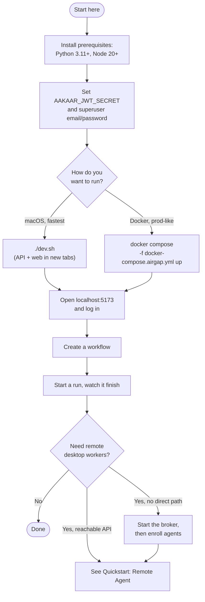
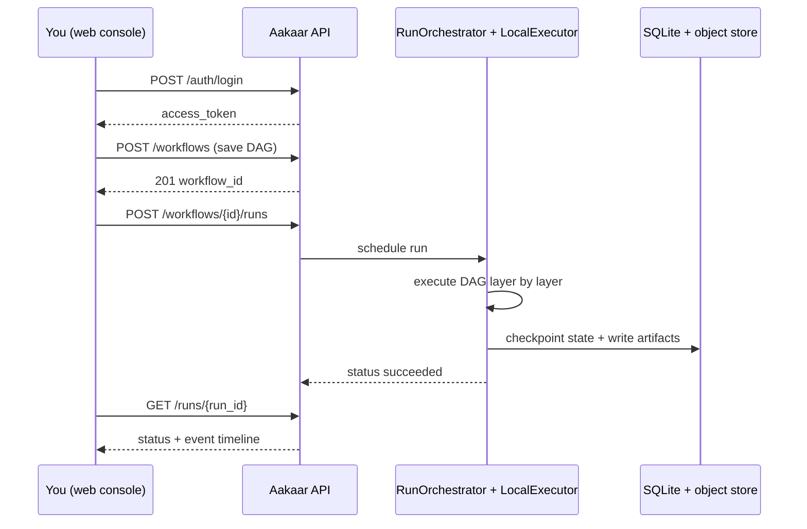

# Quickstart: Server, Broker & Web

In plain terms: this guide gets the Aakaar platform running on one machine and walks you from a blank screen to your first automated workflow actually executing. You will start two things — the **API** (the brain) and the **web console** (the screen you click in) — log in, build a tiny workflow, and run it. The optional **broker** at the end is only needed when remote worker machines cannot reach the API directly. Everything runs in-process with a local SQLite database; there is no Redis, no Postgres requirement, and no cloud account to set up.

By the end you will have:

- The API answering on `http://localhost:8000`
- The web console on `http://localhost:5173`
- A first login as a superuser
- One workflow created and one run completed
- (Optional) a rendezvous broker running for remote agents

---

## The pieces and how they fit

The platform is a small set of independent processes. For a single-machine start you only need the first two.

Setup decision flow — what to start and in what order:



| Process | What it is | Needed for first run? |
|---------|-----------|:---------------------:|
| `aakaar` (API) | FastAPI backend + SQLite + Chroma, the workflow engine | Yes |
| `aakaar-web` | React/Vite console you log in to | Yes |
| `aakaar-broker` | Stateless relay so off-network agents can reach the API | No (optional) |
| `aakaar-agent` | Worker on a remote desktop/RPA machine | No (separate guide) |

---

## Prerequisites

- **Python ≥ 3.11** (3.12 recommended) for the backend.
- **Node ≥ 20** for the web console.
- macOS, Linux, or Windows. The `./dev.sh` helper is macOS-specific (it opens Terminal tabs); on other platforms use Docker or start each service by hand (shown below).
- ~1 GB free disk for the Playwright Chromium download (one-time, only if you use browser capabilities).

> No external services are required. With nothing configured the API uses an embedded SQLite database under `aakaar/data/`, so you can start immediately.

---

## Path A — one command on macOS (`dev.sh`)

This is the fastest way. `dev.sh` bootstraps the Python virtualenv, installs the web dependencies, applies database migrations, and opens the API and web console each in its own Terminal tab.

### Step 1 — set the required secret and first login

The API **refuses to start** without `AAKAAR_JWT_SECRET` (it signs login tokens). Set it, plus a superuser so you have something to log in with. Put these in `aakaar/.env` so they persist:

```bash
cd ~/Codes/Aakaar
cat >> aakaar/.env <<'EOF'
AAKAAR_JWT_SECRET=replace-with-a-long-random-string
AAKAAR_SUPERUSER_EMAIL=admin@example.com
AAKAAR_SUPERUSER_PASSWORD=change-me-please
EOF
```

> Generate a strong secret with `python3 -c 'import secrets; print(secrets.token_urlsafe(48))'`. `dev.sh` will mint a throwaway secret if you skip this, but then your login tokens are invalidated on every restart — set it explicitly.

### Step 2 — launch

```bash
cd ~/Codes/Aakaar
./dev.sh
```

**You should see** it print:

```text
Launched in new Terminal tabs:
  Aakaar API:     http://localhost:8000   (bound to 0.0.0.0)
  Aakaar web UI:  http://localhost:5173
```

The API binds `0.0.0.0` by default so LAN agents can reach it later. To restrict the API to this machine only, run `AAKAAR_API_HOST=127.0.0.1 ./dev.sh`.

### Step 3 — confirm the API is alive

```bash
curl -s http://localhost:8000/healthz
```

**You should see** `{"status":"ok"}`. If you do not, look at the API Terminal tab for a startup error (most often a missing `AAKAAR_JWT_SECRET`).

To stop everything later: `./dev-stop.sh` (frees ports 8000 and 5173).

---

## Path B — Docker, airgap-style (`docker-compose.airgap.yml`)

This brings up the API and web console with **no Postgres and no external services** — exactly the airgapped single-node shape. SQLite, the filesystem vault, the object store, and Chroma all live inside one `aakaar-data` volume.

Both secrets below are **required and fail closed** — the vault key prevents tenant credentials being written as plaintext:

```bash
cd ~/Codes/Aakaar
AAKAAR_JWT_SECRET=$(openssl rand -hex 32) \
AAKAAR_VAULT_KEY=$(python3 -c 'from cryptography.fernet import Fernet; print(Fernet.generate_key().decode())') \
AAKAAR_SUPERUSER_EMAIL=admin@example.com \
AAKAAR_SUPERUSER_PASSWORD=change-me-please \
docker compose -f docker-compose.airgap.yml up --build
```

**You should see** the API container pass its healthcheck (it probes `/healthz`) and `aakaar-web` start serving on port 5173. The image runs `alembic upgrade head` before `uvicorn`, so migrations are applied automatically.

> Keep both secret values in your secret store. The vault key also guards your backups — see the Operations & Runbooks doc.

There is also a Postgres-backed `docker-compose.yml` for when a database server is available (it enables Row-Level Security tenant isolation). For a first run, the airgap compose file is simpler.

---

## Step 4 — first login

Open **http://localhost:5173** in a browser. Log in with the superuser email and password you set above.

Behind the scenes the console calls `POST /auth/login` and receives an access token. If you later enable MFA, the login becomes a two-step TOTP flow, but the default is a single password step.

**You should see** the console land on its dashboard with a tenant context. A superuser can create tenants and tenant-admin users; a tenant admin is who actually builds and runs workflows.

Quick token check from the command line (useful for scripting):

```bash
curl -s -X POST http://localhost:8000/auth/login \
  -H 'Content-Type: application/json' \
  -d '{"email":"admin@example.com","password":"change-me-please"}'
```

**You should see** a JSON body containing an `access_token`. Save it as `TOKEN=...` for the API calls below.

---

## Step 5 — create and run your first workflow

A workflow is a small DAG of capability nodes. The engine (the `RunOrchestrator` driving a `LocalExecutor`) runs it layer by layer with durable checkpoints, so a run survives a restart.

The simplest banking-flavoured starter: fetch a file, transform it, store the result — no remote agent and no credentials required.

### Create it in the console (recommended)

1. Go to **Workflows → New**.
2. Add a couple of nodes (e.g. an HTTP fetch and a transform), wire them, and save. Saving a workflow version calls `POST /workflows`.
3. Click **Run**. The console calls `POST /workflows/{workflow_id}/runs`.

> If the workflow is marked sensitive or requires approval, the run does **not** launch immediately — the API returns `202` and opens a maker-checker gate. A second user approves via `POST /approvals/{id}/approve` before it starts. That governance path is intentional; for your very first run, use a non-gated workflow.

### Or drive it from the API

```bash
# Start a run of an existing workflow (latest version, no inputs):
curl -s -X POST -H "Authorization: Bearer $TOKEN" -H 'Content-Type: application/json' \
  -d '{}' http://localhost:8000/workflows/<workflow_id>/runs
# → 201 with a run id (or 202 if the workflow is governance-gated)

# Watch it reach a terminal status:
curl -s -H "Authorization: Bearer $TOKEN" http://localhost:8000/runs/<run_id> \
  | python3 -m json.tool
```

**You should see** the run's `status` move from `queued` to `running` to `succeeded`, and an `events[]` timeline describing each node. Artifacts the run produced are fetchable from the object store via `GET /objects?uri=...`.

The end-to-end happy path, as a swimlane:



---

## Step 6 (optional) — start the broker

You only need the broker if remote agents **cannot reach the API directly** (both sides on DHCP, behind NAT, or on different networks). The broker is a tiny **stateless** relay: agents and the API both dial *out* to its one stable address, and it pairs them up. Agent keys are still verified end-to-end by the API.

On the machine with a stable address:

```bash
export AAKAAR_BROKER_TOKEN='a-long-shared-secret'   # required, no default
export AAKAAR_BROKER_HOST=0.0.0.0                    # only behind TLS/firewall
export AAKAAR_BROKER_PORT=9300                       # default
aakaar-broker
```

Then tell the API to dial the broker too (it will not start with a broker URL but no token — that is a fail-closed check):

```bash
export AAKAAR_BROKER_URL='wss://broker.example.com'
export AAKAAR_BROKER_TOKEN='a-long-shared-secret'   # SAME value as the broker
# restart the API
```

**You should see** the API log a quiet, non-repeating master-link connection (no `broker master link reconnecting in Ns` lines). When it repeats, the token or address is wrong — see the broker outage runbook.

> Treat `AAKAAR_BROKER_TOKEN` like a JWT secret: anyone holding it can impersonate the API's master link. Keep `AAKAAR_BROKER_HOST=127.0.0.1` unless the broker is fronted by a TLS proxy or firewall.

Enrolling agents and pointing them at the broker is covered in **Quickstart: Remote Agent**.

---

## Troubleshooting the first start

| Symptom | Cause | Fix |
|---------|-------|-----|
| API exits with "AAKAAR_JWT_SECRET is not set; refusing to start" | required secret missing | export it or add to `aakaar/.env` |
| `/healthz` not answering | API never came up | read the API tab/container logs for the first error |
| Login fails with valid password after a restart | `dev.sh` minted a throwaway JWT secret | set `AAKAAR_JWT_SECRET` explicitly so it persists |
| Web console loads but every call 401/CORS-blocked | API origin not allowed | set `AAKAAR_CORS_ORIGINS` to include `http://localhost:5173` |
| Run returns 202 instead of 201 | workflow is governance-gated | approve via `POST /approvals/{id}/approve`, or use a non-gated workflow |
| Port 8000 or 5173 already in use | a previous instance is still running | `./dev-stop.sh` |

---

## Where to go next

- **Quickstart: Remote Agent** — enroll a workstation and run a desktop capability.
- **Operations & Runbooks** — backups, recovery, monitoring via `/metrics`.
- **Disaster Recovery** — RTO/RPO, what to back up, a tested restore drill.
