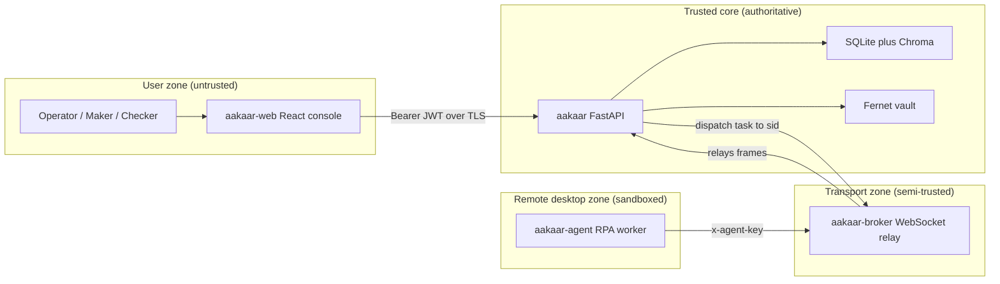
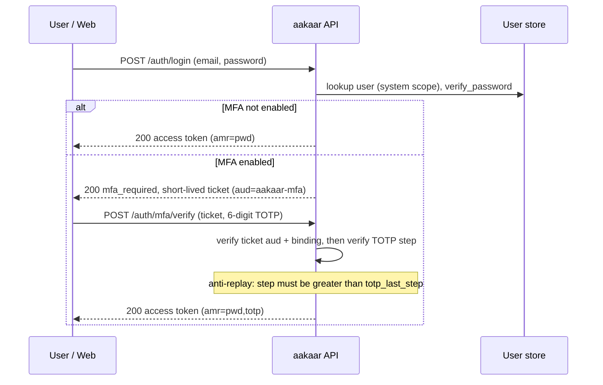
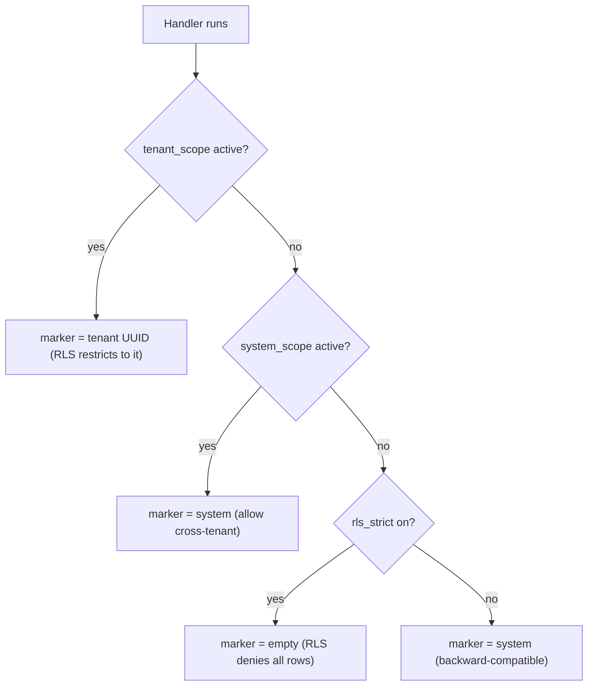
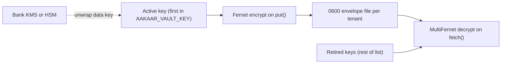
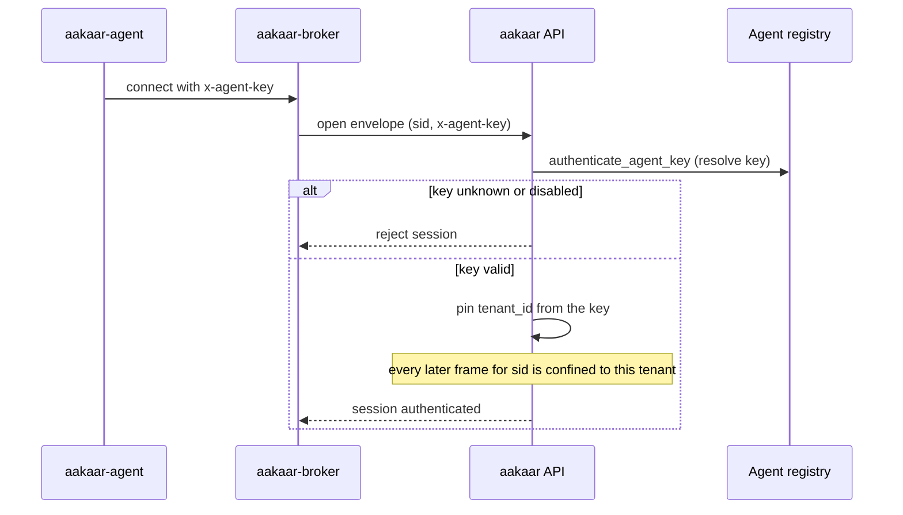

# Security Overview

> **In plain terms:** Aakaar automates back-office banking work (reconciliation, KYC checks, dispute handling) using software robots. This document explains, for a CISO or risk officer, who is allowed to do what, how identities are proven, how one bank's data is kept apart from another's, where secrets live, and how the "robot" workers are boxed in so a compromised one cannot run wild. The short version: every sensitive action is authenticated, scoped to a single tenant, recorded in a tamper-evident log, and — where it touches the outside world — sandboxed. The whole platform runs in-process with no third-party infrastructure (no Redis, no Postgres requirement, no cloud KMS), so it can live inside an air-gapped bank network.

This is a security overview for reviewers who need to assess Aakaar's control posture without reading the code. It covers the trust model, identity and access, tenant isolation, the secrets lifecycle, and the attack surface of the remote RPA agent and how it is contained.

---

## 1. Trust model and trust boundaries

Aakaar is a set of cooperating components. The security design assumes the **API is the only authoritative decision-maker**: it owns the database, verifies every identity, and is the single place where authorization is enforced. Everything outside the API is treated as semi-trusted (the web console, an operator) or untrusted-on-the-wire (the broker relay, a remote agent).

> **Key principle:** the broker and the agent transport never *grant* trust — they only *carry* frames. The API re-verifies identity and tenant on every connection and pins the result. A compromised relay can replay or forge within a session it already carries, but it can never cross a tenant boundary.

The diagram below shows the trust boundaries. Each dashed box is a boundary where data crosses from a less-trusted zone into a more-trusted one and is re-checked.

Trust-boundary topology — where identity is checked as data moves inward:

| Boundary crossing | What is verified at the boundary | Enforced by |
|---|---|---|
| Web console to API | RS256/HS256 JWT signature, expiry, audience; RBAC role | `verify_token` in `api/auth/jwt.py`, `require_*` deps |
| Agent to API (via broker) | Per-agent enrollment key resolved against the DB; tenant pinned to the key's tenant | `authenticate_agent_key` (`/ws/agents`) |
| Broker to API | Broker holds a single `AAKAAR_BROKER_TOKEN` master link; cannot fabricate a tenant | `api/routers/agents.py` pins `tenant_id` from the verified key |
| API to database | Tenant scope contextvar; optional Postgres Row-Level Security | `db/tenancy.py`, `db/session.py` |

---

## 2. Identity and access

### 2.1 Token issuance and signing

Access is carried by a JWT. Two signing modes share one code path (`api/auth/jwt.py`):

- **HS256** — a single shared secret. Fine for development and single-node air-gapped deployments.
- **RS256** — an RSA key pair from a `KeyStore` (`api/auth/keys.py`). The key id (`kid`) rides in the JWT header; the public half of *every* key is published at the JWKS endpoint (`/auth/.well-known/jwks.json`) so a key rotation can overlap without invalidating live tokens.

> **Algorithm pinning closes a whole class of attacks.** At verification time the algorithm is pinned by the server (`algorithms=[algorithm]`); the token's own `alg` header is never trusted. This defeats the `alg:none` downgrade and the HS/RS key-confusion attacks. The `kid` only selects *which public key to try* — it can never talk the verifier into a weaker algorithm.

The token claims are deliberately minimal: `sub` (user id), `tid` (tenant id, or the sentinel `superuser`), `role`, `amr` (authentication methods used, e.g. `["pwd","totp"]`), and standard `iat`/`exp`.

### 2.2 The login and MFA step-up flow

When a user has MFA enabled, password verification does **not** mint an access token. It mints a short-lived **step-up ticket** with a distinct audience (`aakaar-mfa`) that `verify_token` refuses to accept as an access token — so a captured ticket can never be replayed as a session. The ticket is also bound (`bnd`) to the user's current security state (password hash, status, TOTP secret), so it is invalidated the moment any of those change.

Login then MFA step-up — how a privileged session is established:

TOTP (RFC 6238) verification (`api/auth/totp.py`) hardens three things beyond a naive integration:

- **Anti-replay** — `verify_code` returns the matched time-step and refuses any step at or below the last accepted one, so a sniffed code cannot be reused inside its ~90-second window.
- **Recovery codes** — single-use, bcrypt-hashed backup codes so a lost authenticator does not mean a locked-out account.
- **Encryption at rest** — when `AAKAAR_MFA_ENCRYPTION_KEY` is set the stored TOTP secret is Fernet-encrypted (prefixed `enc:`).

### 2.3 OIDC / SSO (optional)

For banks with an existing IdP, `api/auth/oidc.py` implements a confidential authorization-code client with the hardenings a from-scratch implementation must not skip: **PKCE (S256)** binds the code to the browser; a **nonce** binds the `id_token` to this exact login; the `id_token` signature is verified against the IdP's JWKS with the algorithm pinned to an asymmetric allowlist (never `none`/HS); issuer, audience and required claims are checked; a **confused-deputy check** requires `userinfo.sub == id_token.sub`; and provisioning only trusts a **verified email**. State is single-use and TTL'd (`/auth/oidc/login`, `/auth/oidc/callback`).

### 2.4 RBAC

Three roles gate the API (`api/deps.py`): `superuser` (cross-tenant platform admin), `tenant_admin` (manages one tenant — users, retention, audit export), and `tenant_user` (runs workflows). FastAPI dependencies `require_superuser`, `require_tenant_admin`, and `require_tenant_user` are attached to routes so an under-privileged token is rejected before any handler logic runs.

| Role | Token `tid` | Representative permissions |
|---|---|---|
| `superuser` | `superuser` sentinel | manage tenants, verify/export any tenant's audit chain |
| `tenant_admin` | a tenant UUID | manage users, set retention/legal-hold, export own audit |
| `tenant_user` | a tenant UUID | author and run workflows, request approvals |

---

## 3. Tenant isolation

Multi-tenancy is enforced in two layers so a single missed check does not become a data leak.

**Layer 1 — application scoping (always on).** Every request handler must enter a `tenant_scope(tenant_id)` block before touching domain tables (`db/tenancy.py`). Repository functions read `current_tenant()` and refuse to run with no scope set. Switching tenants inside an active scope raises — that almost always means a leaked request context. A small set of legitimately cross-tenant paths (login lookup, scheduler, audit writes, superuser stats) run under an explicit `system_scope()`, which makes cross-tenant access *visible* rather than accidental.

**Layer 2 — Row-Level Security (optional, Postgres/Yugabyte).** When deployed on Postgres, the application scope is mirrored to a database GUC (`app.tenant_id`) that RLS policies read. With `rls_strict` on, a request with no scope set resolves the marker to `""`, which RLS treats as **deny-all** (fail-closed). SQLite has no RLS — there the contextvar is the only line of defense, which is acceptable for dev and single-tenant nodes.

How a tenant marker is resolved for each request:

---

## 4. Secrets lifecycle

Connector credentials (e.g. a core-banking API key used by a reconciliation workflow) live in a **local Fernet-encrypted vault** (`vault/local.py`), not in the database and never in logs.

- **At rest:** files are written with mode `0600` and replaced atomically. With a key configured, each entry is a Fernet envelope; without one, a startup warning is emitted, and setting `AAKAAR_VAULT_REQUIRE_ENCRYPTION=1` makes the vault **fail closed** rather than store plaintext.
- **Path safety:** `vault_ref` may contain slashes (mapped to subdirectories) but path traversal is rejected — a ref that escapes the tenant root raises.
- **Rotation:** `AAKAAR_VAULT_KEY` accepts comma-separated keys. The **first** key encrypts new writes; the rest stay valid for decryption (MultiFernet). Plaintext entries from before encryption was enabled remain readable and are re-encrypted on the next write. So a rotation is: prepend a new key, redeploy, let writes re-encrypt, then drop the old key.
- **Never logged:** the vault logs only the *ref* and the *names* of secrets — never values. Decryption errors are raised with `from None` so a traceback formatter cannot surface the decrypted bundle.

> **The KMS seam keeps the bank's root of trust outside Aakaar without adding infrastructure.** `LocalVault` no longer reads keys directly; it asks a pluggable `KeyProvider` (`vault/key_provider.py`). The default `LocalKeyProvider` reads `AAKAAR_VAULT_KEY`. The shipped `EnvelopeKeyProvider` scaffold shows envelope encryption: a data key encrypted by a master key that lives in the bank's HSM/KMS and never leaves it. The unwrap is a callable the integrator supplies — Aakaar imports no cloud SDK, so the seam stays inside the "plain-PyPI, no third-party infra" constraint.

How a vault entry is sealed and rotated:

---

## 5. The RPA-agent attack surface and how it is contained

The remote agent (`aakaar-agent`) is the highest-risk component: it runs on a desktop, drives real applications, and executes capabilities that touch files, networks, and processes. The design assumes the agent's host *can* be compromised and limits the blast radius.

| Risk | Containment |
|---|---|
| Stolen agent identity | Each agent has its own enrollment key, verified against the DB on every connect (`authenticate_agent_key`). The session's `tenant_id` is pinned to that key — an agent cannot claim another tenant. |
| Shell injection via a capability | `cap.shell_exec` takes an **argv list, never a shell string** (`shell=False` semantics); there is no shell to inject into, and the command must be allow-listed. |
| Server-side request forgery | Network capabilities apply SSRF guards before fetching a URL (blocking loopback/link-local/private targets). |
| Malicious archive (zip-slip / zip-bomb) | Archive-handling capabilities reject entries that escape the extraction root and refuse oversized/over-deep archives. |
| Side effects in dry-run | Capabilities carry a `side_effecting` flag; in `run.mode = dry_run` the orchestrator simulates them instead of performing them. |
| Sensitive data in recordings | The agent records its activity, and sensitive payload fields are redacted before persistence (the same redaction set the audit recorder uses). |

The capability layer is auto-discovered (~38 capabilities), and every side-effecting one is flagged so governance and dry-run can reason about it. The key point for a reviewer: **the agent cannot escalate beyond what its enrollment key authorizes, and it cannot perform a side-effecting action that the workflow's run mode and governance gates have not cleared.**

### The broker trust boundary

The broker (`aakaar-broker`) is a **stateless WebSocket rendezvous relay**. It pairs an agent with the API by identity, not by IP, and relays frames blindly. Crucially, **the broker is a trusted host, not a security control**: the `x-agent-key` header physically transits the broker, so a malicious broker operator could read it or forge `result`/`event` frames on a session it is already relaying.

> **What the broker cannot do is cross a tenant boundary.** The API pins each session — including its recorded events — to the `tenant_id` of the DB-verified key. So a compromised broker is confined to impersonating the agents whose sessions it already relays; it cannot reach into another tenant. The `AAKAAR_BROKER_TOKEN` (no default, fail-closed) only stops *outsiders* connecting a rogue master link. **Run the broker on hardware you control, behind TLS, on the same trust boundary as the API.** A per-agent pre-shared broker token / mutual-TLS scheme (so the enrollment key never transits the broker in clear) is a planned follow-up.

Agent connect — what the API re-verifies regardless of the broker:

---

## 6. Summary of controls for a reviewer

| Control area | Mechanism | Where |
|---|---|---|
| Authentication | RS256/JWKS or HS256 JWT, algorithm pinned | `api/auth/jwt.py`, `keys.py` |
| Step-up MFA | TOTP with anti-replay + recovery codes; distinct ticket audience | `api/auth/totp.py`, `api/routers/mfa.py` |
| Federation | OIDC PKCE + nonce + JWKS verify + verified-email gate | `api/auth/oidc.py` |
| Authorization | Three-role RBAC via FastAPI deps | `api/deps.py` |
| Tenant isolation | App-level `tenant_scope` + optional fail-closed RLS | `db/tenancy.py`, `db/session.py` |
| Secret confidentiality | Fernet vault, 0600 files, rotation, KMS seam | `vault/local.py`, `vault/key_provider.py` |
| Agent containment | Per-agent keys, argv-only shell, SSRF/zip guards, dry-run | `aakaar-agent`, `aakaar-capabilities` |
| Broker confinement | Tenant pinned by API; broker is a trusted-host, not a control | `aakaar-broker`, `api/routers/agents.py` |

For how every privileged action is recorded and how segregation of duties is enforced, see the **Compliance & Governance Guide**.
