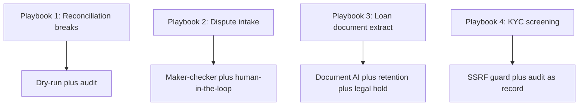
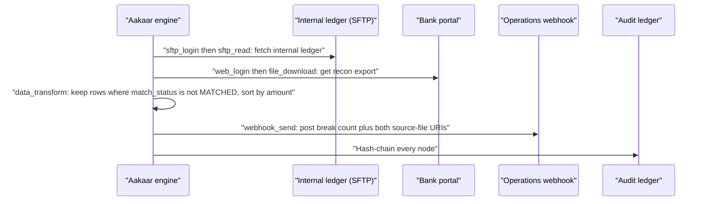
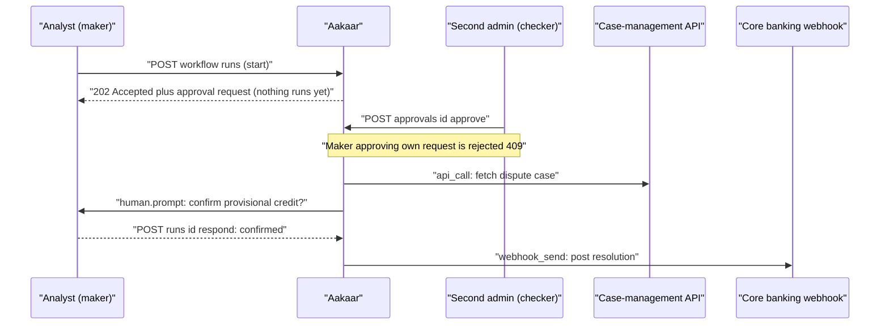
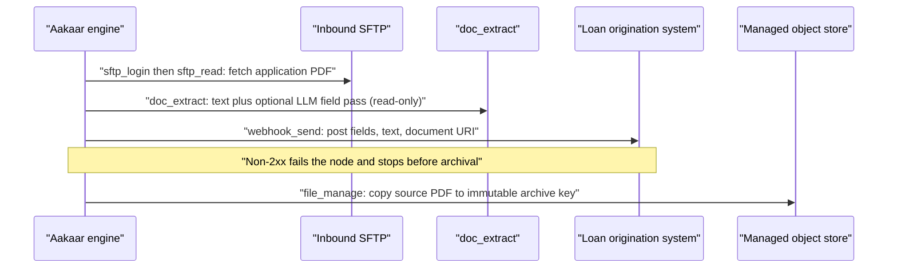
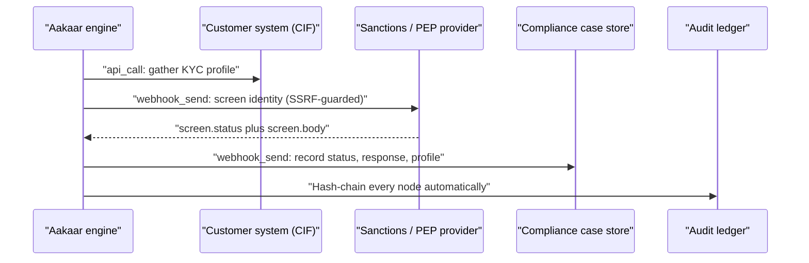

# Banking Solution Playbooks

## In plain terms

This document tells four short business stories. Each one takes a real, painful back-office job a bank does today by hand, and shows how Aakaar turns it into a governed, repeatable workflow — with a before/after, a picture of how the work flows, and the concrete outcome. These are not hypotheticals: all four ship as ready-to-run templates (`examples/05`–`08`). Read them as a menu of what the platform delivers on day one, and as a pattern you can copy for your own processes.

> The four playbooks were chosen because together they exercise every governance muscle Aakaar has: **dry-run** (rehearse safely), **maker-checker** (a second approver), **retention** (privacy without losing the audit trail), and the **tamper-evident audit** that underpins all of them.

How the four playbooks map to the platform features they showcase:

---

## Playbook 1 — Reconciliation breaks

*Template: `examples/05-recon-breaks`*

### The business problem

Every morning, operations must match the bank's **internal ledger** against the **bank statement / reconciliation export** and escalate the rows that did not match — the *breaks*. Done by hand, it means two analysts, two spreadsheets, a VLOOKUP, and a manually written email. It is slow, it is the day's bottleneck, and when a break is missed it can mean a real cash difference no one catches until month-end.

### Before and after

| | Before | After |
|---|--------|-------|
| **Effort** | Two analysts, ~60–90 min each morning | Unattended run, minutes |
| **Consistency** | Filter logic lives in someone's head | Deterministic transform, identical every day |
| **Evidence** | An email with a spreadsheet attached | Break file + both source files, linked as evidence, in a sealed audit chain |
| **Escalation** | Manual, sometimes forgotten | Automatic webhook to operations |

### How the work flows

The recon run, end to end:

### Features it showcases

- **Dry-run** — the fetch, download, transform, and webhook steps are simulated when started with `"mode": "dry_run"`, so the wiring can be validated against a new bank portal without moving a single file.
- **Tamper-evident audit** — every node is hash-chained; prove the recon ran untampered with `GET /audit/verify` and hand an examiner the full chain via `GET /audit/export`.
- **SSRF guard** — the outbound `cap.webhook_send` blocks any target resolving to an internal/loopback address by default.

### Outcome

The day's most tedious bottleneck becomes an unattended run that finishes before the desk opens, escalates breaks automatically with evidence attached, and produces its own provable record. The matching logic is now reproducible and reviewable instead of trapped in a spreadsheet.

---

## Playbook 2 — Dispute intake (maker-checker)

*Template: `examples/06-dispute-intake`*

### The business problem

A card-dispute case arrives. Before the bank issues a **provisional credit** to the customer, an analyst should confirm it, and — because it moves money — a *second* person should sign off. In many shops this control is a policy on paper, enforced by trust and a Slack message. That is exactly the kind of gap auditors flag.

### Before and after

| | Before | After |
|---|--------|-------|
| **Second approval** | Policy on paper, easy to bypass | System-enforced gate; run does not start without a second admin |
| **Self-approval** | Possible if no one is watching | Blocked outright (segregation of duties) |
| **Analyst confirmation** | Verbal / email | An in-flight prompt the analyst answers in the run console |
| **Record** | Scattered | Gate decision, run-start, and every node hash-chained |

### How the work flows

This playbook has **two** governance layers — a maker-checker gate before the run, and a human confirmation inside it:

### Features it showcases

- **Maker-checker** — the headline. Because the workflow carries `requires_approval: true` and `sensitivity: "elevated"`, starting a run returns **`202 Accepted`** with an approval request instead of launching. A *different* admin must call `POST /approvals/{id}/approve` (which both records the decision and starts the run); the maker approving their own request is rejected with `409`. The same two fields also gate *publishing* a new version.
- **Human-in-the-loop** — the `human.prompt` node pauses the run for the analyst's confirmation, surfaced in the console; their answer flows downstream.
- **Tamper-evident audit** — the gate decision, the run-start, and every node are hash-chained and verifiable.

### Outcome

A money-moving control that used to depend on discipline is now structurally impossible to skip. Two distinct people are provably in the loop on every provisional credit, and the whole chain — request, approval, analyst confirmation, posting — is sealed for the auditor.

---

## Playbook 3 — Loan document extract → validate → archive

*Template: `examples/07-loan-document-extract`*

### The business problem

A loan application arrives as a **PDF**. Someone has to open it, read out the applicant name, PAN, loan amount, and property value, type them into the origination system, and file the document somewhere it won't get lost. It is slow, error-prone keying, and the filed copy is often just a blob no one governs.

### Before and after

| | Before | After |
|---|--------|-------|
| **Extraction** | Manual reading and re-keying | `cap.doc_extract` pulls text and (with an LLM configured) structured fields |
| **Validation** | Eyeballed | Delegated to the origination system's own rules; a non-2xx stops the run before archival |
| **Archival** | Ad-hoc file share | Immutable object-store key, a *governed* resource under retention |
| **Privacy** | Hard to honour erasure | Right-to-erasure and legal-hold supported — without ever erasing the audit trail |

### How the work flows

Fetch, extract, validate, then archive — in strict order:

### Features it showcases

- **Document AI, read-only** — `cap.doc_extract` returns the document text; when a model is configured it adds a structured-field pass under `${extract.extracted}`, and degrades gracefully to text-only when no LLM is present. Nothing is written by this node — extraction cannot mutate the source.
- **Dry-run** — the side-effecting nodes (fetch, extract, validate, archive) are simulated, so the flow can be rehearsed without contacting or writing to the real origination system.
- **Retention and legal hold** — the archived application is a governed `stored_object` and the run is a `run` — the two erasable resource types. Set a TTL with `PUT /retention/policies/stored_object`, freeze a document under investigation with `POST /retention/legal-hold`, or honour erasure with `POST /retention/erase`. The archive is a governed record, not an orphaned blob.
- **Tamper-evident audit** — extraction and archival are hash-chained.

### Outcome

Re-keying disappears, validation is owned by the system that holds the business rules, and the filed document becomes a first-class governed record — discoverable, retainable, and erasable on request — while the audit trail of *what was processed* survives any erasure.

---

## Playbook 4 — KYC sanctions / PEP screening and record

*Template: `examples/08-kyc-check`*

### The business problem

When onboarding a customer, the bank must screen them against **sanctions and PEP** lists and keep a record of the outcome. The screening provider is often a sensitive endpoint — sometimes on the internal network — and the *proof* that screening happened must survive even if the downstream case store is later edited.

### Before and after

| | Before | After |
|---|--------|-------|
| **Screening** | Manual lookup, copy-paste result | `cap.webhook_send` posts the identity, returns status and body |
| **Internal endpoints** | Risk of misrouting to internal services | SSRF guard blocks private addresses unless the exact host is allow-listed |
| **Proof** | Trust the case-store record | Hash-chained ledger is the independent source of truth for what the platform did |

### How the work flows

Gather, screen, then record — with the audit ledger as the durable proof:

### Features it showcases

- **SSRF guard** — both outbound calls go through SSRF-guarded capabilities that **block private / loopback / link-local targets by default**. To reach an internal provider, name its exact host in `allow_hosts` on the node; everything else private stays blocked.
- **Tamper-evident audit as the record** — beyond the explicit `record` webhook to the case store, the platform writes *every* node to a hash-chained ledger. So the screening is provable even if the downstream store is later edited — `GET /audit/verify` recomputes the chain and `GET /audit/export` streams it for an examiner or SIEM.
- **Dry-run** — simulates the calls so the topology can be rehearsed without contacting the live provider.
- **Retention** — each run is an erasable `run` resource (`PUT /retention/policies/run`, `POST /retention/legal-hold`).

### Outcome

Screening becomes consistent and unattended, internal-network targets are reachable only when explicitly allow-listed, and the *proof of screening* lives in an independent, tamper-evident chain — exactly the evidence a regulator wants, and exactly the evidence that does not evaporate if a case record is edited.

---

## Choosing a playbook

| If your pain is... | Start with | Lead feature |
|--------------------|-----------|--------------|
| Daily matching / break escalation | Playbook 1 (Recon) | Dry-run + audit |
| Money-moving actions needing a second sign-off | Playbook 2 (Dispute) | Maker-checker |
| Document keying and governed archival | Playbook 3 (Loan) | Document AI + retention |
| Compliance screening with provable records | Playbook 4 (KYC) | SSRF guard + audit-as-record |

> Each template ships with its README, a `workflow.json` you can import, and the exact one-time capability grants a tenant admin sets up. They are starting points: change the URLs, the filter column, or the archive key, and the same governed pattern is yours. For any term used above, see the **Glossary & Concepts**.
