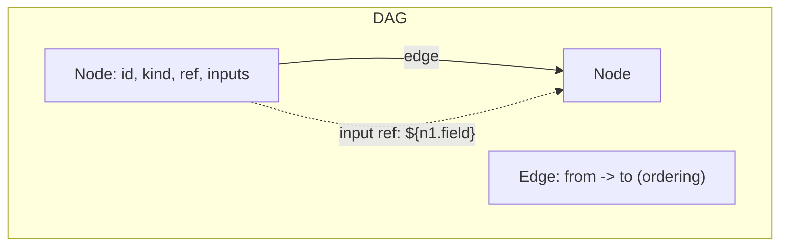
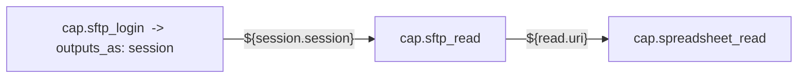
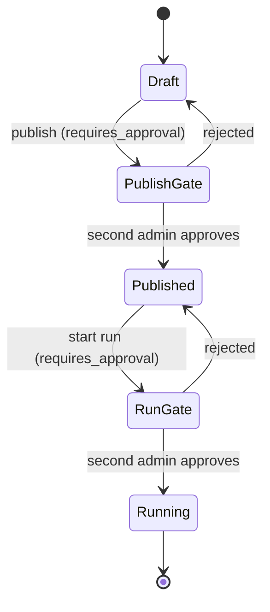
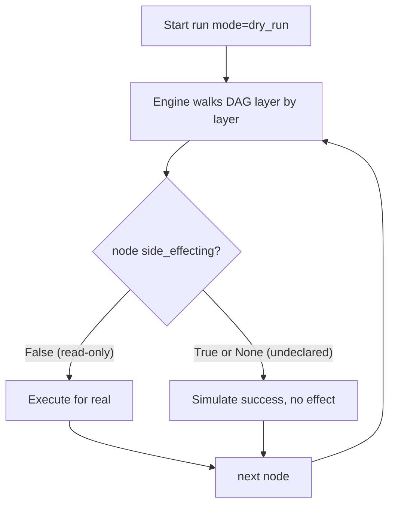
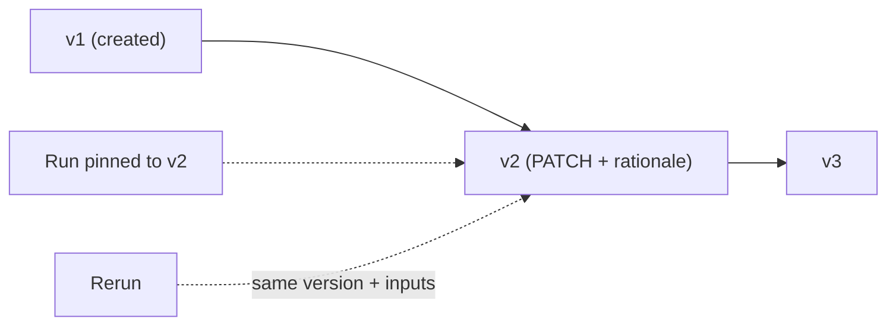
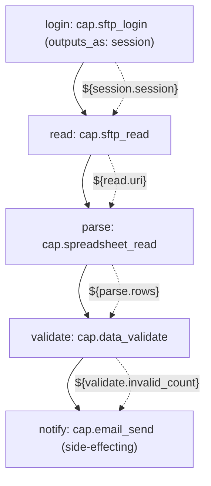
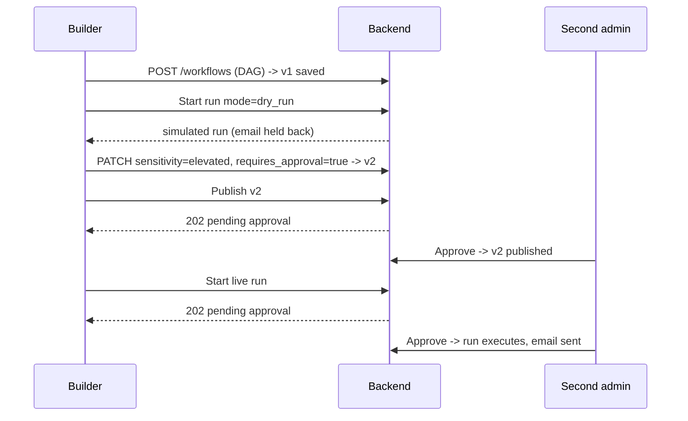

# Workflow Authoring Guide

In plain terms: a workflow is a recipe. You list the steps, say which step's output feeds which step's input, mark the dangerous steps so a human has to sign off, and the platform runs the recipe for you — safely, repeatably, and with a full record of what happened. This guide shows how a builder turns a plain-language intent ("reconcile yesterday's settlement file") into a governed, versioned workflow the engine can execute.

You do not need to write code. A workflow is plain data — a small JSON graph of nodes and edges. This guide explains that data model, how to wire steps together, how to pause for a human, how to mark a workflow sensitive so it is gated, how to rehearse it with dry-run, and how versioning works. It ends with a complete recon example built step by step.

## The DAG model

A workflow is a **DAG** — a directed acyclic graph. It is the single source of truth for what the workflow does: the engine walks it, the planner produces it, and nothing else in the system has its own opinion about workflow shape.



### Nodes

Every step is a **node**. A node has:

| Field | Meaning |
| --- | --- |
| `id` | Unique handle within the DAG (e.g. `fetch`, `n3`). Must match `^[a-zA-Z_][a-zA-Z0-9_]{0,63}$`. |
| `kind` | `capability`, `action`, or `control`. |
| `ref` | What the node *is*: a capability (`cap.*`), an action (`browser.navigate`), or a control (`control.branch`, `human.prompt`). |
| `inputs` | A dict of configuration and references — never live secrets. |
| `outputs_as` | Optional alias for this node's outputs (e.g. `session`) so downstream refs read `${session.handle}` instead of `${n1.handle}`. |
| `retry` | Optional per-node retry policy (`max_attempts`, `backoff_ms`). Control nodes are never retried. |
| `target` | Optional placement: `server` (default, the API host) or a remote-agent selector (`pool:kiosk`, an agent alias). |

Three node kinds, three jobs:

| Kind | What it is | Examples |
| --- | --- | --- |
| `capability` | A tenant-granted, credential-owning macro. | `cap.sftp_login`, `cap.email_send` |
| `action` | A generic, credential-free primitive. | `browser.navigate`, `http.request` |
| `control` | Flow control the interpreter understands directly. | `control.branch`, `control.for_each`, `control.wait`, `human.prompt` |

### Edges

An **edge** (`{ "from": "a", "to": "b" }`) declares ordering: `b` runs after `a`. The engine executes the DAG **layer by layer** — all nodes whose dependencies are satisfied run together, then the next layer. Edges give you the topology; data flow is separate (see refs below).

### Refs — wiring outputs to inputs

This is the heart of authoring. One node's output flows into another node's input through a `${...}` reference string, **without the value ever passing through the planner or the LLM**.

| Form | Means |
| --- | --- |
| `${alias}` | The entire output object of `alias`. |
| `${alias.field}` | One named output field. |
| `${alias.field.sub}` | A nested field; the resolver walks the path at run time. |

Two rules to internalise:

- `alias` is the upstream node's `id` (or its `outputs_as` if set).
- A ref must be the **entire** string. Embedding like `"file-${n1.name}.csv"` is intentionally unsupported — use a dedicated `string.format` action node when you need templating. This keeps every data path machine-validatable.



### Inputs (run-time parameters)

Run inputs are values supplied when the workflow is *started*, not baked into the DAG — for example `as_of_date` or `mailbox`. They arrive in the run environment and are referenced the same way as node outputs. Keeping them out of the DAG is what lets you reuse one published workflow for every day's file.

## Human-in-the-loop nodes

When a step needs a person — a judgment call, a four-eyes confirmation, a manual exception — use a control node:

| Control ref | Purpose |
| --- | --- |
| `human.prompt` | Pause the run and wait for a person to respond. The run blocks (with an SLA timer, escalation, and expiry) until someone answers via the console's Runs page (`POST /runs/{id}/respond`). |
| `control.wait` | Pause for a fixed duration. |
| `control.branch` | Take one path or another based on a condition. |
| `control.for_each` | Fan a sub-flow out over a collection. |

A `human.prompt` node turns an automation into a governed, supervised process: the engine durably checkpoints, the operator sees the prompt in **Runs**, answers it, and the run resumes exactly where it paused. Control nodes always run on the server and are never retried — pausing for a human is not a transient failure.

> Human-in-the-loop is *per-run* supervision (a person answering a question mid-flight). Maker-checker gating (next section) is *per-launch* authorization (a second admin approving that the run may start at all). A sensitive workflow often uses both.

## Marking a workflow gated

Two properties on the workflow decide whether it is subject to maker-checker governance:

| Property | Values | Effect |
| --- | --- | --- |
| `sensitivity` | `normal` (default) or `elevated` | `elevated` marks money-moving / high-risk workflows. |
| `requires_approval` | `false` (default) or `true` | When true, **publishing** the workflow and **starting** a run are gated. |

When a gated workflow is published or run-started, the API does **not** act immediately — it returns `202 Accepted` and opens an `ApprovalRequest`. A *different* tenant admin must approve it on the **Approvals** page before the action proceeds; the maker cannot approve their own request. The governance layer may auto-set `requires_approval` for elevated workflows.

State diagram: how sensitivity and approval shape a gated launch.



## Testing with dry-run

Before publishing or trusting a sensitive workflow, **rehearse it**. Every run carries a `mode`: `live` (default) or `dry_run`. In a dry-run the engine executes the full DAG topology but **simulates side-effecting capabilities** (sends, writes, uploads, transfers, money movement) to a fake success, while read-only steps (scrapes, reads, validations) run for real.



What you get from a dry-run: a real run record, real outputs from the read side, a complete audit entry — and zero irreversible effects. Note the conservative default: a capability that *forgot* to declare `side_effecting` is treated as side-effecting and simulated, so a rehearsal can never move money by accident.

## Versioning

Workflows are versioned, not overwritten. Creating a workflow (`POST /workflows`) saves version 1; each `PATCH /workflows/{id}` with a new DAG saves a new version with an optional `rationale`. The workflow service assigns `id` and `version` — the DAG you author leaves them as zeros and the service overwrites on save. Sensitivity is snapshotted per version, so the gate that applied to v3 is preserved even after v4 lands. A run can be **pinned** to a specific version (`version` on run-start), and a rerun is pinned to its source run's version and inputs — so "rerun yesterday's recon" is always reproducible.



## Worked example: a small reconciliation workflow

Intent: *"Each morning, pull the overnight settlement CSV from the counterparty's SFTP, check every row against our schema, and email the operations team the result."* This is a money-adjacent process, so we mark it elevated and gated.

### Step 1 — pick the bricks

Reading the catalog, we choose: `cap.sftp_login` (authenticate) → `cap.sftp_read` (fetch the file) → `cap.spreadsheet_read` (parse rows) → `cap.data_validate` (check the schema) → `cap.email_send` (notify ops). The login and parse/validate steps are read-only; only the email send is side-effecting.

### Step 2 — wire the outputs into inputs

- `cap.sftp_login` returns `{ session, host }`; we alias it `session` so downstream nodes read `${session.session}`.
- `cap.sftp_read` returns `{ uri, filename, size }`; the parser consumes `${read.uri}`.
- `cap.spreadsheet_read` returns `{ columns, rows, row_count, ... }`; the validator consumes `${parse.rows}`.
- `cap.data_validate` returns `{ valid, invalid_count, errors, ... }`; the email body references `${validate.valid}` and `${validate.invalid_count}`.

### Step 3 — the DAG as a flowchart

Flowchart of the recon workflow showing both ordering edges and data refs.



### Step 4 — the DAG as JSON

This is the actual payload you would `POST /workflows`. The service stamps `id` and `version`; you supply nodes and edges. Note that `account_alias` and `remote_path` come from run inputs or grant defaults, and no credential ever appears in the graph.

```json
{
  "name": "Overnight settlement recon",
  "description": "Fetch and validate the counterparty settlement CSV, then notify ops.",
  "dag": {
    "nodes": [
      {
        "id": "login",
        "kind": "capability",
        "ref": "cap.sftp_login",
        "outputs_as": "session",
        "inputs": { "account_alias": "counterparty_sftp" }
      },
      {
        "id": "read",
        "kind": "capability",
        "ref": "cap.sftp_read",
        "inputs": {
          "session": "${session.session}",
          "remote_path": "/outbound/settlement.csv"
        }
      },
      {
        "id": "parse",
        "kind": "capability",
        "ref": "cap.spreadsheet_read",
        "inputs": {
          "source": "${read.uri}",
          "source_format": "csv",
          "has_header": true
        }
      },
      {
        "id": "validate",
        "kind": "capability",
        "ref": "cap.data_validate",
        "inputs": {
          "rows": "${parse.rows}",
          "schema": [
            { "field": "txn_id", "type": "string", "required": true },
            { "field": "amount", "type": "number", "required": true }
          ]
        }
      },
      {
        "id": "notify",
        "kind": "capability",
        "ref": "cap.email_send",
        "inputs": {
          "account_alias": "ops_smtp",
          "to": ["ops@bank.example"],
          "subject": "Settlement recon result",
          "body": "Recon complete. Invalid rows: ${validate.invalid_count}."
        }
      }
    ],
    "edges": [
      { "from": "login", "to": "read" },
      { "from": "read", "to": "parse" },
      { "from": "parse", "to": "validate" },
      { "from": "validate", "to": "notify" }
    ]
  }
}
```

### Step 5 — rehearse, then gate, then publish

1. **Dry-run it.** Start a run with `mode: dry_run`. Login, read, parse and validate execute for real (read-only), and you see the real validation result; `cap.email_send` is simulated, so ops gets nothing yet. Confirm the validation behaves as expected.
2. **Mark it gated.** Because it touches settlement data, set `sensitivity: elevated` and `requires_approval: true`. Now publishing and live run-starts open an approval for a second admin.
3. **Publish.** The publish returns `202`; a different admin approves on the Approvals page, and the version goes live.
4. **Run it live.** A live run-start also opens an approval; once approved, the workflow runs, and the email actually sends. The whole thing is recorded in the tamper-evident audit ledger.

Sequence diagram: authoring through to the first governed live run.



## Authoring checklist

- Every node `id` is unique; every ref resolves to a granted capability, a known action, or a control.
- Data flows via `${alias.field}` refs that occupy the *whole* string; ordering flows via edges.
- A person-in-the-loop step uses `human.prompt`; a launch that needs sign-off uses `sensitivity` + `requires_approval`.
- You dry-ran it before trusting it, and the side-effecting steps were held back as expected.
- The change is a new version with a `rationale`, and sensitive runs are pinnable and reproducible.

## Where this fits

The bricks you compose here are catalogued in the Capabilities & Catalog doc; the engine that walks the DAG layer-by-layer with durable checkpoints is in the Backend & API component; the maker-checker gate you trip by marking a workflow elevated is operated from the Approvals page in the Web Console.
