# Aakar data flow: NL instruction → action

End-to-end path of a user request, from natural language in the chat panel
to a real activity executing on a Playwright browser session.

## Diagram

```mermaid
flowchart TD
    U([user types in chat]) --> CHAT[POST /chat<br/>aakar/api/routers/chat.py]
    CHAT -->|auth → User → tenant_id<br/>grants_repo.list_granted_refs| PLAN[PlannerService.plan]

    PLAN --> PB[PromptBuilder<br/>system prompt:<br/>hard rules + envelope schema +<br/>DAG shape + GRANTED capabilities +<br/>actions + controls<br/>+ current DAG if editing]
    PB --> LLM[OpenAILLMClient.complete_planner<br/>JSON-mode call to gpt-4.1-mini]
    LLM --> VAL[Pydantic-validate response<br/>into PlannerCompletion]

    VAL --> KIND{kind?}
    KIND -->|dag| DAG_OUT[DAG validated<br/>against ref-ability +<br/>$&#123;ref&#125; sanity]
    KIND -->|clarify| CLAR[questions back to chat UI]
    KIND -->|missing| MISS[needed refs back to chat UI]

    DAG_OUT -->|user keeps the DAG| SAVE[POST /workflows<br/>WorkflowVersion row, dag JSON]
    SAVE -->|user clicks Run| RUN[POST /workflows/&#123;id&#125;/runs]
    RUN --> ORCH[RunOrchestrator.start<br/>create Run row queued<br/>DbEventRecorder<br/>dispatch to Executor]
    ORCH --> EXEC[LocalExecutor walks DAG<br/>topologically]

    EXEC --> NODE[for each node:<br/>1. resolve $&#123;ref&#125; inputs<br/>2. lookup activity in ActivityRegistry<br/>3. build ActivityContext<br/>4. await activity ctx, inputs<br/>5. record started/finished/failed<br/>6. stash outputs under node.id or outputs_as]

    NODE --> ACT{activity kind}
    ACT -->|capability handler| CAP[fetch_credentials → vault<br/>drive browser.* on Playwright<br/>session from BrowserPool]
    ACT -->|action primitive| PRIM[direct Playwright /<br/>HTTP / file / storage call]
    ACT -->|control| CTRL[e.g. human.prompt:<br/>SignalHub.wait — run pauses<br/>until UI POSTs /runs/&#123;id&#125;/respond]

    CAP --> DONE[Run row updated<br/>succeeded / failed]
    PRIM --> DONE
    CTRL --> DONE
    DONE --> STREAM[events streamed to UI<br/>via /runs/&#123;id&#125;]
```

## Five guarantees baked into this spine

1. **The LLM only emits a DAG.** It never executes anything. Bright line
   between "planning" and "doing".
2. **The LLM only sees granted refs.** Ungranted capabilities never appear
   in the prompt, so the model cannot invent unauthorized work. Action
   primitives are universal.
3. **No credentials cross the chat boundary.** Capabilities declare secret
   *names*; tenant admins (or superusers) supply values via grants → vault.
   The planner is forbidden by prompt to ask for them.
4. **Outputs flow only by `${ref}`.** Live data never sits in the DAG JSON
   — only literal config and references. This is what makes the same DAG
   portable across runs.
5. **The Executor is generic.** It walks any DAG; capabilities, actions,
   and controls are all just registered async functions. v1 ships
   `LocalExecutor`; a `TemporalExecutor` can drop in without changing the
   spine.

## Concrete trace

> "Log into `https://app.payops.test/login` using the primary account,
> wait for the reports section to render (`section.reports`), then
> download the file via `a#latest-report`."

- Planner emits a DAG: `cap.web_login` → `cap.file_download`.
  - `cap.web_login` inputs: `account_alias=primary`,
    `login_url=https://app.payops.test/login`,
    `success_selector=section.reports`. Output alias: `login`.
  - `cap.file_download` inputs: `session=${login.session}`,
    `trigger_selector=a#latest-report`, `wait_for=section.reports`.
- On run:
  - `cap.web_login` fetches the stored username/password from the vault
    (via `fetch_credentials(ctx, capability_ref, account_alias)`),
    drives the login form on a Playwright session
    (`navigate → wait_for → fill × 2 → click → wait_for(success_selector)`),
    and returns the session id. Credentials never enter the DAG env.
  - `cap.file_download` looks up the session, waits on the report list,
    triggers the download, and persists the bytes to managed storage
    under `runs/{run_id}/downloads/...`. Returns `{uri, filename}`.
- The orchestrator's run-end cleanup releases the browser checkout even
  if a downstream step fails.

Capabilities currently in the registry: `cap.web_login`,
`cap.file_download`, `cap.file_upload`, `cap.example_login`. All have
real handlers and per-capability integration tests that drive them
through `LocalExecutor` against `FakeBrowserSession` + `LocalVault` +
`LocalFsObjectStore`.
