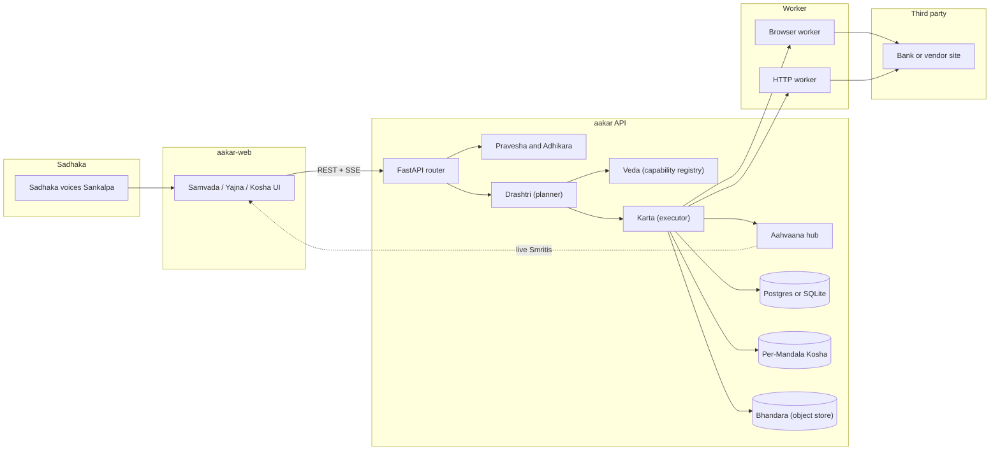
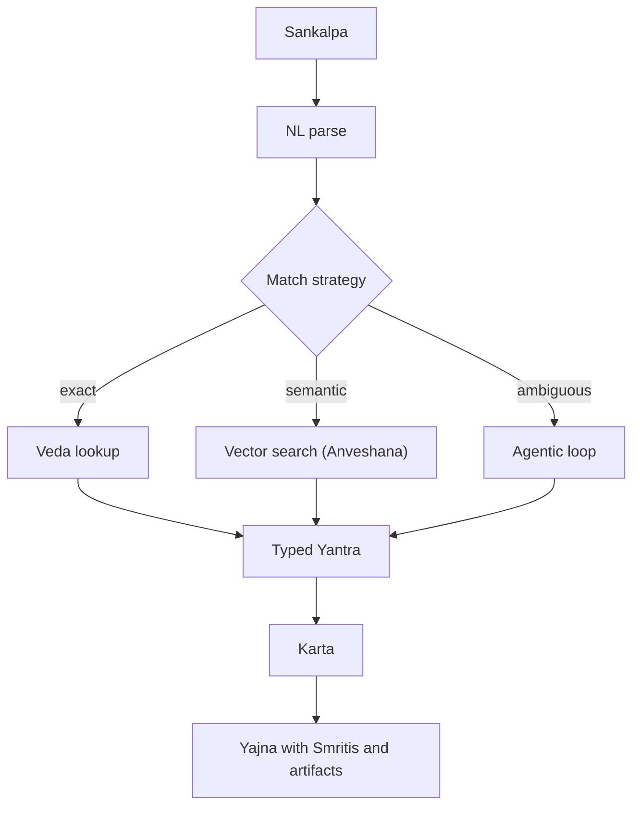
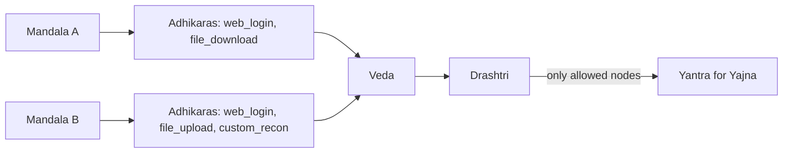
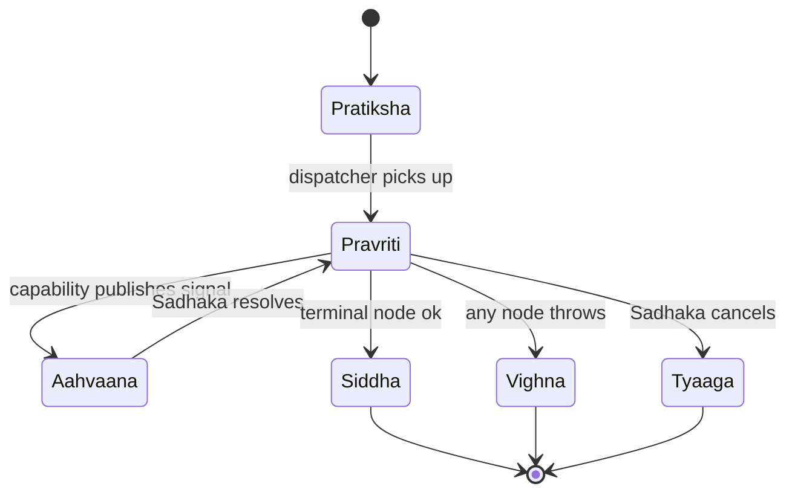

# Aakar — High-Level Design (v1)

> Aakar is the gurukul in which the Pracharya (principal / superuser) inscribes Mandalas (tenants) — named beings such as Aarya — each one given a dharma (purpose), a set of Adhikaras (grants), and a body of attendant Sadhakas (users) who speak Sankalpas (intents) and witness Yajnas (runs). This document describes the v1 system: what it is, where its boundaries lie, the stable architectural spine, and the trade-offs behind the major decisions.

---

## 1. What Aakar is

Aakar is a multi-tenant workflow automation platform. A Sadhaka voices a Sankalpa in plain English ("log into the NBBL portal and download the Open Disputes report for cycle C02"); the system compiles that Sankalpa into a typed Yantra (DAG) of pre-approved Vidyas (capabilities); and a worker enacts the Yantra against the real third-party site or API while streaming live screenshots, Smritis (events), and artifacts back to the UI.

The product is opinionated about three things:

1. **The Drashtri (planner) never invents Vidyas.** It can only emit nodes from the registered catalog. Anything outside the catalog is reported as a Missing Adhikara, not faked.
2. **Every Yajna is auditable.** Each node, Aahvaana (signal), screenshot, file artifact, and human decision is persisted with a Mandala-scoped run id; the Sakshi (audit log) preserves the witness.
3. **Humans stay in the loop where it matters.** Captchas, ambiguous selectors, and OTPs are surfaced through a single Aahvaana primitive instead of bypassed.

## 2. Roles (who is who)

| Aakar today | Mythic name | Surface | Responsibility |
| --- | --- | --- | --- |
| superuser / platform admin | **Pracharya** | superuser routes in aakar-web | Inscribes Mandalas, registers Vidyas, manages the global Veda (registry). |
| tenant_admin | **Acharya** | aakar-web (within a Mandala) | Initiates Sadhakas, manages Kosha (vault) and Adhikaras, views all Yajnas in the Mandala. |
| tenant_user | **Sadhaka** | aakar-web (Samvada / Yajnas) | Voices Sankalpas, approves clarifications, answers Aahvaanas, retrieves artifacts. |

A single Aakar deployment serves many Mandalas. Mandala isolation is enforced at the database row, Kosha path, and object-store URI levels.

## 3. System overview

## 4. Architectural spine

These five constraints are load-bearing. Anything else can change without breaking v1.

1. **Yantra-only Drashtri.** The Drashtri emits a typed Yantra (DAG) made of registered Vidya nodes. Free-form code generation is forbidden.
2. **Generic Karta.** The Karta (executor) walks any valid Yantra. It does not know about specific banks or sites. New behavior is added by registering new Vidyas, not by editing the Karta.
3. **Registry split (Veda).** Vidyas (capabilities), Kriyas (actions), and Lakshanas (controls / selectors) are three separate tables. Each layer evolves independently.
4. **Session pinning.** Once a Yajna binds to a specific browser session, every subsequent node in that Yajna runs in the same browser context until explicit logout or Yajna end.
5. **Three-way Drashtri.** A Yajna can hit the Veda three ways: exact match, semantic search over a FAISS / pgvector index, and an agentic loop (the Drashtri-with-eyes) when the Sankalpa is ambiguous.

## 5. Core concepts

- **Vidya (capability).** A named, typed, human-reviewed unit of work. Example: `cap.web_login`, `cap.file_download`, `cap.file_upload`. Each Vidya declares its inputs, outputs, Aahvaanas, and the Kriyas it composes.
- **Kriya (action).** A primitive the Karta knows how to perform. Examples: `browser.set_field`, `browser.click_by_text`, `time.now`, `file.read_local`, `http.request`.
- **Lakshana (control).** A reusable selector or wait condition associated with a Vidya or site. Lakshanas are kept separate so a UI redesign on the third party only touches one row.
- **Sutra (workflow).** A persisted, named Yantra ready to be performed again and again. Sutras are versioned (Paatha — the recension).
- **Yajna (run).** A single performance of a Yantra. Has an Avastha (status) lifecycle (Pratiksha → Pravriti → Aahvaana → Siddha | Vighna | Tyaaga), a Mandala scope, and a tree of Smritis and artifacts.
- **Aahvaana (signal).** A typed pause. The Karta publishes an Aahvaana (`captcha`, `picker`, `otp`, `confirm`) and waits for a Sadhaka — or another system — to resolve it via the Aahvaana hub.

## 6. Multi-Mandala model

Every persistent row carries a `mandala_id` (on the wire still `tenant_id`). The Kosha, Bhandara, and FAISS index are partitioned by Mandala. Adhikaras (grants) gate which Vidyas a Mandala — and a Sadhaka within that Mandala — can invoke.

A Sadhaka from Mandala A can never plan or perform a Vidya that Mandala A has not been granted, even if the model tries to emit it. The check runs both at plan-time (filter the Veda before the model sees it) and at Yajna-time (refuse to dispatch a node whose Vidya is not granted).

## 7. Pravesha (login) and Adhikara (RBAC)

Aakar uses bcrypt-hashed passwords and HS256 JWTs. Tokens are stored in `sessionStorage` (per tab) so opening a second tab as a different Sadhaka does not stomp the first tab's session.

Roles in v1:

| Role (code) | Mythic | Scope | Can |
| --- | --- | --- | --- |
| `superuser` | **Pracharya** | Platform | Everything across Mandalas. |
| `tenant_admin` | **Acharya** | One Mandala | Initiate Sadhakas, manage Kosha entries; view all Yajnas in the Mandala. |
| `tenant_user` | **Sadhaka** | One Mandala | Voice Sankalpas, drive Yajnas, view own Yajnas and shared Yajnas. |

Pravesha, Nirgama (logout), and refresh all go through the `aakar API`. The frontend never talks to the database directly.

## 8. Yajna lifecycle and HITL

A Yajna progresses through a small state machine. Sanskrit primary, English in parens:

The `Aahvaana` state is the human-in-the-loop primitive. A Vidya that hits a captcha publishes a `captcha` Aahvaana carrying a screenshot and a free-form description. The UI renders the screenshot, asks the Sadhaka to type the answer, and posts the resolution back. The Karta resumes the same Yantra node from where it paused. No code path silently bypasses a captcha.

## 9. Tech stack snapshot

| Layer | Choice | Reason |
| --- | --- | --- |
| Backend language | Python 3.12 | Pydantic v2 + FastAPI + Playwright + OpenAI SDK align here. |
| API framework | FastAPI | Typed request and response models, async, OpenAPI for free. |
| ORM | SQLAlchemy 2 + Alembic | Mature migrations, supports SQLite and Postgres backends. |
| Database (v1) | SQLite for local, Yugabyte (Postgres-wire) for cloud | Same SQL surface in both environments. |
| Vector index | FAISS on SQLite, pgvector on Yugabyte | Avoids running a separate vector DB. |
| Bhandara (object store) | Filesystem | No S3 in v1. Path layout already namespaces by Mandala or Yajna. |
| Browser worker | Playwright headless Chromium | Robust selectors, screenshotting, file dialog support. |
| LLM (Drashtri) | OpenAI Chat Completions | Strict JSON mode for Yantra emission. |
| Frontend | Vite + React 18 + TypeScript | Fast dev loop, low ceremony. |
| Frontend data | TanStack Query | Cache plus revalidation; pairs cleanly with REST. |
| Frontend graph | xyflow + dagre | Yantra layout for plan view and Yajna view. |
| Pravesha | bcrypt + HS256 JWT | Self-contained; no SSO dependency in v1. |

## 10. Key trade-offs

- **No Temporal in v1.** The Karta Protocol is designed so that a `LocalKarta` (in-process, threadpool-backed) can be swapped for a `TemporalKarta` later without touching Drashtri or Vidya code. v1 ships LocalKarta.
- **Per-Yajna browsers.** A fresh Chromium context per Yajna is slower to start (about 1.5 to 3 seconds) but eliminates a whole class of cross-Mandala cookie and storage bugs. A warm pool is on the roadmap, gated behind isolation guarantees.
- **No cron in v1.** Yajnas are Sadhaka-initiated. Adding cron without a queue, dead-letter handling, and quotas would be a footgun.
- **Filesystem Bhandara.** S3 is on the roadmap. Switching is a single adapter change because every artifact is referenced by URI.
- **Permissive email regex, bcrypt direct.** Pydantic `EmailStr` and `passlib` were both swapped out after upstream pain. The current shapes are deliberate; do not "modernize" them.

## 11. Failure modes and guardrails

| Failure | Detection | Mitigation |
| --- | --- | --- |
| Drashtri emits unknown Vidya | Yantra validator | Reject Yantra, return clarification request. |
| Drashtri emits malformed JSON | Strict JSON mode + schema parse | Retry once, then surface error. |
| Selector drift on third-party site | Vidya raises selector error | Fall through to generic `set_field` and `click_by_text` recovery. |
| Captcha encountered | Vidya detects and emits Aahvaana | UI asks Sadhaka; Yajna pauses, not fails. |
| Credential rotation | Kosha read at Yajna-start | Sadhaka updates Kosha; next Yajna picks it up. |
| Mandala boundary violation attempt | Pravesha + Adhikara filter | 403 at API; Vidya not even visible to Drashtri. |
| Transient network error | Vidya-level retry policy | Bounded retries; failed Yajna is retryable from UI. |

## 12. Boundaries (out of scope for v1)

- No mobile clients.
- No SSO / SAML / OIDC.
- No streaming LLM responses in Samvada (responses are turn-based).
- No multi-region replication.
- No public Vidya marketplace.
- No automatic scheduling. Yajnas start when a Sadhaka clicks "Offer Yajna" or when an authorized API caller posts to `/runs`.

## 13. Reading order

1. **HLD (this document)** — what and why.
2. **LLD** — module-by-module deep dive, sequence diagrams, validation rules.
3. **Backend architecture** — request lifecycle, Yajna lifecycle, schema, ops.
4. **Frontend architecture** — routing, state, components, Pratyaksha (live) panel.
5. **Roadmap** — what comes next and in what order, including OpenTelemetry.
