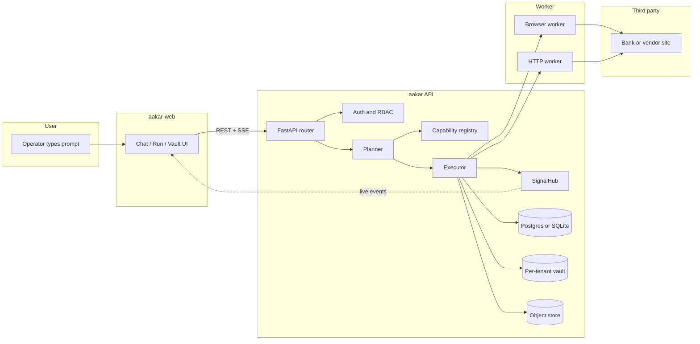
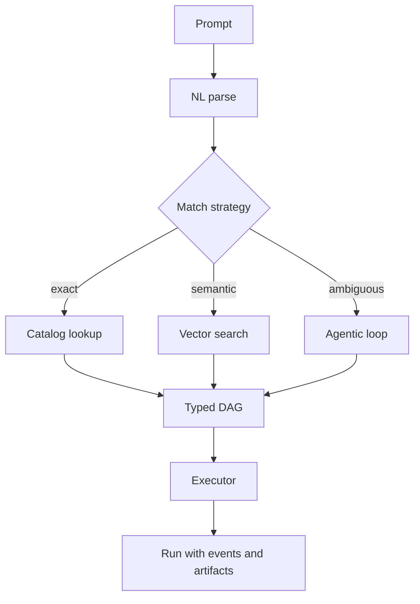
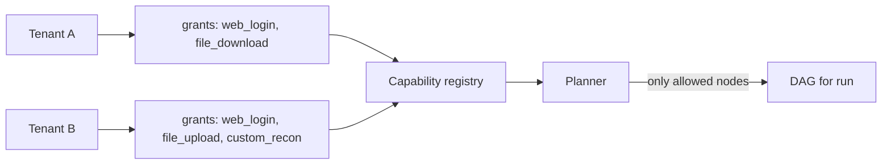
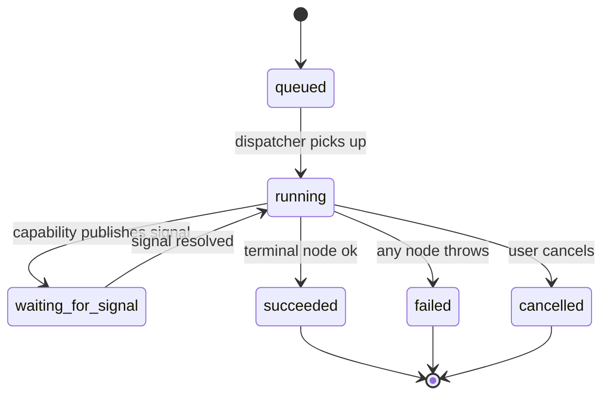

# Aakar — High-Level Design (v1)

> Aakar turns natural-language tasks into auditable, repeatable browser and HTTP workflows for back-office operators. This document describes the v1 system: its purpose, its boundaries, the stable architectural spine, and the trade-offs behind the major decisions.

---

## 1. What Aakar is

Aakar is a multi-tenant workflow automation platform. An operator types a task in plain English (for example, "log into the NBBL portal and download the Open Disputes report for cycle C02"), the system compiles that prompt into a typed Directed Acyclic Graph (DAG) of pre-approved capabilities, and a worker executes the DAG against the real third-party site or API while streaming live screenshots, events, and artifacts back to the UI.

The product is opinionated about three things:

1. **The LLM never invents actions.** It can only emit nodes from the registered capability catalog. Anything outside the catalog is reported back as a missing capability, not faked.
2. **Every run is auditable.** Each node, signal, screenshot, file artifact, and human decision is persisted with a tenant-scoped run_id.
3. **Humans stay in the loop where it matters.** Captchas, ambiguous selectors, and OTPs are surfaced through a single signal primitive instead of bypassed.

## 2. Personas

| Persona | Surface | Responsibilities |
| --- | --- | --- |
| **Brahma** (platform admin) | `admin-app` | Defines tenants, registers capabilities, manages the global catalog, seeds reference data, and runs reconciliation uploads. |
| **AARYA admin** (tenant admin) | `aakar-web` | Manages users, capability grants, vault entries, and views run history within one tenant. |
| **AARYA operator** (tenant user) | `aakar-web` chat | Drives day-to-day work: types prompts, approves clarifications, resolves captchas, downloads artifacts. |

A single Aakar deployment serves many tenants. Tenant isolation is enforced at the database row, vault path, and object-store URI levels.

## 3. System overview

## 4. Architectural spine

These five constraints are load-bearing. Anything else can change without breaking v1.

1. **DAG-only LLM.** The planner emits a typed DAG made of registered capability nodes. Free-form code generation is forbidden.
2. **Generic interpreter.** The executor walks any valid DAG. It does not know about specific banks or sites. New behavior is added by registering new capabilities, not by editing the executor.
3. **Capability registry split.** Capabilities (login, download, upload), Actions (lower-level steps a capability composes), and Controls (selectors, waits) are three separate tables. Each layer can evolve independently.
4. **Session pinning.** Once a run binds to a specific browser session, every subsequent node in that run runs in the same browser context until explicit logout or run end.
5. **Three-way planner.** A run can hit the catalog three ways: exact match, semantic search over a FAISS / pgvector index, and an agentic loop that asks the model to plan in steps when the prompt is ambiguous.

## 5. Core concepts

- **Capability.** A named, typed, human-reviewed unit of work. Example: `cap.web_login`, `cap.file_download`, `cap.file_upload`. Each capability declares its inputs, outputs, signals, and the actions it composes.
- **Action.** A primitive the executor knows how to run. Examples: `browser.set_field`, `browser.click_by_text`, `time.now`, `file.read_local`, `http.request`.
- **Control.** A reusable selector or wait condition associated with a capability or site. Controls are kept separate so a UI redesign on the third party only requires editing one row.
- **Run.** A single execution of a DAG. Has a status lifecycle (queued → running → waiting_for_signal → succeeded | failed | cancelled), a tenant scope, and a tree of events and artifacts.
- **Signal.** A typed pause. The executor publishes a signal (`captcha`, `picker`, `otp`, `confirm`) and waits for a human (or another system) to resolve it via the SignalHub.

## 6. Multi-tenancy model

Every persistent row carries a `tenant_id`. The vault, object store, and FAISS index are partitioned by tenant. Capability grants gate which capabilities a tenant — and a user within that tenant — can invoke.

A user from Tenant A can never plan or execute a capability that Tenant A has not been granted, even if the model tries to emit it. The check runs both at planner-time (filter the catalog before the model sees it) and at executor-time (refuse to dispatch a node whose capability is not granted).

## 7. Authentication and RBAC

Aakar uses bcrypt-hashed passwords and HS256 JWTs. Tokens are stored in `sessionStorage` (per tab) so opening a second tab as a different user does not stomp the first tab's session.

Roles in v1:

| Role | Scope | Can |
| --- | --- | --- |
| `brahma` | Platform | Everything across tenants. Lives in `admin-app`. |
| `tenant_admin` | One tenant | Manage users, grants, vault entries; view all runs in tenant. |
| `tenant_user` | One tenant | Chat, drive runs, view own runs and shared runs. |

Login, logout, and refresh all go through the `aakar API`. The frontend never talks to the database directly.

## 8. Run model and HITL

A run progresses through a small state machine:

The `waiting_for_signal` state is the human-in-the-loop primitive. A capability that hits a captcha publishes a `captcha` signal carrying a screenshot and a free-form description. The UI renders the screenshot, asks the operator to type the answer, and posts the resolution back. The executor resumes the same DAG node from where it paused. No code path silently bypasses a captcha.

## 9. Tech stack snapshot

| Layer | Choice | Reason |
| --- | --- | --- |
| Backend language | Python 3.12 | Pydantic v2 + FastAPI + Playwright + OpenAI SDK align here. |
| API framework | FastAPI | Typed request and response models, async, OpenAPI for free. |
| ORM | SQLAlchemy 2 + Alembic | Mature migrations, supports SQLite and Postgres backends. |
| Database (v1) | SQLite for local, Yugabyte (Postgres-wire) for cloud | Same SQL surface in both environments. |
| Vector index | FAISS on SQLite, pgvector on Yugabyte | Avoids running a separate vector DB. |
| Object store | Filesystem | No S3 in v1. Path layout already namespaces by tenant or run. |
| Browser worker | Playwright headless Chromium | Robust selectors, screenshotting, file dialog support. |
| LLM | OpenAI Chat Completions | Strict JSON mode for DAG emission. |
| Frontend | Vite plus React 18 plus TypeScript | Fast dev loop, low ceremony, isolated from any Next.js concerns. |
| Frontend data | TanStack Query | Cache plus revalidation; pairs cleanly with REST. |
| Frontend graph | xyflow plus dagre | DAG layout for plan view and run view. |
| Auth | bcrypt plus HS256 JWT | Self-contained; no SSO dependency in v1. |

## 10. Key trade-offs

- **No Temporal in v1.** The Executor Protocol is designed so that a `LocalExecutor` (in-process, threadpool-backed) can be swapped for a `TemporalExecutor` later without touching planner or capability code. v1 ships LocalExecutor.
- **Per-run browsers.** A fresh Chromium context per run is slower to start (about 1.5 to 3 seconds) but eliminates a whole class of cross-tenant cookie and storage bugs. A warm pool is on the roadmap, gated behind isolation guarantees.
- **No cron in v1.** Runs are operator-initiated. Adding cron without a queue, dead-letter handling, and quotas would be a footgun.
- **Filesystem object store.** S3 is on the roadmap. Switching is a single adapter change because every artifact is referenced by URI.
- **Permissive email regex, bcrypt direct.** Pydantic `EmailStr` and `passlib` were both swapped out after upstream pain. The current shapes are deliberate; do not "modernize" them.

## 11. Failure modes and guardrails

| Failure | Detection | Mitigation |
| --- | --- | --- |
| LLM emits unknown capability | DAG validator | Reject DAG, return clarification request. |
| LLM emits malformed JSON | Strict JSON mode + schema parse | Retry once, then surface error. |
| Selector drift on third-party site | Capability raises selector error | Fall through to generic `set_field` and `click_by_text` recovery. |
| Captcha encountered | Capability detects and signals | UI asks operator; run pauses, not fails. |
| Credential rotation | Vault read at run-start | Operator updates vault; next run picks it up. |
| Tenant boundary violation attempt | Auth + grant filter | 403 at API; capability not even visible to planner. |
| Transient network error | Capability-level retry policy | Bounded retries; failed run is retryable from UI. |

## 12. Boundaries (out of scope for v1)

- No mobile clients.
- No SSO / SAML / OIDC.
- No streaming LLM responses in chat (responses are turn-based).
- No multi-region replication.
- No public capability marketplace.
- No automatic scheduling. Runs start when an operator clicks "Run" or when an authorized API caller posts to `/runs`.

## 13. Reading order for the rest of this set

1. **HLD (this document)** — what and why.
2. **LLD** — module-by-module deep dive, sequence diagrams, validation rules.
3. **Backend architecture** — request lifecycle, run lifecycle, schema, ops.
4. **Frontend architecture** — routing, state, components, live screen panel.
5. **Roadmap** — what comes next and in what order.
