# Aakar — Low-Level Design (v1)

> Module-by-module reference: how the planner compiles a DAG, how the interpreter walks it, how capabilities compose actions, and how signals pause and resume runs.

---

## 1. Codebase layout

```
Aakaar/
  aakar/                       # backend service (FastAPI)
    aakar/
      api/                     # routers, schemas, deps, app factory
        routers/               # auth, admin, chat, chat_sessions, runs, vault, objects
        repositories/          # SQLAlchemy session-scoped data access
        schemas.py             # Pydantic request and response models
        app.py                 # FastAPI app factory
        deps.py                # auth + db dependencies
      planner/
        agentic/               # multi-step agent loop
        openai_impl.py         # one-shot planner using strict JSON
        prompt.py              # prompt templates and registry rendering
        llm.py                 # OpenAI client wrapper
      interpreter/
        executor.py            # protocol + local implementation
        activities/            # primitive activities the executor dispatches
      capabilities/
        web_login/
        file_download/
        file_upload/
        registry.py            # capability + action + control catalog
      workers/
        browser/               # playwright-backed browser worker
        http/                  # httpx-backed http worker
      models/                  # SQLAlchemy ORM models
      migrations/              # alembic
      tests/
  aakar-web/                   # tenant frontend (Vite + React + TS)
  admin-app/                   # platform admin frontend
    server/                    # admin-app FastAPI service (separate)
```

The backend is a single deployable. The planner, interpreter, capabilities, and workers all live in-process behind clean module boundaries.

## 2. API router map

| Router | Mount point | Notes |
| --- | --- | --- |
| `auth` | `/api/auth` | login, refresh, logout, /me |
| `admin` | `/api/admin` | tenant CRUD, user CRUD, grants |
| `chat` | `/api/chat` | turn-based chat that drives the planner |
| `chat_sessions` | `/api/chat/sessions` | persisted chat threads |
| `runs` | `/api/runs` | run create, get, cancel, events SSE |
| `vault` | `/api/vault` | per-tenant credential entries |
| `objects` | `/api/objects` | artifact upload / download |

All routers depend on `deps.get_db` and `deps.require_user`. Tenant scoping is enforced inside repositories, not by the router, so a misuse at the router layer cannot leak rows from another tenant.

## 3. Planner

The planner has two strategies, picked per turn:

- **One-shot.** The whole prompt is rendered into a single chat completion with strict JSON mode. The model returns a complete DAG. This path is fast and used for prompts that fit one of the well-known templates.
- **Agentic.** The model is allowed to issue tool calls in a loop: `search_capabilities`, `inspect_capability`, `propose_dag`, `ask_user`. The loop ends when the model emits a final DAG or asks a clarifying question.

Both strategies share the registry rendering in `prompt.py` so they always see the same allowed verbs.

### 3.1 One-shot planner sequence

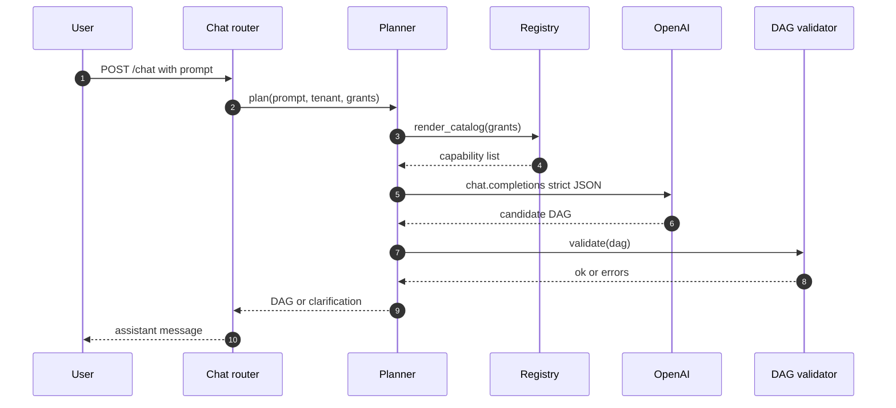

### 3.2 Agentic planner sequence

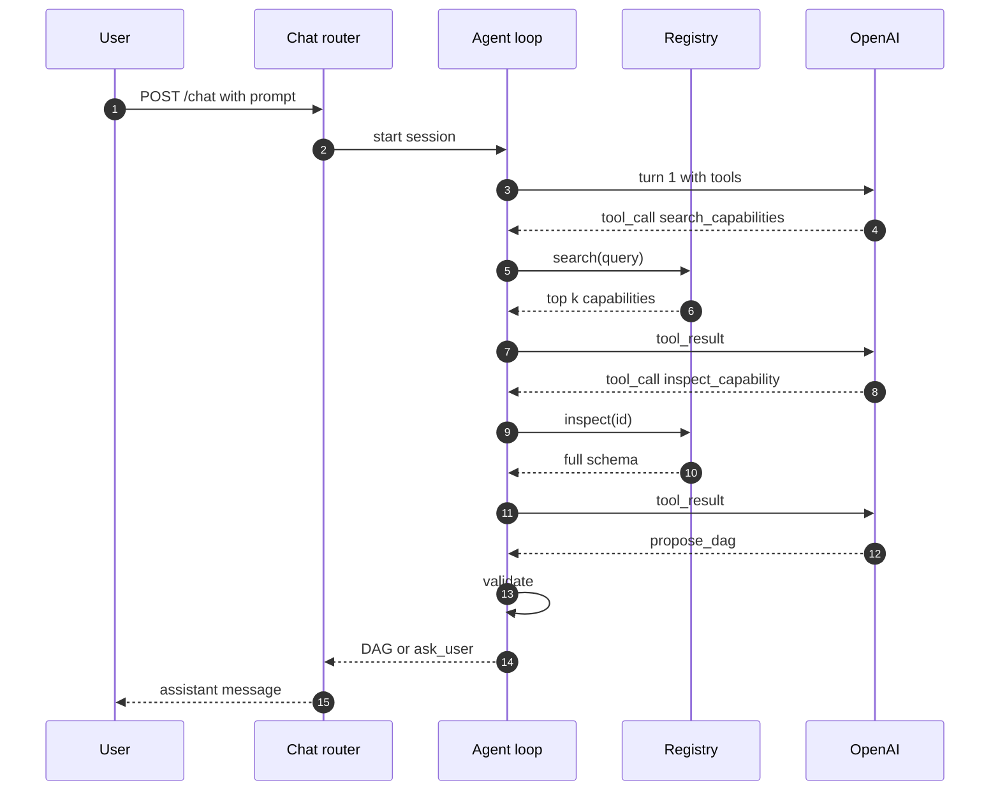

### 3.3 Validation pipeline

The planner never trusts the model. Every candidate DAG passes through a fixed pipeline:

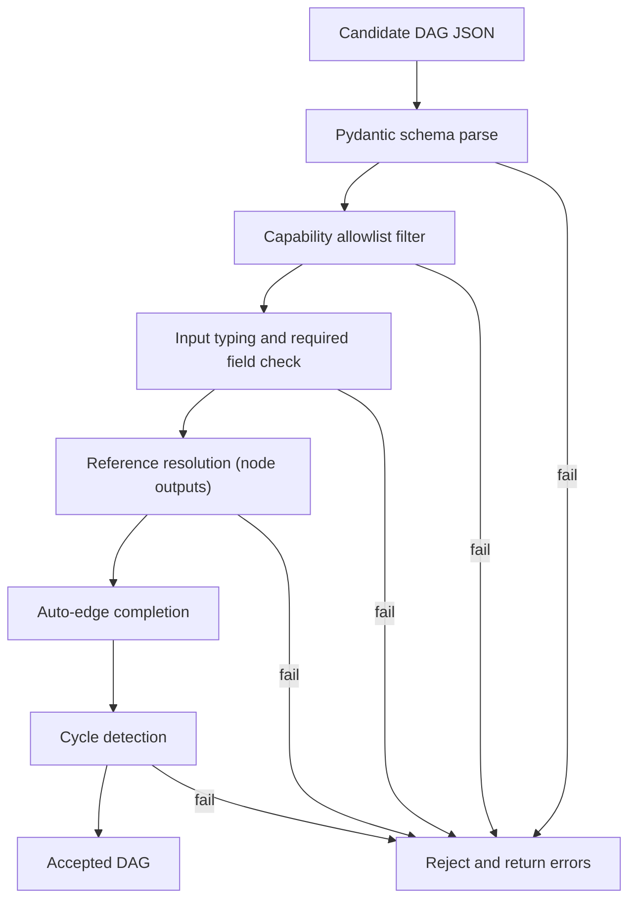

Auto-edge completion is the one piece of leniency: if a node references `${node_a.output}` but the model forgot to declare an edge from `node_a`, the validator inserts the edge.

## 4. DAG types

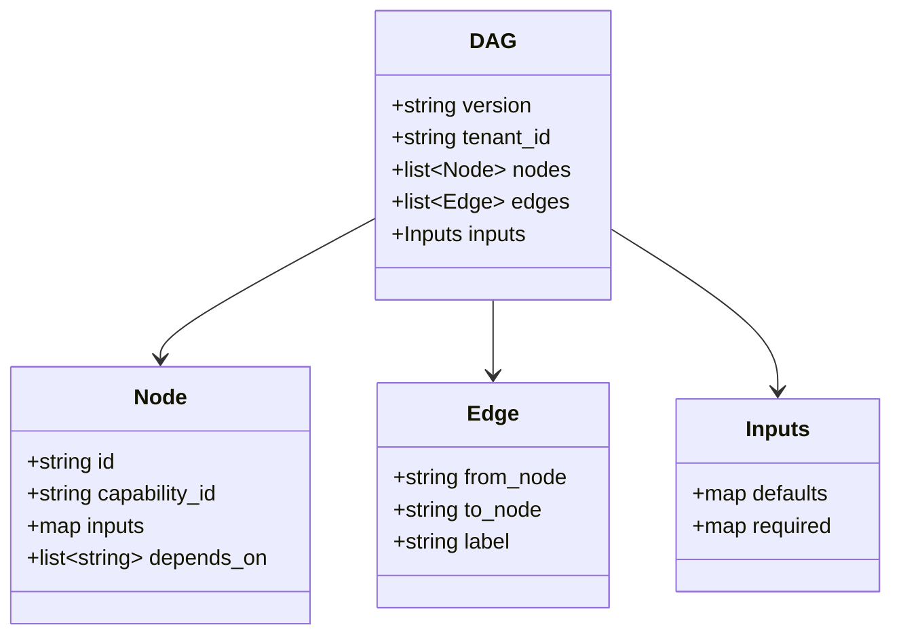

`Node.inputs` accepts both literal values and reference expressions of the form `${node_id.output_field}`. References are resolved at run-time by the executor.

## 5. Capability registry

Capabilities, actions, and controls live in three tables.

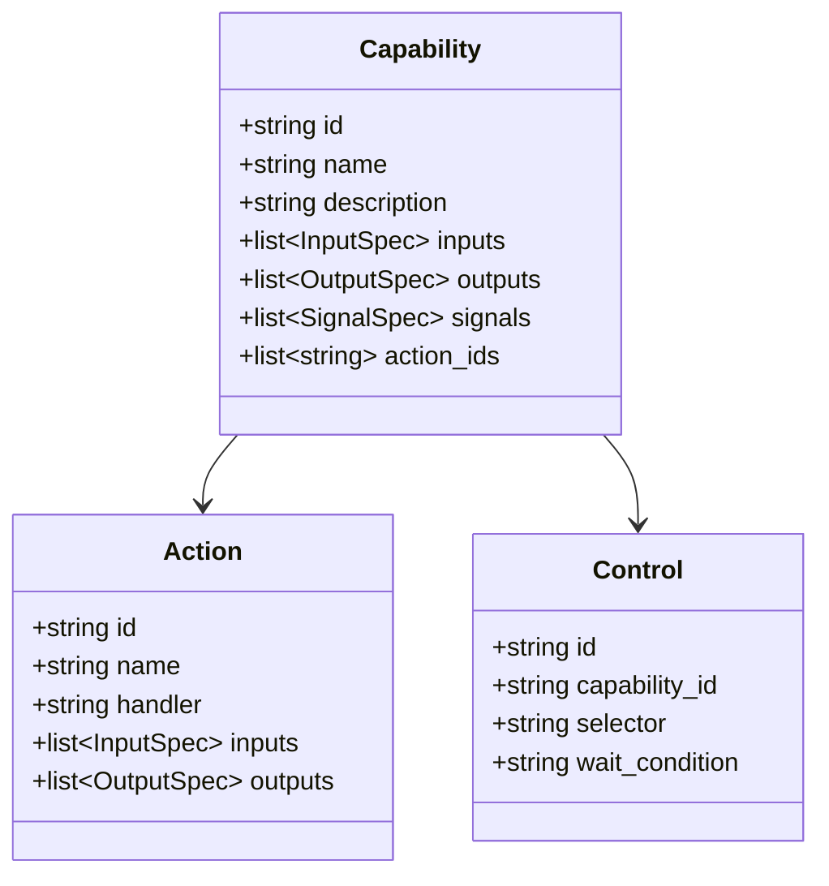

Each capability has a Python module under `aakar/capabilities/<id>/` that exports:

- `INPUTS` — Pydantic input schema.
- `OUTPUTS` — Pydantic output schema.
- `SIGNALS` — list of signal specs published.
- `run(inputs, ctx) -> outputs` — async entrypoint.

The registry is loaded at process start. The planner sees only what is registered for the tenant's grants.

## 6. Capability deep dive: web_login

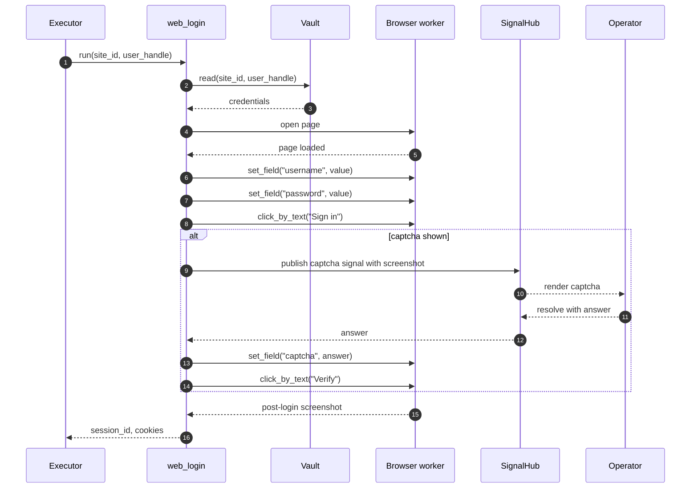

The capability hides the third-party site's exact selectors behind `set_field("username", ...)` and `click_by_text("Sign in")`. The browser worker resolves the abstract label to a concrete selector using the controls table, falling back to heuristic matching (role, name, title, aria-label) when the controls row is missing or stale.

## 7. Capability deep dive: file_download


The nav-recovery loop handles the common third-party pattern where clicking a report link first redirects through an interstitial. The capability detects either a download dialog or a redirect, and re-tries the click after navigating back, up to a small bounded number of attempts.

## 8. Capability deep dive: file_upload

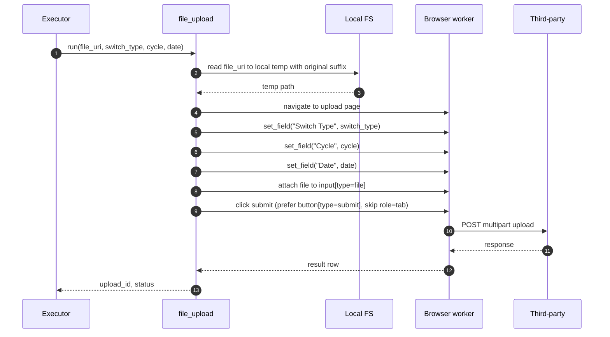

Two specific lessons baked into v1:

- The local temp file preserves the original suffix. Some upload endpoints reject `''` as an extension and return 415.
- `click_by_text("Upload")` on this page would match both the "Upload" tab and the "Upload" submit button. The capability resolves the click using a custom JS resolver that prefers `button[type='submit']` and skips elements with `role="tab"`.

## 9. Executor

The Executor Protocol is small and stable:

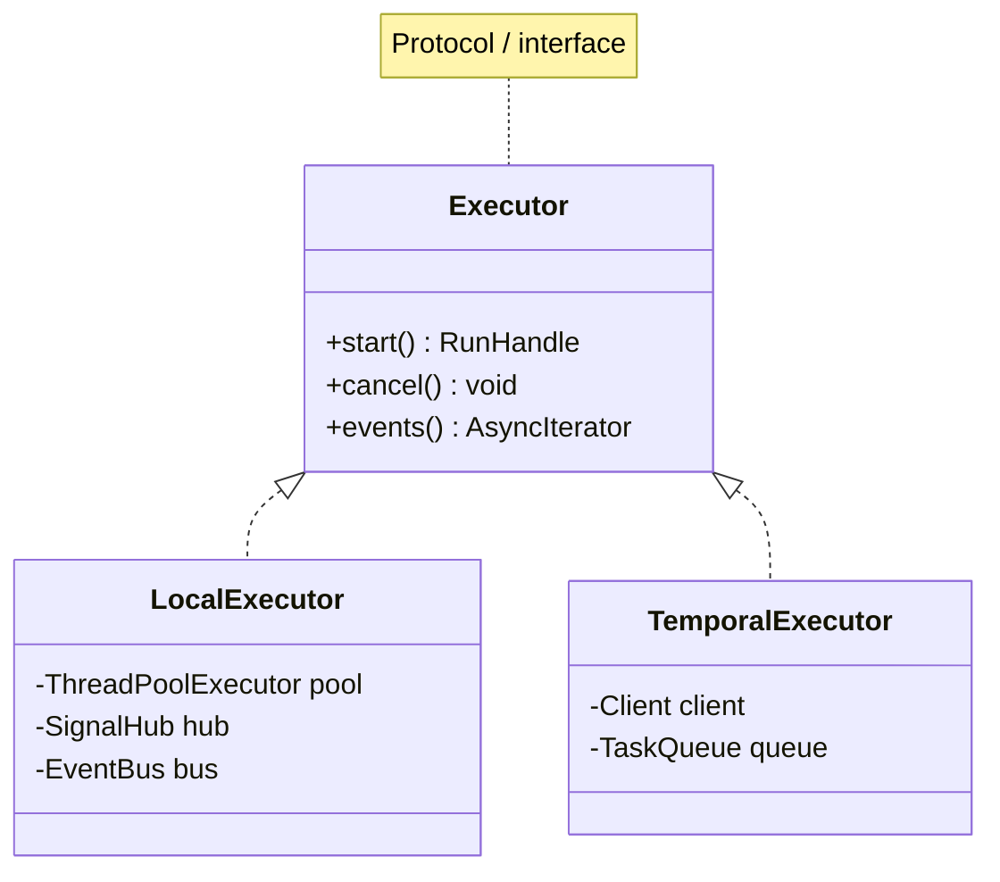

v1 ships `LocalExecutor`. It walks the DAG topologically, dispatches each ready node to its capability, persists `RunEvent` rows, and pushes them to subscribers (the SSE endpoint and the audit log).

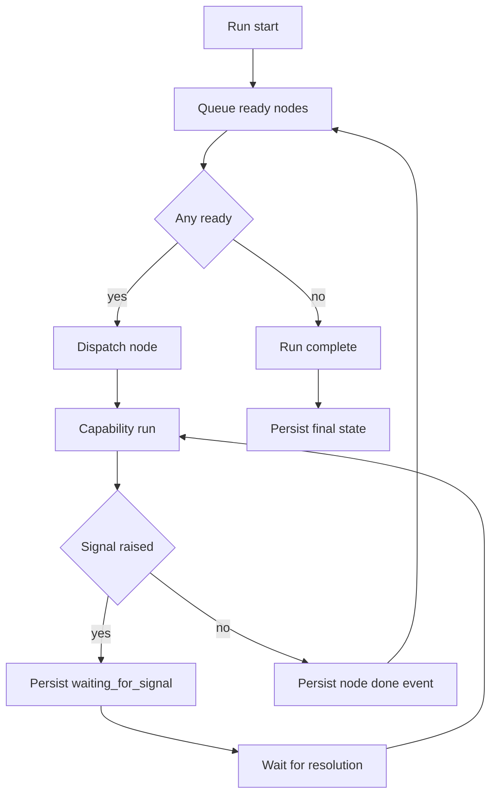

## 10. SignalHub

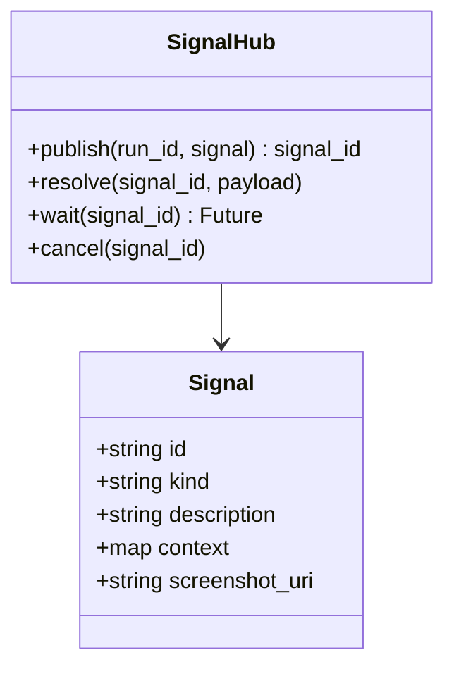

Signal kinds in v1: `captcha`, `picker`, `otp`, `confirm`. Each resolution is persisted as a `RunEvent` so the audit log preserves who resolved what and when.

## 11. Event kinds

| Kind | Emitted by | Carries |
| --- | --- | --- |
| `run.started` | Executor | dag snapshot |
| `node.started` | Executor | node id, capability id |
| `node.input` | Executor | resolved input map |
| `node.output` | Executor | output map (PII scrubbed) |
| `node.failed` | Executor | error type, message |
| `node.screenshot` | Browser worker | object_uri, mime |
| `signal.published` | SignalHub | signal id, kind, screenshot |
| `signal.resolved` | SignalHub | signal id, who, payload |
| `run.succeeded` | Executor | summary |
| `run.failed` | Executor | failed node id |
| `run.cancelled` | Executor | who, reason |

The frontend subscribes via SSE on `/api/runs/{id}/events`.

## 12. Input defaults merge

A capability declares default inputs. A run's DAG node may override any of them. Reference resolution happens after merge.

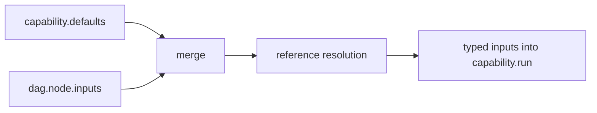

Order of precedence: `dag.node.inputs` > `capability.defaults`. References are resolved last so they can target merged values.

## 13. Test harness

Tests live alongside the source under `aakar/tests/`. Categories:

- **Unit** — pure functions in planner, validator, prompt rendering.
- **Capability** — each capability has its own test file driving a fake browser or HTTP backend.
- **API integration** — FastAPI TestClient, real database, faked LLM and browser.
- **End-to-end** — small set of scripted runs against a local mock site.

Integration tests must hit a real database, not mocks. Mock and prod divergence has masked broken migrations in the past.

## 14. Reading guide

- For a refresher on intent and boundaries, read the HLD.
- For request and run lifecycles plus the schema, read the backend doc.
- For UI shape and state, read the frontend doc.
- For what comes next, read the roadmap.
