# Aakar — Low-Level Design (v1)

> Module-by-module reference for the Drashtri (planner), the Karta (executor), the Vidya (capability) catalog, and the Aahvaana (signal) hub. Mythic names appear with English in parens on first occurrence; code identifiers and file paths stay in English.

---

## 1. Codebase layout

```
Aakaar/
  aakar/                       # backend service (FastAPI)
    aakar/
      api/                     # routers, schemas, deps, app factory
        routers/               # auth, admin, chat, chat_sessions, runs, vault, objects
        repositories/          # SQLAlchemy session-scoped data access
        schemas.py             # Pydantic request and response models
        app.py                 # FastAPI app factory
        deps.py                # Pravesha + db dependencies
      planner/                 # Drashtri
        agentic/               # multi-step agent loop
        openai_impl.py         # one-shot Drashtri using strict JSON
        prompt.py              # prompt templates and Veda rendering
        llm.py                 # OpenAI client wrapper
      interpreter/             # Karta
        executor.py            # protocol + local implementation
        activities/            # primitive Kriya the Karta dispatches
      capabilities/            # Vidya bodies
        web_login/
        file_download/
        file_upload/
        registry.py            # Vidya + Kriya + Lakshana catalog (the Veda)
      workers/
        browser/               # playwright-backed browser worker
        http/                  # httpx-backed http worker
      models/                  # SQLAlchemy ORM models
      migrations/              # alembic
      tests/
  aakar-web/                   # Mandala frontend (Vite + React + TS)
  admin-app/                   # third-party bank-ops mock (not the Pracharya's surface)
```

The backend is a single deployable. The Drashtri, Karta, Vidyas, and workers all live in-process behind clean module boundaries.

## 2. API router map

| Router | Mount point | Notes |
| --- | --- | --- |
| `auth` | `/api/auth` | Pravesha, refresh, Nirgama, /me |
| `admin` | `/api/admin` | Mandala CRUD, Sadhaka CRUD, Adhikaras |
| `chat` | `/api/chat` | turn-based Samvada that drives the Drashtri |
| `chat_sessions` | `/api/chat/sessions` | persisted Samvada threads |
| `runs` | `/api/runs` | Yajna create, get, cancel, Smriti SSE |
| `vault` | `/api/vault` | per-Mandala Kosha entries |
| `objects` | `/api/objects` | Bhandara upload / download |

All routers depend on `deps.get_db` and `deps.require_user`. Mandala scoping is enforced inside repositories, not by the router, so a misuse at the router layer cannot leak rows from another Mandala.

## 3. Drashtri (planner)

The Drashtri has two strategies, picked per turn:

- **One-shot Drashtri.** The whole Sankalpa is rendered into a single chat completion with strict JSON mode. The model returns a complete Yantra. This path is fast and used for Sankalpas that fit one of the well-known templates.
- **Agentic Drashtri (Drashtri-with-eyes).** The model is allowed to issue tool calls in a loop: `inspect_page`, `navigate`, `login_with_grant`, `done`. The loop ends when the model emits a final Yantra or asks a clarifying question.

Both strategies share the Veda rendering in `prompt.py` so they always see the same allowed verbs.

### 3.1 One-shot Drashtri sequence

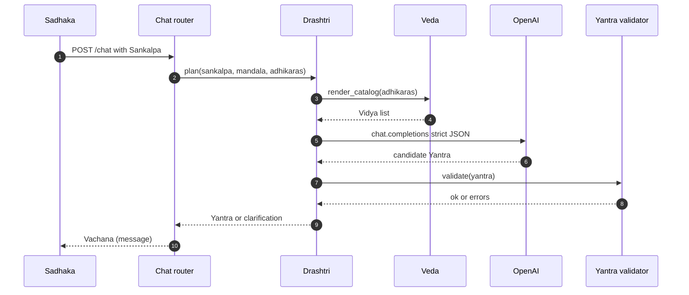

### 3.2 Agentic Drashtri sequence

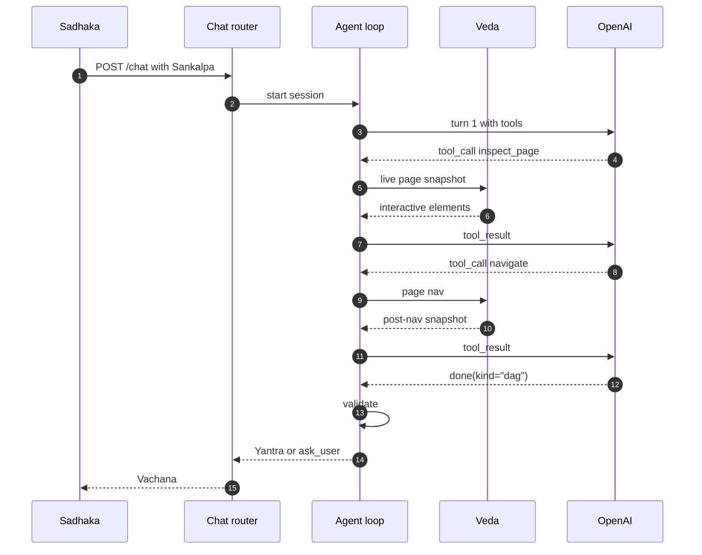

### 3.3 Validation pipeline

The Drashtri never trusts the model. Every candidate Yantra passes through a fixed pipeline:

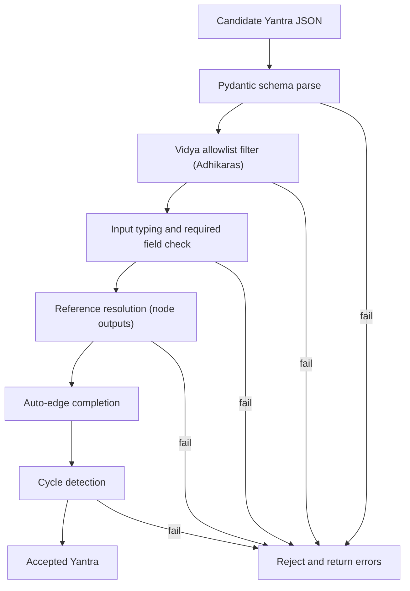

Auto-edge completion is the one piece of leniency: if a node references `${node_a.output}` but the model forgot to declare an edge from `node_a`, the validator inserts the edge.

## 4. Yantra types

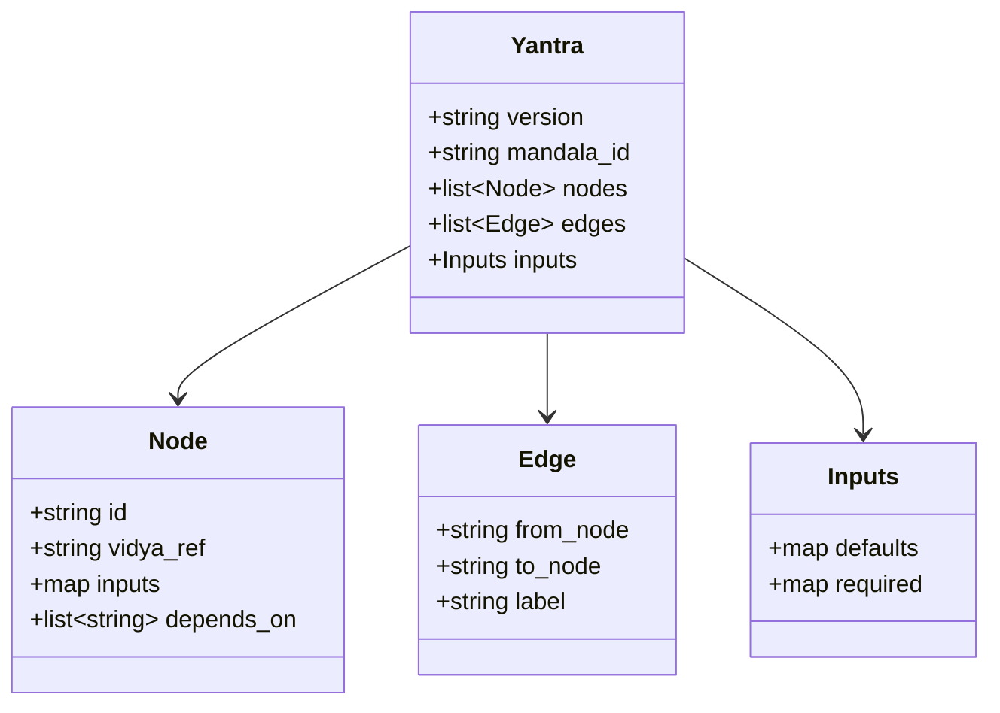

`Node.inputs` accepts both literal values and reference expressions of the form `${node_id.output_field}`. References are resolved at Yajna-time by the Karta.

## 5. Veda (capability registry)

Vidyas, Kriyas, and Lakshanas live in three tables.

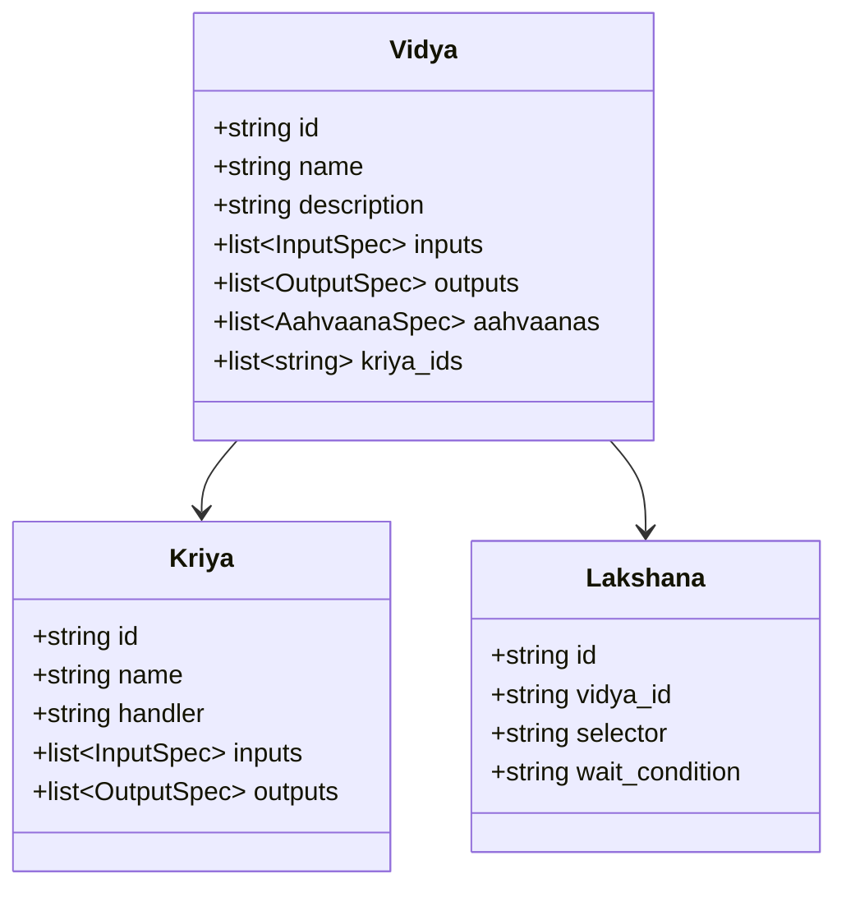

Each Vidya has a Python module under `aakar/capabilities/<id>/` that exports:

- `INPUTS` — Pydantic input schema.
- `OUTPUTS` — Pydantic output schema.
- `SIGNALS` — list of Aahvaana specs published.
- `run(inputs, ctx) -> outputs` — async entrypoint.

The Veda is loaded at process start. The Drashtri sees only what is registered for the Mandala's Adhikaras.

## 6. Vidya deep dive: web_login

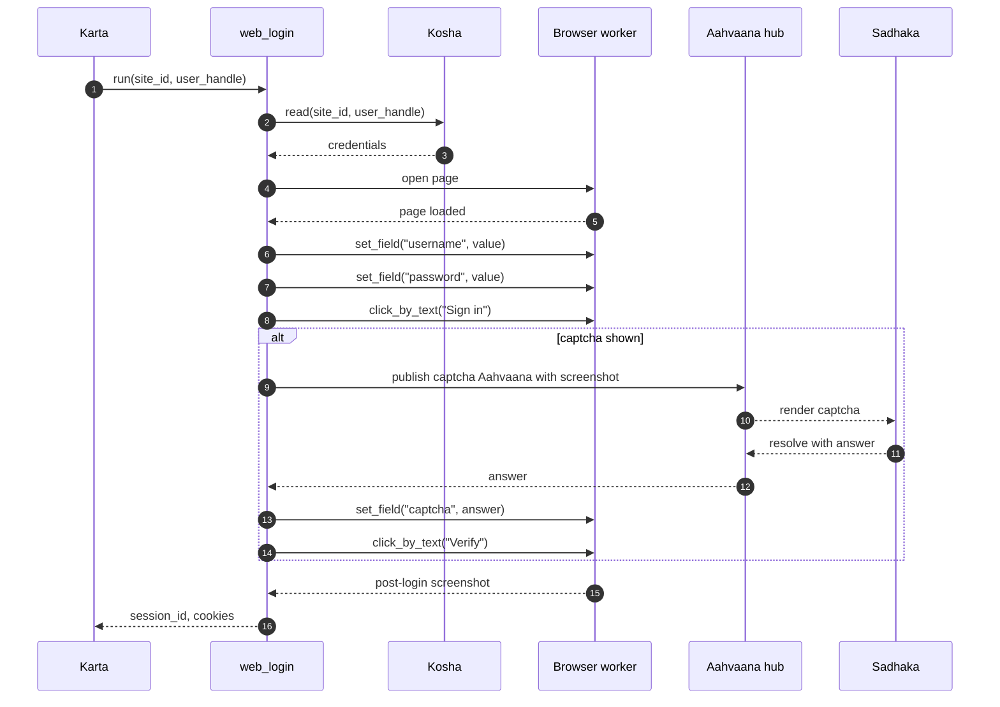

## 7. Vidya deep dive: file_download

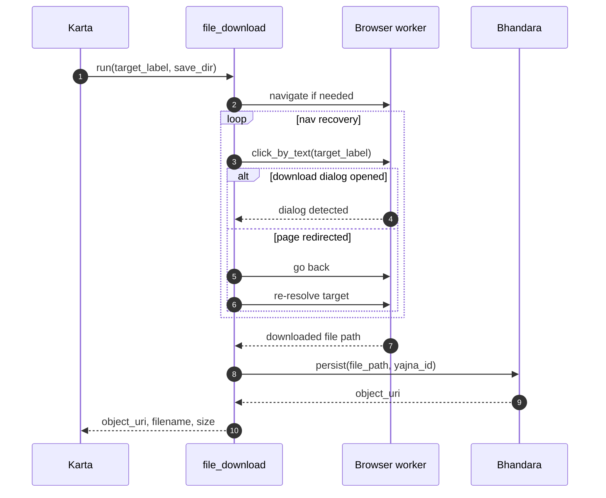

## 8. Vidya deep dive: file_upload


Two specific lessons baked into v1:

- The local temp file preserves the original suffix. Some upload endpoints reject `''` as an extension and return 415.
- `click_by_text("Upload")` on this page would match both the "Upload" tab and the "Upload" submit button. The Vidya resolves the click using a custom JS resolver that prefers `button[type='submit']` and skips elements with `role="tab"`.

## 9. Karta (executor)

The Karta Protocol is small and stable:

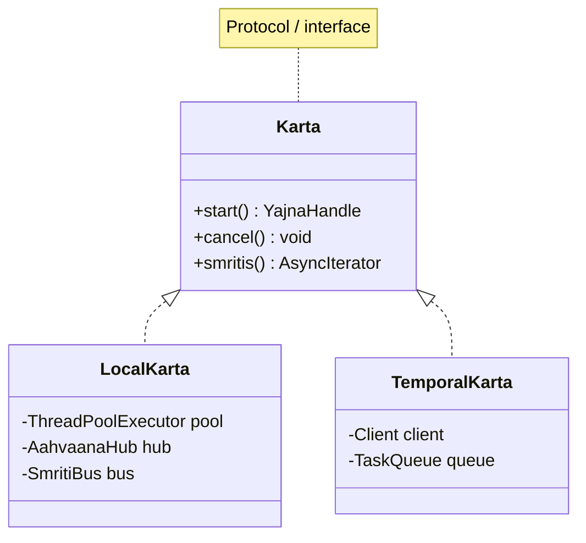

v1 ships `LocalKarta`. It walks the Yantra topologically, dispatches each ready node to its Vidya, persists `Smriti` rows, and pushes them to subscribers (the SSE endpoint and the Sakshi).

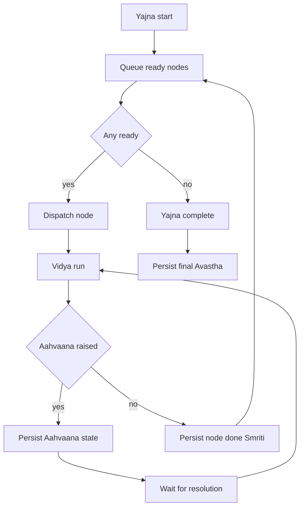

## 10. Aahvaana hub

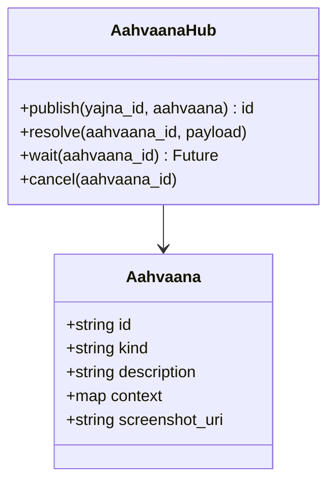

Aahvaana kinds in v1: `captcha`, `picker`, `otp`, `confirm`. Each resolution is persisted as a `Smriti` so the Sakshi preserves who resolved what and when.

## 11. Smriti (event) kinds

| Kind | Emitted by | Carries |
| --- | --- | --- |
| `yajna.started` | Karta | Yantra snapshot |
| `node.started` | Karta | node id, Vidya ref |
| `node.input` | Karta | resolved input map |
| `node.output` | Karta | output map (PII scrubbed) |
| `node.failed` | Karta | error type, message |
| `node.screenshot` | Browser worker | object_uri, mime |
| `aahvaana.published` | Hub | id, kind, screenshot |
| `aahvaana.resolved` | Hub | id, who, payload |
| `yajna.succeeded` | Karta | summary |
| `yajna.failed` | Karta | failed node id |
| `yajna.cancelled` | Karta | who, reason |

The frontend subscribes via SSE on `/api/runs/{id}/events`.

## 12. Input defaults merge

A Vidya declares default inputs. A Yantra node may override any of them. Reference resolution happens after merge.

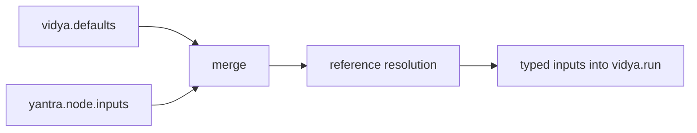

Order of precedence: `yantra.node.inputs` > `vidya.defaults`. References are resolved last so they can target merged values.

## 13. Test harness

Tests live alongside the source under `aakar/tests/`. Categories:

- **Unit** — pure functions in the Drashtri, validator, prompt rendering.
- **Vidya** — each Vidya has its own test file driving a fake browser or HTTP backend.
- **API integration** — FastAPI TestClient, real database, faked LLM and browser.
- **End-to-end** — small set of scripted Yajnas against a local mock site.

Integration tests must hit a real database, not mocks. Mock and prod divergence has masked broken migrations in the past.

## 14. Reading guide

- For intent and boundaries, read the HLD.
- For request and Yajna lifecycles plus the schema, read the backend doc.
- For UI shape and state, read the frontend doc.
- For what comes next, read the roadmap.
