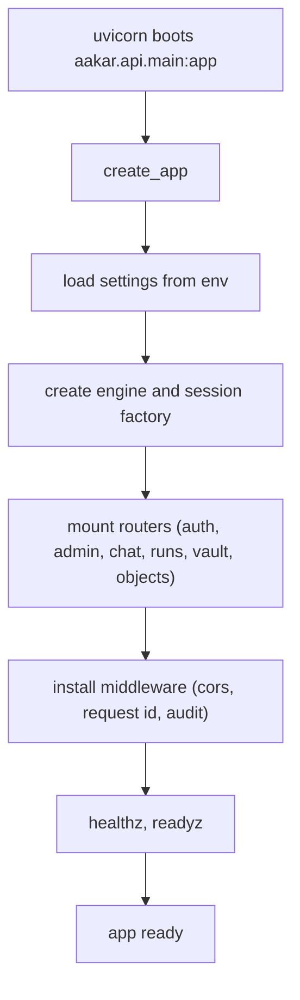
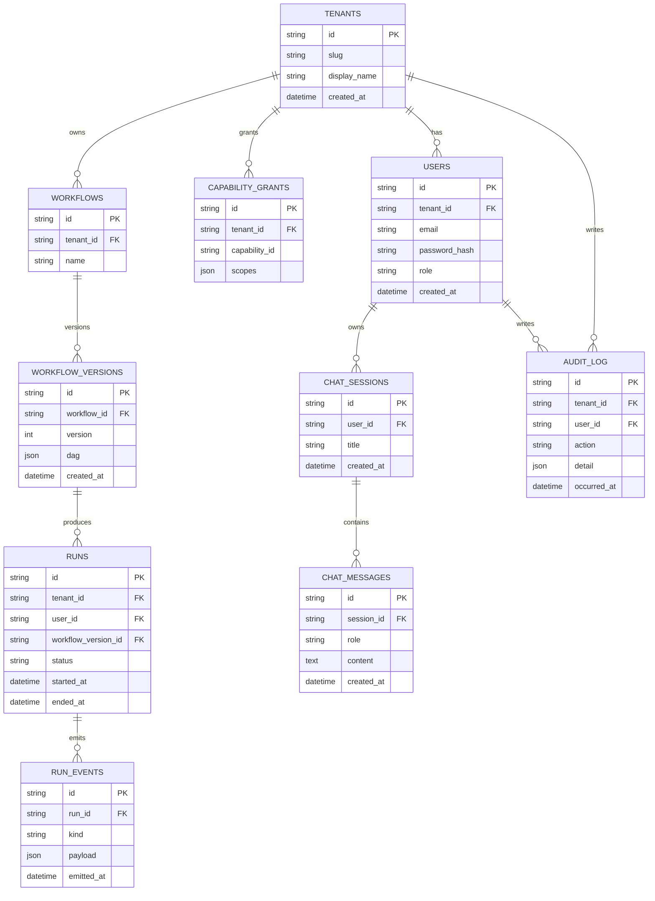
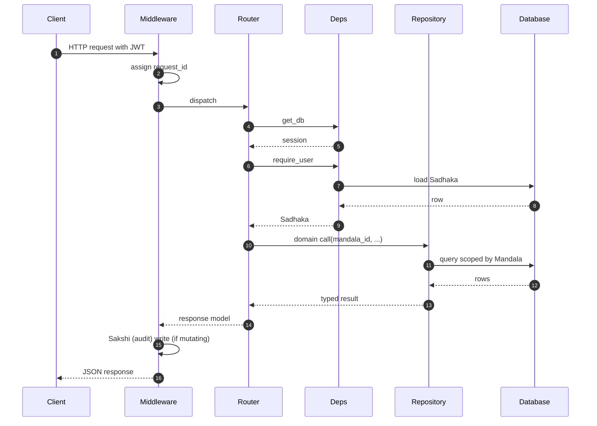
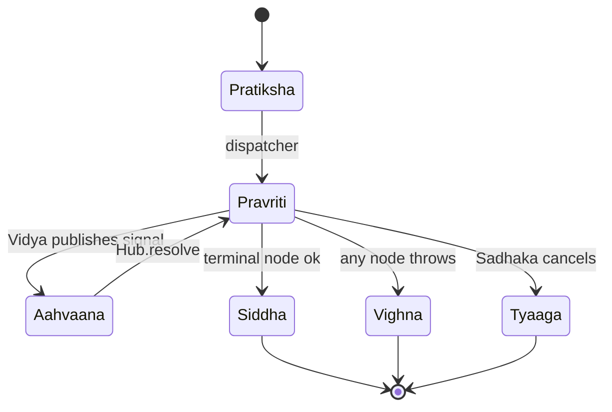
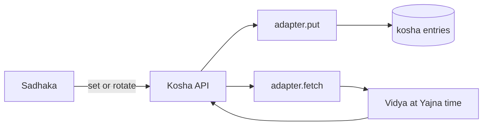

# Aakar — Backend Architecture (v1)

> Two FastAPI services, one shared philosophy: every row is Mandala-scoped, every Vidya is registered, every Yajna is auditable. This document covers the request lifecycle, the database, the Yajna lifecycle, and the operational concerns.

---

## 1. Two backends

| Service | Path | Port (dev) | Owners | Purpose |
| --- | --- | --- | --- | --- |
| `aakar API` | `aakar/aakar/api` | 8000 | Mandala traffic | Pravesha (auth), Samvada (chat), Yajnas (runs), Kosha (vault), Bhandara (objects), admin (per-Mandala). |
| `admin-app API` | `admin-app/server` | 8001 | Demo fixture | A mock bank-ops service used as a third-party site during demos. Not the Pracharya's surface. |

The split is intentional: Mandala traffic must not contend with demo traffic, and admin-app's selectors are part of the Drashtri's targeting heuristics.

## 2. Stack

| Concern | v1 choice |
| --- | --- |
| Language | Python 3.12 |
| Web framework | FastAPI |
| Validation | Pydantic v2 |
| ORM | SQLAlchemy 2 |
| Migrations | Alembic |
| Local DB | SQLite |
| Cloud DB | Yugabyte (Postgres wire) |
| Vector index | FAISS (SQLite mode), pgvector (Yugabyte mode) |
| Bhandara (object store) | Filesystem under `AAKAR_DATA_DIR` |
| Browser worker | Playwright headless Chromium |
| HTTP worker | httpx |
| Pravesha | bcrypt + HS256 JWT |
| LLM (Drashtri) | OpenAI Chat Completions strict JSON |
| Embeddings | BGE small via sentence-transformers |
| Background work | asyncio + a small threadpool |

## 3. App factory



The factory pattern keeps tests cheap: each integration test builds a fresh app bound to a temp SQLite file.

## 4. Database schema



Conventions:

- All ids are ULIDs encoded as 26-char strings.
- Table names stay English (`tenants`, `users`, `runs`) for SQL clarity; the mythic names (Mandala, Sadhaka, Yajna) live in the UI and docs.
- Every Mandala-bearing table has a unique index on `(tenant_id, ...)` first; Postgres planner uses it.
- `RUN_EVENTS.payload` is JSON; PII fields are scrubbed before write.
- `AUDIT_LOG` is append-only — this table is the Sakshi (witness). Deletes are forbidden by an Alembic check.

## 5. Request lifecycle



Mandala scoping is enforced inside repositories. Routers cannot accidentally widen the scope because repositories require a `tenant_id` argument and ignore any free-form filter that would broaden it.

## 6. Yajna (run) lifecycle

Mythic primary, English in parens:



A retry of a Vighna creates a new `RUNS` row with a `parent_run_id` reference. Sakshi history is preserved.

## 7. Kosha (vault)

The Kosha stores per-Mandala credentials. Each entry binds:

- `mandala_id` (tenant_id on the wire)
- `site_id` (the third party, for example `nbbl` or `hdfc`)
- `user_handle` (the Sadhaka's identity on that site)
- `secret_blob` (storage form depends on adapter — see below)
- `metadata` (rotation hints, last-used)



**v1 honesty:** the local adapter writes JSON files at `{data}/vault/{tenant_id}/{ref}.json` with mode 0600. There is no cipher at rest in v1. A KMS-backed adapter (encrypt-on-write, decrypt-at-read, per-Mandala data key wrapped by a master key in a managed KMS) is the Phase 2 roadmap item — code path stays the same, only the adapter changes.

## 8. Bhandara (object storage)

Artifacts (downloaded files, screenshots, run-time uploads) are persisted under:

```
$AAKAR_DATA_DIR/
  tenants/
    <tenant_id>/
      runs/
        <run_id>/
          events/
            <event_id>.png
          downloads/
            <filename>
          uploads/
            <filename>
```

Each row that references an artifact stores its URI as `file://...` in v1. Switching to S3 or GCS is one adapter implementation away; row-level URIs already encode the namespace.

## 9. FAISS index (Anveshana)

The Anveshana (Vidya search) index is built at process start from the registered Veda. It supports:

- top-k similarity search by Sankalpa embedding
- metadata filter by Mandala Adhikaras
- rebuild on Vidya registration

The index is a single FAISS `IndexFlatIP` plus a parallel sidecar list of Vidya ids. For Yugabyte deployments the same data lives in a `pgvector` table and the Drashtri uses a SQL ANN query instead. Behavior is identical from the Drashtri's perspective.

## 10. Darshana queries (dashboard stats)

The frontend Darshana (dashboard) pulls aggregates through three endpoints:

| Endpoint | Returns |
| --- | --- |
| `/api/stats/runs/daily` | Yajna counts per day, last 30 days, by Avastha |
| `/api/stats/capabilities/usage` | top Vidyas by Yajna count |
| `/api/stats/sites/health` | per-site Siddhi rate over last 7 days |

All three are materialized at query time from `RUNS` and `RUN_EVENTS` with simple `GROUP BY` aggregations. v1 makes no attempt at pre-aggregation.

## 11. Settings table

A small `settings` table holds per-Mandala feature flags and tunables:

| Key | Default | Notes |
| --- | --- | --- |
| `planner.strategy` | `auto` | `auto`, `oneshot`, or `agentic`. |
| `executor.max_concurrent_runs` | `4` | Per-Mandala cap on parallel Yajnas. |
| `browser.timeout_ms` | `30000` | Default per-step timeout. |
| `vault.rotation_days` | `90` | Reminder cadence; non-blocking. |

## 12. Bootstrap and seeding

On first boot, the API:

1. Runs Alembic migrations to head.
2. Seeds platform metadata: Veda rows from code, Lakshana rows from YAML.
3. Optionally seeds a demo Mandala with an Acharya if `AAKAR_SEED_DEMO=1`.
4. Builds the FAISS index in memory from the seeded Vidyas.

The seed step is idempotent. Re-running it does not duplicate rows. The Pracharya (superuser) is seeded from `AAKAR_SUPERUSER_*` env vars if present; v1 deployments may run with no Pracharya at all and bootstrap one out-of-band.

## 13. admin-app server

The admin-app's FastAPI service is intentionally thin and **not** the Pracharya's surface:

- It owns the demo recon upload endpoint (`/api/recon/uploads`) and the upload history list — these mimic a real bank-ops backend that the Drashtri targets.
- It does not access the Mandala database. Pracharya surfaces go through the aakar API with a Pracharya JWT.
- Uploaded recon files are stored on disk under `admin-app/server/uploads/` and referenced from the in-memory history table.

## 14. Operations runbook (v1, dev)

| Task | Command |
| --- | --- |
| Start everything | `./start.sh` |
| Run migrations | `(cd aakar && .venv/bin/alembic upgrade head)` |
| Run backend tests | `(cd aakar && .venv/bin/pytest)` |
| Reset local DB | `rm aakar/data/aakar.sqlite && alembic upgrade head` |
| Tail aakar logs | follow stdout in the API Terminal window |
| Stop a service | Ctrl-C in its window or `kill.sh` |

`start.sh` opens five Terminal windows: aakar API (8000), admin-app API (8001), aakar-web (5173), admin-app (3000), nbbl-app (3001). Numerical libs are pinned to single-thread mode in the env to avoid leaked-semaphore warnings on shutdown.

## 15. Failure modes

| Scenario | Detection | Behavior |
| --- | --- | --- |
| LLM returns malformed JSON | Pydantic parse | Retry once then surface error to Samvada. |
| LLM emits unknown Vidya | Yantra validator | Reject Yantra, return clarification. |
| Browser crashes mid-Yajna | Heartbeat timeout | Mark Yajna Vighna; preserve Smritis; surface retry button. |
| Kosha entry missing | Vidya lookup | Pause with a `picker` Aahvaana asking the Sadhaka to add credentials. |
| Disk full | Bhandara write error | Mark Yajna Vighna; alert via Sakshi. |
| Migration failure | Alembic | Refuse to start; print the failing revision. |

## 16. Backups (v1, manual)

Local SQLite is in `aakar/data/aakar.sqlite`; an `sqlite3 .backup` run from cron is sufficient for dev. Yugabyte is backed up via the platform's standard snapshot tooling. Bhandara contents (artifacts) are tarred per Yajna when a Yajna finishes; the tarball is sufficient evidence to replay UI state.

## 17. Reading guide

- For motivation and boundaries, read the HLD.
- For per-module details, read the LLD.
- For UI shape and Pratyaksha (live) panel, read the frontend doc.
- For what comes next (including OpenTelemetry), read the roadmap.
