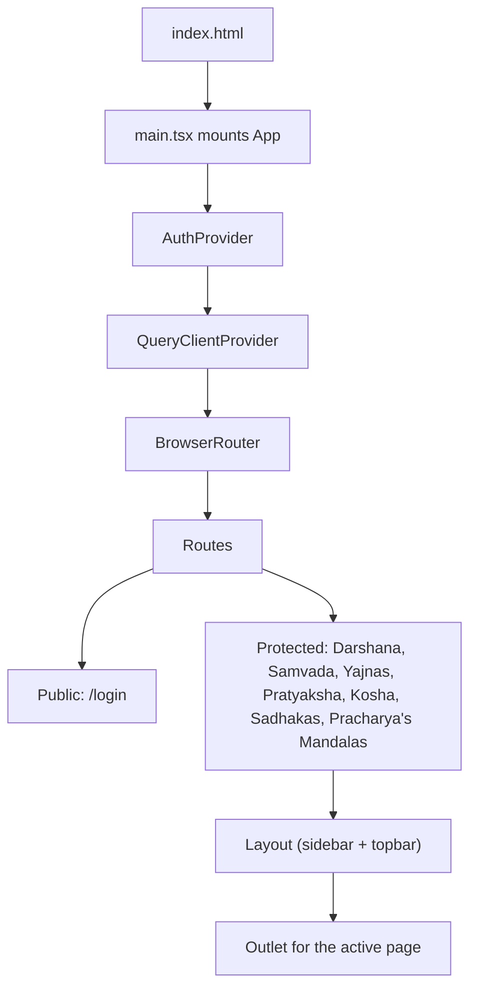
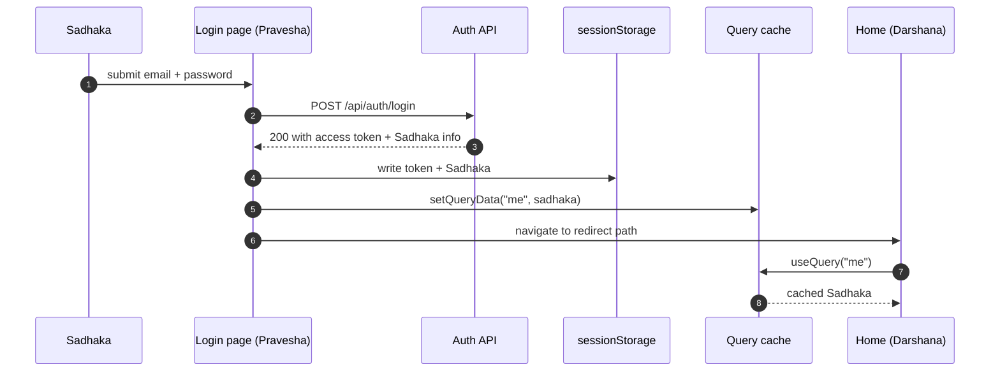
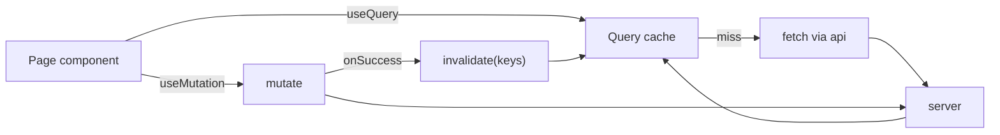
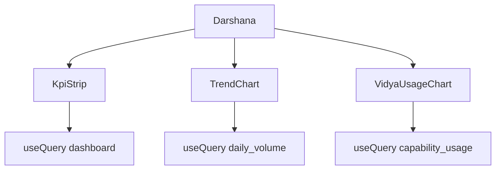
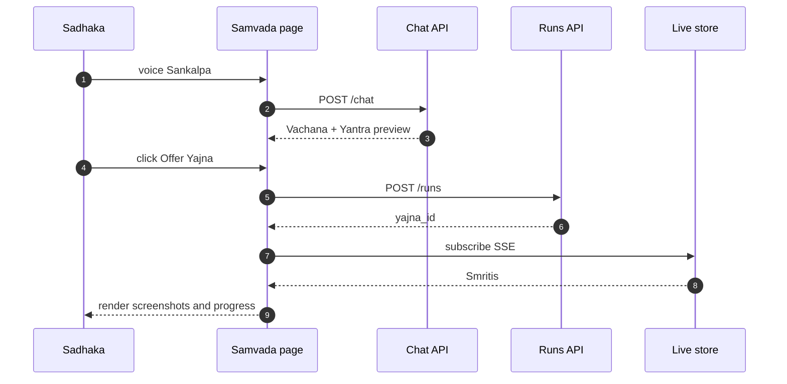
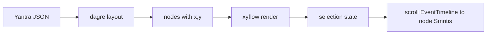
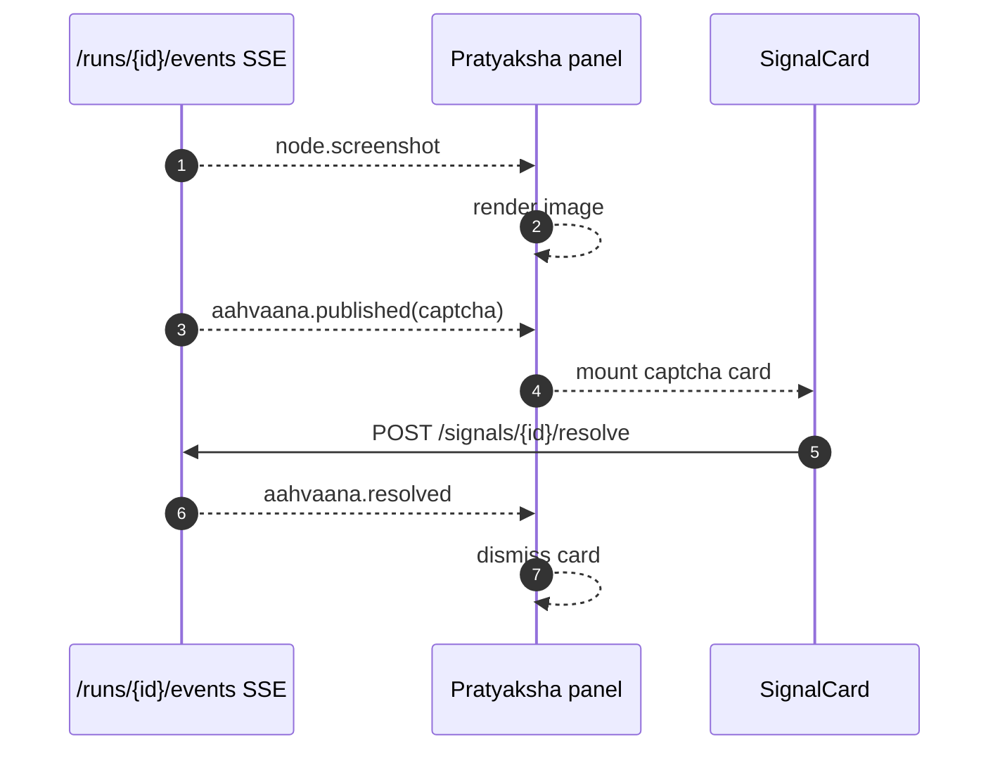
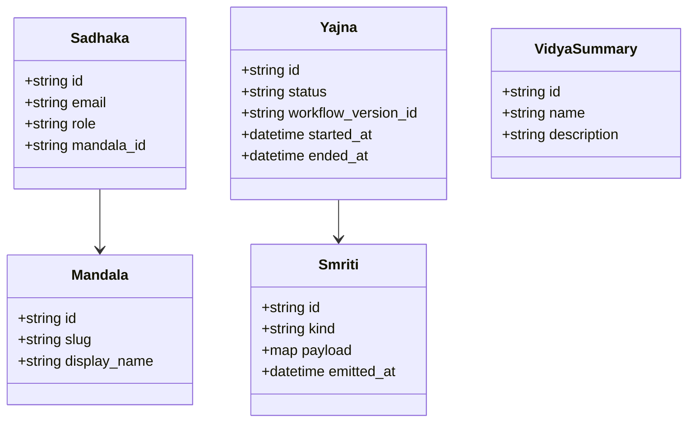

# Aakar — Frontend Architecture (v1)

> `aakar-web` is the single SPA that serves both the Pracharya (principal / superuser) and the Mandala's Sadhakas. This document focuses on it. Mythic terms appear with English in parens on first occurrence per section.

---

## 1. Stack

| Concern | v1 choice |
| --- | --- |
| Build tool | Vite |
| Framework | React 18 |
| Language | TypeScript |
| Routing | React Router 6 |
| Server state | TanStack Query (React Query) |
| Forms | React Hook Form |
| Styling | Tailwind CSS |
| Graph | xyflow (React Flow) plus dagre |
| Charts | Recharts |
| Icons | lucide-react |
| Pravesha (auth) storage | sessionStorage (per tab) |

## 2. App shell and routing



A `RequireAuth` wrapper guards the protected branch. If no token is present, it redirects to `/login` (Pravesha) while preserving the intended location for post-Pravesha redirect.

## 3. Pravesha (login) flow



Per-tab isolation is the reason for sessionStorage rather than localStorage: opening a second tab as a different Sadhaka (or as the Pracharya) does not clobber the first tab's session.

## 4. API client

```ts
// src/api/index.ts (sketch)
const api = axios.create({ baseURL: "/api" });
api.interceptors.request.use(cfg => {
  const t = sessionStorage.getItem("aakar.token");
  if (t) cfg.headers.Authorization = `Bearer ${t}`;
  return cfg;
});
api.interceptors.response.use(
  r => r,
  err => {
    if (err.response?.status === 401) {
      sessionStorage.clear();
      location.replace("/login");
    }
    return Promise.reject(err);
  },
);
```

Every page imports typed wrappers (`api.runs.list`, `api.runs.get`, ...). Wrappers narrow request and response types to the shapes in `src/api/types.ts`. Wire field names stay English (`tenant_id`, `run.status`) so the backend contract is untouched.

## 5. TanStack Query patterns



Conventions:

- Query keys are arrays. First element is the resource: `["runs"]`, `["runs", id]`, `["chat", "sessions"]`.
- Mutations always invalidate the relevant list query on success rather than manually patching cache entries.
- SSE subscriptions for live Smritis are managed outside Query; they push into a Zustand-style local store keyed by Yajna id.

## 6. Pages

### 6.1 Darshana (Dashboard)

Lands at `/`. Three kinds of cards:

- **KPI strip** — Yajnas last 24h, Siddhi 7d, Vighna 7d, Pravriti (running) right now.
- **Trend** — Yajna volume over the last 30 days, stacked by Avastha.
- **Vidya usage** — top Vidyas by invocation, vighnas highlighted.

The Pracharya additionally sees a per-Mandala stacked bar of the last 24 hours.



### 6.2 Samvada (Chat)

`/chat` is the Sadhaka's primary surface. Layout:

- Left: list of Samvadas with a "New" button.
- Center: Vachana (message) thread with Drashtri Yantra previews inline.
- Right: Pratyaksha (live) screen panel that activates when a Yajna starts.

Long file paths and URLs in Vachanas wrap on whitespace and `/`. Code-block detection prevents wrap inside fenced blocks.



### 6.3 Yajna detail (`/runs/:id`)

Shows the Yantra view (xyflow + dagre auto-layout), a Smriti timeline, and an artifacts list. Selecting a node scrolls the Smriti timeline to its events and opens the latest screenshot.

### 6.4 Pratyaksha (Live)

`/live` is a Mandala-wide grid of in-flight Yajnas. Each tile shows Avastha, current node, and a thumbnail of the most recent screenshot. Tiles link to Yajna detail.

### 6.5 Kosha (Vault)

`/admin/grants` is a site-centric layout: the left rail lists sites the Mandala has used; the right pane lists Sadhaka handles registered for the selected site, with rotation hints. Only the Acharya can edit.

## 7. Components inventory

| Component | Responsibility |
| --- | --- |
| `Layout` | shell with sidebar, topbar, and outlet |
| `MorphLogo` | branded logo |
| `RequireAuth` | route guard |
| `MessageBubble` | renders Sadhaka or Drashtri Vachana with markdown and code |
| `DagPreview` | small read-only Yantra used in Samvada |
| `DagView` | full Yajna-detail xyflow with selection |
| `EventTimeline` | scrollable Smriti list with kind icons |
| `LiveScreenPanel` | Pratyaksha stream plus Aahvaana handler |
| `SignalCard` | renders captcha, picker, or otp prompt and POSTs the resolution |
| `IstTimestamp` | formats ISO datetimes in IST |
| `Toast` | non-blocking notifications |

## 8. Yantra (DAG) views



Node colors map to Avastha: gray (Pratiksha), blue (Pravriti), green (Siddha), red (Vighna), amber (Aahvaana). Custom node renderers display the Vidya ref and elapsed time.

## 9. Pratyaksha (live screen) panel



The panel debounces screenshot rendering (about 60 ms) so a fast-moving Yajna does not flicker the canvas.

## 10. Darshana charts

Recharts components are wrapped in a thin `Chart` boundary that handles loading and empty states. v1 uses three chart types: `BarChart` for Vidya usage, `LineChart` for daily Yajna counts, and a small Avastha-badge list for site health.

## 11. IST timestamps

The backend stores UTC. The frontend formats in `Asia/Kolkata` for display because operators are in India and the Sakshi is read by ops in IST. The `IstTimestamp` component is the single source of truth for formatting; raw `Date.toLocaleString` is forbidden by lint.

## 12. Type model



`src/api/types.ts` mirrors the backend's Pydantic shapes by hand. Field names on the wire stay English (`tenant_id`, `user_id`, `run.status`). The mythic surface is rendered via the `src/lib/mythic.ts` glossary helper.

## 13. Build and deploy

| Concern | v1 |
| --- | --- |
| Local dev | `npm run dev` (Vite, port 5173) |
| Production build | `npm run build` (emits `dist/`) |
| Hosting | served as static files behind the same nginx that fronts the API |
| API base URL | `/api` (same origin), proxied by Vite in dev |

## 14. Conventions

- One component per file. File name matches the default export.
- Hooks live next to the component that uses them unless reused; reused hooks go to `src/hooks/`.
- Tailwind utility classes are preferred over CSS modules.
- All forms go through React Hook Form. Manual `onChange` plumbing is forbidden by lint for any form field.
- Never put credentials or secrets in URLs, query params, or analytics events.
- All user-facing strings flow through `src/lib/mythic.ts` (the glossary) so the bilingual rule (mythic primary, English in parens on first per-page occurrence) is enforced in one place.

## 15. Reading guide

- For request and Yajna lifecycles, read the backend doc.
- For the Drashtri and Vidyas, read the LLD.
- For where the UX is heading, read the roadmap.
