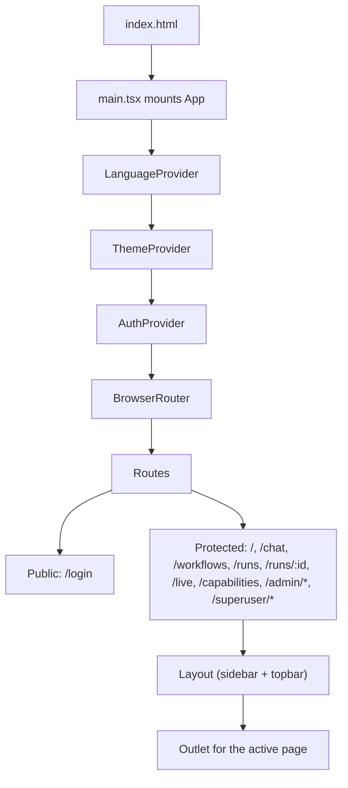
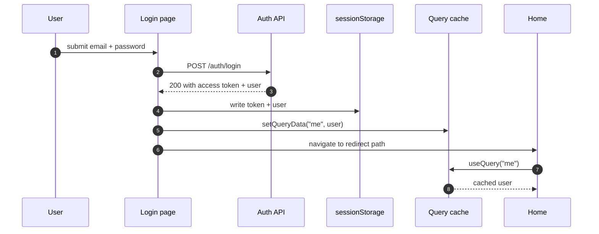
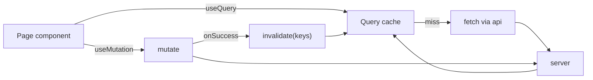
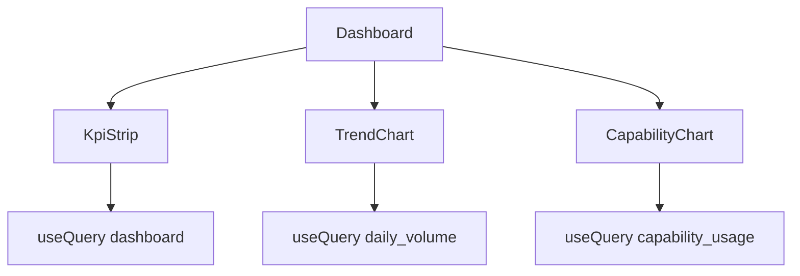
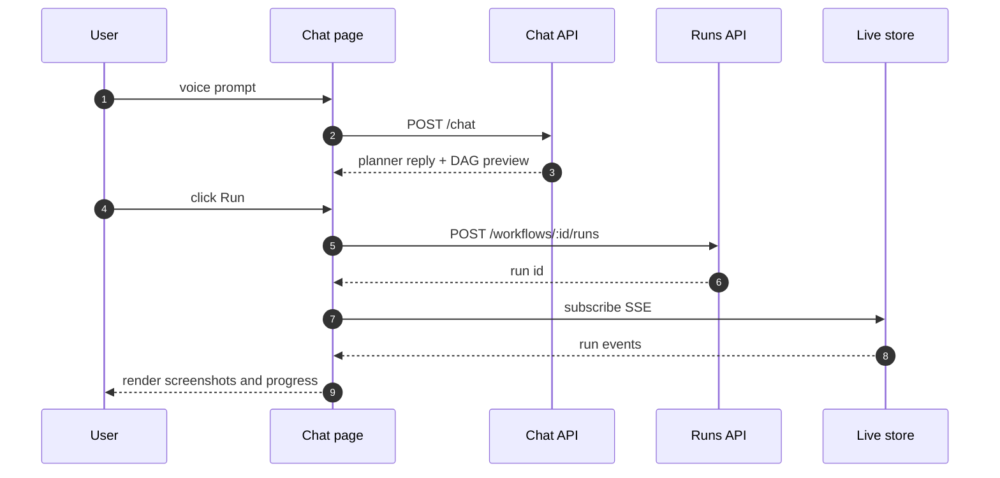
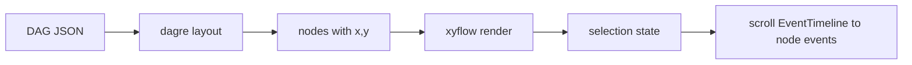
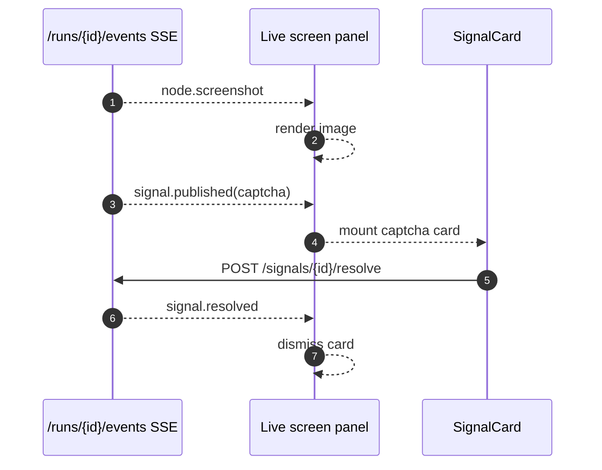
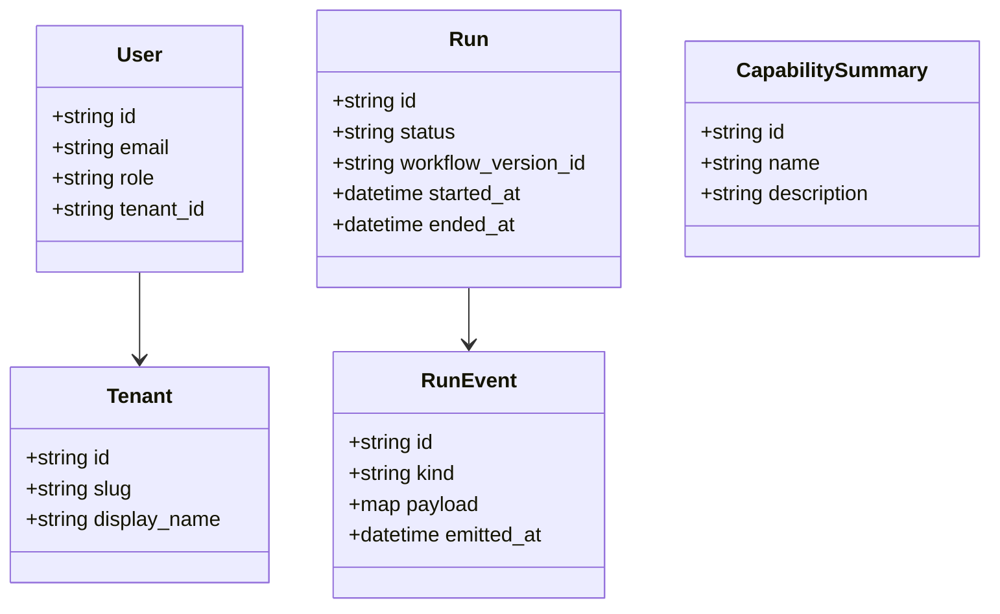

# AAKAAR — Frontend Architecture (v1)

> `aakar-web` is the single SPA that serves both superusers and tenant users. This document focuses on it. The mythic Sanskrit vocabulary (Pracharya, Mandala, Yajna, …) is available as a UI language option but the design and engineering vocabulary throughout this doc is plain English.

---

## 1. Stack

| Concern | v1 choice |
| --- | --- |
| Build tool | Vite |
| Framework | React 18 |
| Language | TypeScript |
| Routing | React Router 6 |
| Server state | TanStack Query (React Query) |
| Forms | React Hook Form |
| Styling | Tailwind CSS |
| Graph | xyflow (React Flow) plus dagre |
| Charts | Recharts |
| Icons | lucide-react |
| Auth storage | sessionStorage (per tab) |
| i18n | tiny hand-rolled label map (`src/i18n/labels.ts`) — English default, five alternate languages |
| Themes | CSS-variable scoped per `[data-theme]` — 5 families × light/dark = 10 themes |

## 2. App shell and routing



A `RequireAuth` wrapper guards the protected branch. If no token is present, it redirects to `/login` while preserving the intended location for post-login redirect.

## 3. Auth flow



Per-tab isolation is the reason for sessionStorage rather than localStorage: opening a second tab as a different role does not clobber the first tab's session.

## 4. API client

```ts
// src/api/index.ts (sketch)
const api = axios.create({ baseURL: "/api" });
api.interceptors.request.use(cfg => {
  const t = sessionStorage.getItem("aakar.token");
  if (t) cfg.headers.Authorization = `Bearer ${t}`;
  return cfg;
});
api.interceptors.response.use(
  r => r,
  err => {
    if (err.response?.status === 401) {
      sessionStorage.clear();
      location.replace("/login");
    }
    return Promise.reject(err);
  },
);
```

Every page imports typed wrappers (`api.runs.list`, `api.runs.get`, ...). Wrappers narrow request and response types to the shapes in `src/api/types.ts`. Wire field names stay English on both sides (`tenant_id`, `run.status`, etc.) so the backend contract is untouched.

## 5. TanStack Query patterns



Conventions:

- Query keys are arrays. First element is the resource: `["runs"]`, `["runs", id]`, `["chat", "sessions"]`.
- Mutations always invalidate the relevant list query on success rather than manually patching cache entries.
- SSE subscriptions for live run events are managed outside Query; they push into a Zustand-style local store keyed by run id.

## 6. Pages

### 6.1 Dashboard

Lands at `/`. Three kinds of cards:

- **KPI strip** — runs last 24h, succeeded 7d, failed 7d, running right now.
- **Trend** — run volume over the last 30 days, stacked by status.
- **Capability usage** — top capabilities by invocation, failures highlighted.

Superusers additionally see a per-tenant stacked bar of the last 24 hours.



### 6.2 Chat

`/chat` is the user's primary surface. Layout:

- Left: list of chat sessions with a "New" button.
- Center: message thread with planner DAG previews inline.
- Right: live screen panel that activates when a run starts.

Long file paths and URLs in messages wrap on whitespace and `/`. Code-block detection prevents wrap inside fenced blocks.



### 6.3 Run detail (`/runs/:id`)

Shows the DAG view (xyflow + dagre auto-layout), an event timeline, and an artifacts list. Selecting a node scrolls the event timeline to its events and opens the latest screenshot.

### 6.4 Live processes

`/live` is a tenant-wide grid of in-flight runs. Each tile shows status, current node, and a thumbnail of the most recent screenshot. Tiles link to run detail.

### 6.5 Vault

`/admin/grants` is a site-centric layout: the left rail lists sites the tenant has used; the right pane lists user handles registered for the selected site, with rotation hints. Only `tenant_admin` can edit.

## 7. Components inventory

| Component | Responsibility |
| --- | --- |
| `Layout` | shell with sidebar, topbar, and outlet |
| `MorphLogo` | branded logo |
| `RequireAuth` | route guard |
| `MessageBubble` | renders user or planner message with markdown and code |
| `DagPreview` | small read-only xyflow used in chat |
| `DagView` | full run-detail xyflow with selection |
| `EventTimeline` | scrollable run-event list with kind icons |
| `LiveScreenPanel` | screenshot stream plus signal handler |
| `SignalCard` | renders captcha, picker, or otp prompt and POSTs the resolution |
| `IstTimestamp` | formats ISO datetimes in IST |
| `Toast` | non-blocking notifications |
| `LanguageSwitcher` | sidebar popover for the i18n layer |
| `ThemeSwitcher` | sidebar popover for theme families |
| `EasterEggs` | tasteful client-side delights (Konami, type-word, triple-click) |

## 8. DAG views



Node colors map to status: gray (queued), blue (running), green (succeeded), red (failed), amber (paused). Custom node renderers display the capability ref and elapsed time. `colorMode` and `<Background>` dot color follow the active theme via the `useTheme()` hook, so a light-mode session shows dark dots on white instead of cream-on-white invisibility.

## 9. Live screen panel



The panel debounces screenshot rendering (about 60 ms) so a fast-moving run does not flicker the canvas.

## 10. Dashboard charts

Recharts components are wrapped in a thin `Chart` boundary that handles loading and empty states. v1 uses three chart types: `BarChart` for capability usage, `LineChart` for daily run counts, and a small status-badge list for site health.

## 11. IST timestamps

The backend stores UTC. The frontend formats in `Asia/Kolkata` for display because operators are in India and the audit log is read by ops in IST. The `IstTimestamp` component is the single source of truth for formatting; raw `Date.toLocaleString` is forbidden by lint.

## 12. i18n and themes

- **i18n** (`src/i18n/labels.ts`). Six languages: English (default), Hindi (Latin), Hindi (Devanagari), Bengali, Tamil, Kannada. Every operator-facing noun is a key in a single table. Pages call `useLabels()` and read `labels.tenant`, `labels.run`, etc. — never literals. Wire formats and code identifiers are unchanged across languages.
- **Themes** (`src/styles/themes.css`, `src/theme/ThemeProvider.tsx`). 5 families × light/dark = 10 themes, scoped via `[data-theme="<id>"]`. Components reference theme tokens (`bg-ink-950`, `text-accent-300`) and inherit the active palette. xyflow's pane background and edge strokes follow the active mode through `colorMode` + computed JS color props.

## 13. Type model



`src/api/types.ts` mirrors the backend's Pydantic shapes by hand. Drift between the two is caught in a small contract test; v1 has no codegen.

## 14. Build and deploy

| Concern | v1 |
| --- | --- |
| Local dev | `npm run dev` (Vite, port 5173) |
| Production build | `npm run build` (emits `dist/`) |
| Hosting | served as static files behind the same nginx that fronts the API |
| API base URL | `/api` (same origin), proxied by Vite in dev |

The admin-app is deployed independently on its own subdomain (or port), with its own nginx and API service.

## 15. Conventions

- One component per file. File name matches the default export.
- Hooks live next to the component that uses them unless reused; reused hooks go to `src/hooks/`.
- Tailwind utility classes are preferred over CSS modules; CSS modules exist only for legacy admin-app pages.
- All forms go through React Hook Form. Manual `onChange` plumbing is forbidden by lint for any form field.
- Never put credentials or secrets in URLs, query params, or analytics events.
- All operator-facing nouns flow through `useLabels()`. Literal strings for nouns are forbidden by code review.

## 16. Reading guide

- For request and run lifecycles, read the backend doc.
- For the planner and capabilities, read the LLD.
- For where the UX is heading, read the roadmap.
