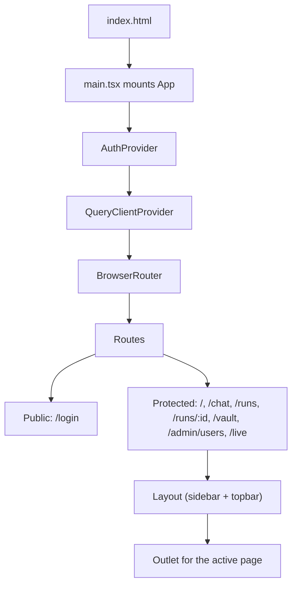
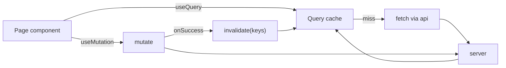
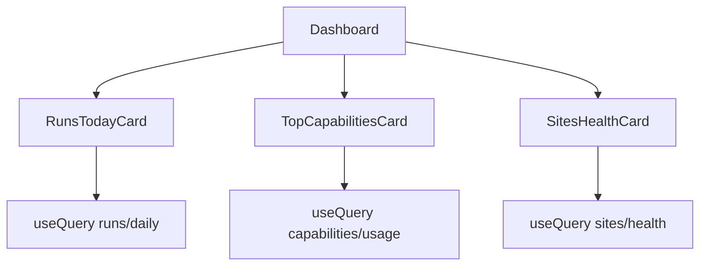
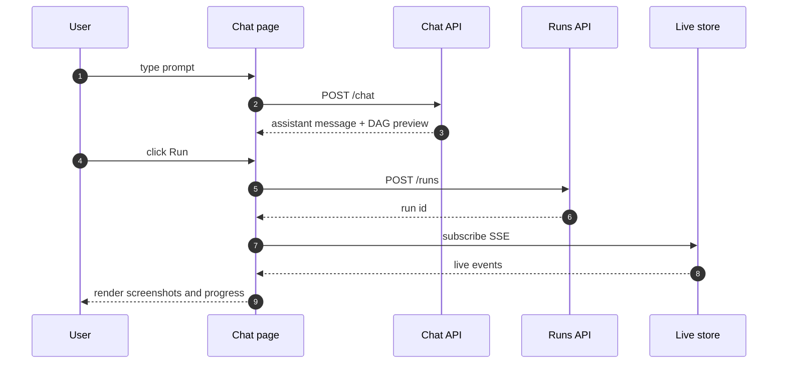
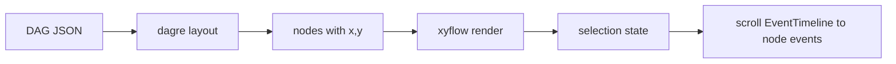
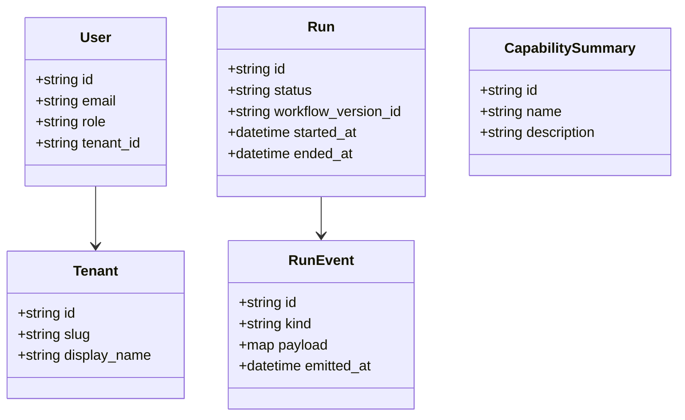

# Aakar — Frontend Architecture (v1)

> Three single-page apps (`aakar-web` for tenants, `admin-app` for platform, `nbbl-app` as a sample third-party harness). This document focuses on `aakar-web` since it is where operators spend their day, and notes where the admin shell differs.

---

## 1. Stack

| Concern | v1 choice |
| --- | --- |
| Build tool | Vite |
| Framework | React 18 |
| Language | TypeScript |
| Routing | React Router 6 |
| Server state | TanStack Query (React Query) |
| Forms | React Hook Form |
| Styling | Tailwind CSS |
| Graph | xyflow (React Flow) plus dagre |
| Charts | Recharts |
| Icons | lucide-react |
| Auth storage | sessionStorage (per tab) |

The admin-app is JavaScript (no TS), Vite-based, and intentionally smaller; it shares no code with `aakar-web` in v1.

## 2. App shell and routing



A `RequireAuth` wrapper guards the protected branch. If no token is present, it redirects to `/login` while preserving the intended location for post-login redirect.

## 3. Auth flow


Per-tab isolation is the reason for sessionStorage rather than localStorage: opening a second tab as a different role does not clobber the first tab's session.

## 4. API client

```ts
// src/api/index.ts (sketch)
const api = axios.create({ baseURL: "/api" });
api.interceptors.request.use(cfg => {
  const t = sessionStorage.getItem("aakar.token");
  if (t) cfg.headers.Authorization = `Bearer ${t}`;
  return cfg;
});
api.interceptors.response.use(
  r => r,
  err => {
    if (err.response?.status === 401) {
      sessionStorage.clear();
      location.replace("/login");
    }
    return Promise.reject(err);
  },
);
```

Every page imports typed wrappers (`api.runs.list`, `api.runs.get`, ...). Wrappers narrow request and response types to the shapes in `src/api/types.ts`.

## 5. TanStack Query patterns



Conventions:

- Query keys are arrays. First element is the resource: `["runs"]`, `["runs", id]`, `["chat", "sessions"]`.
- Mutations always invalidate the relevant list query on success rather than manually patching cache entries.
- SSE subscriptions for live run events are managed outside Query; they push into a Zustand-style local store keyed by run id.

## 6. Pages

### 6.1 Dashboard

Lands at `/`. Three cards:

- **Runs today** — count plus delta vs. yesterday.
- **Top capabilities** — bar chart from `/api/stats/capabilities/usage`.
- **Site health** — color-coded list from `/api/stats/sites/health`.



### 6.2 Chat

The Chat page (`/chat`) is the operator's primary surface. Layout:

- Left: session list, with a "New chat" button.
- Center: message thread with assistant DAG previews inline.
- Right: live screen panel that activates when a run starts.

Long file paths and URLs in messages wrap on whitespace and `/`. Code-block detection prevents wrap inside fenced blocks.



### 6.3 RunDetail

`/runs/:id` shows the DAG view (xyflow + dagre auto-layout), an event timeline, and an artifacts list. Selecting a node scrolls the event timeline to its events and opens the latest screenshot.

### 6.4 LiveProcesses

`/live` is a tenant-wide dashboard of in-flight runs. Each card shows status, current node, and a thumbnail of the most recent screenshot. Cards link to RunDetail.

### 6.5 Vault

`/vault` is a site-centric layout: the left rail lists sites the tenant has used; the right pane lists user handles registered for the selected site, with rotation hints. Only `tenant_admin` can edit.

## 7. Components inventory

| Component | Responsibility |
| --- | --- |
| `Layout` | shell with sidebar, topbar, and outlet |
| `MorphLogo` | branded logo |
| `RequireAuth` | route guard |
| `MessageBubble` | renders assistant or user message with markdown and code |
| `DagPreview` | small read-only xyflow used in chat |
| `DagView` | full RunDetail xyflow with selection |
| `EventTimeline` | scrollable event list with kind icons |
| `LiveScreenPanel` | screenshot stream plus signal handler |
| `SignalCard` | renders captcha, picker, or otp prompt and POSTs the resolution |
| `IstTimestamp` | formats ISO datetimes in IST |
| `Toast` | non-blocking notifications |

## 8. ReactFlow DAG views



Node colors map to status: gray (pending), blue (running), green (succeeded), red (failed), amber (waiting_for_signal). Custom node renderers display the capability id and elapsed time.

## 9. Live screen panel


The panel debounces screenshot rendering (about 60 ms) so a fast-moving run does not flicker the canvas.

## 10. Dashboard charts

Recharts components are wrapped in a thin `Chart` boundary that handles loading and empty states. v1 uses three chart types: `BarChart` for capability usage, `LineChart` for daily run counts, and a small status-badge list for site health.

## 11. IST timestamps

The backend stores UTC. The frontend formats in `Asia/Kolkata` for display because operators are in India and the audit log is read by ops in IST. The `IstTimestamp` component is the single source of truth for formatting; raw `Date.toLocaleString` is forbidden by lint.

## 12. Type model



`src/api/types.ts` mirrors the backend's Pydantic shapes by hand. Drift between the two is caught in a small contract test; v1 has no codegen.

## 13. Build and deploy

| Concern | v1 |
| --- | --- |
| Local dev | `npm run dev` (Vite, port 5173) |
| Production build | `npm run build` (emits `dist/`) |
| Hosting | served as static files behind the same nginx that fronts the API |
| API base URL | `/api` (same origin), proxied by Vite in dev |

The admin-app is deployed independently on its own subdomain, fronted by its own nginx and API service.

## 14. Conventions

- One component per file. File name matches the default export.
- Hooks live next to the component that uses them unless reused; reused hooks go to `src/hooks/`.
- Tailwind utility classes are preferred over CSS modules; CSS modules exist only for legacy admin pages.
- All forms go through React Hook Form. Manual `onChange` plumbing is forbidden by lint for any form field.
- Never put credentials or secrets in URLs, query params, or analytics events.

## 15. Reading guide

- For request and run lifecycles, read the backend doc.
- For the planner and capabilities, read the LLD.
- For where the UX is heading, read the roadmap.
