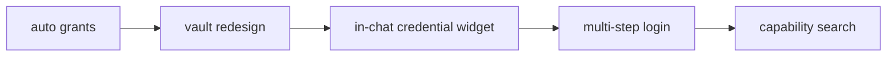
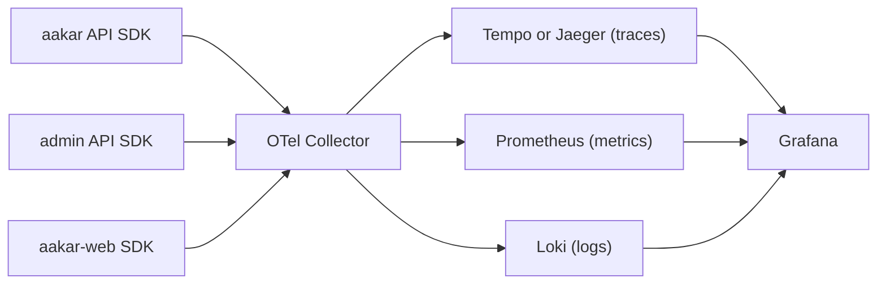
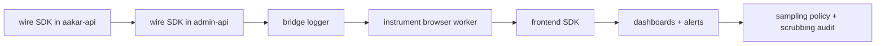
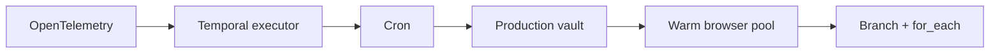
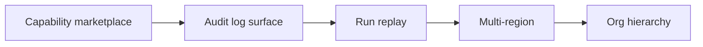

# Aakar — Roadmap (v1)

> What's planned next, in roughly the order it will land. Phases are calendar guidance, not contracts; items can move when reality intervenes. Every item below is anchored to a concrete user pain or platform need we have already seen in v1.

---

## Phase 1 — within 2 weeks

Goals: lower the friction for first-time tenants, sharpen the chat UX, and finish the long tail of v1 polish.

### 1.1 Auto-grant session capabilities on login

Today, a tenant admin must explicitly grant `cap.web_login` to a user before the user can run any login-bearing workflow. In practice, every operator needs it. Phase 1 will auto-grant the read-only "session" capabilities (`web_login`, `http.fetch_session`, `screenshot`) on user creation, with an opt-out toggle.

### 1.2 Vault redesign for non-login capabilities

The current vault is login-centric. Phase 1 widens the schema so a tenant can store API keys, OAuth refresh tokens, and per-site cookies — anything a capability declares it needs. The UI moves to a generic "Site → Credential type → Entry" tree.

### 1.3 In-chat credential widget

When the planner pauses with a `picker` signal because the vault is missing an entry, the chat will render a credential entry form inline rather than redirecting the operator to `/vault`. The form posts directly to the vault and resolves the signal in one step.

### 1.4 Multi-step login

Some sites require username on page A, password on page B, OTP on page C. The current `web_login` capability assumes a single form. Phase 1 introduces `LoginFlow` as a chain of login steps a capability can declare.

### 1.5 Capability search in admin

Brahma's catalog page will gain a top-of-page search box backed by the same FAISS / pgvector index the planner uses. This makes it cheap to discover near-duplicates before publishing a new capability.

## Phase 2 — within 1 month

Goals: production hardening. Replace dev shortcuts with services that scale, add the observability story, and unlock more expressive DAGs.

### 2.1 OpenTelemetry observability

Phase 2 introduces full OpenTelemetry support across both backends and the frontend. This is the single biggest visibility upgrade between v1 and the next version.

#### 2.1.1 What gets instrumented

| Layer | Spans | Notable attributes |
| --- | --- | --- |
| FastAPI | one root span per request | `http.method`, `http.route`, `tenant.id`, `user.id`, `request_id` |
| Planner | spans for "plan" plus child spans per LLM call and tool call | `planner.strategy` (oneshot or agentic), `planner.candidate_count` |
| Validator | one span per DAG validation | `dag.node_count`, `validator.failed_rule` |
| Executor | one span per run, child spans per node, grandchild per signal wait | `run.id`, `node.id`, `capability.id`, `signal.kind` |
| Capability | one span per capability invocation | `capability.id`, `vault.read_count` |
| Browser worker | span per Playwright step | `browser.action`, `browser.selector_strategy`, `browser.duration_ms` |
| HTTP worker | span per outbound request | standard HTTP semantic conventions |
| Frontend | spans for navigation, query fetches, run-event SSE lifecycle | `page.path`, `query.key` |

#### 2.1.2 Metrics

| Metric | Type | Dimensions |
| --- | --- | --- |
| `aakar.runs.started` | counter | `tenant.id`, `capability.id` |
| `aakar.runs.duration_ms` | histogram | `tenant.id`, `capability.id`, `status` |
| `aakar.runs.failed` | counter | `tenant.id`, `capability.id`, `failed_node_id` |
| `aakar.signals.published` | counter | `signal.kind` |
| `aakar.signals.wait_ms` | histogram | `signal.kind` |
| `aakar.planner.tokens_in` | counter | `planner.strategy` |
| `aakar.planner.tokens_out` | counter | `planner.strategy` |
| `aakar.browser.pool.in_use` | gauge | (none) |
| `aakar.vault.reads` | counter | `tenant.id` |

Histograms use the OTel default boundaries; we will tune buckets after a week of real data.

#### 2.1.3 Logs

The structured logger (`structlog`) gets bridged into OTel logs. Every log record inherits the active span context, so a log line in the executor automatically carries the `run.id` and `node.id` of the node that emitted it. Trace-to-log correlation lets ops jump from a slow span to the exact log lines for that node.

#### 2.1.4 Resource attributes

Every signal (trace, metric, log) carries a stable resource bundle:

- `service.name` — `aakar-api`, `admin-app-api`, `aakar-web`.
- `service.version` — Git short SHA from build.
- `deployment.environment` — `dev`, `staging`, `prod`.
- `service.instance.id` — pod name in cloud, hostname in dev.

`tenant.id` is allowed as a span and metric attribute (low cardinality at our scale). `run.id` is allowed on spans only (high cardinality).

#### 2.1.5 Pipeline and exporters

The collector runs as a sidecar in dev and as a per-node DaemonSet in cloud. Backends are pluggable; the exporters above are the v1 picks but the choice does not leak into application code.

#### 2.1.6 Sampling

Default is head-based at 10% for normal traffic plus always-on for any trace whose root span's `error` attribute is true. Tail-based sampling on the collector retains slow traces (greater than the 95th percentile) and traces from a configurable list of "VIP" tenants for debugging.

#### 2.1.7 Privacy

Span attributes are never allowed to carry credentials, cookie values, vault payloads, or full file contents. A small allowlist plus `process.env.OTEL_SCRUB_KEYS` controls scrubbing at SDK level. PII fields in event payloads are redacted before they ever reach the OTel pipeline.

#### 2.1.8 Local developer experience

`docker compose up otel` brings up the collector, Tempo, Prometheus, Loki, and Grafana with seeded dashboards. Hitting the API in dev produces traces that show up in Grafana within seconds. The full stack is opt-in; running without `OTEL_EXPORTER_OTLP_ENDPOINT` set is a no-op.

#### 2.1.9 Rollout sequence

### 2.2 Temporal-backed executor

The Executor Protocol already has a `TemporalExecutor` stub. Phase 2 finishes it, with workflow types per capability and child workflows for sub-DAGs. Local dev keeps `LocalExecutor`.

### 2.3 Cron triggers

Expose a per-workflow cron field. The admin-app gets a "Schedules" page. Cron is backed by the same Temporal cluster that powers the executor.

### 2.4 Production vault

Replace the dev symmetric key with a managed KMS adapter. Cipher rotation is staged so old entries can be re-encrypted without downtime.

### 2.5 Warm browser pool

Today every run boots a fresh Chromium context (about 1.5 to 3 seconds). Phase 2 adds a pool of pre-warmed contexts isolated by tenant. Eviction on tenant-scope conflicts is enforced.

### 2.6 Branch and for_each in DAGs

The DAG schema gets two new node types: `branch` (route by predicate) and `for_each` (fan out over a list and join). The validator and executor learn to handle them; the planner learns to emit them when prompts call for "for each row in the file ...".

## Phase 3 — 3 to 6 months

Goals: turn Aakar from a single-deployment product into a platform that can host external publishers and serve regulated tenants.

### 3.1 Capability marketplace

A signed-publisher model where third-party teams can submit capabilities. Each submission goes through code review, schema validation, a security scan, and a test in a sandbox tenant before becoming visible.

### 3.2 Audit log surface

Today the `audit_log` table is queryable by SQL but not exposed in product. Phase 3 builds a tenant-admin audit view with filter by user, action, and time, plus signed-export for compliance.

### 3.3 Run replay

Given a `run_id`, replay produces a deterministic re-run from persisted DAG and inputs against a recorded mock of the third party. Useful for incident triage and regression tests.

### 3.4 Multi-region

The product currently assumes a single deployment per environment. Phase 3 introduces region affinity: a tenant is pinned to a region; cross-region queries are explicit; the vault is region-local.

### 3.5 Org hierarchy

Tenants can be grouped into orgs. Capability grants and quotas can be set at the org level and inherited; per-tenant exceptions still work.

## Spike candidates (un-prioritized)

- Streaming LLM responses in chat with cancellation and partial DAG previews.
- Planner self-critique pass before emitting a DAG.
- Capability "lint" checks (selector freshness, fixture currency).
- A small mobile companion app for captcha resolution and run notifications.
- Feature-flag service plus per-tenant rollout percentages.
- Out-of-the-box SAML / OIDC.

## Engineering policies

- **One PR per logical change.** Bundle only when a split would be churn.
- **Integration tests hit a real database.** No mocks at the persistence boundary.
- **Migrations are reviewed for online-safety.** Adding a NOT NULL column to a hot table is a multi-PR sequence.
- **No silent fallbacks for security.** A missing capability or a missing grant returns an explicit error.
- **Comments justify the WHY only.** WHAT is in the code; PR description carries context.
- **No hard-coded credentials anywhere.** Vault or env, never in code or tests.

## Decision log (open questions)

| ID | Question | Owner | Target decision date |
| --- | --- | --- | --- |
| RFC-04 | Are we ok with shipping `TemporalExecutor` before warm-pool isolation is proven? | Platform | 2026-05-30 |
| RFC-05 | Where does run replay state live: same DB or separate journaling store? | Platform | 2026-06-15 |
| RFC-06 | Cron triggers in admin-app or in aakar API? | Platform | 2026-05-25 |
| RFC-07 | OTel span naming: do we adopt OpenTelemetry Semantic Conventions verbatim or define an Aakar overlay? | Observability | 2026-05-20 |

## What this roadmap is not

- It does not promise dates. Items move when scope changes or facts on the ground move.
- It does not authorize work outside the listed phases without an explicit RFC.
- It does not replace the HLD or LLD. Items here that touch the architectural spine require a corresponding HLD or LLD update before merge.
